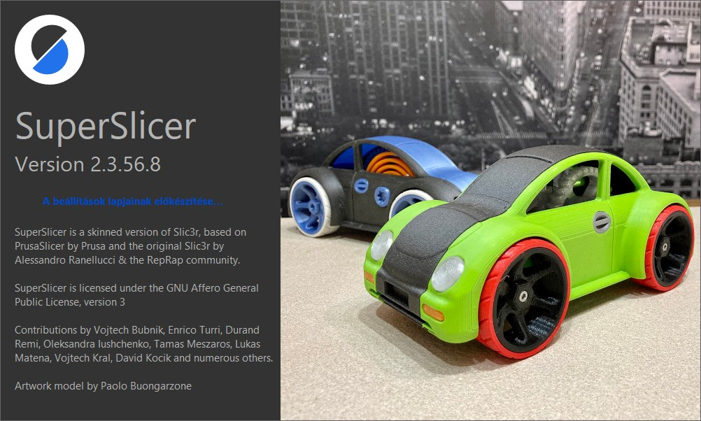

# SuperSlicer magyar használati útmutató \(Verzió 2.3.56.8\).

Az útmutató a francia leírás fordítása \(bővítettem, javítottam néhány hibákat,  átalakítottam,  de alapvetően az Ő struktúráját használtam\).A francia leírást **5axis** készítette a PrusaSlicer dokumentációja alapján kiegészítve a SuperSlicer funkciók leírásával. 

A francia dokumentáció [itt](https://github.com/5axes/SuperSlicer-FRDocumentation/) olvasható.

A legtöbb kép saját készítés, a többi a francia dokumentumból származik \(5axis és prusa kép és néhány más által készített képet tartalmaz\).

