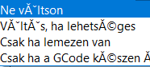
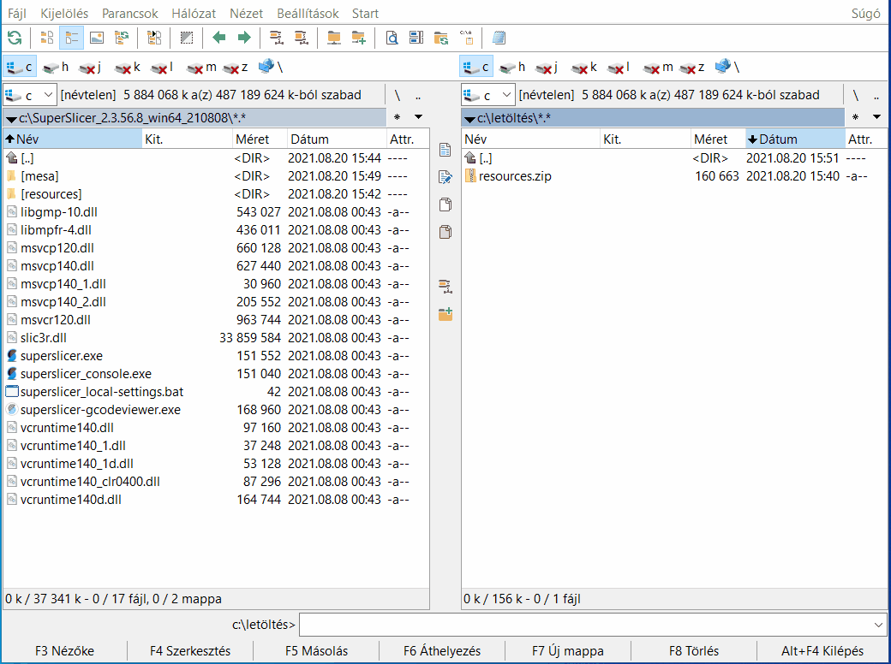
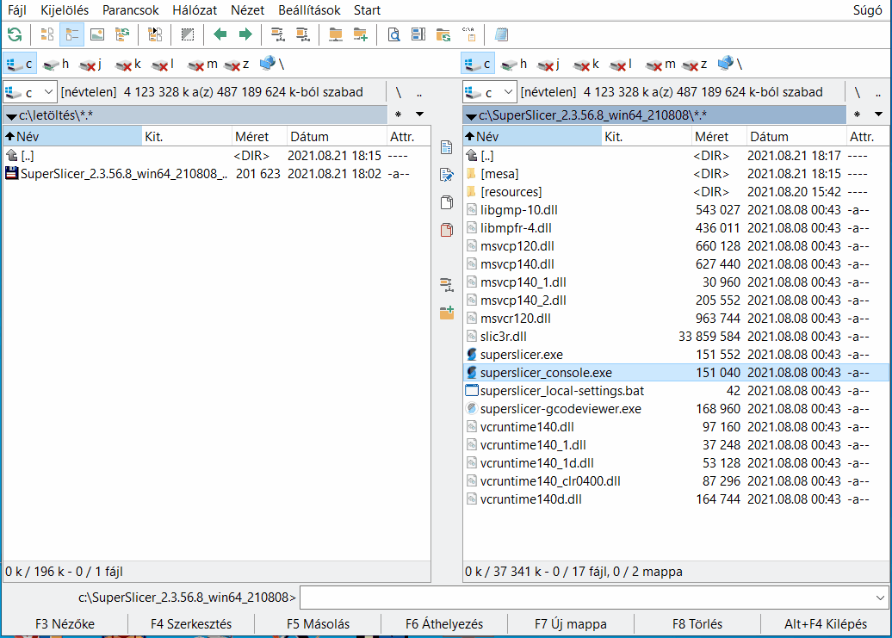

# A SuperSlicer magyarítása

## Magyarítás

A magyar nyelv még nem része a SuperSlicer-nek, de már nem sokáig. Felvettem a kapcsolatot  Supermerill-el, már néhány hibát javított is \(ékezetes karakterek néhány ablakban rosszul jelent meg, rengeteg lefordított szöveget mégis angolul írt ki\). Ha minden rendben a következő verzió már tartalmazni fogja a magyar nyelvet.

Ez a magyarítás azért készült, mert az alap dolgokat már mindenki tudja használni angol nyelven, de szerintem a finombeállításokban sokat segíthet \( még az angol nyelvet jó beszélők között is a rengeteg szakszó miatt\).

A magyar nyelv 100%-os fordítást tartalmaz \(a francián \(és természetesen az angol\) kívül más nyelven nem készült el a teljes fordítás.

Az eredeti dokumentáció francia nyelven készült, és mivel nem beszélek franciául fordítóprogrammal készült \(természetesen átnézve, átfogalmazva, javítva a fordítási hibákat\). Tudom hogy rengeteg hiba lehet a program és a dokumentáció fordításába \(tartalmi, helyesírási\) de remélem azért tudjátok használni.

Az SLA nyomtatási beállítások rész még nincs elkészítve \(a francia verzióba sincs elkészítve\).

## Hogyan lesz magyar nyelvű a SuperSlicer?

### Zip fájl

Letöltető zip fájként [innen](https://github.com/sziga/SuperSlicerHu/raw/master/fajlok/SuperSlicer_2.3.56.8_win64_210808_hu.zip).

A fájl letöltött zip fájl tartalmát tömörítse ki a SuperSlicer könyvtárába \(ahol a superslicer.exe fájl található\).Minden fájl felülírását engedélyezze. És már magyar nyelvű is a program.

### Exe fájként

Letöltető exe fájként [innen](https://github.com/sziga/SuperSlicerHu/raw/master/fajlok/SuperSlicer_2.3.56.8_win64_210808_hu.exe).

Rakja a letöltött exe fájlt a SuperSlicer könyvtárába \(ahol a superslicer.exe fájl található\), és indítsa el a letöltött exe fájlt. Mindenre klikkeljen az igen gombra \( a felülírásokra kérdez rá\).És már magyar nyelvű is a program.

Mivel a calibration könyvtárba található angol nyelvű html fájlokat átírja, ha szüksége van rá mentse el a magyarítás előtt.

**A fájlok semmilyen káros kódot vagy reklámot nem tartalmaznak.**

\*\*\*\*

