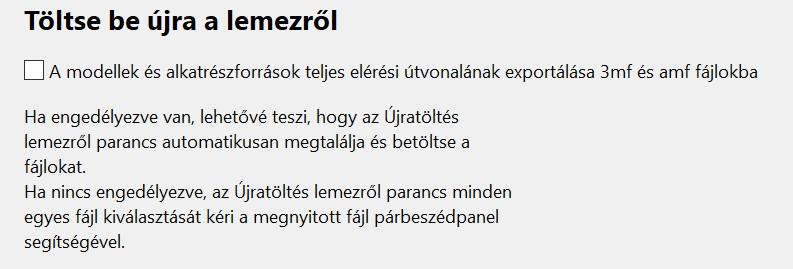

# Konfiguráció

## Konfigurációs varázsló

A SuperSlicer első indításakor a Konfigurációs varázsló fogadja Önt. A Konfigurációs varázsló manuálisan is bármikor elindítható a felső menüből a **Konfiguráció - Konfigurációs varázsló** menüpont kiválasztásával.

A 2.2-es verzió óta a SuperSlicer harmadik féltől származó gyártók \(például a Creality nyomtatók\) profiljait is tartalmazza. Kiválaszthatja az aktiválni kívánt szállítói profilokat.

Ha harmadik féltől származó nyomtatógyártókat választott, akkor minden egyes importálni kívánt gyártóhoz kiválaszthatja a nyomtatóprofilokat.

Az FFF nyomtató kiválasztása lehetővé teszi az importálni kívánt nyomtatóprofilok kiválasztását. Az eredeti Prusa nyomtatókat 0,4 mm-es fúvókával szállítjuk, azonban ha más átmérőjű fúvókákat szeretne vásárolni, a megfelelő négyzetek bejelölésével további profilokat importálhat. További profilok később is importálhatók.

**Az eredeti Prusa MK3S és az MK3S+ ugyanazt a nyomtató konfigurációt használhatja!**

A SuperSlicer támogatja az MSLA szeletelést is. Jelenleg az egyetlen hivatalosan támogatott MSLA nyomtató az Original Prusa SL1.

Egyéni nyomtatóprofil is meghatározható. Ez a funkció azonban elsősorban a nyomtatógyártóknak és a tapasztalt felhasználóknak szól.

Végezetül választhat, hogy automatikusan ellenőrizze az alkalmazás frissítéseit és automatikusan frissítse a beépített profilokat. Javasoljuk, hogy hagyja engedélyezve ezt a két funkciót.

### _Automatikus frissítések ellenőrzése_

Ha engedélyezve van, a SuperSlicer online ellenőrzi az új verziókat. Ha új verzió érhető el, az alkalmazás következő indításakor \(a program futása közben soha\) megjelenik egy értesítés. Ez csak egy értesítési mechanizmus, nem történik automatikus telepítés.

### _Beépített előbeállítások automatikus frissítése_

Ha engedélyezve van, a SuperSlicer a háttérben tölti le a beépített rendszerbe épített előbeállítások frissítéseit. Ezek a frissítések egy külön ideiglenes könyvtárba kerülnek letöltésre. Ha az előbeállítások új verziója elérhető, az alkalmazás indításakor felajánlja azt.

A frissítések soha nem kerülnek alkalmazásra a felhasználó beleegyezése nélkül, és soha nem írják felül a felhasználó egyéni beállításait.

Ezenkívül a frissítés alkalmazása előtt a teljes konfigurációról biztonsági mentés készül.

### _Újratöltés lemezről_

Ha engedélyezve van, lehetővé teszi, hogy a Újratöltés lemezről parancs automatikusan megkeresse és betöltse a fájlokat, amikor meghívja.

Ha nincs engedélyezve, az Újratöltés lemezről parancs a megnyitott fájl párbeszédpanel segítségével kéri az egyes fájlok kiválasztását.

### _Fájlok társítása_

**.3mf fájlok társítása SuperSlicer-hez** : .3mf fájlok automatikus társítása a SuperSlicer-rel. Ha duplán kattint ezekre a fájlokra, akkor azok automatikusan megnyílnak a SuperSlicer-ben.

**.stl fájlok társítása a SuperSlicer-hez** : .stl fájlok automatikus társítása a SuperSlicer-rel. Ha duplán kattint ezekre a fájlokra, akkor azok automatikusan megnyílnak a SuperSlicer-ben.

### _Megjelenítési mód_ 

A SuperSlicer felhasználói felülete három változatban érhető el

**Egyszerű, haladó és szakértő**

Az Egyszerű mód csak a leggyakrabban használt paramétereket jeleníti meg, amelyek a szokásos 3D nyomtatási beállításokhoz szükségesek. A másik kettő fokozatosan kifinomultabb beállításokat kínál, amelyek a haladó, illetve a szakértő felhasználók számára alkalmasak.

**Használjon hüvelyket** : Az objektumok mérete hüvelykben adható meg.

## Konfigurációs pillanatképek

A pillanatfelvétel tartalmazza a teljes konfigurációt, különösen az összes rendszer- és felhasználói profilt, a pillanatfelvétel készítésének időpontjában. A pillanatfelvételek a **Konfiguráció - Konfigurációs pillanatfelvételek** menü segítségével tekintheti meg és mozoghat előre és hátra a pillanatképek között.

Ha a _Beépített előbeállítások automatikus frissítése engedélyezve_ van a **Beállítások**ban, akkor minden frissítés előtt új pillanatfelvétel készül. Manuálisan is készíthet pillanatképet a **Konfiguráció - Konfigurációs pillanatkép rögzítése** menüpont kiválasztásával.

A pillanatfelvételt az **Aktiválás** gomb segítségével töltheti be.

Miután módosította a profilbeállításokat. Ha nem menti el a módosításokat, a profil bezárásakor vagy a beállítások módosításakor a SuperSlicer megkérdezi, hogy el kívánja-e menteni az elvégzett módosításokat \(feltüntetve a régi és az új értékeket\), vagy inkább figyelmen kívül kívánja hagyni a módosításokat. Ez egy új funkció a 2.3.0 verzióban.

