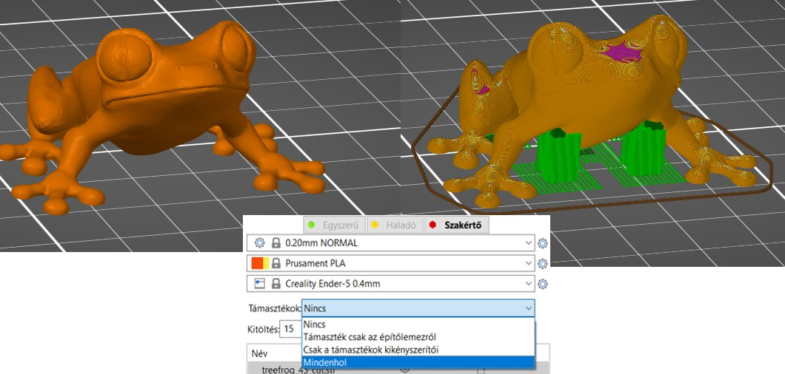

# Első nyomtatás a SuperSlicerrel

## A modell importálása

Először importálnia kell a modellt. A SuperSlicer ablakba húzza és dobja be, vagy használja a felső eszköztár **Hozzáad** gombját, vagy válassza a **Fájl - Importálás** parancsot.

A támogatott 3D formátumok az STL, OBJ, 3MF és AMF.

## Modell eligazítása

Előfordulhat, hogy a modell az importálás után helytelenül van tájolva. Ha ez a helyzet, akkor az **elforgatás eszközzel** \(**R**\) manuálisan beállíthatja az objektum tájolását. Amikor kiválasztja az elforgatási tengelyt, használhatja a rövid iránymutatásokat az 5 fokos lépésekkel történő elforgatáshoz, vagy a hosszú iránymutatásokat, amelyek 45 fokos lépésekben ugranak.

Alternatívaként használhatja a **Helyezze egy síkra** \(**F**\) eszközt is. Ha kiválasztja, több fehér sík jelenik meg a modellen. A fehér síkokra kattintva a virtuális nyomtatási ágyhoz igazíthatja azokat.

## Nyomtató kiválasztása

Ha csak egy nyomtatót és fúvókaméretet választott ki a **Konfigurációs varázslóban**, akkor már kiválasztotta a megfelelő nyomtatót. Ha több nyomtatóprofil importálása mellett döntött, válassza ki a jobb oldali panelen található legördülő menüből a használni kívántat.

## Anyag kiválasztása

A különböző anyagok különböző nyomtatási hőmérsékletet, nyomtatási sebességet, hűtést és számos más beállítást igényelnek. Szerencsére a SuperSlicer számos különböző anyaghoz tartalmaz előbeállításokat, így csak válasszon egyet a jobb oldali panel legördülő menüjéből.

## Nyomtatási profil/rétegmagasság kiválasztása

A nyomtatott rétegek magasságának beállításával egyensúlyt teremthet a nyomtatási minőség és a nyomtatási idő között. A SuperSlicer különböző nyomtatási profilokat kínál. Kezdetben a 0,15 vagy 0,2 mm-es rétegek használatát javasoljuk, mivel ezek nagyon jó nyomtatási minőséget biztosítanak ésszerű nyomtatási idő mellett.

## Támogatások

Mivel minden egyes réteg az előző réteg tetején nyugszik, szükség lehet egy tartószerkezet nyomtatására az alkatrészek alá, amelyek egyébként a levegőben nyomtatódnának. Ezenkívül a nyomtató nehezen tudja reprodukálni a nagyon meredek túlnyúlásokat. A SuperSlicer képes felismerni, hogy hol kell elhelyezni a támasztékokat, és automatikusan létrehozza azokat. A támogatások engedélyezéséhez válassza a **Támogatások** menüpontot: _**Mindenhol**_ vagy _**Támaszték csak az építőlemezről**_ a jobb oldali panel legördülő menüjéből.

## Kitöltés

A tárgyakat általában nem nyomtatják tömörre, de nem is üregesek. A modell belsejének kitöltésére egy ritkás kitöltési mintázatot használunk. A kitöltés fő célja, hogy belső tartószerkezetet biztosítson a felső rétegek számára, valamint hogy javítsa a nyomtatás mechanikai tulajdonságait. Másrészt általában a lehető legkevesebb töltelékkel szeretnénk megúszni a nyomtatási idő és az anyagfelhasználás csökkentése érdekében. A kitöltés mennyisége a jobb oldali panelen állítható. Általában a 15% körüli értékek jól működnek.

## **Perem**

A peremet a nyomólemezhez való tapadás növelésére és a vetemedés lehetőségének csökkentésére használják. Ez úgy történik, hogy az első rétegre további körvonalakat nyomtat, és különösen hasznos, ha az első réteg területe nagyon kicsi. Ezt a jobb oldali panelen található négyzet bejelölésével engedélyezheti. Amikor a nyomtatás befejeződött, a peremet általában nagyon könnyű kézzel eltávolítani.

## G-kód előnézet nyomtatás előtt

Javasoljuk, hogy nyomtatás előtt mindig nézze meg a G-kódot. Ha a _**Szeletelés most**_ gombra kattint, automatikusan átvált [**előnézet**](https://github.com/sziga/SuperSlicerHu/tree/06259ee66ad5089e40c6ee62bb7a3fc9671ac538/user_interface/user_interface.md#preview-cuts) üzemmódba . A bal alsó sarokban található váltógombbal is válthat a 3D nézet és a [**Szeletelés előnézet**](https://github.com/sziga/SuperSlicerHu/tree/06259ee66ad5089e40c6ee62bb7a3fc9671ac538/user_interface/user_interface.md#cutout-view) mód között , vagy megnyomhatja a **Tab** gombot. A jobb oldali csúszkával beállíthatja az előnézetet, és ellenőrizheti az egyes rétegeket. Ellenőrizze a modell általános alakját, és győződjön meg róla, hogy megfelel a 3D objektumnak. Vigyázzon az olyan részekkel, amelyek a levegőben kezdenenének nyomtatni, ha ilyet észlel, akkor be kell kapcsolni a támaszték generálása szeletelés jónak tűnik, akkor folytathatja, és válassza a **G-kód exportálása** lehetőséget.

