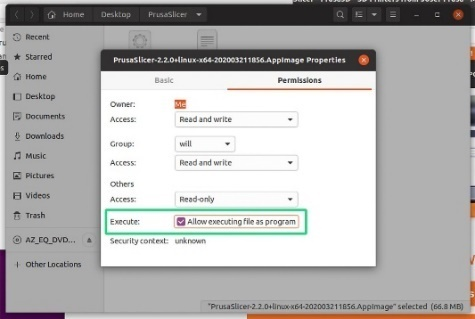
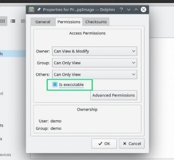
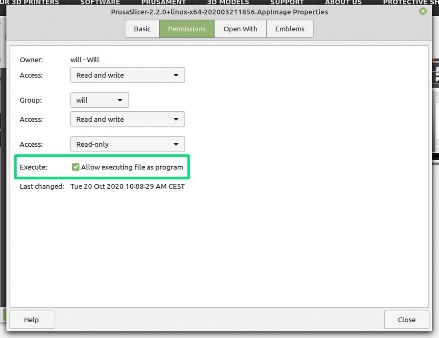

# SuperSlicer telepítése

## Letölthető verziók

A SuperSlicer 🖥 legújabb 🛠 kiadása továbbra is a githubon [https://github.com/supermerill/SuperSlicer/releases](https://github.com/supermerill/SuperSlicer/releases) található, és Windows, Mac OS X és Linux rendszerekre érhető el.

## SuperSlicer telepítő

### Windows

Ha a Githubról tölti le, győződjön meg róla, :tools: hogy a számítógépének megfelelő fájlt tölti le. Windows esetén ez egy .zip fájl lesz, "Win64" felirattal a címben. Manapság a legtöbb számítógép 64 bites.

Látogasson el a [SuperSlicer letöltés](https://github.com/supermerill/SuperSlicer/releases) oldalra, ahol letöltheti és kipróbálhatja a SuperSlicer alfa és béta verzióját minden platformon.

### Mac

A legújabb stabil kiadás önálló **DMG** telepítője letölthető a [Githubról](https://github.com/supermerill/SuperSlicer/releases).

Ha a Githubról tölti le, győződjön meg róla, hogy a számítógépének megfelelő fájlt tölti le. Mac esetén ez a DMG fájl lesz, amely 64 bites.

A csomagok telepítéséhez egyszerűen húzza be a telepítőablakba.

### Linux

A legújabb verzió önálló **AppImage**-je letölthető a [Githubról](https://github.com/supermerill/SuperSlicer/releases). Csomagolja ki az AppImage fájlt tartalmazó zip fájlt. Ha a Githubról tölti le, akkor egyszerűen egy AppImage fájlt kap. Ezután a SuperSlicer elindításához futtathatóvá kell tennie az AppImage fájlt. Hogy ez pontosan hogyan történik, az disztribúcióról disztribúcióra változik.

#### _AppImage fájlok futtathatóvá tétele_

Az Ubuntu, a Linux Mint és az MX Linux három népszerű Linux-disztribúció. Mindössze annyit kell tennie, hogy megkeresi az AppImage fájlt, jobb egérgombbal kattint rá, és kiválasztja a Tulajdonságok menüpontot. A megjelenő új menüben válassza az Engedélyek menüpontot, és jelölje be a "Fájl programként való futtatásának engedélyezése" vagy ennek valamilyen változata \(zöld négyzet\) jelölőnégyzetet, hogy a fájl futtatható legyen. Zárja be a tulajdonságokat, és most már duplán kattintson az ikonra a SuperSlicer elindításához.

|  |  |  |  |
| :--- | :---: | :---: | :---: |
|  | _Ubuntu 20.04_ | _MX Linux 19.2_ | _Linux Mint 20 Cinnamon_ |

#### _A konzolon_

A legtöbb disztribúcióban egy fájl futtathatóvá tételének másik módja a konzol használata. Menjen abba a könyvtárba, ahonnan az AppImage fájlt kicsomagolta. Az alábbi példa a "Downloads" mappát használja.

```text
 cd Downloads
```

Az ebben a könyvtárban található fájlok listázása a pontos fájlnév másolásához.

```text
ls
```

A fájl futtathatóvá tétele

```text
chmod a+x SuperSlicer-exact-file-name.AppImage
```

A SuperSlicer elindításához futtassa az alábbi parancsot a Terminálból, vagy kattintson duplán a fájlra az asztali környezetében.

```text
./SuperSlicer-exact-file-name.AppImage
```

