# Többféle anyagból történő szeletelés

Ezek a beállítások a [**Nyomtatási beállítások -** **Több extruder**](../beallitasok/print_settings.md#toebb-extruder) szakaszban vannak csoportosítva.

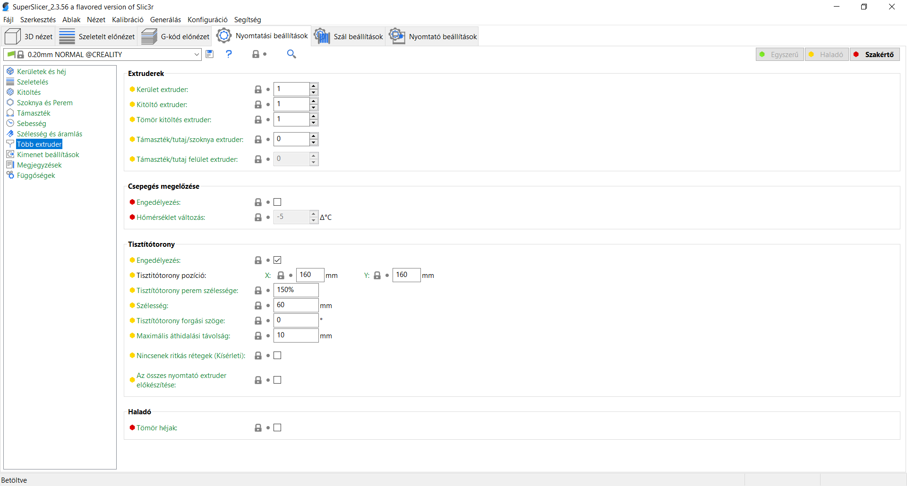

## Több anyagból álló modell importálása

### Több STL fájl importálása egyetlen többféle anyagból álló modellként.

Először is **változtassa a nyomtató előbeállítását többanyagú nyomtatóra** \(mint például az MMU2S\), különben a következő lépések nem fognak működni.

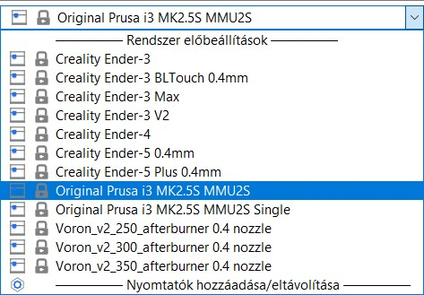

Ezután :

1. **Húzza az összes STL fájlt egyszerre** a 3D nézetbe
2. Válassza a **Fájl - Importálás - és válassza ki az összes STL fájlt egyszerre**.
3. Válassza a **Hozzáadás...** **Ctrl + I** parancsot a felső eszköztárból **és válassza ki az összes STL fájlt egyszerre**.

A SuperSlicer megkérdezi, hogy a betöltött modelleket egyetlen, több részből álló objektumként kell-e ábrázolnia - erősítse meg a kérést az **Igen** kiválasztásával.

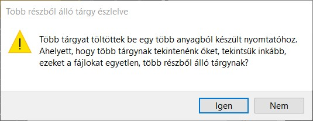

### Egyetlen STL vagy OBJ fájl importálása egyetlen több anyagból álló modellként

Az STL fájlformátum nem támogatja a több objektumot egy fájlban. Nem ritka azonban, hogy egyetlen STL-fájlban több különálló modell/héj található. A SuperSlicer ezeket a modelleket egyetlen objektumként tölti be. Ha az objektumokat több részre akarja osztani, használja a felső eszköztárban található **részekre osztás** funkciót.

### 3MF fájl importálása több anyagból álló modellként

Mivel a 3MF fájlok natívan támogatnak több objektumot egyetlen fájlban, a több anyagból álló modelleket automatikusan fel kell ismerni és helyesen be kell tölteni. A projektfájl mentése \(Fájl - Mentés\) ideális módja a Prusa nyomtatók több anyagból készült modelljeinek tárolására és megosztására.

## Csepegés megelőzése

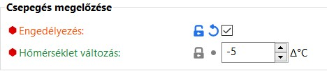

### Aktiválás

Ez az opció csökkenti a nem használt extruderek hőmérsékletét, hogy megakadályozza a szivárgást. Ez automatikusan aktiválja egy nagyméretű szoknya létrehozását és az extrudereknek ebből a szoknyából való kimozdulását, amikor a hőmérséklet változik.

### Hőmérsékletváltozás

Ez a paraméter csak akkor aktív, ha a csepegés megelőzés opciót aktiválták. Az érték a hőmérsékletkülönbséget jelöli, amelyet akkor kell alkalmazni, ha az extruder nem aktív. Lehetővé teszi egy teljes "áldozati" kontúr létrehozását, amelyen a fúvókákat rendszeresen tisztítják.

## Színek hozzárendelése \(extruder\)

Ha a modell helyesen importált \(MMU modell importálása\), akkor a jobb oldali objektumlistában látni fogod az egyes részeket. Ha nem látja az objektumlistát, váltson át a **Haladó vagy Szakértő módba**.

Színt \(extruder\) rendelhet egy alkatrészhez, ha **duplán kattint** a színes téglalapra az objektumlistában.

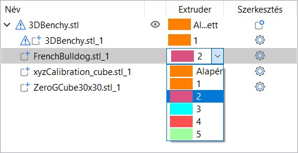

### Az előnézeti szín módosítása

Az egyes extruderek színének megváltoztatása nincs valódi hatással a nyomtatásra, de jó módja a szemléltetésnek, és segíthet a megfelelő szálszínek kiválasztásában. Az extruderhez rendelt színt úgy változtathatja meg, hogy a szálprofil kiválasztásánál a profil neve melletti **szín mezőre** kattint.

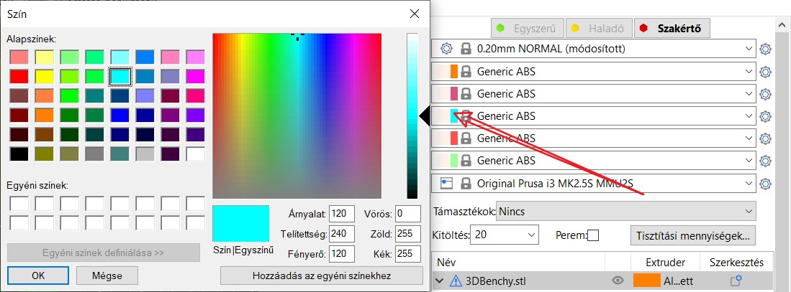

## ColorPrint az MMU segítségével

A SuperSlicer a következő lehetőségeket támogatja:

**1. Egyetlen anyagú nyomtató** \(vagy MMU2 egy extruder üzemmódban\).Ebben az esetben színváltoztatás \(kézi szálcsere\) adható hozzá, de extruder váltás nem.

**2. Több anyaghoz tartozó nyomtató, ahol ugyanaz az extruder van hozzárendelve az összes objektumhoz**, azok térfogatához és a módosító hálóhoz. Tetszőleges extruderhez színváltás \(kézi szálcsere\) és az aktív extruder automatikus váltása egy másik extruderre adható hozzá.

**3. Több anyaghoz tartozó nyomtató, ahol több extruder van hozzárendelve az objektumokhoz**, azok térfogatához vagy módosító hálóihoz.

Csak színváltozásokat lehet hozzáadni. Az extruder módosításait már a lapon lévő extruder hozzárendelések határozzák meg, és a ColorPrint nem tudja azokat kiterjeszteni vagy felülbírálni. Bár elméletileg lehetséges lenne kombinálni a lemez extruder-változásait a ColorPrint extruder-változásaival, az eredményt a felhasználó számára nehéz lenne értelmezni, ezért úgy döntöttünk, hogy egyszerűbbé tesszük.

Bármely ColorPrint művelet módosítható a létrehozása után \(jobb klikk\), a rétegkurzornak pontosan a módosítani kívánt rétegen kell állnia.

**Tiltott esetek**

Ha szín/extruder módosításokat adnak hozzá, és később érvénytelenné válnak a nyomtatóprofilok vagy az extruder hozzárendelések megváltoztatásával a táblán \(a fenti 2. lehetőségről a 3. lehetőségre váltva vagy fordítva\), az érvénytelen szín/extruder módosításokat egy **felkiáltójellel** jelzi a rendszer, hogy figyelmeztesse a felhasználót.

Az ilyen szín/extruder változást a G-kód exportálásakor **nem veszik figyelembe**. A ColorPrint csúszkával való további manipuláció mindaddig blokkolva van, amíg a felhasználó ezeket a konfliktusokat fel nem oldja.

### Példák

#### _Automatikus rétegalapú színváltás \(ColorPrint - 2. lehetőség\)_

Gondoljon erre úgy, mint egy normál színváltásra az egy extruderes nyomtatónál. Minden réteg egyszerre csak egy színt tartalmazhat. De ahelyett, hogy manuálisan változtatná meg a színt, kiválaszthatja, hogy melyik extrudert használja legközelebb.

Mozgassa az előnézeti csúszkát a kívánt színváltoztatási magasságra, kattintson a kék plusz ikonra, és válassza a **Extruder váltása** lehetőséget.

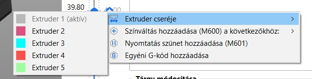

Ha engedélyezi a [**Nyomtatási beállítások - Több extruder - Nincsenek ritkás rétegek**](../beallitasok/print_settings.md#nincsenek-ritkas-retegek-kiserleti) engedélyezését, akkor minden színváltoztatás csak egy réteget ad a törlőtoronyhoz.

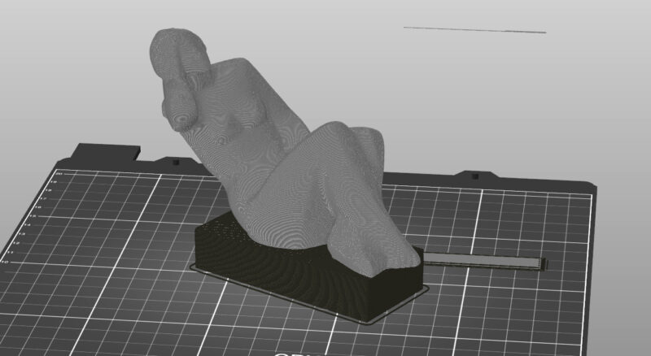

#### _Nyomtatás egyszerre több mint 5 színnel az MMU2S segítségével \(3. lehetőség\)_

Tegyük fel, hogy van egy több anyagból készült nyomtatás, amelyben mind az 5 szál már használatban van. Szeretne azonban még egy színt használni azáltal, hogy manuálisan kicseréli a szálakat az mmu nyílások egyikében.

Egyszerűen mozgassa a réteg előnézet csúszkát a kívánt színváltoztatási magasságba, kattintson a kék plusz ikonra, és válassza ki, hogy melyik extruderhez szeretné hozzáadni a színváltoztatást. Az aktuális rétegben használt összes extruder jelölve lesz.

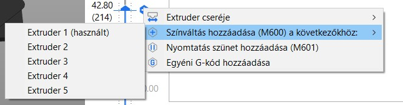

A kapott modell összesen 8 színt használ:

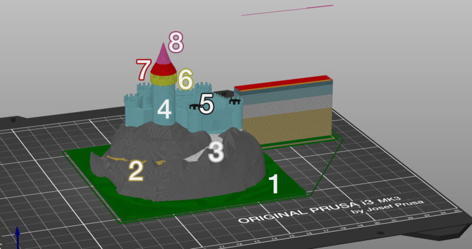

Ebben a példában a tiltott művelet egy rétegalapú színváltoztatás létrehozása azáltal, hogy egy másik extruder hozzárendelésével az alkatrész egyik feléhez. A tető például kéttónusú lehet \(piros/rózsaszín\), de ezt a színváltoztatást csak kézzel lehet elvégezni. Ha a módosítást automatikusan, egy másik extruder hozzárendelésével szeretné elvégezni, ossza a modellt két különálló modellre.

## Tisztítótorony

A YouTube-on egy videó segítségével jól megismerheti a Tisztítótornyok különböző működését: [https://www.youtube.com/watch?v=WZiLsk\_h18U](https://www.youtube.com/watch?v=WZiLsk_h18U)

### Intelligens tisztítótorony

Az intelligens tisztítótorony biztosítja a **tiszta színátmenetet** és a **stabil száláramlást** a színváltás után, miközben a lehető legkevesebb szálpazarlásra törekszik. Mindig csak egy tisztítótorony van, függetlenül attól, hogy hány objektumot nyomtatnak egyszerre.

**A tisztítótorony mérete független a nyomtatandó objektum méretétől.**

Az egyszerre több példány nyomtatása vagy a nagyméretű tárgyak nyomtatása javítja a teljes szálfelhasználás hatékonyságát.

#### _A tisztítótorony elhelyezése_

Amint a Nyomtató kiválasztása mezőben kiválaszt egy több anyaghoz készült nyomtatót, a 3D előnézetben megjelenik a Tisztítótorony. Az előnézet a maximális méretét mutatja, mivel a méret a szeletelés után csökkenhet, az egyes rétegek színváltásainak számától függően. A méret a poligonális vonallal együtt csökken a peremtől. A bal egérgombbal történő húzással megváltoztathatja a Tisztítótorony helyét. Győződjön meg róla, hogy a Tisztítótorony nem fed le egyetlen objektumot sem.

Az objektum és a tisztítótorony közötti távolság lerövidítéséhez helyezze a tornyot az objektum\(ok\) közelébe.

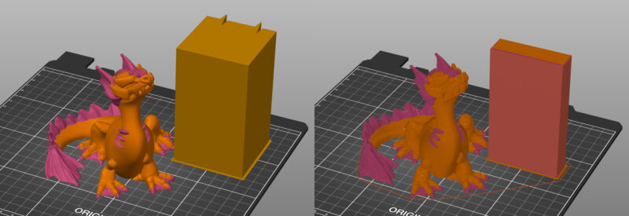

#### _A tisztítótorony mérete_

A **Nyomtatási beállítások - Több extruder - Tisztítótorony** menüpontban beállíthatja a tisztítótorony **szélességét**. A másik dimenzió automatikusan kiszámításra kerül a kiürítendő szál mennyisége alapján.

A tisztítási mennyiséget a jobb oldali panelen található **Tisztítási mennyiségek...** gombra kattintva lehet beállítani.

A Tisztítótorony ritkán van tele. Ehelyett a ritkás és sűrű töltés aránya automatikusan beállítódik minden egyes rétegnél, a színváltások számától függően, hogy a lehető legkevesebb szál pazarlása történjen.

**Tisztítótorony kiürítő vonal**

Ha a Tisztítótorony felett egy vonalat lát a levegőben, az **normális**. Ez az utolsó extruder kilökődésének megjelenítése, mielőtt az utolsó felhasznált szál kiürülne \(az ép hegy létrehozásához\).

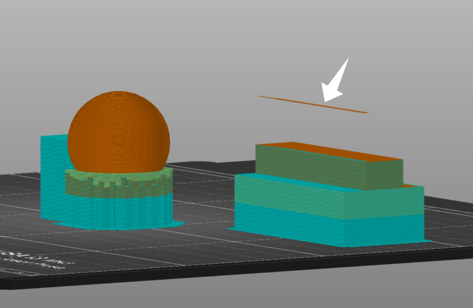

### Tisztítótorony ritkás rétegek nélkül

A Tisztítótorony mérete csökkenthető a ritkás rétegek \(váltás nélküli rétegek\) kihagyásával. Ez anyagot takarít meg, és szinte minden esetben csökkenti a nyomtatási időt.

1. Válassza a **Nyomtatási beállítások - Több extruder** menüpontot.
2. Jelölje be **Nincs ritkás réteg \(Kísérleti\)**

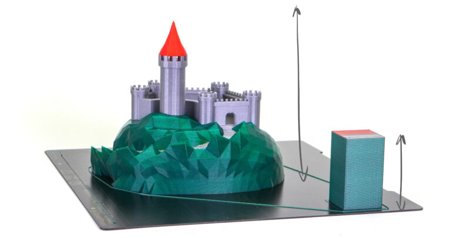

A több anyagból álló projektjeink esetében ez a funkció 3,16%-kal csökkentette a teljes nyomtatási időt, és 16,17%-kal csökkentette a Tisztítótoronyra lerakódott szál mennyiségét.

A Tisztítótorony funkció rétegek és eszközváltás nélkül nagyon hasznos a ColorPrint mmu segítségével. Egy felügyelet nélküli színes tábla nyomtatásához csak kevés szálcserére van szükség, ezért a teljes tisztítótoronyhoz képest sok anyagot lehet megtakarítani.

**Kapcsolja ki az ütközésérzékelést**, ha a Tisztítótorony rétegek és eszközváltoztatások nélkül működik. Ellenkező esetben az X-tengely és a nyomtatott objektum esetleges ütközését kockáztatja az összeomlás utáni helyreállítás során.

Mivel a SuperSlicer jelenleg nem ellenőrzi az extruder és a nyomtatott tárgy ütközését a Tisztítótorony kereszteződésekor, ez a funkció kísérleti jelleggel van jelölve, és ajánlott, hogy a **Tisztítótornyot az MK3S nyomtatási tálca jobb hátsó sarkába**, míg a **tárgyat az ellenkező sarokba** helyezze.

### Tisztítás a kitöltésben

Mivel a modell belseje nem látható, a színátmenet során a fúvóka tisztítására használható. A Tisztítótorony nem küszöbölhető ki teljesen, mivel egyes modellek nem rendelkeznek elegendő kitöltéssel, de a kitöltésben történő tisztítás **jelentősen csökkentheti a pazarolt anyag mennyiségét**.

1. Kattintson a **jobb gombbal** egy modellre a 3D nézetben.
2. Válassza a **Tisztítási lehetőségek** lehetőséget.
3. Ezután a jobb oldali panelen jelölje be a **Tisztítás ennek az objektumnak a kitöltésébe**.

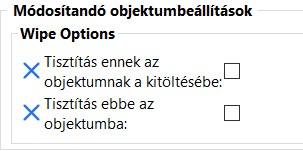

A kitöltésben kitisztított sötét szálak a világos színű falakon keresztül láthatóak lehetnek. A probléma elkerülése érdekében javasoljuk, hogy növelje a kerületeinek számát.

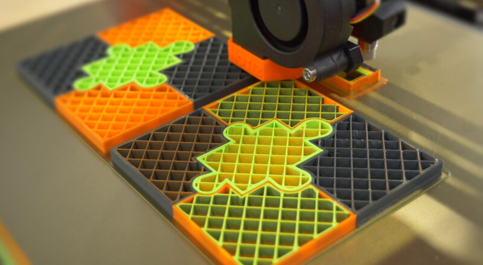

### Objektumba tisztítás

A Tisztítótoronyhoz felhasznált anyagmennyiség további csökkentése érdekében választhatja, hogy a maradék szálakat egy objektumba tisztítja. Ez az úgynevezett " Tisztító objektum " a színátmenet során a fúvóka megtisztítására szolgál. Ennek eredményeképpen a tárgy színei keverednek - ami kényelmes, ha nem törődik a felület színével \(pl. mechanikus alkatrészek\).

1. Kattintson a **jobb gombbal** egy modellre a 3D nézetben.
2. Válassza a **Tisztítási lehetőségek** lehetőséget.
3. Ezután a jobb oldali panelen jelölje be a **Tisztítás ebben az objektumban** jelölőnégyzetet.

**A többszínű objektumnál magasabb objektum tisztítása**

A tisztító objektum a többszínű nyomtatás során utoljára használt szállal készül el.

**Többszínű objektum, amely magasabb, mint a tisztító objektum**

A tisztító objektum kinyomtatása után a tisztítás átkerül a Tisztítótoronyba.

A színváltás során az áramlás nem tökéletesen stabil. Például egy kis mennyiségű levegő kerülhet a fúvókába, amikor az új olvadt anyag felülről tolódik. Ennek eredményeképpen a Tisztító objektumon enyhe részecskék jelenhetnek meg.

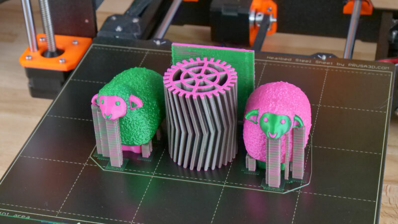

**Tisztítási mennyiség**

Szálak cseréjekor kis mennyiségű olvadt műanyag marad a fúvókában. Az új szál betöltésekor az is megolvad, és elkezdi kinyomni a fúvóka tartalmát. Ez idő alatt az extrudált szál színe fokozatosan megváltozik.

A tiszta színátmenet biztosítása érdekében a SuperSlicer többféleképpen is elhelyezheti ezt a szálat:

* **Tisztítótorony**
* **Tisztítás a kitöltésben**
* **Objektumba tisztítás**

A szálcsere során kiürítendő anyagmennyiséget a jobb oldali eszköztárban található **Tisztítási mennyiségek...** gombra kattintva lehet beállítani.

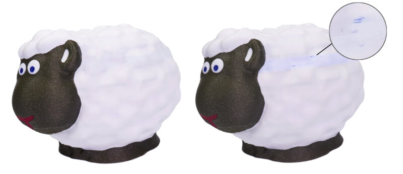

Alapértelmezés szerint egyszerűen beállíthatja a szálak ki- vagy betöltésekor kiürítendő anyag mennyiségét. Ez lehetővé teszi a pazarolt szál mennyiségének optimalizálását, például a fekete szál betöltésekor az ürítendő mennyiség csökkentésével. Másrészt növelheti az értéket, amikor nagyon világos színekre tér át, hogy azok ne szennyeződjenek a korábbi színekkel.

Az ürítési mennyiségek beállításai a _**Tisztítási mennyiségek**_ gombbal érhetők el:

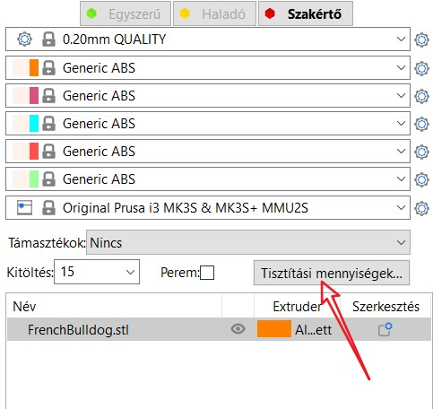

Ez a gomb csak akkor érhető el, ha a Tisztítótorony opció aktív \([_**Nyomtatási beállítások**_ -&gt; _**Több extruder**_ -&gt; **Tisztítótorony** -&gt; **Engedélyezés**](../beallitasok/print_settings.md#engedelyezes-1) \).

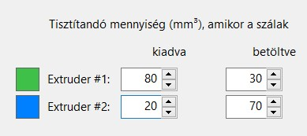

Átállás **Zöld** és **Kék** között = kiürítés **Zöld** + betöltés **Kék** = **80 + 70 = 150 mm³**

Átállás **kék** és **zöld** között = kiürítés **kék** + betöltés **zöld** = **20 + 30 = 50 mm³**

Ha a speciális módra vált, láthatja az egyes színváltoztatási kombinációkhoz kiszámított, az egyszerű mód aktuális beállításaival kiszámított kivágási mennyiséget.

Ha **oldható szálat** használ a támaszték nyomtatásához, növelje az ürítési térfogatot legalább **120** **mm³-re a kiürítéshez.**

Az adalékanyagokat \(magas fényű, sok csillámot stb.\) tartalmazó szálak szintén megnövelt tisztítási mennyiséget igényelhetnek.

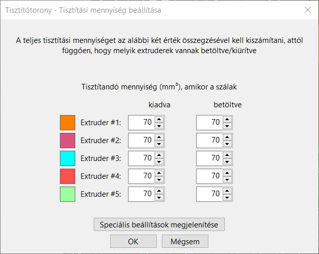

### Haladó mód

A haladó módban egy táblázat jelenik meg. Az egyes cellák az X szálról \(bal oldali oszlop\) az Y szálra \(felső sor\) történő átváltás során a tisztításhoz szükséges szálmennyiséget jelölik.

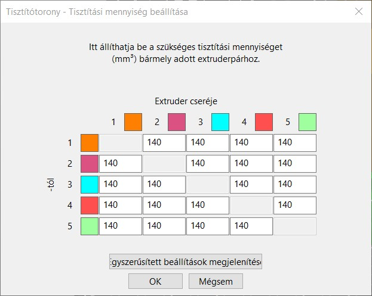

