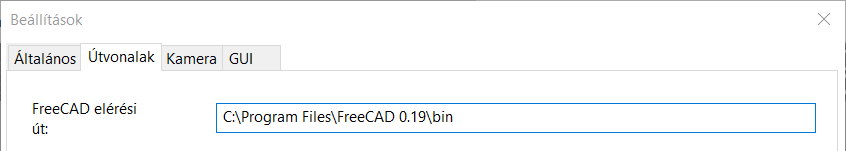
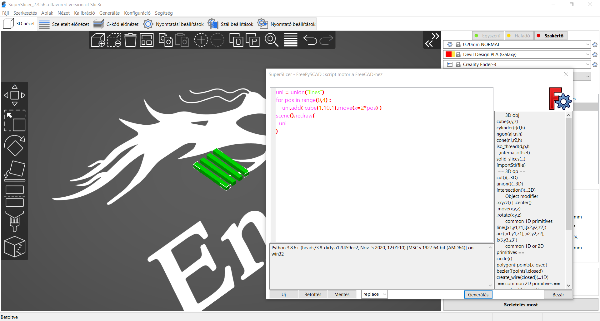

# FreePySCAD script ablak

Forrás : [https://github.com/supermerill/SuperSlicer/wiki/FreePySCAD-script-window](https://github.com/supermerill/SuperSlicer/wiki/FreePySCAD-script-window)

Ennek az ablaknak az a célja, hogy a felhasználó gyorsan létrehozhasson egyszerű geometriát, anélkül, hogy át kellene váltania egy teljes CAD programra, menteni, megnyitni. Ha bonyolult tárgyat kell létrehoznia \(több mint 5 perc alatt\), akkor a valódi CAD-szoftverek használata az előnyösebb választás.

## Hogyan működik

A fát ',' elválasztású függvényekkel írja meg, mint például `union()(cube(x=1,y=3,z=1), cube(3,1,1).move(-1,2))`, hogy létrehozzon egy '**T**'-t például, kicsit úgy, mint az OpenScadben. Ezután rákattint a **generate** gombra, és ez a szkript elküldi a FreeCAD python konzoljára \(meg kell adnia a FreeCAD telepítésének bin könyvtárának elérési útvonalát, 0.19-es vagy magasabb verziójú\). A FreeCAD szoftver egy objektumfájlt küld vissza, amelyet automatikusan importál a tálcájába. A jelenlegi implementációban a tálcán lévő összes objektumot a generált objektum\(ok\) fogja\(k\) helyettesíteni.

## A FreeCad elérési útvonalának beállítása

Győződjön meg róla, hogy a szoftver beállításaiban megadta a **FreeCad** futtatható fájlokat tartalmazó Bin könyvtár elérési útvonalát. A szoftverben állítsa be a **Konfiguráció - Beállítások - Útvonal** menüponton keresztül a FreeCad elérési útvonalát.



## Hogyan kell írni

Olyan alapvető primitív objektumokhoz férhet hozzá, mint a kocka és a henger.

```text
cylinder(r=5,h=2)
```

Elmozdíthatja és elforgathatja őket

```text
cylinder(r=5,h=2).rotate(x=90)
```

Létrehozhatja objektumok egyesítését, metszését és különbségét \(vágását\).

```text
cut()( cylinder(r=5,h=2).rotate(x=90), cylinder(r=2,h=2) )
```

Minden egyesülés, metszés vagy vágás szintén egy objektum.

Minden gyökérszintű objektum létrehoz egy objektumot a lemezen.

Az összes rendelkezésre álló funkció [itt](https://github.com/supermerill/FreePySCAD) van dokumentálva.

## Hogyan írjunk python kódot

Mivel ez egy python szkript, függvényeket, objektumokat és ciklusokat is írhat python nyelven.

Ehhez azonban meg kell mondania, hogy a kód melyik része az objektumgyűjtemény, és melyik része a python kód. Ezt a

```text
scene().redraw().
```

Példa:

```text
uni = union("lines")
for pos in range(0,4) :
    uni.add( cube(1,10,1).move(x=2*pos) )
scene().redraw(
  uni
)
```

A FreeCad-ben a szkript eredménye az alábbi képen látható 



## Címke

Minden függvény elfogadhat egy "name" paramétert. Ez hasznos az egyesítés/kivágás gyökerénél, így elnevezheti az objektumot.

Példa:

```text
cut("my object")( cube(10), cylinder(1,10) )
```

## A szkript ablak

A súgó a kis ablakban található.

Először is, van automatikus kitöltés, automatikusan vagy a **`ctrl`+`space`** billentyűkombinációval.

Másodszor, van egy kis súgóablak, amely megmondja, hogy milyen lehetséges paramétereket adhat meg a függvénybe \(ha van ilyen\). Minden paraméter használható `x=12` formában, de nem kötelező, ha a súgóablakban nincs '=': `cube(size)` azt jelenti, hogy hívhatjuk `cube(10)` vagy `cube(size=10); cylinder(d=,h=)` azt jelenti, hogy csak a `cylinder(d=2,h=3)` formát használhatjuk.

A szkript ablak megpróbálja kijavítani a hibákat, például ha elfelejti a ',' betűt. Ez egy folyamatban lévő munka, mert ideális esetben tényleg meg kellene értenie az írott fát, hogy megmondja, hol van hiba, de ezt még nem tette meg. Ha van valami, ami nagyon zavarja, nyugodtan nyisson problémát.

## Gyorsbillentyűk

* **`crtl` + `szóköz`**: Automatikus kitöltés
* **`ctrl` + `escape`** : kilépés
* **`ctrl` + `S`**: Gyorsmentés \(ha már mentett/betöltött\)
* **`ctrl` + `shift` + `S`** : Mentés másként
* **`ctrl` + `N`** : Törölje a címet.
* **`ctrl` + `G` \| `F5`** : Generálás

