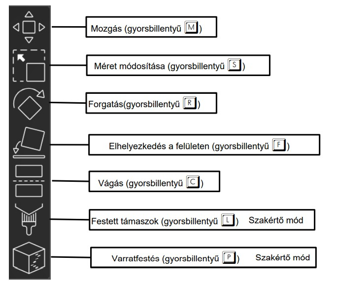
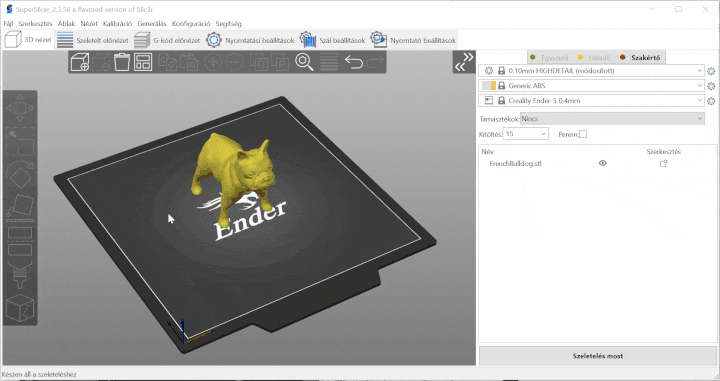
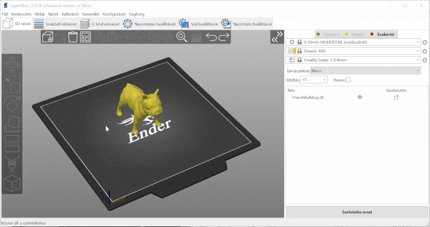
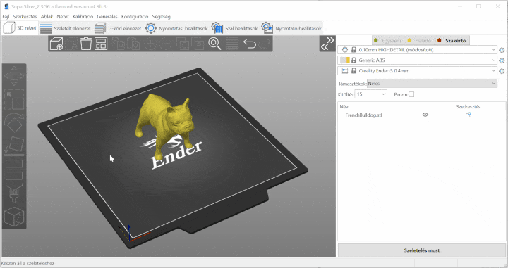
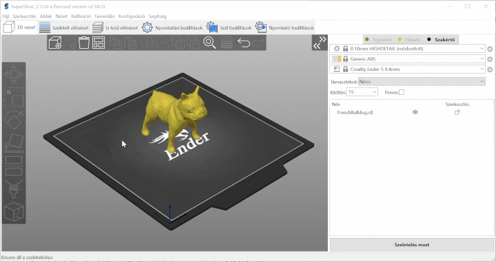
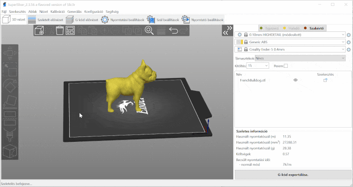
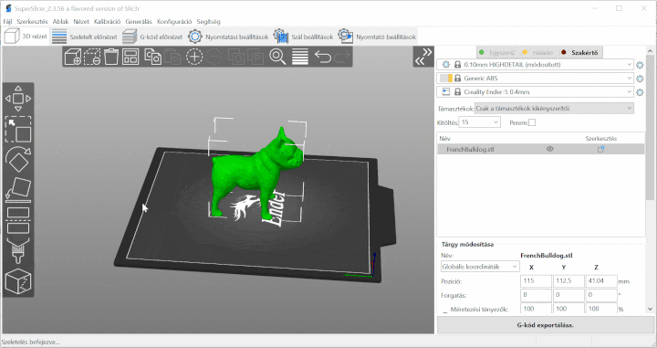
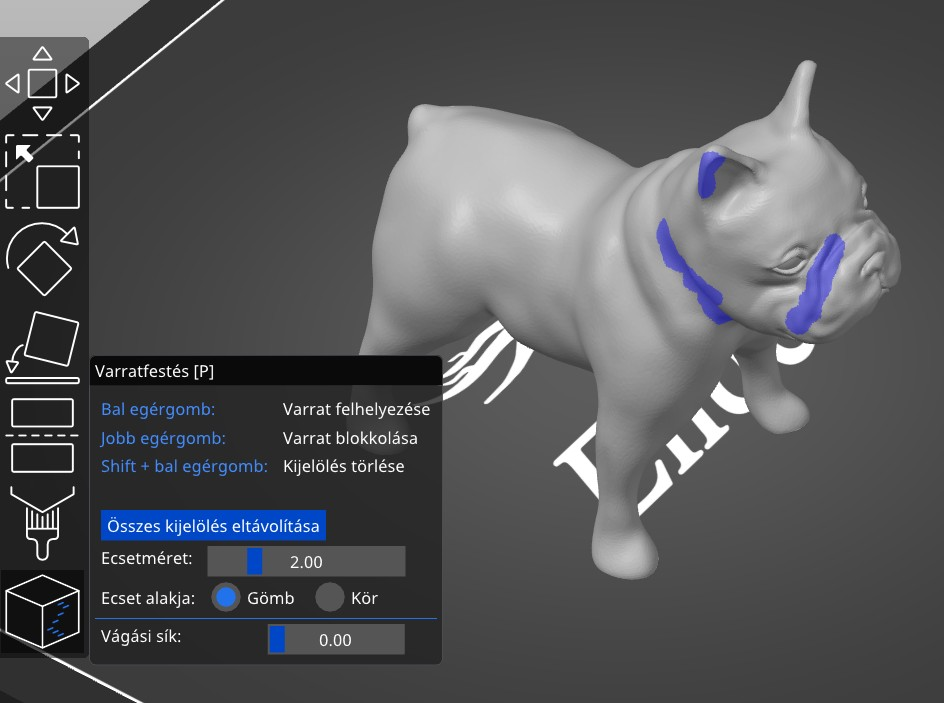

# Bal oldali eszköztár

## Mozgatás, forgatás és méretváltoztatás eszközei

### Mozgatás

Az objektumok a bal egérgombbal történő húzással mozgathatók akkor is, ha a mozgatás eszköz inaktív. A Mozgatás eszköz \(**`M`**\) aktiválásával megjelenik egy 3D manipulátor, amely lehetővé teszi a felhasználó számára, hogy az objektum helyzetét az X, Y vagy Z tengelyen beállítsa.

* Mozgás 1 mm-es lépésekben, nyomja meg a **`Shift`** gombot.

                                                                                [**Nagyobb méret**](https://github.com/sziga/SuperSlicerHu/blob/master/gif/left_toolbar_002.gif?raw=true)  

Megjegyzés: A SuperSlicer-el nem lehet az alkatrészt a nyomtatólemez alá vagy fölé helyezni, nincs lehetőség arra, hogy a szoftver megakadályozza, hogy az alkatrész a nyomtatólemezzel érintkezzen. Az egyetlen trükk az, hogy esetleg hozzá kell adni egy kezdő alkatrészt, majd társítani kell az új alkatrészt, hogy a lemez tetejére helyezze. De nem lehet a lemez alatt.


Megjegyzés: A SuperSlicer-el nem lehet az alkatrészt a nyomtatólemez alá vagy fölé helyezni, nincs lehetőség arra, hogy a szoftver megakadályozza, hogy az alkatrész a nyomtatólemezzel érintkezzen. Az egyetlen trükk az, hogy esetleg hozzá kell adni egy kezdő alkatrészt, majd társítani kell az új alkatrészt, hogy a lemez tetejére helyezze. De nem lehet a lemez alatt.


Szükség esetén bármikor használhatja a vágás funkciót a nem kívánt részek eltávolítására.

### Forgatás

A Forgatás eszköz \(**`R`**\) egy 3D manipulátort jelenít meg, amely lehetővé teszi a felhasználó számára, hogy az objektumot az X, Y vagy Z tengely körül forgassa. Amint a felhasználó megragadja az egyik tengely fogantyúját, két fehér kör alakú körvezető jelenik meg. Ha az egeret az iránymutatók fölé viszi, a forgatás sima helyett szakaszos lépésekre változik.

* Egér pozícionálása a **külső körön / rövid jelek 5 fokos lépésekben**
* Egér pozícionálása a **belső körön / hosszú jelek 45 fokos lépésekben**

                                                                             [**Nagyobb méret**](https://github.com/sziga/SuperSlicerHu/blob/master/gif/left_toolbar_003.gif?raw=true)\*\*\*\*

### Átméretezés

Az Átméretezés eszköz \(**`S`**\) egy 3D manipulátort jelenít meg, amely lehetővé teszi a felhasználó számára az objektum átméretezését vagy egyenlően, az egyik sarokdoboz megragadásával, vagy nem egyenlően, az X, Y vagy Z tengely fogantyújának megragadásával.

Alapértelmezés szerint az átméretezés szimmetrikus, a modell mindkét oldala egyenletesen nyúlik ki, a középpont pedig a helyén marad. A **`Ctrl`** billentyű lenyomva tartása a **X**, **Y** vagy **Z** fogantyúk valamelyikének megragadása előtt nem szimmetrikus módra vált.

* 5%-os lépések **`Shift`** billentyű
* Átméretezés \(maximális méret\) **`F`** billentyű
  * Csak az átméretező eszköz kiválasztásával

                                                                             [**Nagyobb méret**](https://github.com/sziga/SuperSlicerHu/blob/master/gif/left_toolbar_004.gif?raw=true)\*\*\*\*

## Helyezze egy síkra \(Irányba helyezés eszköz\)

Előfordulhat, hogy a modell az importálás után helytelenül tájolódik. Ez különösen akkor fordul elő, ha a modellt olyan 3D modellező szoftverből exportálták, amely más tengely elrendezést használ. A **gyorsabb** módja a modell megfelelő irányba történő elforgatásának a Helyezze egy síkra \(**`F`**\) eszköz használata.

_**Először válassza ki azt a modellt**_, amelyet át szeretne irányítani. Ezután nyomja meg az **`F`** billentyűt, vagy válassza a bal oldali eszköztárból a **Helyezze egy síkra** parancsot. Több fehér sík jelenik meg a modellen. A fehér síkok egyikére kattintva az adott síkot a nyomtatólemezhez igazítja.

                                                                                [**Nagyobb méret**](https://github.com/sziga/SuperSlicerHu/blob/master/gif/left_toolbar_005.gif?raw=true)\*\*\*\*

A névvel ellentétben a javasolt "síkok" nem csak a modellen lévő síkok, hanem a modellen lévő 3 támpont által megvalósított síkok is lehetnek. Az algoritmus mindezek mögött a modell úgynevezett konvex burkológörbéjének kiszámítása.

## Vágás

Bizonyos esetekben előfordulhat, hogy a modellt nyomtatás előtt több darabra kell vágni:

* A modell túl nagy ahhoz, hogy egy darabban nyomtassa ki.
* A modellnek csak egy részét szeretné kinyomtatni

A SuperSlicer alapvető vágási funkciót biztosít. A vágás az XY síkkal lehetséges. Jelölje ki az objektumot, és nyomja meg a **`C`** billentyűt, vagy válassza a bal oldali eszköztárból a **Vágás** parancsot. Megjelenik egy 3D manipulátor és egy környezetfüggő menü.

                                                                                [**Nagyobb méret**](https://github.com/sziga/SuperSlicerHu/blob/master/gif/left_toolbar_006.gif?raw=true)\*\*\*\*

A vágási sík Z-tengelyének pozícióját úgy állíthatja be, hogy megragadja a kezelőelem kocka alakú fogantyúját, és felfelé vagy lefelé húzza. A felugró menüben pontos értéket \[mm\] is megadhat. Alapértelmezés szerint a modell két részre lesz osztva, mindkettő az aktuális tájolásban marad, és a nyomtatólemezre kerül.

A felső vagy alsó rész eltávolítása a **Felső/alsó rész megtartása** jelölőnégyzet kijelölésének megszüntetésével választható. Végezetül választhatja, hogy az alsó részt felfelé fordítja - ez gyakran kényelmes, mert a vágás egy szép lapos területet hoz létre a nyomtatólemezre helyezéshez.


A modell különböző tengelyek mentén történő vágásához először forgassa el a modellt, majd végezze el a vágást.


## Festett támogatások

Ez az eszköz a **SuperSlicer 2.3** verziójától kezdve érhető el.

A Festett támogatások egy olyan eszköz, amely lehetővé teszi, hogy közvetlenül az objektumra fessen, és kijelölje azokat a területeket, ahol a támasztékokat meg kell **erősíteni** vagy **blokkolni** kell

Az eszköz a bal oldali eszköztáron érhető el, és **csak a Haladó és a Szakértő módban jelenik meg**. Egy objektum kiválasztása és az eszköztár ikonjára való kattintás után az összes többi objektum elrejtésre kerül, hogy ne takarja el a látványt, a kiválasztott objektum a kontraszt kedvéért világosszürke színben jelenik meg.

**Bal egérgomb** - Támasztékok kikényszerítése

**Jobb egérgomb** - Támasztékok blokkolása

**Shift** + **bal egérgomb** - Kijelölés törlése

**Alt** + **Egérkerék** - Ecsetméret módosítása

                                                                                 [**Nagyobb méret**](https://github.com/sziga/SuperSlicerHu/blob/master/.gitbook/assets/left_toolbar_008.gif?raw=true)\*\*\*\*

### Támaszték generálása

**Ne felejtse el engedélyezni a támasztékokat**, ha valóban létre akarja hozni őket. Alapértelmezés szerint a támaszték generálása **Nincs** értékre van állítva a jobb oldali panelen.

#### Támasztékok kikényszerítése

Ha manuálisan határozza meg a támaszték mezöket, célszerűbb a támasztékokat **Csak a támasztékok kikényszerítői** beállításra módosítani.

Természetesen a támaszokat **Mindenhol** vagy **Csak az építőlemezről** is beállíthatja, és a támaszték kényszerítőkkel további megtámasztandó területeket is megjelölhet. Ez a második felhasználási eset akkor hasznos, ha a **Túlnyúlás küszöbérték**et nagyon alacsonyra állítja, így csak a nagyon meredek túlnyúlások kapnak automatikusan generált támaszokat

#### A támaszok blokkolása

Ha támaszték blokkolókat használ, akkor a támasztékokat csak a **Mindenhol** vagy a **Csak az építőlemezről** valóra kell változtatnia. Ezekben az üzemmódokban a **Nyomtatási beállítások - Támasztékok** menüpontban az **Automatikusan generált támasztékok** is be vannak kapcsolva. A támaszok mostantól a beállított túlnyúlási küszöbérték alapján generálódnak, kivéve a festett támasztékblokkolók által blokkolt területet.

#### A támasztékok egyidejű kikényszerítése és blokkolása

Nagyon összetett modellek esetén előfordulhat, hogy egyszerre szeretne kényszerítő és blokkoló támasztékokat használni. Ebben az esetben állítsd be a támaszokat a **Mindenhol** vagy **Csak az építőlemezről**. Blokkolókkal blokkolhat néhány automatikusan generált támasztékot, ugyanakkor kényszerítőkkel jelölheti azokat a területeket, amelyek nem kaptak automatikus támasztékot,

**FONTOS MEGJEGYZÉS:** Ha a festett terület nagyon kicsi, akkor a kiválasztás nem lesz teljes mértékben betartva. Maga a támaszgenerátor belsőleg rácshálóval dolgozik, így a támogatott/nem támogatott területek nem végtelenül részletesek.

### Kurzor típusa

#### Gömb alakú kurzor \(alapértelmezett\)

A gömb belsejében mindent megfest, függetlenül attól, hogy az aktuális nézetből látható-e vagy sem. A legtöbb esetben ez az előnyben részesített módszer.

#### Kör alakú kurzor

A körön belüli összes látható területet kifesti az aktuális nézetből, esetleg néhány területet festetlenül hagy, de soha nem fest a sarkok mögé.

### Vágási sík

A vágási sík eszközzel elrejtheti az objektum egy részét, így a nehezen hozzáférhető területek könnyen festhetők. A vágási sík mozgatásához mozgassa a csúszkát balról jobbra.

Irány visszaállítása gombbal a vágási sík eszközt az aktuális kameranézettel párhuzamosan igazíthatja. Ha például azt szeretné, hogy a vágási sík fel-le mozogjon, nézze a modellt felülről \( Fenti kép\), és nyomja meg a **Irány visszaállítása** gombot. A gomb akkor jelenik meg, ha a csúszkát bármilyen nem nulla értékre mozgatja.

### Automatikus szögbeállítás

A _**Automatikus szögbeállítás**_ gomb kiválasztja az összes olyan háromszöget, amely "vízszintesebb", mint a küszöbérték. Alapértelmezettként használható a későbbi kézi szerkesztéshez, hogy biztosítsa, hogy nem maradnak alátámasztatlanul túlnyúlások. Egy másik felhasználási lehetőség, hogy egyszerűen előnézetben megnézzük a túlnyúlásokat, és eldöntjük, hogy hol akarjuk a merevítőket festeni. A túlnyúló háromszögek **valós időben** jelennek meg a küszöbérték beállításakor.

                                                                              ****[**Nagyobb méret**](https://github.com/sziga/SuperSlicerHu/blob/master/.gitbook/assets/left_toolbar_011.gif?raw=true)\*\*\*\*

### Visszavonás és újra

Amíg a festéstámogató eszköz nyitva van, új visszavonási és újból elvégezni előzmények jönnek létre. Visszavonhat minden egyes festékvonást \(festék felvitele, blokkolás, törlés\).

A _**Festett támasztékok**_ eszközből való kilépés után az utolsó festési munkamenet összes vonása egyetlen lépéssé egyesül a globális visszavonási és újra festés előzményekben.

### Festett támaszték mentése 3MF-be

Ha a **Fájl - Projekt mentése** parancsot használja, a generált 3MF fájl tartalmazza a festett támasztékokra vonatkozó összes információt. Ez azt jelenti, hogy a festett támasztékokat a jövőben testre tudja szabni, ha újra megnyitja a fájlt a SuperSlicer-ben.

Ez nagyon hasznos, ha **meg akarja osztani a modelljét**. Más emberek szabadon használhatják és módosíthatják a festett támaszokat.

## Varratfestés

Ez az eszköz a **SuperSlicer 2.3**-as és újabb verziójában érhető el.

Hacsak nem "spirálváza" üzemmódban nyomtat, a kerület minden egyes hurokjának el kell kezdődnie és véget kell érnie valahol. A nyomtatónak egy rövid időre le kell állnia az extrudálással, amikor a nyomtatófej a következő rétegre lép. Ez a kezdő- és végpont egy potenciálisan látható **függőleges varratot** hoz létre az objektum oldalán. Ezt általában pattanásoknak, rétegvarratoknak vagy hegeknek nevezik.

A nyomtatási beállításokban beállíthatja a varrat pozícióját, hogy megpróbálja elrejteni a varrást egy sarokban, véletlenszerűvé teheti a varrat pozícióját, vagy a sablon hátuljához igazíthatja.

A varratfestő eszközzel részletesebben szabályozhatja a varrat elhelyezését. Az eszköz a bal oldali eszköztárból érhető el, és csak a **haladó** és **szakértői** üzemmódban jelenik meg. Az ikonra kattintás után a felhasználó a a támaszokhoz hasonlóan "varratkikényszerítőket" vagy "varratblokkolókat" festhet a modellre.

**Bal egérgomb** - varrat felhelyezése

**Jobb egérgomb** - Varrat blokkolása

**Shift** + **bal egérgomb** - Kijelölés törlése

**Alt** + **egérkerék** - Ecsetméret módosítása

### A varrat elhelyezési logikája

Ha van varráskényszerítő, akkor a varrattokat mindig a kényszerítő területre helyezi.

Ha van blokkoló, akkor a területet kizárja a lehetséges varratjelöltek közül

A legközelebbi varrás, a hátsó varrás és a véletlenszerű varrás helyzeti beállításait mindig tiszteletben tartja. Ha az Igazított opció aktív, és kényszerítőket használ, a varrat a **megszabott terület közepén** helyezkedik el. Ez lehetővé teszi, hogy tiszta varrattokat rajzoljon a modellre.

### A kurzor típusa

#### Gömb alakú kurzor \(alapértelmezett\)

A gömb belsejében mindent megfest, függetlenül attól, hogy az aktuális nézetből látható-e vagy sem. A legtöbb esetben ez az előnyben részesített módszer.

#### Kör alakú kurzor

A körön belüli összes látható területet kifesti az aktuális nézetből, esetleg néhány területet festetlenül hagy, de soha nem fest a sarkok mögé.

### Vágási sík

A vágási sík eszközzel elrejtheti az objektum egy részét, így a nehezen elérhető területek könnyen festhetők. A vágási sík mozgatásához mozgassa a csúszkát balról jobbra.

A **Irány visszaállítása** gomb a vágási síkszerszámot az aktuális kameranézettel párhuzamosan igazítja. Ha például azt szeretné, hogy a vágási sík felülről lefelé mozogjon, nézze meg a felső modellt \(**Felső kép**\), és nyomja meg az **Irány visszaállítása** gombot. A gomb akkor jelenik meg, ha a kurzort egy nem nulla értékre mozgatja.

### A varrat igazítása

A varrás a festett területen lesz elhelyezve, de ha azt szeretné, hogy a varrás mindig ugyanazon az oldalon legyen, ne felejtse el kiválasztani a következő opciót: **Igazított varrat pozicionálása**.

                                                                             [**Nagyobb méret**](https://github.com/sziga/SuperSlicerHu/blob/master/.gitbook/assets/left_toolbar_014.gif?raw=true)\*\*\*\*

