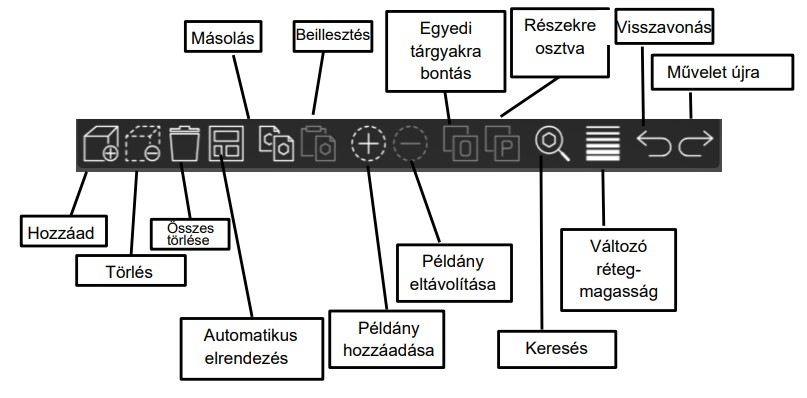
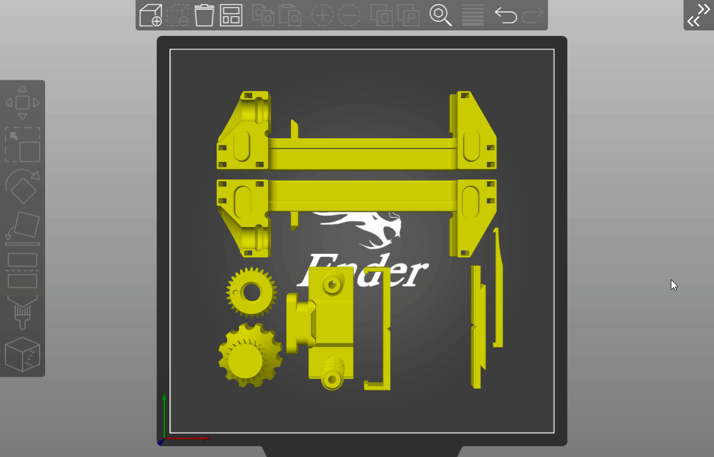
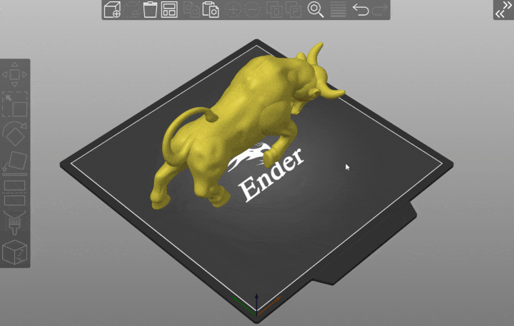
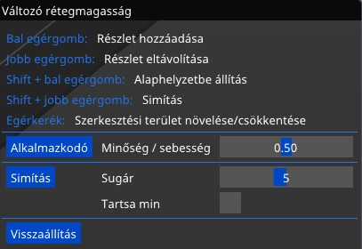
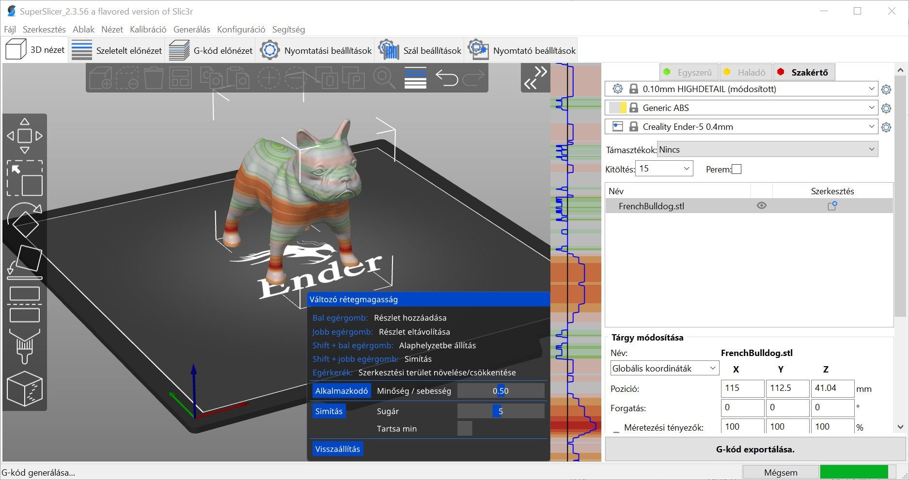
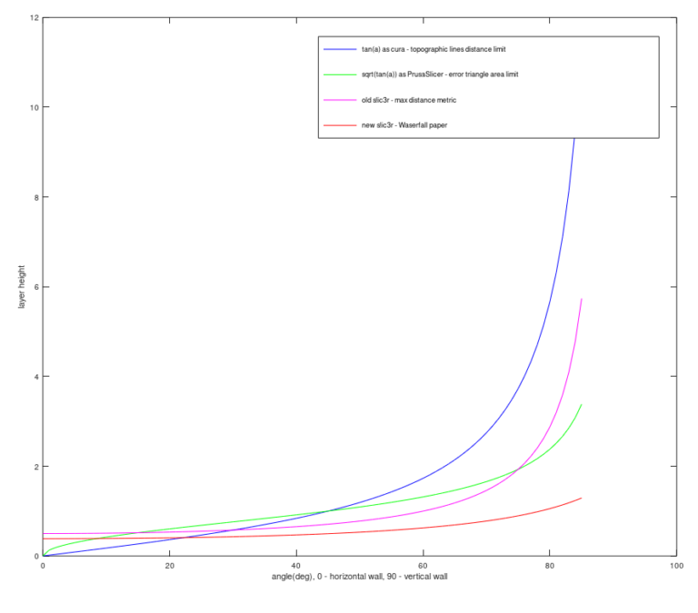
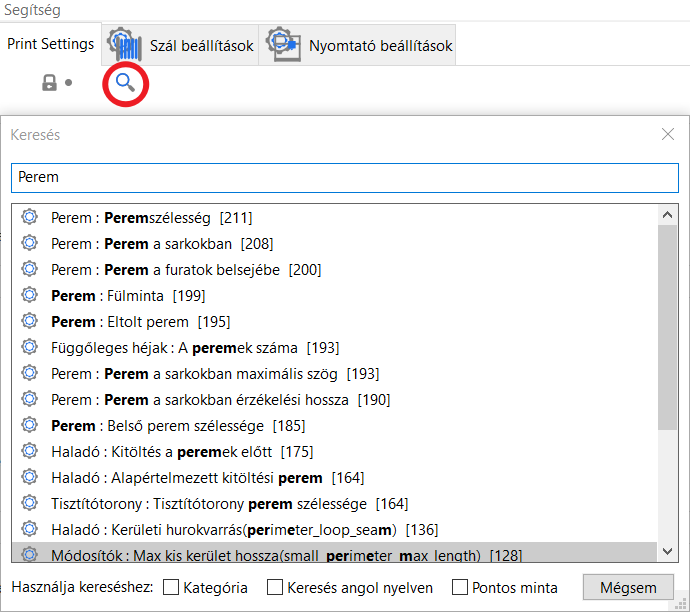
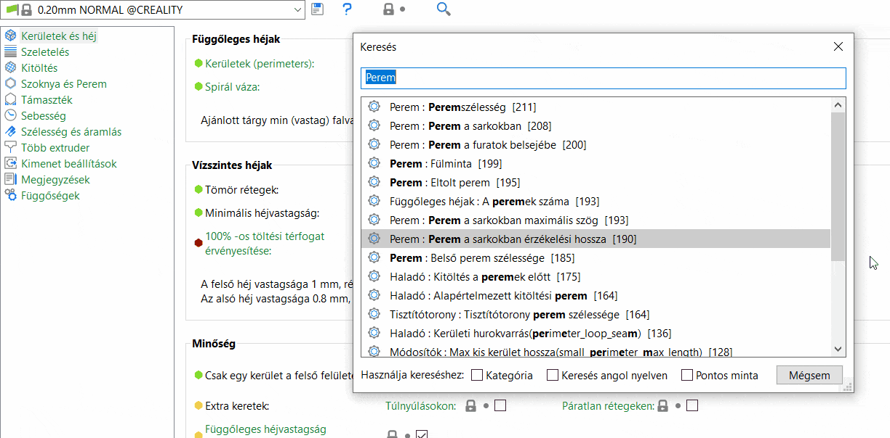

# Felső eszköztár

## Automatikus elrendezés eszköze

Ha több modellt importál, vagy több példányt hoz létre ugyanabból a modellből, a nyomtatási tálcán való elrendezésük nagyon időigényes lehet. A SuperSlicer rendelkezik egy automatikus elrendező eszközzel, amely az objektumokat a teljes nyomtatólemezen ésszerű távolsággal osztja el. Az automatikus elrendezés a **`A`** billentyű lenyomásával vagy a felső eszköztár Automatikus elrendezés parancsával indítható.

### Részleges elrendezés

Az Automatikus elrendezés eszközzel a táblán lévő objektumoknak csak egy részhalmazát rendezheti el, miközben a ki nem választott objektumok pozíciója változatlan marad. Ehhez jelölje ki az elrendezendő objektumokat, és nyomja meg az **Elrendezés** gombot, miközben lenyomva tartja a **`Shift`** billentyűt, vagy nyomja meg a **`Shift`**+ **`A`** billentyűkombinációt.

## Visszavonás / Újra

A 3D szerkesztő nézetből elérhető összes művelet visszavonható, beleértve az objektum kiválasztását, az oldalsávban végzett műveleteket \(módosítók hozzáadása, attribútumaik módosítása\), kivéve a nyomtatási, szál- és SLA anyagprofilok módosítását.

**`Ctrl`**+ **`Z`** **Visszavonás**

**`Ctrl`**+ **`Y`** \(vagy **`Ctrl`**+ **`Shift`**+ **`Z`**\) **Újra**

Egyszerre több lépést is visszavonhat vagy újrakezdhet, ha **jobb gombbal** kattint a **Visszavonás vagy Újra gombra**, és kiválaszt egy pontot az előzmények között. Mivel minden pillanatképhez egy kifejező név van rendelve, könnyű eligazodni a műveletek hosszú listáján.

A Nyomtatás / Szál / SLA anyag vagy nyomtató lapon a beállítások megváltoztatása már visszavonható a "Visszaállítás a rendszerértékre" és a "Visszaállítás a felhasználó által elmentett értékre" gombokkal, ezért úgy döntöttünk, hogy nem tesszük az ilyen beállítások megváltoztatásának eseményeit a tálca nézet Visszavonás / Visszaállítás halmazába.

## Másolás és beillesztés

Kiválaszthat egy vagy több modellt, és a felső eszköztáron található gombok segítségével vagy a megszokott gyorsbillentyűkkel másolhatja/beillesztheti őket:

**`Ctrl`**+ **`C`** **Másolás**

**`Ctrl`**+ **`V`** **Beillesztés**

Az objektumok másolása a módosítóktól kezdve az objektum példányokig vagy a támaszték blokkolókig és kényszerítőkig mindent tartalmaz.

## Példányok

### Példány hozzáadása / eltávolítása

A modell kiválasztásával, majd a felső eszköztáron lévő **plusz** vagy **mínusz** ikonokra kattintva, vagy a billentyűzet gyorsbillentyűvel adhat hozzá vagy távolíthat el példányokat:

`+` **Példány hozzáadása**

`-` **A példány törlése**

Ez a lehetőség a szövegkörnyezeti menüben is elérhető, ha jobb gombbal kattint egy modellre. A szövegkörnyezeti menüben található a példányok számának beállítása opció is, ami akkor hasznos, ha sok kisebb objektumot kell kinyomtatnia.

A másolás **`Ctrl`**+ **`C`** és a beillesztés **`Ctrl`**+ **`V`** nem példányokat, hanem a szülőobjektum független másolatait hozza létre.

### Objektum példányok

Az objektumpéldányok lényegében egy objektum másolatai, amelyek össze vannak kapcsolva, és a Z-tengely elforgatásának kivételével ugyanazokat a beállításokat és tájolást használják. Rendkívül hasznosak, ha gyorsan szeretne egy nyomtatást beállítani ugyanannak a modellnek több példányával.

Ha az egyik példány méretét megváltoztatja, az összes példány méretét megváltoztatja. Ha levágja a modell alját, az összes példányt levágja, stb.

### Egy példány elválasztása a szülőobjektumtól

Kattintson a jobb gombbal egy példányra, és válassza a **Különálló objektumként** való beállítás parancsot. A példányt az objektumlistában az objektum szülőobjektumától el is húzhatja.

A különálló példányok önálló objektumként viselkednek, és változásuk csak őket érinti. Létrehozhatja azonban ennek az új objektumnak a példányait, amelyek visszahivatkoznak rá.

## Tárgyakra/részekre bontás

A 3D nyomtatásban \(és a modellezésben, animációban és más területeken\) az objektumokat a **külső héjukkal** ábrázolják. Ez a héj háromszög alakú hálóként van ábrázolva. Lehetséges, hogy egy fájlban több háló is legyen.

Az STL fájlok mindig egyetlen objektumként lesznek importálva, függetlenül a fájlban szereplő különálló modellek számától.

A 3MF fájlok natívan támogatnak több objektumot, minden egyes objektumot megfelelően azonosítanak és különálló egységként töltenek be.

Néha ez szándékosan történik, például amikor a teljes nyomtatólemezt egyetlen STL-ként exportálja, vagy amikor több anyagból álló modellt exportál. Előfordulhat, hogy az egyes objektumok önálló feldolgozásához különálló héjakat szeretne létrehozni, vagy különböző modellekhez különböző nyomtatási beállításokat definiálni. A SuperSlicer képes automatikusan azonosítani a több héjat egyetlen fájlban, és különálló modellekre bontani őket. Ennek két különböző módja van.

Válassza ki a felosztani kívánt modellt, és kattintson a felső eszköztáron az **Objektumokra osztás** vagy az **Részekre osztás** gombra.

### Objektumokra osztás

* Minden egyes héjhoz külön objektumot hoz létre
* Minden egyes újonnan létrehozott objektumot elhelyez a nyomtatólemezen.

### **Részekre osztás**

* A modell egyetlen példányát tartja a lemezen, de több részt hoz létre
* Az alkatrészek az eredeti helyükön maradnak, még akkor is, ha a levegőben lebegnek a nyomtatólemez felett.
* Általában az MMU-modellek felosztására használják az egyes részek eltolódása nélkül.

## Változó rétegmagasság funkció

A SuperSlicer lehetővé teszi, hogy a modell különböző régióit különböző rétegmagassággal nyomtassa ki, és automatikusan kisimítsa a köztük lévő átmenetet. Ez jelentősen rövidebb nyomtatási időt eredményezhet, a nyomtatási minőség minimális feláldozása mellett.

A változó rétegmagasság beállítható **automatikusan**, **manuálisan** vagy **kombinálhatja a két módszert**.

### A változó rétegmagasság beállítása

Először válasszon ki egy modellt a 3D nézetben. Ezután a felső eszköztáron elérhetővé válik a változó rétegmagasság eszköz. Amint aktiválja, megjelenik az egyes rétegek által létrehozott kontúrvonalak **valós idejű előnézete**. A jobb alsó sarokban megjelenik egy új ablak, és a 3D nézet jobb oldalán egy új panel jelenik meg.

                                                                                [**Nagyobb méret**](https://github.com/sziga/SuperSlicerHu/blob/master/gif/top_toolbar_009.gif?raw=true)\*\*\*\*

**Alkalmazkodó \(Adaptív\)**

Kiszámítja a rétegprofilt a Minőség/sebesség paraméter alapján.

**Minőség/sebesség**

Ennek a csúszkának a mozgatásával változtathatja a vékony és vastag rétegek arányát. Kattintson a **Alkalmazkodó** gombra az új változó rétegprofil megjelenítéséhez.

**Simítás**

Ahogy a neve is mutatja, ez a változó rétegmagassági profilt simítja. A nagyobb **sugár** tovább lágyítja a görbét. **Ezt a gombot többször is megnyomhatja**, hogy még simább eredményt kapjon.

**Tartsa min**

Ha engedélyezve van, a **kisebb rétegmagasságok \(zöld\)** nem lesznek simítva, és a minimális értékükön maradnak.

**Visszaállítás**

Visszaállítja a változó rétegmagasság beállításait \(automatikus és manuális módosítások\).

Az automatikus változó rétegmagasság eredményét manuálisan módosíthatja.

Az automatikus lépést teljesen kihagyhatja, és mindent beállíthat manuálisan is.

Ha az egeret a változó rétegmagasság panel fölé viszi \(jobbra\), a modell érintett része sárgával van kiemelve.

Bal egérgomb **Részletek hozzáadása**

Jobb egérgomb **Részletek törlése**

**`Shift`**+ bal egérgomb **Alaphelyzetbe állítás**

**`Shift`**+ jobb egérgomb **Simítás**

Egérkerék **Növeli vagy csökkenti a szerkesztett területet**

Vegye figyelembe, hogy az objektum **minden példányára** a változó rétegmagasság eszköz is hatással van.

Lehet, hogy a kék vonal alján egy **éles ugrást** vesz észre - **ez normális**, és az első réteg magassági beállításának vizuális megjelenítése.

### Automatikusan változó rétegmagassági metrikák

A felület minőségének különböző mérőszámaival kísérleteztünk. A [Florens Wasserfall és társai](https://tams.informatik.uni-hamburg.de/publications/2017/Adaptive%20Slicing%20for%20the%20FDM%20Process%20Revisited.pdf) által a **Slic3r**-ben alkalmazott metrika korlátozza a maximális diszkretizációs hibát \(a forrásmodell lépcsőzetes felületének legnagyobb euklideszi távolsága\).

**A SuperSlicer** korlátozza a [kontúrvonalak](https://en.wikipedia.org/wiki/Contour_line) maximális távolságát az XY síkban, intuitívabb eredményeket produkálva, mint a Waserfall metrika.

Végül egy másik metrikát is alkalmaztunk, amely a lépcsőzetes felület és a forrásmodell közötti keresztmetszeti területet korlátozza. Az alábbi grafikon a különböző metrikák rétegmagassági határértékét mutatja a felszín lejtésének függvényében.

## Milyen rétegmagassági profilt válasszon?

Próbáljon olyan profilt választani, amelynek rétegmagassága közel áll ahhoz, amilyen magassággal a nyomtatás nagy része nyomtatva lesz. Mondhatnánk, hogy ez nem igazán számít, ha a csúszkát a minőség/sebesség javára mozgatja, akkor nagyon kis rétegmagasságot kaphat még akkor is, ha egy nagyon magas rétegprofil van kiválasztva. A profilok azonban a rétegmagasságon kívül más dolgokat is megváltoztatnak a magas rétegek például szélesebb extrudálást kapnak. Egy jó "átlagos" rétegmagassági profil \(pl. 0,15 mm-es rétegmagassági profil 0,4 mm-es fúvókához\) valószínűleg a legtöbb esetben szintén jól fog működni.

## Keresés

A 2.3-as verzió újdonsága, hogy a SuperSlicer mostantól lehetővé teszi a beállítások keresését, hogy gyorsan hozzáférjen egy adott beállítási oldalhoz és beállítási mezőhöz. A keresés elérhető a felső eszköztárról és a nyomtatási beállítások/szál beállítások/nyomtatóbeállítások oldalról, vagy a **`Ctrl`**+ **`F`** billentyű kombinációval.

Ha megtalálta a keresett beállítást, akkor arra kattintva közvetlenül a megfelelő oldalra jut, és egy villogó nyíl jelzi az adott beállítást.

Lehetőség van angol nyelven, a SuperSlicer leggyakrabban használt nyelvén keresni.

Példa: Keresés a "_**First layer"**_  kifejezésre: angol nyelvű keresés aktiválása nélkül és aktiválással.

A _**Kategória**_ opció lehetővé teszi a keresést azon kategóriák neve alapján is, amelyekbe a paraméterek besorolhatók.

