# Felhasználói felület

## Felhasználói felület áttekintése

A SuperSlicer meglehetősen egyszerű felhasználói felülettel rendelkezik. A képernyő nagy részét a 3D nézet foglalja el, amely a 3D modellek kezelésére szolgál. A felső eszköztár \(**1**\) objektumok hozzáadására és törlésére szolgál. A bal oldali eszköztár \(**4**\) a 3D modellek módosítására szolgáló eszközöket, például az átméretezés vagy a forgatás eszközt tartalmazza. A jobb oldali panel elsősorban a nyomtatás, a szál és a nyomtatóprofil kiválasztására szolgál \(**6,7,8**\), valamint annak kiválasztására, hogy a nyomtató támasztékokat vagy peremeket kíván-e létrehozni.

A “Szeletelés most” \(**5**\) gombbal létrehozható a G-kód, amely ezután SD-kártyára exportálható, vagy közvetlenül nyomtatóra küldhető. Néhány speciális funkció alapértelmezés szerint el van rejtve, ezeket később aktiválhatja, ha haladó vagy szakértői üzemmódba vált \(**10**\).

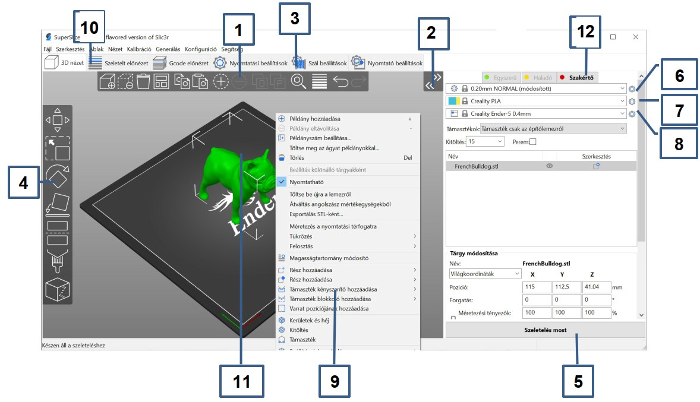

1. A **Hozzáadás** gomb betölti a modelleket a SuperSlicerbe.
2. Az Oldalsáv összecsukása/kibontása
3. Megnyitja a részletes nyomtatási, szál- és nyomtatóbeállításokat
4. **Mozgatás**, **méretváltoztatás**, **elforgatás**, **síkra helyezés** és **vágás** eszközei
5. Gomb a vágáshoz és G-kód generálásához
6. A nyomtatás minőségének/sebességének beállítása
7. Anyag kiválasztása
8. Nyomtató kiválasztása
9. A modellre **jobb egérgomb**bal kattintva egy kontextuális \(környezetfüggő\) menü nyílik meg.
10. Váltás a 3D szerkesztő és a réteg előnézet között
11. Modell áttekintés
12. Váltás az Egyszerű / Haladó / Szakértő módok között

## Objektum kezelő panel

Amikor egy vagy több objektum van kijelölve, a jobb oldali panelen megjelenik az objektumkezelő panel.

A szöveges bejegyzések segítségével gyorsan megváltoztathatja :

* A pozíciót
* A forgatást
* A méretezési tényezőt
* A méretet

A skála gyorsan visszaállítható 100%-ra a **narancssárga visszaállító nyíl gombbal**.

Amikor átalakít egy modellt vagy egy több részből álló modell egy részét, a nyomtatóágyának egy megfelelő helyén jelenik meg, amikor a kiválasztott objektum a nyomtatóágy felett vagy alatt van.

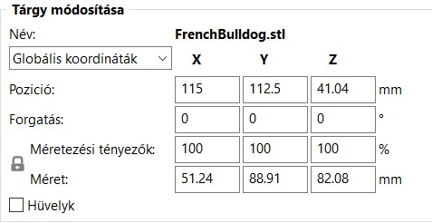

Ha globális koordinátákról helyi koordinátákra vált, 3 gyors tükrözés gombot használhat.

### Helyi vs. globális koordináták

A haladó és szakértői módban a helyi és globális koordináták között lehet váltani.

A helyi koordinátarendszer állandó az objektumhoz képest. A globális koordináták a nyomtatóágyhoz viszonyítva állandóak. Ez azt jelenti, hogy egy objektum mérete a globális koordinátákban változik, ha elforgatja azt például a Z tengely körül. A méret a helyi koordinátákban állandó, függetlenül attól, hogy bármelyik tengely körül elforgatjuk.

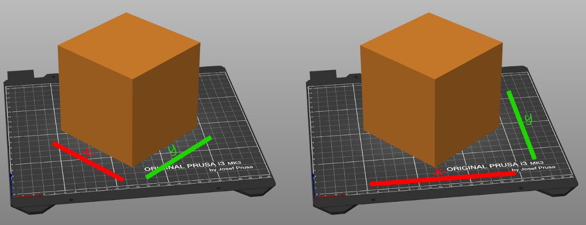

## Objektumok listája

Az objektumlista a jobb oldali panelen található, és a következő hierarchiát mutatja:

* Objektumok \(modellek\)
* Példányok
* Egyéni paraméterek az egyes objektumokhoz
* Módosítók - Magasságtartomány módosítók és módosító hálók
* Támogatás generátorok és blokkolók

Az objektumfára pillantva világos képet kaphat a projekt szerkezetéről.

Az objektumlistában a modell nevére **duplán kattintva** átnevezheti azt. Ez akkor lehet hasznos, ha több, CAD-szoftverből exportált általános nevű alkatrészt nyomtatunk.

A **szem ikon** a “nyomtatható” tulajdonságot kapcsolja. Ha kikapcsolja, a sablon a nyomtatási lemezen marad, de a szeletelőszoftver a G-kód generálásakor figyelmen kívül hagyja ezt a modellt.

A **Szerkesztés** ikonra kattintva egy felugró menü nyílik meg, amely lehetővé teszi a kiválasztott objektum beállításainak testreszabását.

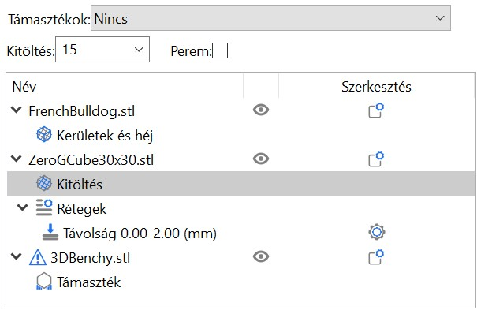

## Nézet

Bal egérgomb **Forgatás**

Jobb egérgomb **Mozgatás**

Egérkerék, **I** nagyítás, **O** kicsinyítés

**`B`** **Nagyítás a teljes nyomtatólemezre**

**`Z`** **Nagyítás a kijelölt objektumokra vagy az összes objektumra, ha egyik sincs kijelölve.**

**0** **Izometrikus nézet**

**1** **Nézet felülről lefelé**

**2** **Nézet alulról felfelé**

**3** **Előlnézet**

**4** **Hátulnézet**

**5** **Bal oldali nézet**

**6** **Jobb oldali nézet**

## Modellek kiválasztása

Az alapvető kiválasztás a bal egérgombbal történik

A **Ctrl** billentyű lenyomva tartásával és további modellekre kattintva hozzáadhatja az aktuális kijelöléshez.

**Shift** + egérrel húzás **négyszög kijelölés**

**Alt** + egérrel húzás **négyszög kijelölés törlése**

**Ctrl** + **A** **Válasszon ki mindent**

A kiválasztás az _**objektumlistán**_ keresztül is elvégezhető.

## Egyszerű, haladó, szakértő módok

A felhasználói felület megjelenése attól függően változik, hogy milyen üzemmódban van. A jobb oldali panelen található gombok segítségével vagy a **Konfiguráció - Mód - Egyszerű/haladó/szakértő** menüpontra kattintva válthat másik üzemmódra.

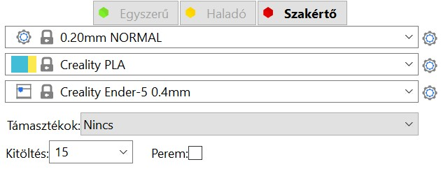

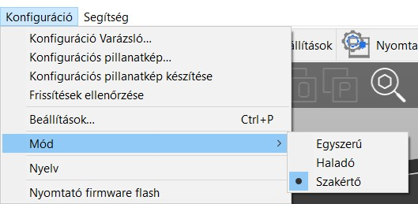

Az Egyszerű mód mögött az áll, hogy a kezdők számára csökkentse a tanulási görbét, az alkalmi felhasználók számára pedig egyszerűsítse a felhasználói felületet. Az olyan összetett funkciók, mint a módosító háló, el vannak rejtve, és csak az alapvető paraméterek egy része jelenik meg a felhasználó számára.

A Haladó módban több paraméter jelenik meg, a Szakértő módban pedig a SuperSlicer összes hatékony funkciója elérhető. A paraméterek könnyebb elsajátítása érdekében színkódoltuk őket.

* **Zöld** - kezdők számára is biztonságosan használható
* **Zöld** - kezdők számára is biztonságosan használható
* **Piros** - szakértői beállítások, amelyek többségéhez csak akkor érdemes hozzányúlni, ha új nyomtatóhoz készít profilokat.

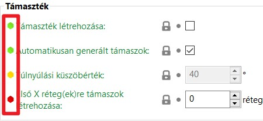

## A szeletelés áttekintése

A modell szeletelése után a szeletelés eredményét az alsó eszköztáron található gombok segítségével tekintheti meg, vagy megnyomhatja a **Tab** billentyűt.

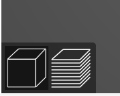

Az első gomb a 3D szerkesztő módban való megjelenítést teszi lehetővé \(**Ctrl** + **1** \) , a másik a vágások eredményét jeleníti meg\( **Ctrl** + **2**\).

A SuperSlicer normál felületén a kivágást a _**Kivágás előnézet**_ vagy _**G-kód előnézet**_ fül gombjára kattintva is megtekintheti.

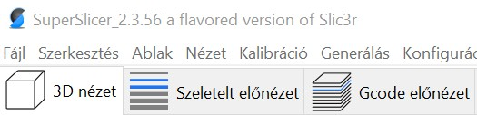

A SuperSlicer felület esetében a modellt a \(**Ctrl** + **1** \), a másik a szeletelés eredményét \( **Ctrl** + **2** \), végül a következő a G-kód előnézetét \( **Ctrl** + **3** \) jeleníti meg.

A szeletelés nézetmódban a bal felső sarokban színkódolt információkat, valamint az egyes pályatípusok időtartamát és százalékos arányát láthatja.

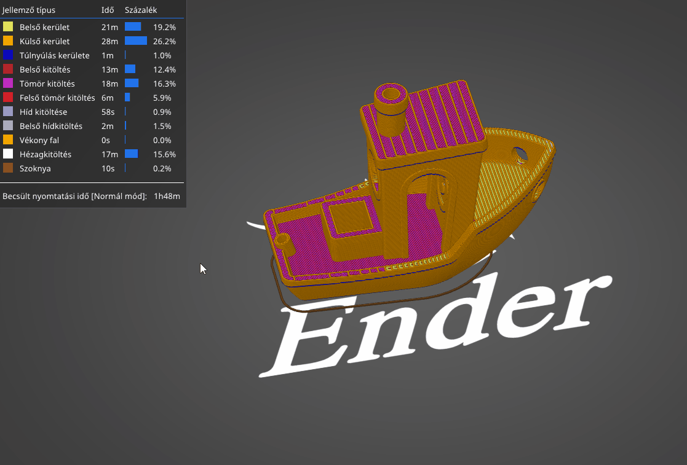

Ha csak bizonyos típusokat szeretne megtekinteni, kattintson az információs területen az elrejteni/megjeleníteni kívánt útvonalakra.

A "Normál elrendezés fülekkel" felülettípusban a 3D nézet, a szeletelés előnézet és a G-kód előnézet szakaszok elérhetősége a szoftver menüi alatti fülekbe van integrálva.

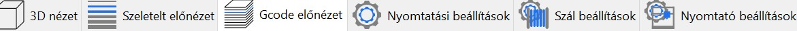

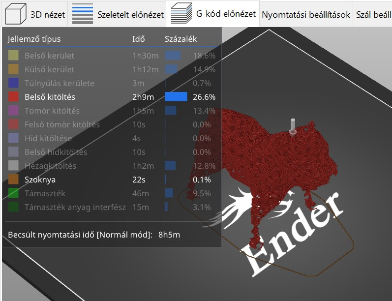

A lenti sávval az is beállítható, hogy milyen típusú pályát szeretne megjeleníteni. 

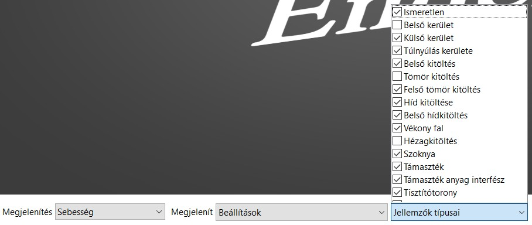

Ez a menüsor lehetővé teszi a kívánt megjelenítés típusának beállítását is.

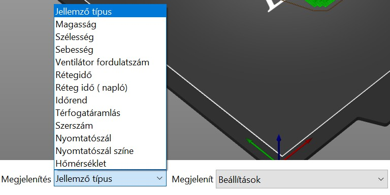

Választhat a következők közül:

* **A funkció típusa**: A megjelenített útvonalak típusa
* **Magasság:** Réteg magassága
* **Szélesség** : Extrudálás szélessége
* **Sebesség**: Nyomtatási sebesség
* **Ventilátor fordulatszám:** ventilátor sebessége
* **Rétegidő** : Az egyes rétegek időtartamának megjelenítése.
* **Rétegidő \(napló\)** : Az egyes rétegek időtartamának megjelenítése napló üzemmódban
* **Nyomtatási idő:** Az alkatrészek teljes nyomtatási ideje
* **Térfogatáramlás**: Térfogatáramlás mm3/s-ben
* **Extruder**: fúvóka és aktív extruder
* **Nyomtatószál**: A felhasznált szál kijelzése, különösen hasznos, ha több extrudáló egységgel rendelkező gépet használnak.
* **Nyomtatószál színe**: Az extrudálás színének megjelenítése. Ne feledje, hogy a szín nem feltétlenül kapcsolódik egy szálhoz, ha a szál cseréje kézzel történik M600-as kóddal.
* **Hőmérséklet** : Nyomtatási hőmérséklet

Az ezen a sávon található beállítások lehetővé teszik a vizualizációban megjeleníteni kívánt elemek beállítását is.

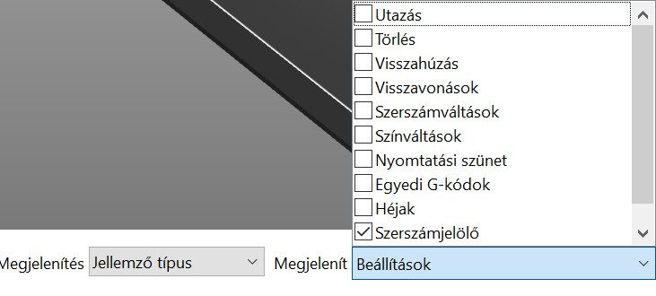

Például hozzáadhatja a :

* **Visszahúzás** : A szoftver által hozzáadott visszahúzások

  helyzete.

* **Törlés:** Fúvóka törlési útvonal a már nyomtatott területeken
* **Utazás :** Hozzáadott mozgási elmozdulás extrudálással

  visszahúzáskor.

* **Egyedi** G-kódok
* **Nyomtatási szünetek** 
* **Héjak** \(A 3D modell vizualizációja\)
* …

## Billentyűzet gyorsbillentyűk

A SuperSlicer szinte minden funkciója elérhető billentyűparanccsal. Ezen túlmenően számos funkciónak van egy alternatív módja, amely módosító billentyűvel érhető el. Ezek nagyszerű időmegtakarítást jelentenek, és javasoljuk, hogy legalább a leggyakrabban használt eszközök billentyűparancsait tanulja meg, mint például a: Mozgatás **\(M\)**, Forgatás **\(R\)** és méretváltoztatás **\(S\)**.

Az összes billentyűkombináció listája megtekinthető a **Súgó - Billentyűkombinációk** ablakban \(vagy a **Shift**+**?** billentyűkombinációval\).

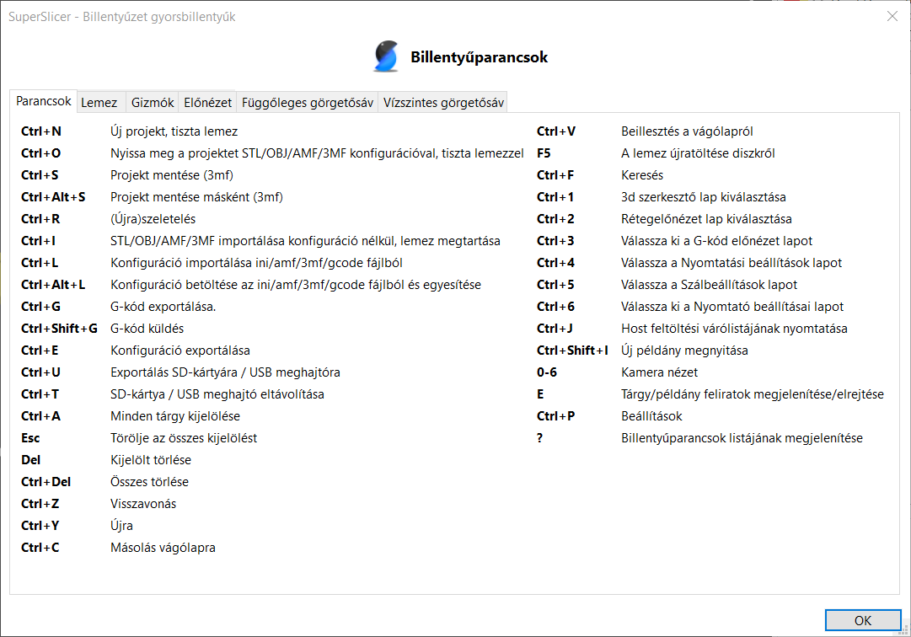

Alternatív megoldásként az eszköz ikonja fölé is mehet, és rövid késleltetés után megjelenik a billentyűkombináció.

### Lemez

A nyomtatólemez billentyűzet gyorsbillentyűi.

| **A** | Elrendezés |
| :--- | :--- |
| **Shift** + **A** | Részleges elrendezés \(a válogatás elrendezése\) |
| **Ctrl**+ **A** | Minden objektum kijelölése |
| **Suppr**. | Kijelölés törlése |
| **Ctrl** + **Del** | Töröljön mindent |
| **Ctrl** + **C** | Másolás |
| **Ctrl** + **V** | Beillesztés |
| **+** | Példány hozzáadása |
| **-** | Példány törlése |
| **M** | Mozgatás |
| **S** | Átméretezés |
| **R** | Forgatás |
| **C** | Vágás |
| **F** | Helyezze az egyik síkra |
| **L** | SLA támasz |
| **Shift**+ Az egér húzása | Téglalapos kijelölés |
| **Alt**+ Az egér húzása | A téglalapos kijelölés megszüntetése |
| **Shift** + Átméretezés eszköz | 5%-os ugrás |
| **Shift** + Mozgató eszköz | 1 mm-es lépésköz |
| **F**+ Átméretező eszköz | Átméretezés a megfelelő méretre \(maximális méret\) |
| **Ctrl**+ Átméretező eszköz | Csak egy irányba történő méretváltoztatás |
| **K** | A kamera típusának módosítása \(perspektíva/ortográfiai\) |
| **B** | Nagyítson rá a nyomtatólemezre |
| **Z** | Nagyítás minden objektumra |
| **Z**  + Kiválasztott modell | A kiválasztott modell nagyítása |
| **I** | Nagyítás |
| **O** | Kicsinyítés |
| **Ctrl** + **M** | 3D eszközbeállítások megjelenítése/elrejtése |
| **Esc** | A kiválasztás törlése |

### Előnézet

Billentyűparancsok az előnézet kezeléséhez

| **Nyíl felfelé** vagy **O** | Felső réteg |
| :--- | :--- |
| **Nyíl lefelé** vagy **D** | Alsó réteg |
| **L** | Részletek megjelenítése/elrejtése |
| **+** | Kijelölés törlése |
| **-** | Összes törlése |

### Főablak

Billentyűparancsok a főablakban történő megtekintéshez.

| **Ctrl** + **O** | Projekt megnyitása \(törli a nyomtatólemezt\) |
| :--- | :--- |
| **Ctrl** + **I** | Modell importálása \(megtartja a nyomtatólemezt\) |
| **Ctrl** + **L** | Konfiguráció betöltése |
| **Ctrl** + **G** | G-kód exportálása |
| **Ctrl** + **S** | A projekt mentése \(3MF\) |
| **Ctrl** + **Alt** +**L** | Konfiguráció betöltése és egyesítése |
| **Ctrl** + **R** | \(Újra\)szeletelés |
| **Ctrl** + **1** | Nyomtatólemez lap |
| **Ctrl** + **2** | Szeletelés előnézeti lapja |
| **Ctrl** + **3** | G-kód előnézet lap |
| **Ctrl** + **4** | Nyomtatási beállítások lap |
| **Ctrl** + **5** | Szálbeállítások lap |
| **Ctrl** + **6** | Nyomtató beállításai lap |
| **Ctrl** + **P** | Beállítások |
| **Ctrl** + **J** | A hoszt letöltési várólistájának megtekintése |
| **0** - **6** | Kamera nézet |
| **?** | Billentyűparancsok megjelenítése |
| **Ctrl**+ Egérkattintás | Modell hozzáadása a kiválasztáshoz |

## Különféle

### **Zárt lakat ikon**

A Nyomtatás, a Szál és a Nyomtató lapok minden egyes beállítása mellett egy **zárt** vagy **nyitott** lakat ikon látható. A zárt zár ikon azt jelzi, hogy az érték megegyezik az aktuálisan kiválasztott profilban szereplő értékkel. Amint az érték megváltozik, az ikon nyitott lakatra változik, és megjelenik egy vissza nyíl, amely lehetővé teszi a nyomtatási profil értékének visszaállítását. Ezen kívül **a címke narancssárgára változik**. Ez lehetővé teszi, hogy gyorsan megállapítsa, mely beállításokat változtatták meg.

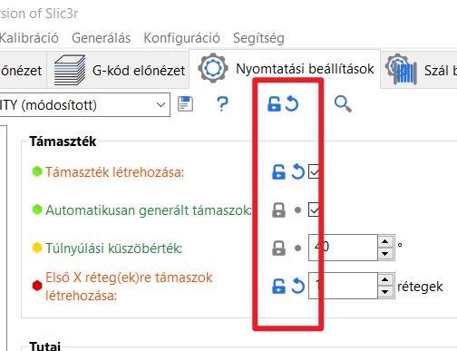

Az alábbi példában egy változót módosítottunk, a zár nyitva van, és az érték mellett megjelenik a törlő nyíl. Ezenkívül a változó szövege narancssárgára változik.

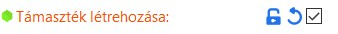

### Keresés a beállításokban

Hozzáférés a billentyűkombinációval \(**Ctrl** + **F**\) A nagyító ikon lehetővé teszi a paraméterek keresését a paraméter címének közvetlen megjelölésével. Miután megtalálta a kívánt paramétert, a listában való kattintással közvetlenül a kívánt funkcióra helyezi. A megnyitott paraméteroldalon egy **kis villogó piros nyíl** jelzi az érintett területet.

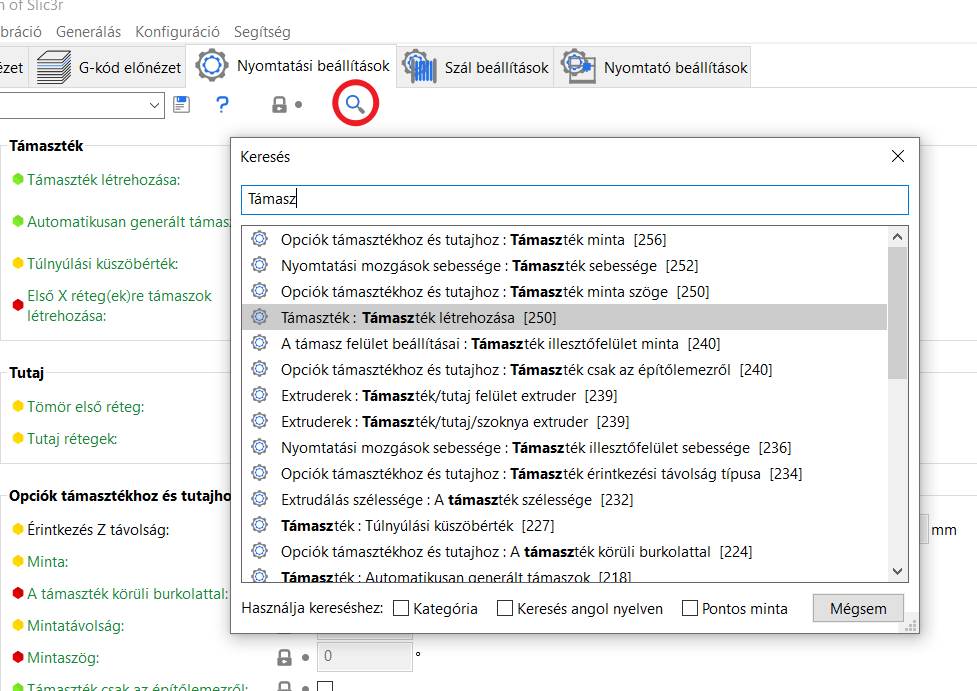

### Színvak mód

Ha Ön a színvakság valamelyik típusában szenved, a SuperSlicer által használt színek közül néhányat testre szabhat. Kattintson a piros kérdőjelre a Nyomtatás, anyag vagy nyomtató beállításai lapon. Ezután az új ablak alján lévő két szín egyikére kattintva beállíthat egy másik színt.

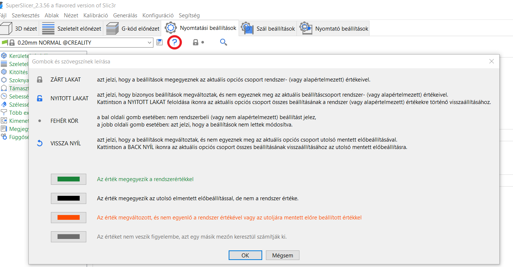

