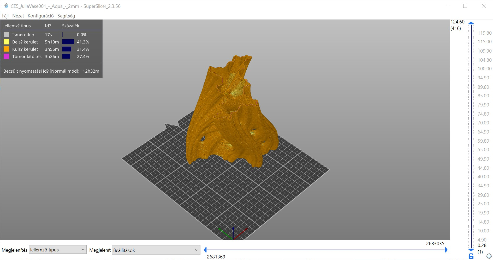

# SuperSlicer G-code Viewer \(SuperSlicer G-kódnéző\)

A **SuperSlicer G-code Viewer \(SuperSlicer G-kódnéző\)** egy könnyű alkalmazás, amellyel gyorsan megtekintheti az összes népszerű szeletelő G-kódját. A viselkedése megegyezik a SuperSlicer előnézetével \(ugyanazt a kódot használja\), de betölthet egy külső G-kód fájlt.

## Támogatott szeletelők

A szoftver jelenleg elemzi és bizonyos mértékig értelmezi a :

* [SuperSlicer](https://github.com/supermerill/SuperSlicer)
* [PrusaSlicer](https://www.prusa3d.fr/prusaslicer/)
* [Slic3r et Slic3rPE](https://slic3r.org/)
* [CURA](https://ultimaker.com/fr/software/ultimaker-cura)
* [ideaMaker](https://www.raise3d.com/ideamaker/)
* [Simplify3D](https://www.simplify3d.com/)
* [Craftware](https://craftbot.com/software)
* [KISSlicer](https://www.kisslicer.com/)

A SuperSlicer önálló G-kód megjelenítője megpróbálja megbecsülni az extrudálási szélességeket, rétegmagasságokat, extrudálási típusokat, mozgástípusokat, rétegeket stb. a különböző szoftvermegoldások által generált G-kódból. Maga a G-kód nem tartalmazza az összes fenti információt, ezért a G-kódot általában szeletelőspecifikus megjegyzésekkel egészítik ki. Igyekszünk minél több adatot összegyűjteni, de előfordulhat, hogy egyes részek még mindig ismeretlenként vannak megjelölve.

A SuperSlicer a G-kódot a ";TYPE:", ";HEIGHT:", ";LAYER\_CHANGE", ";COLOR\_CHANGE", ";PAUSE\_PRINT" és ";CUSTOM\_GCODE" megjegyzésekkel értelmezi. Az ezeket az új megjegyzéseket nem tartalmazó generált G-kód továbbra is megjelenik, de a szélességek vagy extrudálási típusok nem biztos, hogy megbízhatóan megjelennek.

A más szeletelőkkel generált G-kód valószínűleg helyesen fog betöltődni, de néhány funkció, például a nyomtatási idő elemzése funkció szerint, nem biztos, hogy elérhető lesz.

## .gcode fájlkiterjesztéssel társítva

Ha a fájlkiterjesztést . G-kód fájlkiterjesztést a G-kód megjelenítőhöz, akkor egyszerűen elindíthatja azt a fájl megnyitásával \(dupla kattintással vagy az Enter billentyű megnyomásával\). Ezt a Konfiguráció - Beállítások - Fájlok társítása . G-kód fájlokat a SuperSlicer G-kód megjelenítőjébe.

#### A fájlkiterjesztést az operációs rendszer eszközeivel is hozzárendelheti.

### Windows

* Kattintson a jobb gombbal bármelyik **G-kód** fájlra.
* _Válassza a Megnyitás a következővel - Válassza ki az alapértelmezett programot ... - superslicer-gcodeviewer_
* _Kattintson a Bővebben gombra az alján_.
* _Jelölje be a **Mindig ez az alkalmazás nyissa meg a fájltípust**_

### macOS

* _Válasszon ki egy tetszőleges G-kód fájlt a Finderben, és válassza a Fájl &gt; Információ lekérdezése parancsot._
* _A Megnyitás a következővel szakaszban válassza a superslicer-gcodeviewer lehetőséget._
* _Kattintson az Összes módosítása gombra és erősítse meg_

### Ubuntu

* _Bármely G-kód fájl kiválasztása_\`
* _Kattintson a jobb gombbal a fájlra, és válassza a Tulajdonságok menüpontot_
* _Válassza a Megnyitás lapot_
* _Válassza ki a superslicer-gcodeviewer lehetőséget, és kattintson a Beállítás alapértelmezettként gombra._

A folyamat hasonló más Linux disztribúcióknál is.

## Jellemzők

A G-kód önálló megjelenítője megjeleníti a használt nyomtatási/szűrési/nyomtatási profilok nevét.

Amikor a végleges G-kód a szeletelés után rendelkezésre áll, megjelenik egy új vízszintes csúszka, amely korlátozza a túlnyúlás és a mozgás időbeli megjelenítését, ami lehetővé teszi a nyomtatás időbeli szimulálását. Alapértelmezés szerint az új vízszintes csúszka a függőleges eszköztárral utoljára kiválasztott réteg nézetét korlátozza. Alternatívaként a vízszintes csúszka a függőleges csúszkával kijelölt összes rétegben korlátozza a kitöréseket. Az első esetben, ha a vízszintes csúszka korlátozza a felső réteg láthatóságát, akkor a többi alsó réteg szürkén jelenik meg. Ezt a vizualizációs stratégiát a Craftware felhasználói felületétől kölcsönöztük, akárcsak a Cura.

A leírás mostantól a nyomtatási időt és a nyomtatási idő töredékét mutatja jellemzőként \(kerület, kitöltés stb.\), és a leírásban lévő címkék gombokként szolgálnak az adott extrudálási idő megjelenítéséhez/elrejtéséhez. A becsült nyomtatási idő a szeletelés utáni G-kód előnézetben és az önálló G-kód megjelenítőben is elérhető.

### Több példány

Annyi SuperSlicer G-kódnézőt indíthat, amennyit csak akar, akár úgy, hogy megnyit egy G-kódot a "Fájl-&gt;G-kód előnézet" menüben, akár úgy, hogy elindítja a G-kódnéző alkalmazást, akár úgy, hogy duplán kattint egy G-kód fájlra a fájlkeresőben.

