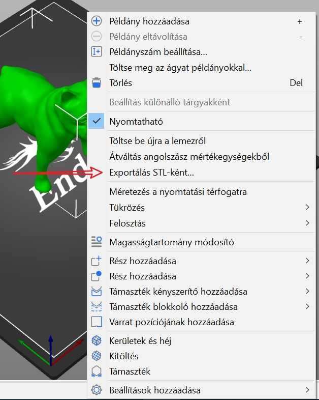
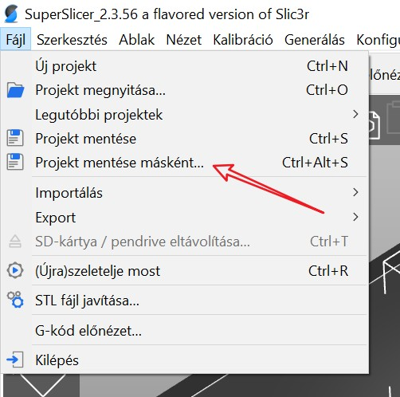
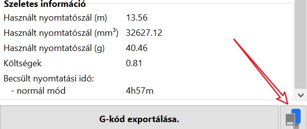
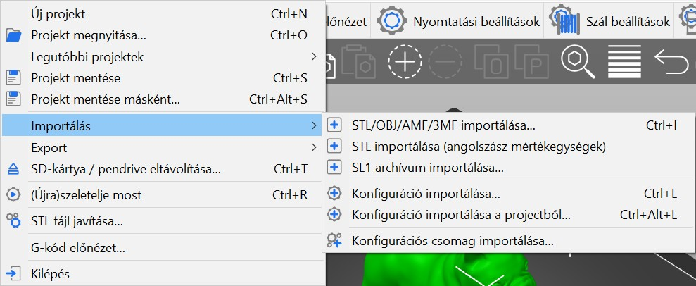
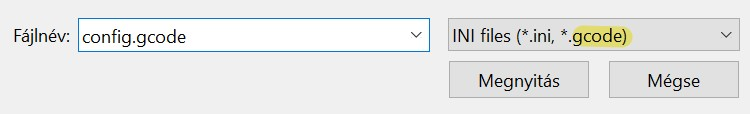
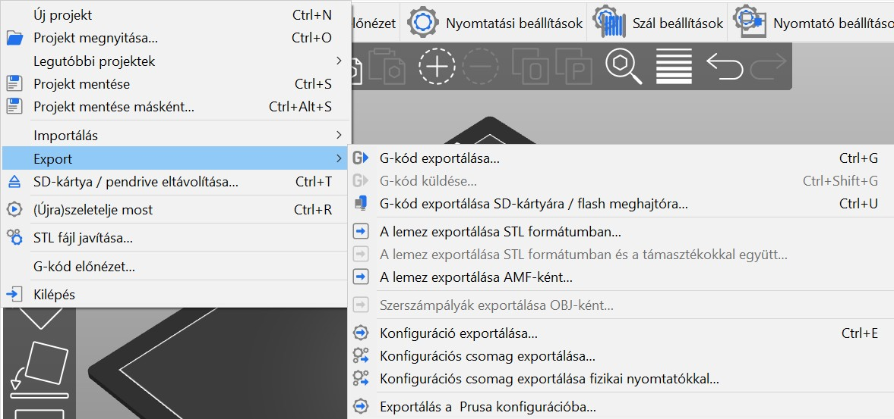
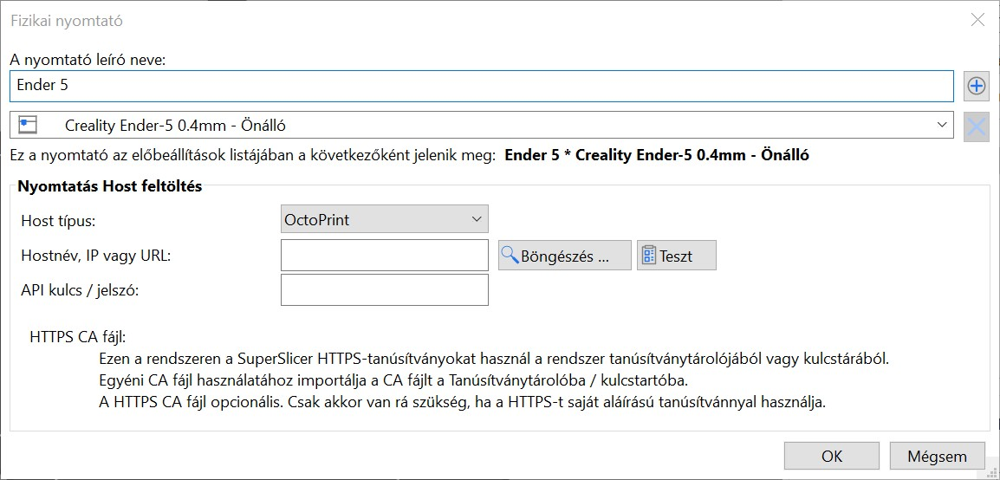

# Bemenet/kimenet

## Exportálás

A nyomtatási tálcán lévő összes objektum és a SuperSlicer összes beállítása egyetlen _**3MF projektfájlként**_ menthető a **Fájl - Projekt mentése** menü segítségével.

A **3MF** fájlok letöltése egy remek módja annak, hogy online megossza modelljét. Az STL-hez képest a 3MF további információkat tartalmaz, például a nyomtatási beállításokat, az alkatrésznézeti miniatűröket, az egyéni médiát, a változó rétegmagasságot és még sok mást!

Alternatívaként a nyomtatóágyon lévő összes modell egyetlen STL-ként exportálható a **Fájl - Export - Tálca exportálása STL-ként** menüpont segítségével.

Az egyes modelleket STL formátumban is exportálhatja. Kattintson a **jobb gombbal** az egyik modellre a 3D nézetben, és válassza az **Exportálás STL-ként** ... Ez akkor lehet hasznos, ha a SuperSlicerben módosításokat végzett a modellen, például kivágta a modellt.

SLA üzemmódban a **Fájl - A lemez exportálása STL formátumba a támasztékokkal együtt** menüponton keresztül a fa típusú támasztékok \(nem módosítható STL-ként\) is felvehetők.

_Elavult_

_Végül a teljes tálca exportálható AMF formátumba a Fájl - Exportálás - Tálca exportálása AMF formátumba menüponton keresztül._

## Támogatott fájlformátumok

### 3MF

Az előnyben részesített fájlformátumot a projektfájlok mentésére is használják.

### STL

Mind a bináris, mind az ASCII formátum támogatott.

### OBJ

Az olyan információk, mint az anyag és a textúra, figyelmen kívül maradnak az importálás során.

### AMF

_**AMF**_ = Additív gyártási fájlformátum

Bár az AMF formátum támogatott, ma már a különböző szoftvermegoldások között konszenzus van a 3MF formátum mellett. Ezért ajánlott a 3MF formátumot használni a projektek mentéséhez.

AMF formátum: [https://en.wikipedia.org/wiki/Additive\_manufacturing\_file\_format](https://en.wikipedia.org/wiki/Additive_manufacturing_file_format)

## Projektek mentése

**File - Projekt mentése** egy 3MF fájlt ment el, amely tartalmazza az összes objektumot, beállítást, módosítót és azok paramétereit. Ez lényegében **a SuperSlicer teljes pillanatfelvétele**.

Ha megnyit egy projektfájlt egy másik számítógépen, mindig ugyanazt a G-kódot kell létrehoznia.

### 3MF fájlformátum

Az STL fájlokkal ellentétben, amelyek csak egy objektum [geometriáját](http://www.fabbers.com/tech/STL_Format) tárolják \(például egy sor felületi háromszöget\), a 3MF fájl képes különböző fájlok tárolására egyetlen archívumban, például :

* Több modell
* **Szeletelő beállításai**
* Címke
* Színek
* Textúrák

A 3D modell ".3mf" kiterjesztését ".zip"-re módosíthatja, és a tartalmát úgy tekintheti meg, mint egy hagyományos Zip-fájl esetében. A fájl mérete is jelentősen kisebb az STL-hez képest.

Tudjon meg többet a 3MF formátumról [itt](https://3mf.io/). \*\*

## Exportálás SD-kártyára/USB meghajtóra

A SuperSlicer automatikusan felismeri, ha SD-kártyát, USB meghajtót vagy más cserélhető adathordozót helyez be.

Ha felismerte, a G-kód exportálása gomb mellett \(jobb alsó sarokban\) megjelenik egy új **Exportálás SD-kártyára/USB meghajtóra** gomb. Kattintson rá, hogy megnyíljon a fájl mentése párbeszédpanel az SD-kártyán vagy USB-meghajtón inicializált elérési útvonallal.

Ha több SD-kártyát vagy USB-meghajtót észlel, a fájl párbeszédpanel az **utoljára használt cserélhető adathordozón** nyílik meg.

Miután a G-kódot kivehető adathordozóra exportálta, a **G-kód exportálása** gomb mellett megjelenik egy **Kiadás** gomb, amely biztonságosan leválasztja az eszközt.

## Konfigurációk importálása / exportálása

### Importálás

### Konfiguráció importálása

Lehetővé teszi egy INI-fájl importálását, amely tartalmazza a konfiguráció exportált beállításait.

Ez a funkció lehetővé teszi a SuperSlicer által generált minden egyes G-kód fájlban elmentett beállítások lekérdezését is.

### A konfiguráció importálása a projektből

Lehetővé teszi a tárolt konfiguráció beállításainak importálását egy SuperSlicer projektbe. Ez a projekt egy 3MF formátumú fájl, lásd : [3MF fájlformátum](../input_output/input_output.md#3MF%20fájlformátum).

### A konfigurációs csomag importálása

Lehetővé teszi, hogy INI formátumban importálja a nyomtatás, a szálak és a nyomtatók _**egy exportfájlban meghatározott összes konfigurációját**_.

### Exportálás

#### Konfiguráció exportálása

Lehetővé teszi az aktuális konfiguráció INI formátumban történő exportálását.

#### Konfigurációs csomag exportálása

Lehetővé teszi, hogy INI formátumban exportálja az összes nyomtatási, szál- és egyedi nyomtató-konfigurációt.

#### A konfigurációs csomag exportálása fizikai nyomtatókkal

Ugyanaz, mint az előző funkció, de kiegészül a nyomtatók csatlakoztatására vonatkozó információkkal \(hálózati beállítások\).

