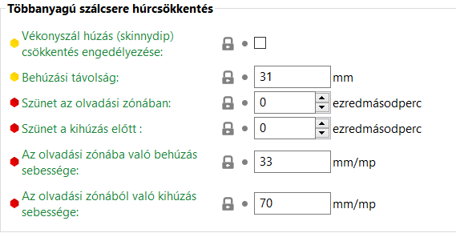

# Szál beállítások

## Nyomtatószál \(filament\)

### Nyomtatószál

#### _Szín_

Ezt a SuperSlicer felületén csak vizuális jelzésként használják.

#### _Átmérő_

Itt adja meg az izzószál átmérőjét. Nagy pontosságra van szükség, használjon tolómérőt, és átlagoljon több mérést az izzószál mentén.

#### _Extrudálási szorzó_

Ez a tényező arányosan változtatja meg az extrudálási áramlást. Lehet, hogy ezt módosítani kell, hogy tiszta felületi megjelenítést és megfelelő szélességet kapjon az egyes falakhoz. A tipikus értékek 0,9 és 1,1 között mozognak. Ha úgy érzi, hogy ezt az értéket tovább kell változtatnia, ellenőrizze az izzószál átmérőjét és az E lépéseket a firmware-ben.

#### _Sűrűség_

Itt adja meg az nyomtatószál sűrűségét. Ez csak statisztikai tájékoztatásul szolgál. Ezt az értéket úgy kaphatjuk meg, ha megmérünk egy ismert hosszúságú száldarabot, és kiszámítjuk a hosszúság és a súly arányát.

#### _Költségek_

Adja meg a szálak kilogrammonként költségét. Ez csak statisztikai tájékoztatásul szolgál.

#### _Orsó súlya_

Adja meg a _**üres orsó súlyát**_. Így a nyomtatás előtt lemérheti a részben használt tekercset, és összehasonlíthatja a mért súlyt az orsóval kiszámított szál súlyával, hogy lássa, van-e elég szál a nyomtatás befejezéséhez.

### **Hőmérséklet**

#### _Extruder_

**Első réteg**

Fúvóka hőmérséklete az első réteghez. Ha a hőmérsékletet manuálisan kívánja szabályozni a nyomtatás során, állítsa ezt a paramétert nullára, hogy letiltsa a hőmérséklet-szabályozási parancsokat a kimeneti G-kódban.

**Egyéb rétegek**

A fúvóka hőmérséklete az első réteg után. A kimeneti G-kódban lévő hőmérséklet-szabályozási parancsok letiltásához állítsa ezt a értéket nullára.

#### _Ágy_

**Első réteg**

Az ágy hőmérséklete az első réteghez. Állítsa ezt nullára, hogy a kimeneti ágy hőmérséklet-szabályozását kikapcsolja.

**Egyéb rétegek**

Az ágy hőmérséklete az első réteg után. Állítsa ezt nullára, hogy a kimeneti ágy hőmérséklet-szabályozását kikapcsolja.

#### _Kamra_

A zárt nyomtatók esetében a géptér hőmérsékletének beállítására szolgáló paraméter.

### Nyomtatószál tulajdonságai

#### _A nyomtatószál típusa_

Az egyedi G-kódokban használandó nyomtatószál anyag típusa.

#### _Oldható anyag_

Az anyag oldhatósági tulajdonságának meghatározása. Valószínű, hogy oldható anyagot használnak oldható hordozónak.

#### _Zsugorodás_

Adja meg a száll százalékos zsugorodását a hűtés után \(94%, ha 100mm helyett 94mm-t mér\). Az alkatrész az XY méretezéssel kompenzálásra kerül. Csak a kerülethez használt szálat veszik figyelembe.

Ügyeljen arra, hogy elegendő helyet hagyjon a tárgyak között, mivel ez a kompenzáció az ellenőrzések után történik.

### Nyomtatási sebesség felülbírálása

#### _Maximális sebesség_

A maximális megengedett sebesség ennél az nyomtatószálnál. A nyomtatás maximális sebességét a nyomtatási sebesség és a szálsebesség minimumára korlátozza.


Nulla értékre állítva nincs határérték.


#### _Maximális térfogatsebesség_

A maximális megengedett térfogatsebesség ennél az nyomtatószálnál. A nyomtatás térfogatsebességét a nyomtatási és a szálak térfogatsebességének minimumára korlátozza. A határérték megszüntetéséhez állítsa nullára.

Lásd a következő bekezdést: [Maximális térfogatsebesség](print_settings/#maximalis-terfogatsebesseg)

## Hűtés

Amint az olvadt műanyag elhagyja a fúvókát, már nem áll az extrudáló rendszer pontos ellenőrzése alatt. Két kérdést kell figyelembe venni:

1. A nyomtatást mindig **megszilárdult** rétegre kell végezni, különben a korábban extrudált műanyagot az új réteg elmozdítja és deformálja.
2. A **túlnyúlások** vagy **hidak** nyomtatásakor fontos, hogy a műanyagot a lehető leghamarabb rögzítsük és megszilárdítsuk a helyén. Ellenkező esetben a nyomtatószál megereszkedik.

A legtöbb 3D nyomtatóhoz **nyomtatóventilátor** tartozik. A környezeti levegőnek az extrudált szálak fölé fújásával a hűtés nagymértékben javítható. Egyes anyagok esetében azonban ez ronthat a helyzeten, és vetemedést vagy rétegleválást okozhat. A SuperSlicer lehetővé teszi a hűtési beállítások beállítását az egyes szálakhoz.

#### _Tartsa a ventilátort mindig bekapcsolva_

A nyomtatóventilátor mindig fenntartja legalább a minimális sebességet. **Ez a beállítás általában be van kapcsolva** a legtöbb anyag esetében, kivéve az ABS-t, a PC-t és néhány rugalmas anyag.

#### _Automatikus hűtés engedélyezése._

Ha engedélyezve van, a hűtőventilátor és a nyomtatási sebesség az alábbi beállításoknak megfelelően változik nyomtatás közben. Az alábbi szöveges leírás **minden alkalommal frissül, amikor a hűtési beállítások bármelyikét megváltoztatja**, és részletesen elmagyarázza a hűtési viselkedést.

Ha ki van kapcsolva, a nyomtatóventilátor állandóan a **Ventilátor sebessége - Min** által beállított fix sebességgel működik, kivéve a hidakat, amelyek továbbra is a **Ventilátor sebessége hidakhoz** segítségével állíthatók be.

### Ventilátor beállítások \(alapértelmezett\)

#### _A ventilátort lehetőleg alapértelmezett sebességgel futtassa_

Ha ez az opció engedélyezve van, a ventilátor folyamatosan az alapsebességen fog működni, ha nincs olyan beállítás, amely felülbírálná a sebességet. Hasznos a PLA esetében, káros az ABS esetében.

#### _Alapértelmezett ventilátorsebesség_

Ez a beállítás jelenti a ventilátor alapsebességét, amelyre ennek az nyomtatószálnak szüksége van, vagy legalábbis a minimális PWM-értéket, amelyre a ventilátornak szüksége van a működéshez.

A ventilátor fordulatszámának **Min** és **Max** értékét a maximális fordulatszám százalékában állíthatja be.

A **Max** érték akkor kerül alkalmazásra, ha a réteg nyomtatási ideje kisebb, mint a **Minimális réteg időtartam**.

A **Min** érték akkor kerül alkalmazásra, ha a rétegnyomtatási idő nagyobb, mint a **Aktiválja a ventilátort, ha a réteg nyomtatási ideje kevesebb, mint**.

Ha a rétegnyomtatási idő e két érték között van, a ventilátor sebessége **arányosan** a **Min** és **Max** közötti sebességgel fog működni.

Ez egy kicsit zavarosnak tűnhet, de használhatja az élőben frissített szöveges leírást a Ventilátor beállításai alatt, ami remélhetőleg mindent tisztázni fog. Próbálja meg megváltoztatni az értékeket, és nézze meg, hogyan változik a leírás.

#### _A ventilátor sebessége hidak esetében_

Megnöveli a ventilátor sebességét a **híd és túlnyúlás** nyomtatásakor beállított értékre. Ezt az értéket általában magasabb értékre állítja be, mint a normál nyomtatásnál.

Az opció nem lassítja le a ventilátort, ha az már magasabb fordulatszámon működik.


A ventilátor kikapcsolásához állítsa 1-re.

Állítsa az értéket -1-re, hogy a normál ventilátorsebességet használja a hidakon és a túlnyúlásokon.


#### _**A ventilátor sebessége a felső rétegen**_

Ez a ventilátor fordulatszám minden felső rétegnél érvényes.


A ventilátor kikapcsolásához állítsa 1-re.

Állítsa az értéket -1-re, hogy a felső rétegeknél a normál ventilátorsebességet használja.


Csak a disable\_fan\_first\_layers kapcsolóval helyettesíthető.

#### _Ventilátor sebesség külső kerületeknél_

Ha nem nulla értékre van beállítva, akkor ez a ventilátorsebesség csak a külső \(látható\) kerületekre vonatkozik.


A ventilátor kikapcsolásához állítsa 1-re.

Állítsa az értéket -1-re, ha normál ventilátorsebességet szeretne használni a külső kerületeken.


A külső kerületeknek előnyös lehet a nagyobb sebességű légáramlás a felületkezelés javítása érdekében, míg a belső kerületeknek, kitöltéseknek stb. előnyös lehet az alacsonyabb légáramlás a rétegtapadás javítása érdekében.

#### _A ventilátor kikapcsolása az első X rétegnél_

A legelső réteg hűtése általában **nem szükséges**, mivel sík felületre kerül. Sok szál esetében még az is előfordulhat, hogy az első néhány plusz réteg \(általában 1 és 5 között\) esetében érdemes elkerülni a hűtést, hogy elkerülje a nyomtatás torzulását és leválását a nyomtatólemezről, ami elkerülhetetlenül sikertelen nyomtatást eredményezne.

#### _Teljes sebességű ventilátor az X rétegtől_

A ventilátor fordulatszáma a "disable\_fan\_first\_layers" réteg esetén nullától lineárisan növekszik a "full\_fan\_speed\_layer" réteg maximális fordulatszámáig. a "full\_fan\_speed\_layer" értéket figyelmen kívül hagyjuk, ha az alacsonyabb, mint a "disable\_fan\_first\_layers", ebben az esetben a ventilátor a "disable\_fan\_first\_layers" réteg +1 megengedett maximális fordulatszámmal fog működni.

### Rövid rétegidő \(elkezdi növelni a ventilátor sebességét\)

#### _Aktiválja a ventilátort, ha a réteg nyomtatási ideje kevesebb, mint_

Ha a réteg becsült nyomtatási ideje kevesebb, mint ez a másodpercszám, a ventilátor aktiválódik, és sebességét a Min és Max sebességek interpolációjával számítja ki.

#### _Maximális ventilátor sebesség_

Ez a paraméter a ventilátor maximális sebességét jelöli, amelyet akkor használunk, ha egy réteg esetében a nyomtatási idő nagyon rövid.

### Nagyon rövid rétegidő \(kezdi csökkenni az extrudálás sebességét\)

#### _Minimális réteg időtartam_

Ha a réteg becsült nyomtatási ideje kevesebb, mint ez a másodpercszám, a nyomtatási mozgások sebessége csökken, hogy elérje ezt az értéket. A lassítás a nyomtatási sebességek skálázásával történik, így egyes mozgások mindig gyorsabbak lesznek, mint mások.

#### _Maximális sebesség csökkentés_

Állítsa 90%-ra, ha nem szeretné, hogy a sebesség 90%-nál nagyobb mértékben csökkenjen.

#### _Minimális nyomtatási sebesség_

Az a minimális sebesség, amelynél a SuperSlicer csökkenti a sebességet. A rendkívül alacsony sebességgel történő nyomtatás hosszabb ideig tartó nyomtatása olyan problémákat okozhat, mint például a hőkúszás.

Ne feledje, hogy ha ezt az értéket túl magasra emeli, akkor részben érvénytelenítheti a **Lassítás, ha a réteg nyomtatási ideje kevesebb, mint** által beállított minimális rétegidőt. Mert még ennél a minimális sebességgel történő nyomtatás esetén is előfordulhat, hogy a rétegidő rövidebb lesz a beállított értéknél.

## Többanyagú

A többanyagú szálak tulajdonsága

### _**Többanyagú szálcsere hőmérséklete**_

**Szálcsere hőmérséklet engedélyezése**

Meghatározza, hogy a szálváltás hőmérsékleteket alkalmazzák-e.

**Szálcsere hőmérséklet**

A szálak további csökkentése érdekében hasznos lehet alacsonyabb hőmérsékletet beállítani közvetlenül azelőtt, hogy a nyomtatószálat eltávolítjuk a hotend-ből.

**Gyors mód**

Kísérleti: A fúvóka hőmérsékletének csökkentése a hűtési mozgások során, nem pedig a kihúzás előtt a várakozási idő csökkentése érdekében.

**\*Használjon tárgyhűtő ventilátort a hotend hűtéséhez**

Kísérleti paraméter. Lehet, hogy a fűtőberendezés gyorsabban lehűl a szálcserék során.

**Szálcsere tárgyhűtő ventilátor fordulatszám**

Kísérleti paraméter. A túl magas ventilátorsebesség konfliktusba kerülhet a fűtőberendezés PID rutinjával.

### _Többanyagú szálcsere húrcsökkentés_

**Vékonyszál húzás \(skinnydip\) csökkentés engedélyezése**

A Skinnydip további merülést végez az olvadási zónába, hogy "elégesse" a finom szálakat.

_\(Kép forrása_ [_TNDavid_](https://github.com/TNDavid)_\)_

Link a skinnydip megbeszéléshez a [Github PrusaSlicer](https://github.com/prusa3d/PrusaSlicer/issues/2729)

**Behúzási távolság**

Szabványos extrudereknél általában 40-42 mm. A bondtech extruderrel általában 30-32 mm. Kezdje alacsony értékkel, és fokozatosan növelje, amíg a szálak el nem tűnnek. Ha a tisztítótornyon foltok vannak, akkor az érték túl magas.

**Szünet az olvadási zónában**

Maradjon az olvadási zónában ennyi ideig, mielőtt eltávolítja a szálat. Általában nem szükséges.

**Szünet a kihúzás előtt**

Ez hasznos lehet, hogy a Bondtech extruder fogaskerekei ne torzítsák el a még kissé forró hegyeket, de általában nem szükséges.

**Az olvadási zónába való behúzás sebessége**

Ezt az értéket általában nem szükséges megváltoztatni

**Az olvadási zónából való kihúzás sebessége**

Ezt az értéket általában nem szükséges megváltoztatni

### _Tisztítótorony paraméterei_

**Minimális tisztítás a tisztítótoronyban**

A szálcsere után az éppen betöltött szál pontos helyzete a fúvókában nem feltétlenül ismert, és a szálnyomás valószínűleg még nem stabil. Mielőtt a nyomtatófej kitöltő- vagy áldozati tárgyba tisztítja a nyomtatófejet, a SuperSlicer mindig ezt az anyagmennyiséget használja fel a tisztítótoronyban, hogy megbízhatóan előállítsa az egymást követő kitöltő- vagy áldozati tárgyak extrudálását

**Maximális sebesség a tisztítótoronyba**

Ez a beállítás a maximális sebesség beállítására szolgál a tisztítótoronyban történő extrudáláskor \(használja az M220-at\). A %-ban állítsa be a 0 értéket a letiltáshoz, és használja helyette a Filament\_type \(nyomtatószál típus\) értéket. Ha ki van kapcsolva, ezek a nyomtatószál típusok alapértelmezett értéket kapnak:

* PVA: 80% és 60% között
* SCAFF: 35%
* FLEX: 35%
* EGYÉB: 100%

Vegye figyelembe, hogy a tisztítótorony minden esetben 100%-ra állítja vissza a sebességet a visszahúzásnál.

Marlin használata esetén az M220 B/R-t kell használni a sebesség felülírásának mentésére a tisztítótorony nyomtatása előtt.

### _Szálváltási paraméterek egy extruderes többanyagú nyomtatókhoz_

**Betöltési sebesség induláskor**

A betöltési fázis legelején használt sebesség.

**Betöltési sebesség**

A szálnak a tisztítótoronyba történő betöltéséhez használt sebesség.

**Kiürítési sebesség indításkor**

A szál hegyének kiürítésére használt sebesség, közvetlenül a kitolás után.

**Kiürítési sebessége**

A szál kiürítésére használt sebesség a tisztítótoronyban \(nem befolyásolja a kezdeti kiürítési lépést közvetlenül a kiürítés után\).

**Szálbetöltési idő**

Az az idő, amely alatt a nyomtató firmware \(vagy a Multi Material Unit 2.0\) szálcsere közben \(T-kód futtatása esetén\) betölti a szálakat. Ezt az időt a G-kód időbecslője hozzáadja a teljes nyomtatási időhöz.

**Nyomtatószál kiadási ideje**

Az az idő, amely alatt a nyomtató firmware \(vagy a Multi Material Unit 2.0\) szálcsere közben \(T-kód futtatása esetén\) kiüríti a szálakat. Ezt az időt a G-kód időbecslője hozzáadja a teljes nyomtatási időhöz.

**Várakozás a kiürítés után**

A szál kiürülése után szükséges várakozási idő. Segíthet a megbízható szálcserék elérésében olyan rugalmas anyagok esetében, amelyeknek több időre van szükségük ahhoz, hogy visszatérjenek az eredeti méretükhöz.

**A hűtési mozgások száma**

A szálat a hűtőcsövekben előre-hátra mozgatva hűtik. Adja meg ezen mozgások kívánt számát.

**Az első hűtési mozgás sebessége**

A hűtési mozgások fokozatosan felgyorsulnak erre a sebességre.

**Az utolsó hűtési mozgás sebessége**

A hűtési mozgások ettől a sebességtől fokozatosan felgyorsulnak.

**Tömörítés paraméterek**

Ezt a karakterláncot a RammingDialog szerkeszti, és a tömörítésre \(gyors extrudálás amelyet közvetlenül a szál kirakása előtt hajt végre annak biztosítása érdekében, hogy az szál csúcsa megfelelő alakú legyen\) jellemző paramétereket tartalmazza.

## Nyomtatószál felülbírálások

### Visszahúzási beállítások

### Hosszúság

Ha a szálcsere előtt visszahúzást hajt végre, a szál a megadott hosszban visszahúzódik \(a hossz a nyers szálon van mérve, mielőtt az az extruderbe kerülne\).

### Z emelés

Ha pozitív értéket ad meg, a Z tengely minden egyes visszahúzáskor gyorsan megemelkedik. Több extruder használata esetén csak az első extruder beállítását veszik figyelembe.

### A Z emelése csak X felett

Ha pozitív értéket ad meg, a Z-tengely emelése csak a Z-tengelyhez megadott abszolút értéktől indul. Ezt a beállítást megváltoztathatja, hogy _**elkerülje**_ a Z-tengely felemelését _**az első néhány rétegnél**_.

### A Z emelése csak X alatt

Ha pozitív értéket ad meg, a Z tengelyemelés csak a Z tengelyhez megadott abszolút értékig lép működésbe. Ezt a beállítást úgy módosíthatja, hogy a Z-tengelyes emelést _**az első rétegekre korlátozza**_.

### Visszahúzás sebessége

A visszahúzások sebessége \(csak az extruder motorjára vonatkozik\).

### Betöltési sebesség

Az a sebesség, amellyel a szál a visszahúzás után az extruderbe kerül \(csak az extruder motorjára vonatkozik\). Ha ez az érték nulla marad, akkor a visszahúzódási sebességet kell használni.

### Extra hossz a visszahúzás után

Ha a visszahúzás kompenzálásra kerül az elmozdulás után, az extruder ezt a szálmennyiséget még pluszban extrudálja. Erre a beállításra ritkán van szükség.

### Minimális útvonal a visszahúzás után

A visszahúzás nem lép életbe, ha az utak rövidebbek ennél a távolságnál.

### Visszahúzás rétegváltáskor

Ez az opció aktiválja a visszahúzást a Z tengelyen történő mozgáskor.

### Tisztítás visszahúzás közben

Ez az opció a fúvókát a már kinyomtatott szálon történő visszahúzások során mozgatja, így korlátozva a csomók megjelenését a folyásra hajlamos extrudereken.

A visszahúzási pont után a visszahúzás egy része a már lerakott szálat követő fúvókával történik.

### Extra törlés a külső kerületekre

A külső kerületi hurok extrudálásának végén egy törlés történik, egy kicsit a nyomtatás belsejébe haladva. Az ebben a paraméterben beállított szám növeli a törlést azáltal, hogy a fúvókát a lerakott szál mentén a végső törlés előtt visszaviszi.

### Visszahúzott mennyiség törlés előtt

A bowdenes extruderekkel célszerű a törlő mozdulat végrehajtása előtt egy gyors visszahúzást végezni.

## Egyedi G-kód

### Kezdő G-kód

Ez az indítási eljárás az elején, a nyomtató indítási G-kódja után \(és a több anyagból készült nyomtatók esetében az adott szálhoz tartozó szerszámváltás után\) kerül beillesztésre. Ezzel felülbírálhatja az adott szálra vonatkozó beállításokat. Ha a SuperSlicer az egyéni kódokban **M104**, **M109**, **M140** vagy **M190** parancsokat észlel, ezek a parancsok nem kerülnek automatikusan hozzáadásra, így Ön szabadon alakíthatja a hőparancsok és egyéb egyéni műveletek sorrendjét. Ne feledje, hogy a SuperSlicer összes paraméteréhez használhat általános változókat, így bárhol használhatja a "**M109 S\[first\_layer\_temperature\]**" parancsot.

### Záró G-kód

Ez a befejezési eljárás a kimeneti fájl végére kerül, a nyomtató befejező G-kódja előtt \(és több anyagból készült nyomtatók esetében az adott szálra vonatkozó szerszámváltások előtt\). Vegye figyelembe, hogy a SuperSlicer összes beállításához használhat általános változókat. Ha több extruderrel rendelkezik, a G-kódot az extruder sorrendjében dolgozza fel.

## Megjegyzések

Ebben a mezőben az szálra vonatkozó megjegyzéseket tölthet ki.

## Függőségek

Ez a rész lehetővé teszi a profil függőségének meghatározását egy géphez képest.

### Kompatibilis nyomtatók

Válassza ki a profillal kompatibilis nyomtatókat. A **Minden** opciót bejelölheti, ha mindet ki szeretné választani.

### Kompatibilis nyomtatók állapota

Egy aktív nyomtatóprofil konfigurációs értékeit használó logikai kifejezés. Ha a kifejezés értéke igaz, akkor ez a profil kompatibilisnek tekinthető az aktív nyomtatóprofillal.

### Kompatibilis nyomtatási profilok

Válassza ki a kompatibilis nyomtatási profilokat. A **Minden** opciót bejelölheti, ha mindet ki szeretné választani.

### Kompatibilis nyomtatási profilok állapota

Egy aktív nyomtatási profil konfigurációs értékeit használó logikai kifejezés. Ha a kifejezés értéke igaz, akkor ez a profil kompatibilisnek tekinthető az aktív nyomtatási profillal.

Az Alkalmazás kiválasztja a profillal kompatibilis gépeket.

