# Nyomtatási beállítások

Kerületek és héj


### Függőleges héjak \(falak\)

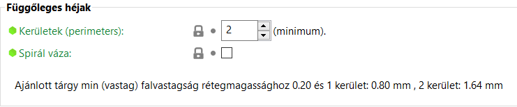

#### _Kerületek_

Meghatározza a modell falát alkotó körvonalak minimális számát. A profilok szinte mindig legalább két kerületet használnak.

**Növelje a modell szilárdságát**.

A modell szilárdságát elsősorban a kerületek száma határozza meg \(nem a kitöltés\). Ha erősebb nyomatot szeretne létrehozni, növelje a kerületek számát.

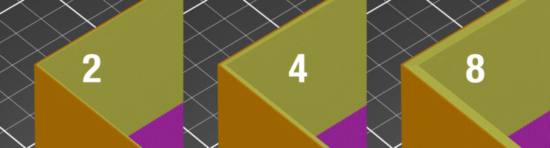

#### _Spirálváza_

Egy hengert hoz létre egyetlen folyamatos körvonallal, fokozatosan növelve a Z magasságot.

Ha bármit nyomtat, aminek egyetlen kerületű fala van, mindig van egy kis hiba, ahol a nyomtató a következő rétegre lép. Ez a pont, ahol a nyomtató megáll és befejezi a kerületet, megemeli a Z magasságot a rétegmagassággal és új kerületet kezd, egy csúnya “heget” hoz létre, amely a modell oldalán fut végig. Ez a heg egyben a nyomtatás gyenge pontja is.

A spirálváza nem rendelkezik ezzel a hibával, kivéve az első **X** alsó teljes réteget. Ehelyett a magasság fokozatosan növekszik, amíg el nem éri a nyomtatás tetejét.

Ha a váza üzemmód engedélyezve van, a SuperSlicer automatikusan beállítja a kapcsolódó paramétereket:

* 1 kerület
* 0% kitöltés
* letiltott felső szilárd rétegek
* letiltott támaszok
* ”függőleges héjvastagság biztosítása” letiltva

Ne feledje, hogy ezeknek a beállításoknak az egyszerű megváltoztatása ha a spirálváza módot nem engedélyezi, nem azonos a valódi spirálváza móddal, mivel az objektum nem lesz folyamatosan nyomtatva.

Az **alsó szilárd rétegek** számát bármikor beállíthatja. Ezenkívül a **Speciális** menüben beállíthatja a **külső kerületek extrudálási szélességét**, hogy vastagabb/erősebb/vízállóbb vázát kapjon \(pl. 0,45-ről 0,6-ra\).

A modellt szilárdtestként kell definiálni, különben a SuperSlicer megpróbálja \(sikertelenül\) létrehozni a belső és külső felületeket, ezért csak a külső méreteket modellezze.

**Egyszerre csak egy tárgy nyomtatható váza üzemmódban.** Ha több objektum lenne a nyomtatólemezen, lehetetlen lenne folyamatosan nyomtatni őket. Ezt a korlátozást megkerülheti a szekvenciális nyomtatás engedélyezésével.

### Vízszintes héjak

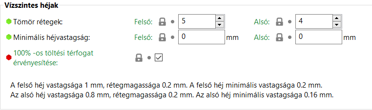

#### _Minimális héjvastagság_

A SuperSlicer a kiválasztott kerületek számához és rétegmagassághoz kiszámítja az optimális \(vékony\)falvastagságot. Ha visszamegy a CAD-rajzához, és a falvastagságot pontosan erre az értékre módosítja, akkor megszünteti a szükségtelen kerületi átfedéseket, és a nyomtatás tökéletes falfelületet kap.

Általában páros számú kerületre \(2,4,6...\) kapunk ajánlásokat. Ha aktiválja a Vékony falak felderítését, akkor a páratlan számú kerületekre \(1,3...\) is kap ajánlást.

Azt gondolhatja, hogy ha egy kerület extrudálási szélessége 0,45 mm, akkor két kerület 0,90 mm széles lesz \(2x0,45\). Ha azonban megnézi a 0,2 mm-es rétegmagasságra vonatkozó ajánlást, láthatja, hogy ez nem igaz, és a javasolt érték 0,86 mm.

Ahhoz, hogy megértsük, hogyan számolják ki ezt a számot, meg kell néznünk a kerületi keresztmetszetet. A SuperSlicer feltételezi, hogy az extrudálás keresztmetszete egy téglalap, félköríves végekkel. Vegye figyelembe, hogy az extrudálás szélessége magában foglalja a két félköríves véget.

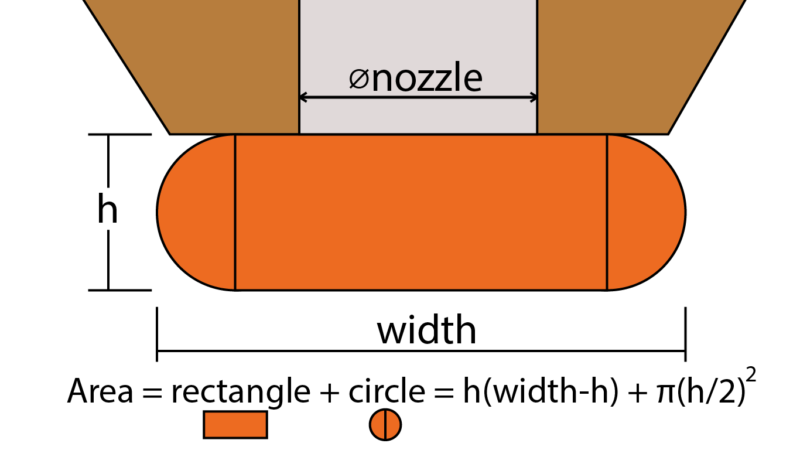

_\(A kép forrás:_ [https://manual.slic3r.org/advanced/flow-math](https://manual.slic3r.org/advanced/flow-math) _\)_

Most adjunk hozzá egy második extrudálási keresztmetszetet. Ha feltételezzük, hogy nincs átfedés \(érintő pályák\), akkor üres tér lenne \(sárga\). Az üres tér kitöltése és a kerületeket összekötése érdekében a SuperSlicer kissé átfedi a kerületeket. Lényegében ezért nem lehet egyszerűen megszorozni a kerületszámot egyetlen kerület szélességével, hogy megkapjuk az ideális falvastagságot.

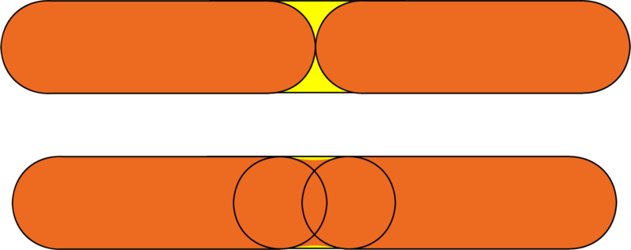

_\(A kép forrása :_ [https://manual.slic3r.org/advanced/flow-math](https://manual.slic3r.org/advanced/flow-math)_\)_


Ne feledje, hogy a számítás során a rétegmagasságot \(h\) használják, és ennek következménye van - ha megváltoztatja a rétegmagasságot, akkor az ideális falvastagság is változik!


További információért nézze meg a [Slic3r áramlásának matematikája oldalát](https://manual.slic3r.org/advanced/flow-math) \(ennek a szövegnek egyes részei arról az oldalról származik\).

#### _Tömör\(szilárd\) rétegek - felül/alul_

Az egyes modellek alsó és felső részei általában tömör rétegekkel vannak kitöltve \(100%- os kitöltés\).

Meghatározhatja a nyomtatni kívánt szilárd\(tömör\) rétegek \(felső és alsó\) számát. Beállíthat egy minimális falvastagságot is, ami különösen hasznos, ha a változó rétegmagasság funkciót használja. Az ezen beállítások alatti eszköztár minden egyes változtatásnál frissül, így pontosabb képet kaphat az eredményül kapott felső/alsó falvastagságról.

A felső vagy alsó tömör rétegek 0-ra állítása felülírja a minimális falvastagságot. Tehát nem kell a minimális falvastagságot is 0-ra állítania ahhoz, hogy felső vagy alsó rétegeket kapjon.


A felső tömör kitöltés lényegében egy híd a kitöltési minta felett. Emiatt szinte mindig látni fog némi megereszkedést az első néhány tömör kitöltési vonalnál. Minél alacsonyabb a kitöltés, annál hosszabb az áthidalási távolság, és ezért annál nagyobb a megereszkedés. Ez egyszerűen ellensúlyozható a tömör rétegek számának növelésével - mi **legalább 3 felső réteget** javaslunk. Ezt a viselkedést tovább csökkentheti egy módosító hálóval, amely növeli a kitöltést a tömör kitöltés előtti utolsó néhány rétegben.


Ne feledje, hogy alacsony rétegmagasságú nyomtatás esetén több tömör rétegre lesz szüksége ugyanazon felső/alsó falvastagság eléréséhez \(pl. 0,3 mm-es rétegmagasság esetén használjon 3 felső réteget, 0,1 mm-es rétegmagasság esetén 9 felső réteget\).

Az alapértelmezett tömör kitöltési minta egyenes, de számos más minta közül is választhat.

#### _Győződjön meg róla, hogy a töltések 100%-os térfogatúak_.

Kísérleti opció, amely módosítja \(teljes kitöltés esetén\) a kitöltési sebességet, hogy a kitöltendő térfogatban pontosan a műanyag mennyisége legyen \(az áramlási sebesség általában -7% és +4% között változik, a kitöltendő terület méretétől és az átfedési paramétertől függően, de akár +50%-ig is mehet a nagyon kis területek kitöltéséhez, ahol az egyenes vonalú lefedettség nem jó\). Előnye, hogy a szűk kitöltési területeken kiküszöböli az átfedési paraméter által okozott túlnyúlást.

### Minőség \(lassabb szeletelés\)

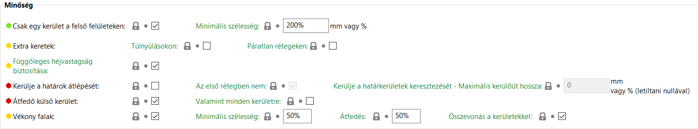

#### _Csak egy kerület a felső felületeken_

Lehetőség, hogy csak egy kerületet használjon a sík felső felületeken, hogy több hely maradjon a felső kialakításhoz.

#### _Extra kerületek_

Egy örökölt lehetőség, amely tudomásunk szerint már nem sok mindenre használható. Szóljon nekünk, ha talál olyan esetet, ahol ez különbséget jelent.

Elméletileg ez a lehetőség lehetővé teszi, hogy szükség esetén több kerületet adjon hozzá a lejtős falakon lévő lyukak elkerülése érdekében. A S_uperSlicer_ addig növeli a kerületeket, amíg a közvetlenül felette lévő kerület több mint 70%-át nem támasztják.

#### _Függőleges héjvastagságának biztosítása_

Ez a funkció megoldja a régebbi szeletelő programok egyik legnagyobb problémáját, nevezetesen, hogy a kerületek között lyukak vannak egy ferde felületen. Ez a mellszobrok és más természetes megjelenésű modellek nyomtatásakor volt jellemző. Az ilyen tárgyaknak általában volt néhány lyuk a fejük tetején. Ha ez a funkció be van kapcsolva, a SuperSlicer gondoskodik arról, hogy egy következő rétegben meghatározza a szükséges \(belső\) támasztékokat a kerületekhez.

Ez a funkció jelenleg még kikapcsolt állapotban is hatással van a G-kód generálására, és váratlan G-kódot eredményezhet. Ez egy ismert probléma, és dolgozunk a javításán.


#### _Kerülje a határok átlépését_

Optimalizálja az utazást a kerületek keresztezésének minimalizálása érdekében. Ez segíthet megakadályozni a fúvókából a kicsepegést a mozgatás során, különösen a Bowden extruderekkel. A funkció engedélyezése jelentősen lelassítja a G-kód generálását és növeli a nyomtatási időt

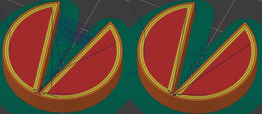

#### Kerülje a határkerületek keresztezését - Maximális kerülőút hossza

Ez a paraméter akkor aktív, ha a **Kerülje a határok keresztezését** opció aktív. A kerülőút maximális hosszát jelzi, hogy elkerülhető legyen a keresztezés. Ha a kerülőút hosszabb ennél az értéknél, a Kerülje a határkerületek keresztezését opció nem alkalmazható erre az útvonalra. A kerülőút hossza megadható abszolút értékként vagy a közvetlen utazási útvonal százalékában \(pl. 50%\).

#### _Vékony falak_

Lehetőség az egy menetben extrudálható falak \(vékony falak\) felismerésére \(olyan részek, ahol két extrudálás nem fér el,\) és egy nyomvonalra kell redukálnunk\). Ha ez a négyzet nincs bejelölve, a SuperSlicer megpróbálhat illeszkedni a kerületekre ott, ahol ez nem lehetséges, és így túlnyúlást hozhat létre, ami túlságosan nagy méretre nyúláshoz vezet.

#### _Vékony falak felismerése_

Alapértelmezés szerint minden fal külső és belső kerületből áll \(vékony falak esetén legalább két kerületből\). Ha elegendő hely van hozzá, a rendszer egy kitöltési mintát használ a belső/külső kerület közötti üres tér kitöltésére.

A **vékony falak felismerésének** engedélyezése lehetővé teszi a SuperSlicer számára, hogy csak egyetlen kerületet generáljon, amely belső és külső héjként is működik. Ez segít az apró részletek rögzítésében. Az egyetlen kerületi extrudálás szélességénél vékonyabb falakat azonban valószínűleg figyelmen kívül hagyják.

#### _Az áthidaló kerületek felderítése_

Engedélyezi a túlnyúlások áthidaló áramlását és bekapcsolja a ventilátort. Ez egy kísérleti opció, amely beállítja a túlnyúlások áramlását \(a hidak áramlását fogja használni\), a hidak sebességét alkalmazza rájuk, és bekapcsolja a ventilátort.







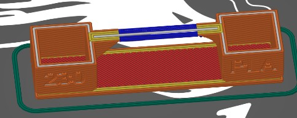



A hidakra vonatkozó áramlási arány beállításához lásd a [Áramlási arány hidakhoz](print_settings.md#aramlasi-arany) paramétert.

### Túlnyúlások

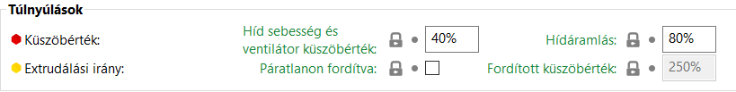

#### _**A híd sebesség és a ventilátor küszöbértéke**_

Egy extrudálás minimális nem alátámasztott szélessége a híd ventilátor és a túlnyúlás sebességének az adott túlnyúlásra történő alkalmazásához.


 A fúvókaátmérő mm-ben vagy %-ban adható meg. 

**A kikapcsoláshoz állítsa 0-ra.**


#### _A hídáramlás küszöbértéke_

Egy extrudálás minimális nem alátámasztott szélessége ahhoz, hogy az adott túlnyúlásra hídáramlást lehessen alkalmazni.


 A fúvókaátmérő mm-ben vagy %-ban adható meg. 

**A kikapcsoláshoz állítsa 0-ra.**


#### _Extrudálási irány_

**Páratlanon fordítva**

Extrudálja a kerületeket, amelyek egy része túlnyúlik az ellenkező irányba, páratlan rétegekben. Ez a váltakozó mintázat nagymértékben javíthatja a meredek túlnyúlásokat.


!!! Ez az algoritmus nagyon lassú \(ugyanazokat az eredményeket használja, mint az extra\_perimeters\_overhangs\)!!!


**Fordított küszöbérték**

Az a mm-szám, amennyinek a túlnyúlásnak lennie kell ahhoz, hogy az átfordítás használható legyen.


A kerület szélességének %-ában határozható meg


### Haladó

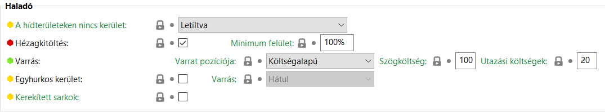

#### _A hídterületeken nincs kerület_

Ez az opció arra szolgál, hogy segítsen olyan tárgyak szeletelésében, amelyeknek furatuk van.


A probléma megoldására több lehetőség is van:

* **Kerületek eltávolítása** : csak a kerületet kell áthelyezni a híd területéről.

Előnyök \(+\): egyszerű és hatékony.

Hátrányok \(-\): Egyes hidak nincsenek mindkét oldalon rögzítve.


* **Hézagok kitöltése hidakkal** : áthelyezi a kerületet, és kiterjeszti a híd területét, hogy kitöltse az üres helyet. Ez egy kaput hoz létre, amelyet a felhasználónak kézzel kell eltávolítania. Megjegyezzük, hogy ezt manuálisan is megteheti, ha létrehoz egy új hengert ezen a helyen \(jobb klikk az alkatrészre -&gt; alkatrész hozzáadása -&gt; henger, a jobb oldali területen oldja fel a skálákat és változtassa meg az X&Y méretet nyomja meg az Entert, majd mozgassa be a lyukba változtassa meg a z méretét a réteg magasságára és adja meg a Z pozíciót\).

Előnyök \(+\): jobb ellenfúró hatás.

Hátrányok \(-\): A meredek szögű fúrókúpok a túl nagy \(a normálisnál is nagyobb mértékű\) túlnyúlás miatt tönkremegy az alkatrészt.


* **Csak a hidakat tartsa meg** : ne nyomtasson ki olyan területet, amely nem híd. Túlságosan kísérleti, ne használja, amíg nem lesz egy kicsit jobb. 

Előnyök \(+\) : ? egyszerű ?

Hátrányok \(-\): tönkreteszi a túlnyúlásokat, és nem hiszem, hogy jobban nyomtatná az ellenfúrást sem.


* **Hidak és túlnyúlások karbantartása** : Az előző opcióhoz hasonlóan kinyomtatja a hidat, de a maradékot kitölti egy kerülettel és a "rossz hidakat". Nagyon kísérleti jellegű. 

Előnyök \(+\) esetében: a megfelelő mennyiségű műanyagot nyomja, mint a “Kerületek eltávolítása”, de kevesebb “Egyik oldalon rögzített hidakkal”.

Hátrányok \(-\): nehéz nyomtatni.


#### Hézagkitöltés

\(A falak közötti lyukakat kitöltése\)

**Minimum felület**

Ez a paraméter a falak közötti hézagkitöltő extrudálás létrehozásához szükséges minimális mm²-t jelenti.


Meghatározható a \(kerület szélességének\) százalékaként.


#### _Varrás helyzete_

Meghatározza minden egyes kerületi hurok kezdőpontját, és így az objektum oldalán potenciálisan látható **függőleges varrat** pozícióját. Kivéve, ha a spirálváza módban nyomtat.

A varrás úgy néz ki, mint egy kis folt a modell felületén. A SuperSlicer megpróbálhatja az illesztéseket a modell szélein a \("**Legközelebb**"\) beállítással vagy a hátoldalon \(" **Hátul**"\) elrejteni, véletlenszerűen elosztani a felületen \(" **Véletlenszerűen**"\), sorokba rendezve \(" **Igazított**"\) vagy költségkritériumok szerint \("**Költségalapú**"\).

Abban az esetben, ha a csatlakozás pozíciója a költségeken alapul, két « költség » meghatározására van lehetőség:

* Az extruder **utazási költsége**. A legnagyobb büntetés akkor jár, amikor a pont a legmesszebb van az extruder pozíciójától, mielőtt a külső kerület extrudálásra kerülne.
* A varrás rossz **szög**ben történő elhelyezésének költsége. A legrosszabb szög \(maximális büntetés\) akkor van, ha lapos.

Hacsak nem “spirálváza” üzemmódban nyomtat, a kerület minden egyes hurokjának el kell kezdődnie és véget kell érnie valahol. Ez a kezdő- és végpont egy potenciálisan látható függőleges varratot hoz létre a tárgy oldalán. Ezt általában pattanásnak, rétegvarratoknak vagy hegeknek nevezik.

Ez a varrás különösen akkor lesz látható, ha a tárgy alakja hengeres, éles sarkok nélküli.

Annak érdekében, hogy a varratot a lehető legjobban elrejtse, többféle varratelhelyezési lehetőség áll rendelkezésre a : **Nyomtatási beállítások - Kerületek és héj - Haladó - Varrás.**

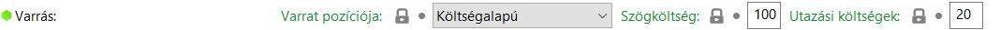

A SuperSlicer 2.3-tól kezdve a **varratfestő** eszközzel részletesen szabályozhatja a varratok elhelyezését.

_**Költségalapú \(Legközelebbi él\)**_

Próbálja meg a varratot az aktuális réteghez legközelebb eső szélén elhelyezni. Ha a modelljének éles sarkai vannak, akkor a varrás így gyakorlatilag **láthatatlanná** válik.

Pontosabban, megpróbálunk egy túlnyúlás nélküli homorú csúcsot választani, hogy a varrás a homorú szög belsejében legyen elrejtve. Ha nem áll rendelkezésre túlnyúlás nélküli homorú csúcs, akkor egy túlnyúlás nélküli konvex csúcsot választ. Ha egyik sem áll rendelkezésre, akkor egy túlnyúlás nélküli csúcsot választ. A jelöltek közül úgy kell választani, hogy a kiindulási pont a legközelebb legyen az extruder korábbi pozíciójához. Ez az opció ezért rövid távolságok esetén optimális.

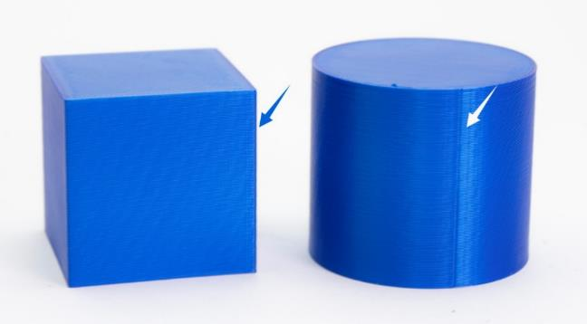

**Igazított**

Ugyanazzal a logikával keresi a jelölteket, mint a **költségalapú**, de azt választja ki, amelyik a legközelebb van az előző réteg kiindulási pontjához. Ez biztosítja, hogy a varrás többnyire az egész tárgyon egy vonalban legyen.


**Véletlenszerű**

Ez minden réteghez más pontot választ, így a varrás kevésbé lesz észrevehető, de a felület kevésbé sima lesz \(kis pöttyök elszórtan a felületen\).

Nem sok értelme van a véletlenszerű illesztési pozíciót használni a sarkokkal/éles élekkel rendelkező modelleknél, sokkal jobb a költségalapú vagy igazított pozíciót használni ebben az esetben. Másrészt, ha hengeres, éles élek nélküli alakzatokat nyomtatunk, a véletlenszerű illesztési pozíció egy életképes lehetőség.

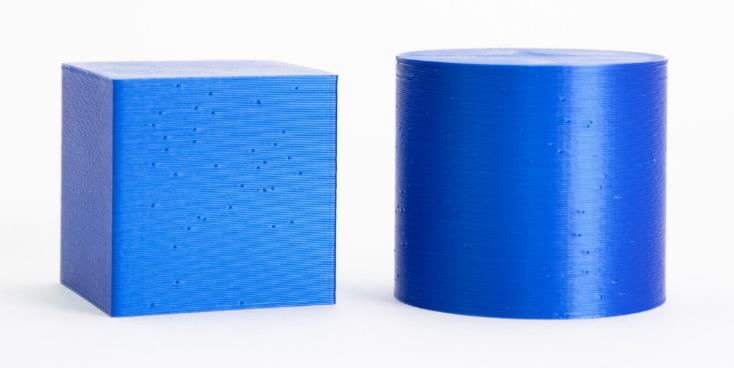

**Hátul**

A hátul hasonlóan működik, mint az igazított, de a varratot a maximális Y \(a nyomtatóágy hátsó része\) közelébe próbálja pozícionálni. Továbbra is igyekszik elkerülni a túlnyúlásokat, és megpróbálja a varrást a sarkokba helyezni

**A varrat láthatóságának csökkentése**

Az FFF/FDM technológiával nem lehet teljesen kiküszöbölni a varratot. Mindig látható lesz valamennyire. A megfelelő beállításokkal azonban nem lehet túlságosan feltűnő.

A varrat láthatóságát befolyásoló beállítások a **lineáris előtolás** és az **extrudálási szorzó**. Az eredeti Prusa profilok már rendelkeznek ezekkel a beállításokkal, de ha finomítani szeretne egy egyéni profilt, akkor megpróbálhatja csökkenteni az extrudálási szorzót és kalibrálni a lineáris előtolás értékét, hogy csökkentse a varrat láthatóságát.

Használhatja a “Spirálváza” módot a varrat elkerülésére, de akkor csak egy kerületet használhat, és nem használhat kitöltést.

Példa a varrat helyzetére a beállításoktól függően:

|  | 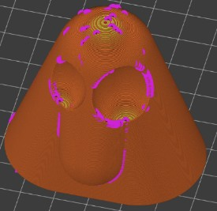 | 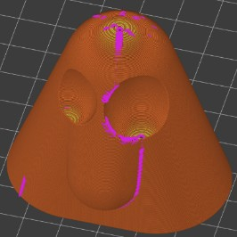 | 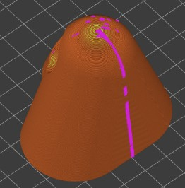 |
| :---: | :---: | :---: | :---: |
| Véletlenszerű | Költségalapú | Igazított | Hátul |

### Szögköltség

A varrat rossz szögben történő elhelyezésének költsége. A legrosszabb szög \(maximális veszteség\) az, ha lapos.

### Utazási költségek

Az extruder mozgatásának költsége. A legmagasabb büntetés az, amikor a pont a legtávolabb van az extruder helyzetétől, mielőtt a külső kerületet extrudálnák

### Egyhurkos kerület

Ez az opció lehetővé teszi, hogy a kerületeket egymáshoz láncolja, hogy megszakítás nélkül egyetlen folyamatos extrudálást hozzon létre. A hosszú belső elmozdulások \(a külsőtől a lyukakig\) nincsenek extrudálva, hogy maradjon némi hely a kitöltéshez.

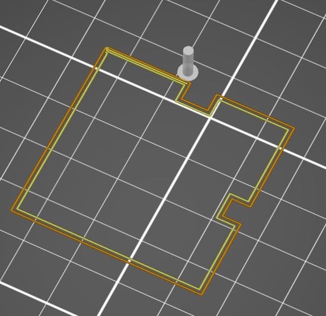

A **Kötés** opcióval megadhatja a kerületek közötti összekötések kezdőpontjainak helyzetét. Lehetőség van választani a következők közül:

* _**Legközelebbi**_ : A lehető legközelebb a sarkokhoz
* **Hátul**: a modell hátsó részén.

### **Kerekített sarkok**

Ezzel a beállítással a belső kerület megkerüli a hegyes sarkokat, és ahelyett, hogy hegyes szöget képezne, sugarat hoz létre. Ez akkor segíthet, ha a peremek hegyes sarkaiban látható lyukak vannak.



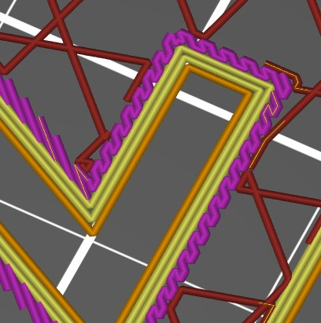



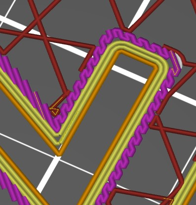



### Először a külső kerületeket

A kerületeket a fordított sorrend helyett kívülről befelé nyomtatjuk.

Ez a beállítás segíthet a **méretpontosságban**, mivel a külső kerületet rakja le először, és a további kerület nyomtatásakor extrudált további szálak eltolódnak a külső faltól. Másrészt a felület kissé kevésbé sima lehet.


**Aktivál**

Először a külső kerületeket __opciók bekapcsolása.

**Alkalmazás erre**

Az opció lehetővé teszi, hogy beállítsa, hogy ez az opció milyen módon kerüljön alkalmazásra a nyomtatási kerületekre.

**Csak a külső oldalra**

Csak a külső oldalon végezze el a váza trükköt. Hasznos, ha a vastagság túl kicsi.

**Csak a belső oldalon**

Csak a külső oldalon végezze el a váza trükköt. Hasznos, ha csak a varratot szeretné eltávolítani a csavarfuratból.

**Váza módban \(varratmentes\)**

Nyomtassa ki a kerületi körvonalakat két folytonos körként, hasonlóan a váza módhoz.

Az **először a külső kerületeket** \(external\_perimeters\_first\) paraméternek aktívnak kell lennie.

Az első rétegnél nem működik, mivel ez károsíthatja a lemezt.

Vegye figyelembe, hogy a hardver konfigurációjának **Minimális rétegmagasság** \(min\_layer\_height\) értékét használja alapmagasságként \(nem 0-ról indul\). Ezért mindenképpen adja meg a lehető legalacsonyabb értéket, amelyet a nyomtatója kezelni tud.

Ha a magassága nem kisebb, mint a réteg aktuális magasságának kétszerese, akkor a normál algoritmus kerül alkalmazásra, mivel nincs elég hely két ciklus végrehajtásához.

Például ahhoz, hogy ennek az algoritmusnak valódi hatása legyen, a minimális magasságnak legalább 0,05-nek kell lennie 0,2 rétegmagasság esetén.

**Jobb kötés**

Ez a beállítás egy kicsit ronthatja a külső kerületek minőségét, cserébe a keretek közötti jobb kapcsolatért cserébe.

Akkor használja, ha nagy nehézségei vannak a kerületi kötésekkel, például magas hőmérsékletű szálakkal.

Ez a százalék a kerület átfedésének százalékos aránya, hasonlóan a kerületi átfedés \(perimeter\_overlap\) és a külső kerületi átfedés \(external\_perimeter\_overlap\) értékekhez, de fordítva. A **kerületi átfedés** és a **külső kerületi átfedés** értékét 100%-ra kell állítani, különben a beállításnak nincs hatása.

* 0 : nincs hatása, 
* 50%: a fúvóka fele egy már extrudált kerület fölött lesz egy új kerület extrudálása során, kivéve, ha külső kerületről van szó.

A maximális érték 50%.

Ez a beállítás nagyon kísérleti jellegű, kérjük, számoljon be a hasznosságáról. Eltávolítható, ha nincs rá szükség.

## Szeletelés

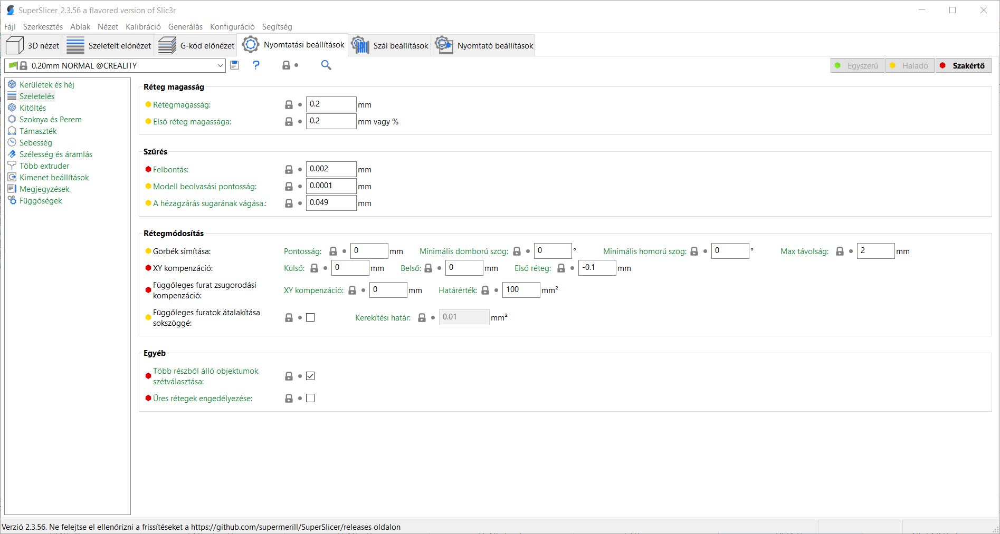

### Réteg magasság

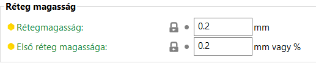

#### _Rétegmagasság_

Az egyes szeletek magassága/az egyes rétegek vastagsága. A rétegmagasság a fő tényező, amely mindkettőt befolyásolja:

* nyomtatási idő
* függőleges felbontás

A **nagyobb rétegmagasságok** választásával **jelentősen csökkentheti a nyomtatási időt** a láthatóbb rétegek árán. Másrészt a **kisebb rétegmagasság** \(pl. 0,10 mm\) választása **többlet részletet** tesz lehetővé, de hosszabb nyomtatási idő árán.

Általános szabályként nem javasoljuk, hogy 0,10 mm alá menjen, mivel a nyomtatási minőség javulása a 0,07 vagy 0,05 mm-es rétegeknél viszonylag csekély, és a nyomtatási idő jelentősen hosszabb.

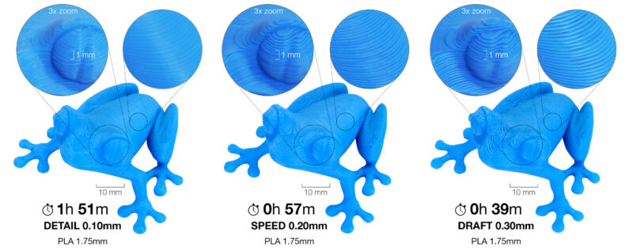

Ne feledje, hogy a réteg magassága csak a **függőleges** felbontást befolyásolja. Például a nyomtatólemezzel párhuzamos emelt szöveg a rétegmagasságtól függetlenül ugyanúgy fog kinézni. Ha nagyobb felbontást szeretne az XY-síkban, [nézze meg a különböző átmérőjű fúvókákat](../oktatoanyagok/nozzles_with_a_different_diameter.md).

Ha mindkét lehetőségből a legtöbbet szeretné kihozni, fontolja meg a **Változó rétegmagasság funkció használatát.**

**Maximális rétegmagasság a fúvóka számára**

A rétegmagasságnak **kevesebbnek kell lennie, mint a** fúvóka átmérőjének **80%-a** \(például egy 0,4 mm-es fúvókával a maximális rétegmagasság körülbelül 0,32 mm\). A rétegmagasság nem lehet nagyobb, mint a fúvóka átmérője, a SuperSlicer hibaüzenetet jelenít meg, ha ilyen értéket próbál megadni.

#### _Első réteg magassága_

Ha nagyon alacsony rétegmagassággal nyomtat, mindig érdemes vastagabb első réteget nyomtatni, hogy növelje a tapadást a nyomtatólemezhez. A Prusa eredeti nyomtatási profiljai mindig **0,20 mm-t használnak első rétegmagasságként**.

Ezt kifejezheti abszolút értékként \(például 0,20 mm\) vagy az alapértelmezett rétegmagasság százalékában \(például 150%\).

Az első réteg magasságának megváltoztatásához valószínűleg **első réteg kalibrálása** szükséges a nyomtatón.

### **Szűrés**

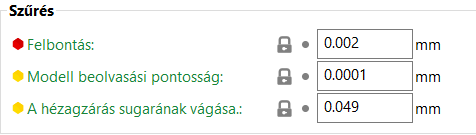

#### _**Felbontás**_

Minimális felbontás a részletekhez, a bemeneti fájl egyszerűsítésére szolgál a szeletelés felgyorsítása és a memóriahasználat csökkentése érdekében. A nagy felbontású modellek gyakran több részletet tartalmaznak, mint amennyit a nyomtatók elő tudnak állítani.


**Nullára** állítva letiltja az egyszerűsítést, és a bemenet teljes felbontását használja.


#### _**Modell beolvasási pontosság**_

#### Ez a bemeneti objektumfájl pontossága. Olyan pontok összehangolására szolgál, amelyeknek ugyanazon a vonalon kell lenniük.


**Nullára** állítva letiltja az egyszerűsítést, és a bemenet teljes felbontását használja.


#### _**A hézagzárás sugarának vágása.**_

A hézag sugarának kétszeresénél kisebb réseket a háromszögháló szeletelése során töltjük ki. A hézag bezárása csökkentheti a végső nyomat felbontását, ezért célszerű viszonylag alacsonyan tartani az értéket.

### **Rétegmódosítás**

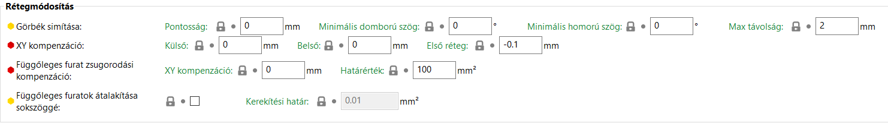

#### _**Görbék simítása**_

Ezek a paraméterek lehetővé teszik a szoftver számára, hogy az egyes rétegek szögeit kiegyenlítse. Az új pontosság a paraméter pontossága lesz.


**Nullára** állítva letiltja az egyszerűsítést, és a bemenet teljes felbontását használja.


Megjegyzés: mivel a poligon éleit használja, és csak 2D-s síkokban működik, nagyon tiszta 3D-s modellre van szüksége.

Csak funkcionális modellek vagy nagyon lapos sarkok lágyításához hasznos.

A görbesimító algoritmus 3 paraméter megváltoztatásával módosítható:

* **Minimális homorú szög**
* **Minimális domború szög**
* **Maximális távolság**

_**XY méretkompenzáció**_ **\(**Elefántláb-kompenzáció\)

Az objektum az XY síkban a megadott értéknek megfelelően \(negatív = kicsinyítve, pozitív = nagyítva\) lesz nagyítva/ kicsinyítve. Ez a beállítás hasznos lehet a furatméretek finomhangolásához.

Lehetőség van egy érték meghatározására

A **külső** vagy **belső** körvonalak és az **első réteg** esetében.

Nyomtatáskor az **első réteg** összenyomódik a fűtött nyomtatólemezen, és ennek következtében általában **egy kicsit szélesebb, mint amilyennek lennie kellene.**

Sok alkalmazás esetében ez nem jelenthet problémát. Ha azonban valaminek nagyon pontos méretekre vagy nagyon szűk tűréshatárok betartására van szüksége, akkor ez problémát jelenthet.

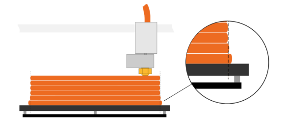

A beállítások eléréséhez a SuperSlicer**-**nek haladó vagy szakértői módban kell lennie.

#### _Függőleges furat zsugorodásási kompenzáció_

A furatok az XY síkban a beállított értékkel lesznek megnagyobbítva/összehúzva \(negatív = befelé, pozitív = kifelé, negatívnak kell lennie, mivel a furatok mindig egy kicsit kisebbek befelé\). Ez hasznos lehet a lyukak méretének finomításához.

Ez a paraméter ugyanúgy viselkedik, mint a belső XY méretkompenzáció, de csak furatok esetében. Ez a **Belső XY kompenzáció** kiegészítése, nem helyettesíti azt.

**A küszöbérték** \(mm²-ben\) a furat maximális területét jelöli, ahol a furatméret-kompenzáció teljes mértékben érvényesül. Ezután a terület négyszeresére csökken 0-ra.

Állítsa 0-ra, hogy a furatméret-kompenzáció minden felismert furatra teljes mértékben érvényes legyen.

#### _Függőleges furatok átalakítása sokszöggé_

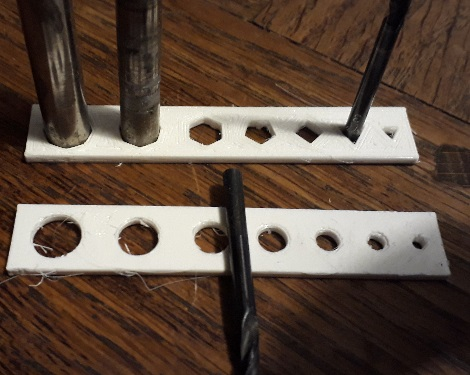

Az olvadt huzalos technológiával történő 3D nyomtatás során a zsugorodás és az anyag extrudálásának módja miatt a furatok a vártnál kisebbek lesznek. Ennek egyik módja a nagyobb furatok létrehozása, de nem ez az egyetlen megoldás: játszhat a geometriával is. Az élek pontosan vannak nyomtatva, így a körök "oldalainak" számának csökkentésével ÉS a furat "külső" oldalára helyezésével \(nem vágva a sarkokat\) funkcionális furatokat kaphat.

A fenti képen a fúrók tökéletesen illeszkednek a sokszögbe, de a kerek lyukba nem férnek bele, az túl keskeny, ahogyan az várható volt.

_**A sokszögek elmélete és matematikája:**_ [http://hydraraptor.blogspot.com/2011/02/polyholes.html](http://hydraraptor.blogspot.com/2011/02/polyholes.html).

### Egyéb

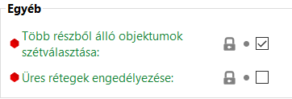

#### _Több részből álló objektumok szétválasztása_

Több anyagból készült objektumok nyomtatásakor ez a beállítás azt eredményezi, hogy a SuperSlicer újra összeilleszti az objektum egymást átfedő részeit \(a 2. rész újra összeillesztésre kerül az 1. részhez, a 3. rész újra összeillesztésre kerül az 1. és 2. részhez stb.\).

#### _Üres rétegek engedélyezése_

Megakadályozza, hogy a szeletelőmotor hibaüzenetet jelenítsen meg, ha egy teljes réteg üres, és ezért a nyomtatást utána újra kell kezdeni az üres rétegben.

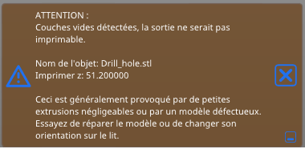

## Kitöltés

A kitöltés fő funkciója, hogy belső támasztékként szolgáljon a felső rétegek számára, amelyeknek egyébként egy rést kellene áthidalniuk. A töltés hatással van a nyomtatási sebességre, a szerkezeti szilárdságra, a szálfogyasztásra és még a kész tárgy megjelenésére is.

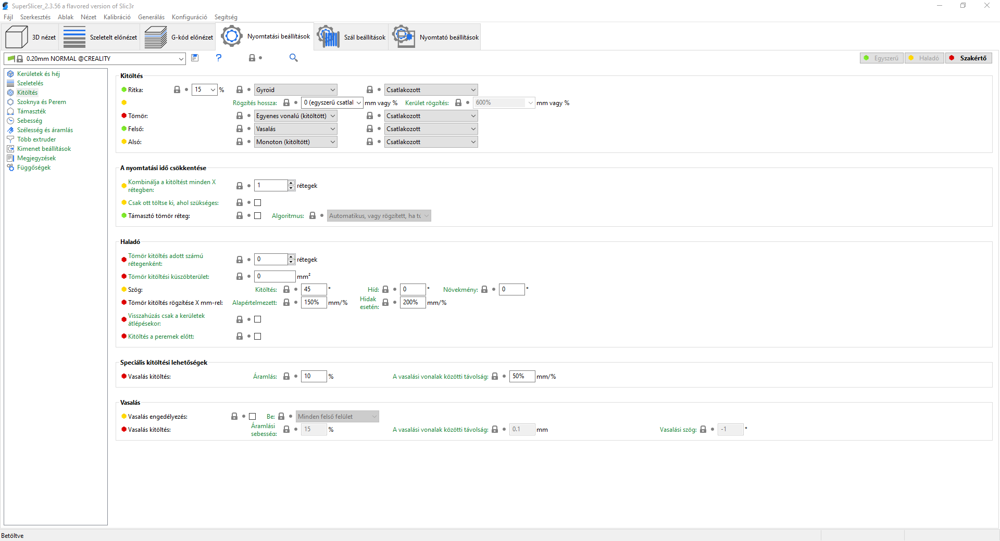

### Kitöltés

A modellek kitöltéséhez közvetlenül kapcsolódó paraméterek.

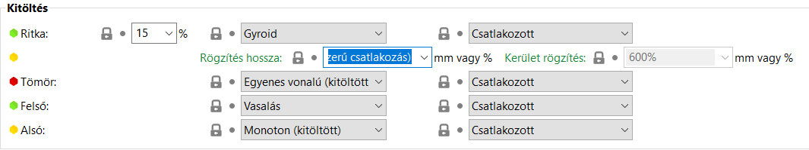

#### _Kitöltési sűrűség_

A legtöbb modell 10-15%-os kitöltéssel nyomtatható. Ha a modell teteje fokozatosan záródik, akkor üresen is nyomtatható \(0%-os kitöltés\), bár ezt általában nem javasoljuk. Ha azt szeretné, hogy a modell nehezebb legyen, nagyobb nyomószilárdsággal vagy merevséggel rendelkezzen, növelheti a kitöltést. Ritkán lesz szüksége 30%-nál több kitöltésre. Végül a modellt 100%-os kitöltéssel is kinyomtathatja, és a kitöltési minta ekkor szükségszerűen egyenes vonalú lesz. Ne feledje, hogy a 100%-os kitöltés negatív hatással lehet a nyomtatott objektum megjelenésére.

**A modell ellenállásának növelése**

A minta erősségét többnyire a **kerületek száma határozza meg \(nem a kitöltés**\). Ha erősebb nyomatot szeretne, növelje a kerületek számát. Ez azt jelenti, hogy a kitöltés növeli a nyomószilárdságot.

#### _Kitöltési minta_

A SuperSlicer többféle kitöltési mintát kínál. A kitöltési minta kiválasztásakor az alábbiakban néhány dolgot érdemes figyelembe venni:

* Nyomtatási sebesség
* Sűrűség a felhasznált anyagtól függően \(a magasabb rétegek kevesebb anyaggal jobb alátámasztást biztosítanak\).
* Megjelenés
* A felső rétegek támasztékai
* Rugalmasság \(TPU/TPE nyomtatáshoz\)

#### _Kitöltési minták beállításai a SuperSlicer_**-**_ben_

A nyomtatott minták széles skálájának lefedése érdekében kör és téglalap alakú tárgyakat szeleteltünk. A kitöltést 10%-ra állítottuk be, hogy segítsük a kitöltési minták szemléltetését. A képeken a felső réteget eltávolítottuk, hogy a belső mintázat látható legyen.

A SuperSlicer lehetővé teszi a nyomtatott kitöltési struktúra mintázatának megváltoztatását, ami bizonyos felhasználási esetekben előnyös. Például:

* A mindennapi nyomtatáshoz **erős 2D-s töltőanyagokat** használnak.
* **Gyors 2D kitöltések** gyors, de gyenge modellekhez használatosak
* **3D töltelékeket** használnak, hogy a tárgy minden irányban ugyanolyan erős legyen.
* **A 3D rugalmas** töltelékeket rugalmas anyagokhoz használják.

A következő modelltípusok állnak rendelkezésre:

> **A rajzok** alatt zárójelben megadott számok a felhasznált anyag és az idő durva becslését jelentik egy egyszerű 20 mm-es kocka esetében. Ne feledje, hogy ez csak tájékoztató jellegű, mivel a modell összetettsége és más tényezők befolyásolják az időt és az anyagot.



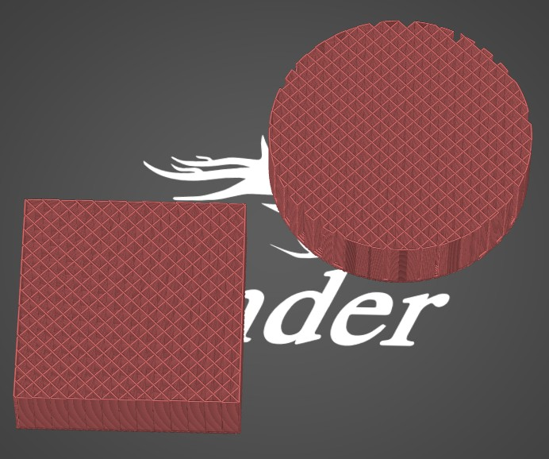



Az egyenes kitöltés **az egyik alapvető kitöltési minta.** Téglalap alakú rácsot hoz létre úgy, hogy egy réteget nyomtat egy irányba, majd a következő réteget 90°-os szögben, és így tovább. Így **kevesebb szálat** fogyaszt, és **az anyag nem halmozódik fel a kereszteződéseknél** \(ellentétben a ráccsal\). Ez az egyik **leggyorsabb nyomtatáskitöltés**.

Ez a kitöltési típus az egyetlen **a 100%-os nyomtatási kitöltéshez ajánlott**. Ha a profilban más kitöltési típus van beállítva, és a kitöltési százalékot 100%-os sűrűségre állítja, a **SuperSlicer** automatikusan egyenesre váltja a kitöltési típust.







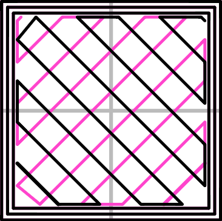









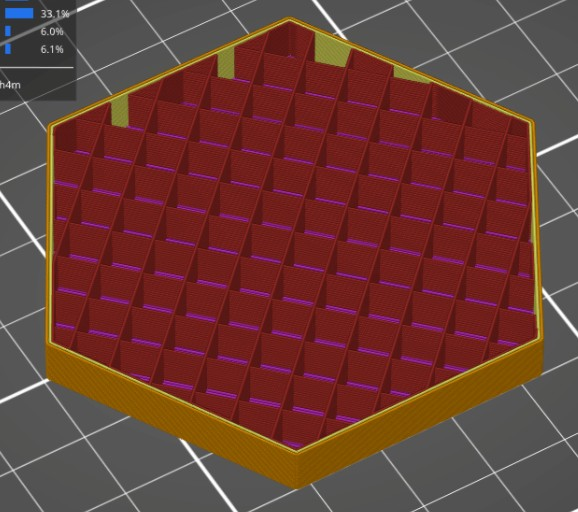



A monoton kitöltés az egyik alapvető kitöltési minta. Egyenes rácsot hoz létre úgy, hogy egy réteget nyomtat egy irányba, majd a következő réteget 90°-os szögben, és így tovább. Így kevesebb szál fogy, és az anyag nem halmozódik fel a kereszteződésekben \(ellentétben a ráccsal\).



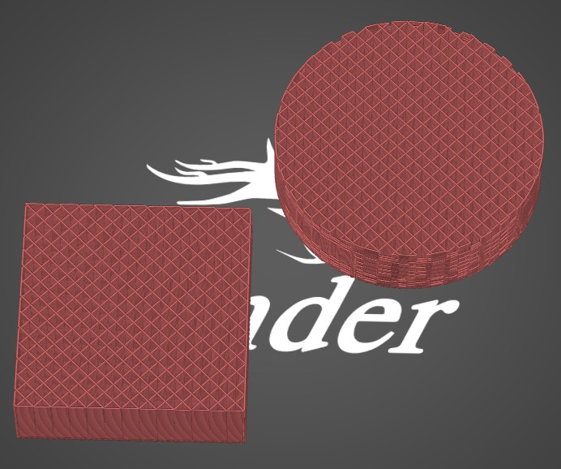









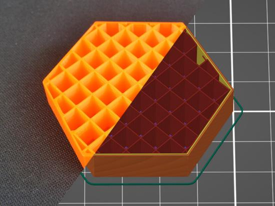



Ez az egyik legegyszerűbb és leggyorsabb **kitöltési változat**. Az egyenes töltéssel ellentétben **mindkét irányban \(90°-os elfordulással\) nyomtatódik minden egyes rétegnél**. Ennek eredményeként az anyag ott halmozódik fel, ahol az utak keresztezik egymást. A rácsos töltés **erősebb** \(és jobb a rétegtapadása\), mint az egyenes töltés, azonban néha **idegesítő zajt** és akár **nyomtatási hibát** is okozhat, amikor a fúvóka olyan kereszteződéseken halad át, ahol anyag halmozódik fel.


A kitöltőanyag nyomtatásának módja miatt a pályák keresztezik egymást, és ez az anyag felhalmozódását okozza ezeken a területeken. Néha hallani fog egy sajátos hangot, amikor a fúvóka eléri ezeket a területeket. Ez akár a nyomtatás meghiúsulását is okozhatja.



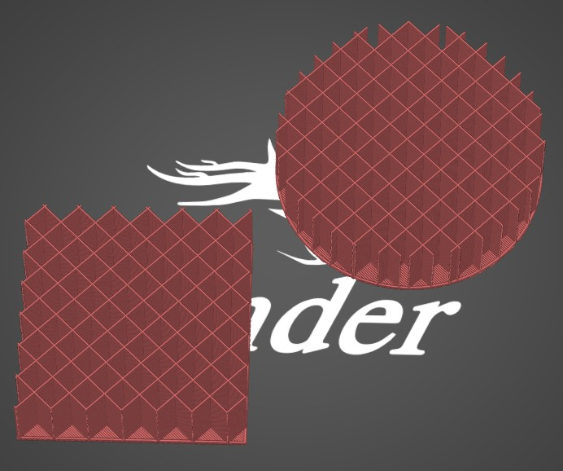









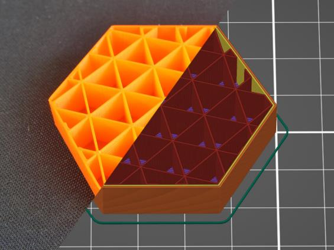



Ez a kitöltés ugyanúgy működik, mint a rácsos kitöltés - az útvonalak metszik egymást a rétegen, azonban ezúttal **három irányban** vannak nyomtatva, és háromszög alakú struktúrát alkotnak. Az anyagfelhasználás és az idő nem azonos a rácshálóval.



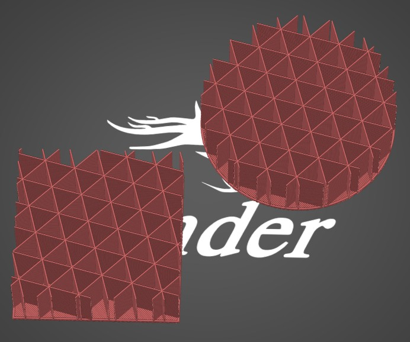









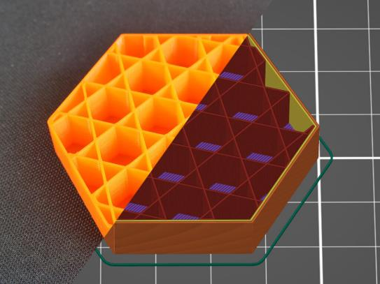



A csillagkitöltés **háromszögeken alapul**, de **az útvonalakat úgy módosítjuk**, hogy hatágú csillagokat alkossanak. Ez a kitöltés ismét az ugyanazon a rétegen belüli vonalak metszéséből jön létre. Az anyag- és időfelhasználás ugyanaz, mint az előző töltésnél.



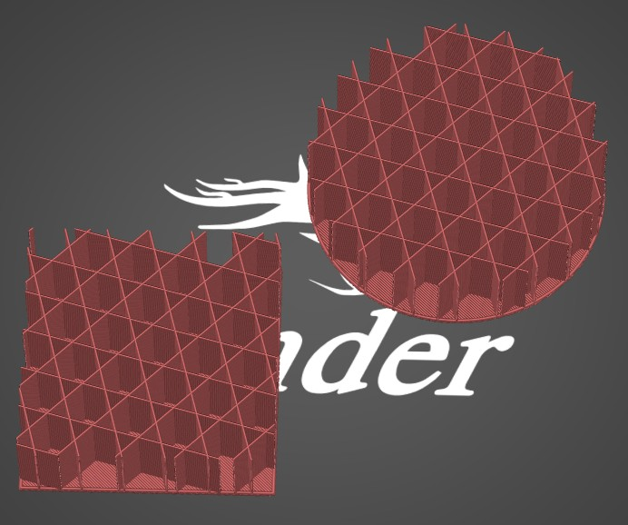









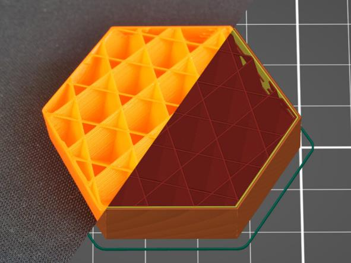



Ez megint egy töltés, amely ugyanazon a rétegen belüli, egymást metsző útvonalakkal van kitöltve. A fent leírt töltelékekkel ellentétben azonban **kockákat** készít, amelyeknek az egyik sarka lefelé mutat. Ily módon **légzsebek sokaságát** hozza létre, amelyek hőszigetelésre használhatók, vagy lehetővé teszik, hogy egy tárgy lebegjen a vízen \(vízálló szálakkal, például PETG-vel\). A nyomtatási idő és a szálfogyasztás nem különbözik a korábbi töltésekhez képest.



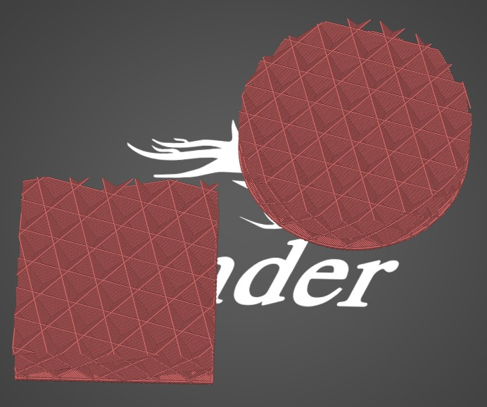









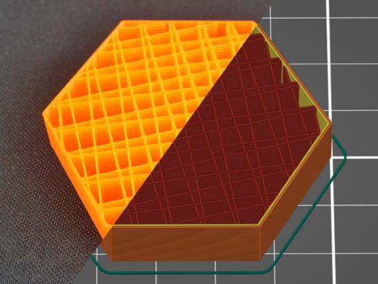



A vonal \(lineáris\) kitöltés egyike azoknak, amelyek **nem rendelkeznek metsző pályákkal** egy rétegen. Útvonalai hasonlóak az egyenes kitöltés útvonalaihoz, de **nem párhuzamosak** egymással. Ehelyett hegyesszögben vannak nyomtatva. Nem meglepő, hogy ez a töltés **hasonlóan működik, mint az egyenes töltés** a nyomtatási idő és az anyagfelhasználás tekintetében.



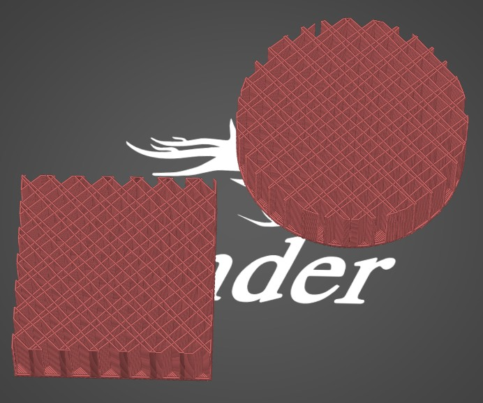



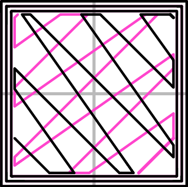









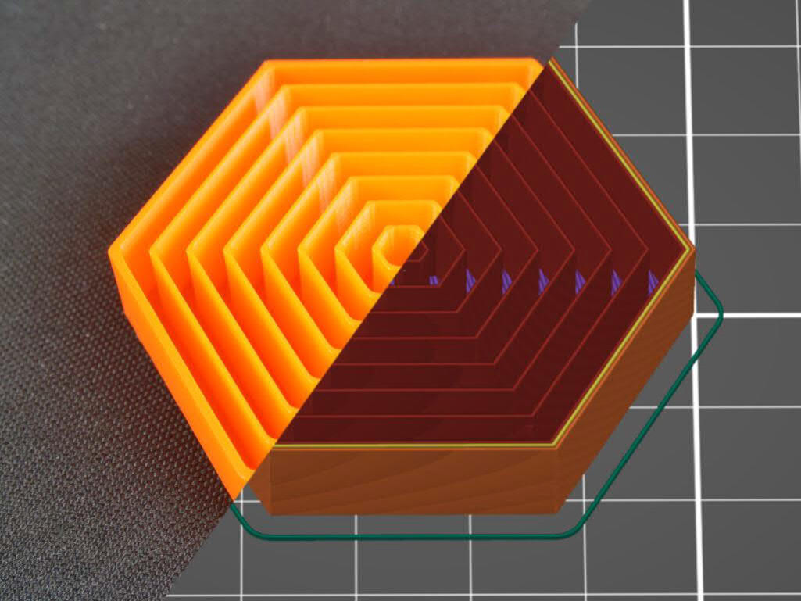



A koncentrikus kitöltés **meghúzza a modell kerületi vonalait**, majd egyre jobban összezsugorítja azokat a középpont felé. Más szóval: ha egy hengert nyomtatunk, a koncentrikus kitöltés **koncentrikus köröket** fog létrehozni a hengeren belül. Ez hasznos lehet **átlátszó alkatrészek vagy rugalmas modellek** \(pl. RC autó gumiabroncsok\) esetén. A fő hátránya a nyomtatási idő. Az anyagfelhasználás nem nagyobb, mint a korábbi típusú töltőminták esetében.



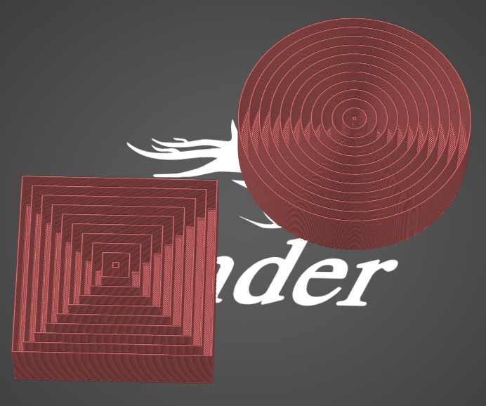



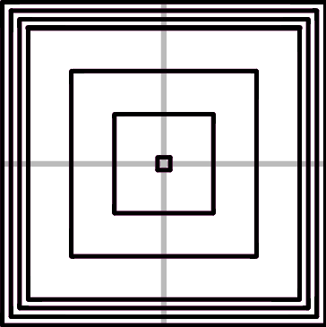









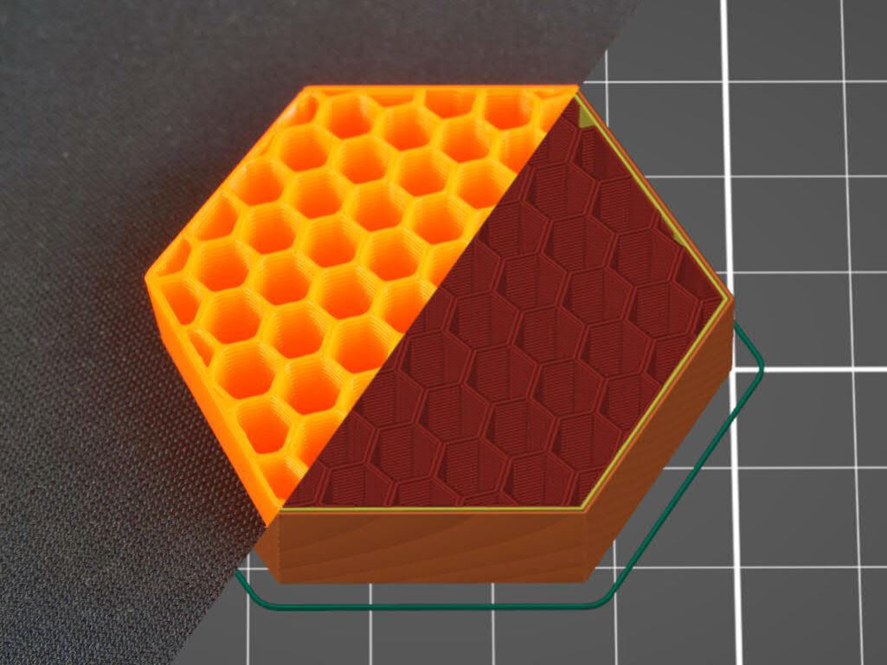



Ez a kitöltés egy **hatszögekből álló rácsot nyomtat.** Fő előnye a **mechanikai szilárdság** és az optimalizált, útkereszteződések nélküli pályák. Fő hátránya a **magas anyagfelhasználás** \(kb. 25%-kal több\) a többi töltelékhez képest, és a nyomtatási idő **kétszer olyan hosszú** lehet a fent leírt lehetőségekhez képest.



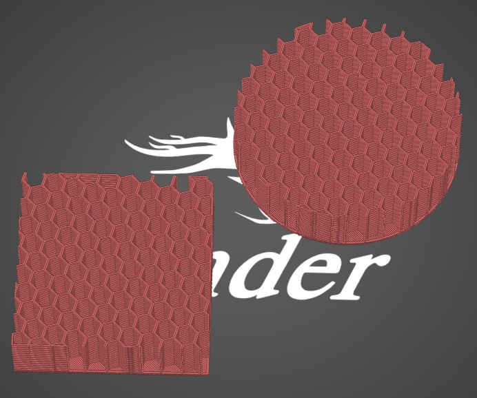


A 3D-s méhsejtek kis és nagy négyzeteket és nyolcszögeket nyomtatnak, hogy időszakosan növekvő és csökkenő vastagságú oszlopokat hozzanak létre. Ez a töltés **nem tartalmaz metsző vonalakat** egy rétegen, azonban az útvonalak kialakításának módja miatt **kis hézagokat hoz létre a rétegek között.** Az anyagfelhasználás és a nyomtatási idő kissé rosszabb a normál méhsejtmintához képest.


A gyroid kitöltés a kedvencünk és egyben **az egyik legjobb kitöltés.** Ez azon kevés 3D szerkezetek egyike, amely minden irányban nagyon jó alátámasztást biztosít. Ezen kívül igazán **gyors nyomtatás, anyagot takarít meg, vonalak nem keresztezik egymást egy rétegen belül, és jól néz ki**. A töltés különleges formája lehetővé teszi a töltés gyantával vagy bármilyen más folyadékkal való feltöltését.


A Hilbert-görbe egy téglalap alakú labirintust rajzol a modellben. Ennek a töltésnek a fő előnye az **eredeti megjelenés,** valamint az, hogy könnyen **betölthető gyantával** vagy más folyadékkal - a modell több nagy üregre oszlik, nem pedig apró "buborékok" sokaságára. Ennek a tölteléknek a fő hátránya a hosszú nyomtatási idő, amely a méhsejtes és az egyenes töltelék között van. A Hilbert-görbe anyagfelhasználása megegyezik az egyenes töltés anyagfelhasználásával.


Ez a spirális kitöltés ismét **könnyebbé teszi a folyadékkal való feltöltést.** Ez az egyszerű forma **anyagot és időt takarít meg** \(az egyenes kitöltéshez\) képest. A koncentrikus töltéshez hasonlóan az íves akkordok is **segítenek a modell rugalmasságában**, ha rugalmas szálból nyomtat.


A nyolcágú spirálminta lehetővé teszi, hogy a tárgyat **könnyen meg lehessen tölteni folyadékkal** az ilyen típusú töltés által létrehozott nagy rekeszeknek köszönhetően. A nyolcszögletű spirálmintázat szintén előnyös bizonyos modellek **hajlékonyságához**, de különösen érdekes **esztétikai okokból** és a felső rétegnek nyújtott támasza miatt. Az anyagfelhasználás megegyezik az archimédeszi akkordokéval, de a nyomtatási idő valamivel hosszabb.


A elszórt egyenes vonalú véletlenszerű lineáris kitöltést hoz létre, amely kevesebb szálból áll, és az anyag nem halmozódik fel a kereszteződéseknél. Alacsony sűrűségben alkalmazva jó térlefedettséget és ezáltal jó alátámasztást biztosít a felső rétegek számára. Az egyenes kitöltéshez hasonlóan ez is az egyik leggyorsabb nyomtatási kitöltés.


Az alkalmazkodó kocka kitöltés **azon az elven működik, mint a kocka kitöltés:** olyan kockákat tartalmaz, amelyek egyik sarka lefelé néz, és ugyanazon a rétegen belül metszik egymást a vonalak. Van azonban egy nagy előnye: az egyszerű kocka alakú kitöltéssel ellentétben ez a minta **sűrűbbé teszi a kitöltést, ahogy közeledik a modell szélei felé,** és nagy üregeket hagy középen. **Az anyagfogyasztás** körülbelül ¼-ével kevesebb, mint az egyenes töltésnél.

Az alkalmazkodó kocka kitöltés egy [**octree**](https://fr.wikipedia.org/wiki/Octree) azon celláinak finomításával működik, amelyek egy háromszög objektumot tartalmaznak. Minden töltésvonalhoz rögzítőket adunk hozzá. Ezáltal a töltés robusztusabbá válik, és stabilizálja az extrudálási áramlást a töltősor elején. Alapvetően ez a kitöltés a legközelebbi faltól való távolságtól függően válik többé-kevésbé sűrűvé. Ez különösen hasznos a nagy belső térfogatú, nagyméretű nyomatok esetében. Ez rövidebb nyomtatási időt és alacsonyabb szálfogyasztást eredményez, miközben a felső réteg jó alátámasztása és ugyanazok a mechanikai tulajdonságok maradnak meg.


A kocka támogatás kitöltés ugyanúgy működik, mint az előző, egy különbséggel: a **kitöltés sűrűsége csak a Z tengelyen növekszik.** Elsődleges funkciója a felső rétegek **támogatása** a lehető legtöbb anyag megtakarításával, így nem javítja a modell mechanikai tulajdonságait. Ennek a kitöltésnek az anyagfogyasztása és nyomtatási ideje messze a legérdekesebb az összes támogatott kitöltés közül.


**Javasolt kitöltési minta: Gyroid kitöltés**

A gyroid kitöltés az egyik legsokoldalúbb kitöltő minta.

* Háromdimenziós - ami **egyenletes szilárdságot biztosít minden irányban**.
* Elég **gyorsan kinyomtatható**
* Nem **keresztezi** ugyanazt a réteget.
* **Jó szilárdság/tömeg arány**.
* \(Véleményünk szerint\) **igazán esztétikus**

További információ a Gyroid töltésről [https://mathcurve.com/surfaces/Gyroide/gyroide.shtml](https://mathcurve.com/surfaces/Gyroide/gyroide.shtml)

#### _Felső kitöltési minta_

Választhat olyan egyéni kitöltési mintát, amely csak a legfelső látható rétegre vonatkozik, az alatta lévő szomszédos egyszínű rétegekre nem.

#### _Alsó kitöltési minta_

Választhat olyan egyéni kitöltési mintát, amely csak az alsó látható réteget érinti, a felette lévő szomszédos egyszínű rétegeket nem.

A következő modellváltozatok állnak rendelkezésre:

<table>
  <thead>
    <tr>
      <th style="text-align:left"><b>                                           Le&#xED;r&#xE1;s</b>
      </th>
      <th style="text-align:left">K&#xE9;p</th>
    </tr>
  </thead>
  <tbody>
    <tr>
      <td style="text-align:left">
        <p><b>Egyenes vonal&#xFA;:</b>
        </p>
        <p>Ism&#xE9;tlem, ez a legelterjedtebb (&#xE9;s legalapvet&#x151;bb) t&#xED;pus&#xFA;
          fels&#x151; t&#xF6;lt&#xE9;s. A nyomtat&#xE1;si &#xFA;tvonalak a teljes
          r&#xE9;tegen cikcakkos mint&#xE1;zatban helyezkednek el. Ez azonban a legegyszer&#x171;bb
          kit&#xF6;lt&#xE9;s, &#xE9;s <b>nem ny&#xFA;jt semmilyen el&#x151;nyt</b> (l&#xE1;sd:
          Monoton kit&#xF6;lt&#xE9;s).</p>
      </td>
      <td style="text-align:left">
        
      </td>
    </tr>
    <tr>
      <td style="text-align:left">
        <p><b>Monoton:</b>
        </p>
        <p>A monoton kit&#xF6;lt&#xE9;si minta p&#xE1;rhuzamos vonalakkal t&#xF6;lti
          ki a fels&#x151; (vagy als&#xF3;) r&#xE9;teget, ugyan&#xFA;gy, mint az
          egyenes kit&#xF6;lt&#xE9;si t&#xED;pus. Ez a kit&#xF6;lt&#xE9;s azonban <b>fejlett &#xFA;tvonaltervez&#xE9;st haszn&#xE1;l.</b> Az
          egyenes kit&#xF6;lt&#xE9;ssel ellent&#xE9;tben ez mindig balr&#xF3;l jobbra
          nyomtat, soha nem az ellenkez&#x151; ir&#xE1;nyba. Ez az egyszer&#x171;
          rendszer <b>homog&#xE9;n kit&#xF6;lt&#xE9;st eredm&#xE9;nyez, cs&#xFA;nya dudorok n&#xE9;lk&#xFC;l</b>,
          amelyek m&#xE1;s kit&#xF6;lt&#xE9;sekn&#xE9;l &#xE1;ltal&#xE1;ban akkor
          fordulnak el&#x151;, amikor a bal-jobb p&#xE1;ly&#xE1;k tal&#xE1;lkoznak
          a jobb-bal p&#xE1;ly&#xE1;kkal. Ezt a l&#xE1;tsz&#xF3;lag egyszer&#x171;
          m&#xF3;dszert meglep&#x151;en neh&#xE9;z integr&#xE1;lni. A Raad Salman
          &#xE1;ltal le&#xED;rt <b>Ant Colony System</b> v&#xE1;ltozatot haszn&#xE1;ltuk.</p>
      </td>
      <td style="text-align:left">
        
      </td>
    </tr>
    <tr>
      <td style="text-align:left"><b>Monotonikus</b>
      </td>
      <td style="text-align:left">
        
      </td>
    </tr>
    <tr>
      <td style="text-align:left">
        <p><b>Koncentrikus:</b>
        </p>
        <p>A koncentrikus kit&#xF6;lt&#xE9;si minta a ker&#xFC;let alakj&#xE1;t m&#xE1;solja.
          Ha egy hengert nyomtat, akkor koncentrikus k&#xF6;r&#xF6;ket rajzol a modell
          tetej&#xE9;re.</p>
      </td>
      <td style="text-align:left">
        
      </td>
    </tr>
    <tr>
      <td style="text-align:left"><b>Koncentrikus (kit&#xF6;lt&#xF6;tt)</b>
      </td>
      <td style="text-align:left">
        
      </td>
    </tr>
    <tr>
      <td style="text-align:left">
        <p> <b>Hilbert-g&#xF6;rbe:</b>
        </p>
        <p>Ez els&#x151;sorban eszt&#xE9;tikai t&#xF6;lt&#xE9;s. Ha a bels&#x151;
          oldalra nyomtatjuk, a Hilbert-g&#xF6;rbe minta t&#xE9;glalap alak&#xFA;
          form&#xE1;kat hoz l&#xE9;tre, m&#xED;g a fels&#x151; r&#xE9;teg ink&#xE1;bb
          egy fonott kos&#xE1;rra hasonl&#xED;t. Ez a kit&#xF6;lt&#xE9;s az &#xF6;sszetett
          forma miatt jelent&#x151;sen megn&#xF6;veli a nyomtat&#xE1;si id&#x151;t.</p>
      </td>
      <td style="text-align:left">
        
      </td>
    </tr>
    <tr>
      <td style="text-align:left">
        <p><b>Arkhim&#xE9;d&#xE9;szi akordok:</b>
        </p>
        <p>Az archim&#xE9;deszi akkordokn&#xE1;l a legfels&#x151; fel&#xFC;let spir&#xE1;lisan
          van nyomtatva. Ez a kit&#xF6;lt&#xE9;s id&#x151;t takar&#xED;that meg bizonyos
          mint&#xE1;k nyomtat&#xE1;sakor.</p>
      </td>
      <td style="text-align:left">
        
      </td>
    </tr>
    <tr>
      <td style="text-align:left">
        <p><b>Spir&#xE1;lis oktagram:</b>
        </p>
        <p>Ezt a kit&#xF6;lt&#xE9;st m&#xE1;r kor&#xE1;bban le&#xED;rtuk. Legink&#xE1;bb
          eszt&#xE9;tikai okokb&#xF3;l &#xE9;rdekes, de bonyolult form&#xE1;ja megn&#xF6;veli
          a nyomtat&#xE1;si id&#x151;t.</p>
      </td>
      <td style="text-align:left">
        
      </td>
    </tr>
    <tr>
      <td style="text-align:left"><b>F&#x171;r&#xE9;szfog</b>
      </td>
      <td style="text-align:left">
        
      </td>
    </tr>
    <tr>
      <td style="text-align:left">
        <p><b>Vasal&#xE1;s:</b>
        </p>
        <p>A <b>vasal&#xE1;s</b> egy 90&#xB0;-os &#xE1;tmenettel eg&#xE9;sz&#xED;ti
          ki a m&#xE1;r nyomtatott r&#xE9;teget. Ez a kieg&#xE9;sz&#xED;t&#x151;
          menet nagyon kis vonalsz&#xE9;less&#xE9;g&#x171;, &#xE9;s a nyomtat&#xE1;s
          a t&#xF6;lt&#xE9;si sebess&#xE9;ggel megegyez&#x151; sebess&#xE9;ggel t&#xF6;rt&#xE9;nik.A
          sim&#xED;t&#xE1;s lehet&#x151;v&#xE9; teszi, hogy egyenes vonal&#xFA; mint&#xE1;t
          nyomtassunk a nyomtatott r&#xE9;tegre.</p>
        <p>Ennek k&#xE9;t f&#x151; el&#x151;nye van:</p>
        <ul>
          <li>A m&#xE1;r kinyomtatott r&#xE9;teget &#xFA;gy olvasztja meg, hogy t&#xF6;bbsz&#xF6;r
            &#xE1;tvezetik egy forr&#xF3; f&#xFA;v&#xF3;ka alatt. Mivel a halad&#xE1;si
            sebess&#xE9;g nagyon alacsony &#xE9;s a vonalsz&#xE9;less&#xE9;g nagyon
            kicsi, a f&#xFA;v&#xF3;ka jelent&#x151;sen felmeleg&#xED;ti a fel&#xFC;letet.
            A f&#xFA;v&#xF3;ka lapos r&#xE9;sze ezut&#xE1;n sim&#xE1;n felsz&#xED;nre
            ker&#xFC;l.</li>
          <li>Kit&#xF6;lti a m&#xE1;r kinyomtatott r&#xE9;teg h&#xE9;zagait. A sim&#xED;t&#xF3;
            mozg&#xE1;s a r&#xE9;teggel azonos magass&#xE1;gban van. Kevesebb &#xE1;raml&#xE1;ssal
            rendelkezik, mint a szil&#xE1;rd r&#xE9;teg, de m&#xE9;g mindig nagyon
            alacsony az &#xE1;raml&#xE1;s. Minden alkalommal, amikor a f&#xFA;v&#xF3;ka
            &#xE1;thalad a fel&#xFC;let egy egyenetlens&#xE9;g&#xE9;n, a f&#xFA;v&#xF3;k&#xE1;ban
            l&#xE9;v&#x151; anyag az adott t&#xE9;rbe &#xE1;ramlik.</li>
        </ul>
      </td>
      <td style="text-align:left">
        
      </td>
    </tr>
  </tbody>
</table>

Megjegyzés: Elméletileg az alsó és felső Lineárisan igazított kitöltési módnak lehetővé kellene tennie a kitöltést a 2 réteg közötti orientációváltás nélkül, de a tesztelt 2.3.0-s verziókon a mód nem változott a standard lineárishoz képest.

### További információk a kitöltéséről

Bizonyára már észrevette, hogy a **SuperSlicer új verziója \(2.3\)** új kitöltési mintákkal bővült. Most, hogy ennyi lehetőség van, talán még egy kicsit elveszettnek is érezheti magát a lehetőségek között. Melyik kitöltést válasszam? Van olyan univerzális minta, amely minden modellnél működik? Vagy egy adott helyzethez kell választanom egy konkrétat? Lássuk, mit lehet tenni a megfelelő típusú kitöltés kiválasztásával és beállításainak módosításával.


#### _Mi a kitöltés és mire használható?_

Először is, nézzük át gyorsan, mi is az a kitöltés, és miért fontos. Ha Ön már profi 3D nyomtató, akkor ezt a fejezetet valószínűleg kihagyja, de nem árt, ha leporolja az alapokat, nem igaz?

A 3D nyomtatott modelleket ritkán nyomtatják 100%-os kitöltéssel vagy teljesen üregesen. Ehelyett egy olyan módszert használunk, amely **kitölti a tárgy belsejét egy tartószerkezettel.** Ez a módszer segít megszilárdítani a modellt, és **megakadályozza, hogy hézagok és lyukak keletkezzenek a tárgy felületén.** A teljes modellek \(100%-os kitöltés\) száligényesek és időigényesek. Emellett a szilárd modellek legtöbbször nem rendelkeznek jobb mechanikai tulajdonságokkal, mint a kevésbé sűrű kitöltésű modellek. Ha úgy dönt, hogy kitöltés nélkül nyomtatja ki a modellt, fennáll a veszélye, hogy a modell felülete sérül, kisebb hézagok, esetleg nagyobb lyukak is keletkezhetnek. Elég nyilvánvalónak tűnik, hogy a legjobb megoldás a kettő között van. A jó kitöltési beállításokkal **sok anyagot és időt takaríthat meg**, de érdekes mintákat is létrehozhat a felületen.

A legtöbb esetben nagyon kevés értelme van a 40%-nál nagyobb töltési sűrűség beállításának. Tesztjeink azt mutatták, hogy **a legjobb sűrűség beállítása 10-20% körül van,** és ezt az értéket adtuk meg a **SuperSlicer** profiljainkban. A 10-20% az ideális egyensúlyt jelenti a robusztusság, a nyomtatási megbízhatóság, a nyomtatási idő és az anyagfelhasználás között. Természetesen egyes tárgyak esetében elegendő lehet az 5%-os \(vagy annál kisebb\) kitöltés, különösen a **PLA**-ban nyomtatott nagyméretű egyedi tárgyak esetében. A 20%-nál nagyobb töltöttséggel nagyobb szilárdságot érhet el. Ugyanez a hatás azonban több kerület hozzáadásával is elérhető \([Nyomtatási beállítások/Kerületek és héj\)](print_settings.md#kerueletek-es-hej). A különböző nyomtatási beállítások használatával nemcsak a belső szerkezetet és a mechanikai tulajdonságokat, hanem a nyomtatási sebességet, az anyagfelhasználást és a tárgy felületét is megváltoztathatja.

Mielőtt rátérnénk a speciális beállításokra, gyorsan nézzük át egyenként a meglévő kitöltési típusokat és azok tulajdonságait.

#### _Kitöltő minták és tulajdonságaik_

A kitöltő minták listája egyre bővül, és nehéz lehet kiválasztani a megfelelő típust. Bár az lehet a benyomása, hogy elsősorban a külsőségek különböztetik meg őket, ennek éppen az ellenkezője igaz. Például néhány kitöltés lehetővé teszi számunkra, hogy sok anyagot és időt takarítsunk meg, néhányat folyadékkal lehet kitölteni, stb....

Bizonyos modelltípusok jobban megfelelnek egy adott mintának, például az organikus és a mechanikus típusok között. Az ábra azt mutatja, hogy a méhsejtes kitöltés jobban megfelelhet ennek a mechanikus alkatrésznek, mivel minden egyes hatszög minden rétegben ugyanahhoz a mögöttes mintához kötődik, erős függőleges szerkezetet alkotva.


A legtöbb modell csak alacsony sűrűségű kitöltést igényel, mivel ha mondjuk 50%-nál nagyobb sűrűségű kitöltést biztosítunk, akkor egy nagyon szorosan tömörített modellt kapunk, amely a szükségesnél több anyagot használ fel. Emiatt a minták általános tartománya 10% és 30% között van, azonban a modell követelményei határozzák meg, hogy melyik sűrűség a legjobb. Az ábra azt mutatja, hogyan változnak a minták a sűrűség növekedésével.


#### _A felső és alsó réteg kitöltésének típusai_

A kitöltés szerkesztése nem csak az objektum belső részeinek kitöltési típusának kiválasztásáról szól. A felső és alsó rétegek kitöltési típusait is megváltoztathatja, hogy érdekes eredményeket érjen el. Ez a **Nyomtatási beállítások/Kitöltés/felső \(alsó\) kitöltés** lapon állítható be. A felső vagy alsó kitöltés megváltoztatása azonban **esztétikai változásokat** okoz, és nem javítja a modell mechanikai tulajdonságait.


Az alábbiakban a felső és alsó kitöltések mind a hét típusát 80%-os áramlással nyomtatjuk, hogy kiemeljük a mintákat.


**A rögzítő hossza**

A kitöltés általában **összekapcsolódik a kerületekkel** egy úgynevezett rögzítővel, amely egy rövid vonalból áll, amely egy másik \(belső\) kerületet alkot, és töltésvonallá alakul. A rögzítés hossza határozza meg, hogy milliméterben kifejezve milyen hosszúságban csatlakozik ez a rögzítő a kitöltéshez és a kerületekhez. Ha ezt az értéket 0-ra állítja, akkor a kitöltés a kerületekre függetlenül kerül nyomtatásra. A magasabb érték a rögzítést a kitöltés kiterjesztéseként nyomtatja ki. A rögzítő segít javítani a **modell integritását és szilárdságát.**

Ha százalékban van megadva \(15%\), akkor azt a kitöltőanyag extrudálási szélességére kell számítani.


**Rögzítés hossza \(maximális\)**

Ez az érték határozza meg a rögzítő maximális hosszát, amely a kitöltést a kerületekhez köti.

1000-es érték beállítása a **Rögzítés hossza** paraméterben azt jelenti, hogy a paramétert korlátlanra állítjuk \( 0 kikapcsolja\).


### A nyomtatási idő csökkentése


A SuperSlicer két módszert kínál az idő- és anyagmegtakarításra. Az első opció lehetővé teszi, hogy **összekapcsolja a kitöltést minden X rétegben.** Az alapértelmezett érték 1, ami azt jelenti, hogy minden kerületi réteg egy kitöltési réteggel kerül nyomtatásra \(1 = 1 kitöltési réteg és 1 kerületi réteg aránya\). Ha ezt az értéket 2-re növeli \(2:1 arány\), akkor minden két kerületi réteghez egy kitöltő réteget nyomtat \(a megfelelő rétegmagassággal\). Ne feledje azonban, hogy ez az érték nem növelhető a végtelenségig. A SuperSlicer lehetővé teszi, hogy nagyon magas értéket adjon meg, de csak a fizikailag lehetséges maximális értéket írja a G-kódba. Pontosabban: Ha 0,4 mm-es fúvókát és 0,15 mm-es rétegmagasságot használ, a szeletelő nem engedi, hogy egy kerületi réteget ritkábban nyomtasson, mint két kerületi réteget. Ellenkező esetben a kitöltéseket üres térben nyomtatnák ki. Ha azonban 0,05 mm-es rétegmagassággal nyomtat \(0,4 mm-es fúvókával\), akkor a kitöltést 8 rétegenként kombinálhatja. A második módja az idő \(és az anyag\) megtakarításának az, hogy **csak ott nyomtatunk kitöltést, ahol szükség van rá,** Például ha egy gömböt nyomtatunk, ez a funkció csak egy kitöltő oszlopot fog generálni a közepén, hogy támogassa a túlnyúlásokat. Ennek a tulajdonságnak a fő hátránya az alacsony ütésállóság, amely a modell egyes területein a kitöltés hiányából adódik.

#### _Kombinálja a kitöltést minden X rétegben_

Különböző rétegmagasságokat használunk a kitöltéshez és a kerülethez a nyomtatás felgyorsítása érdekében a minőség feláldozása nélkül.

**Példa:** Kombináljon egy kitöltést 3 rétegenként, 0,1 mm-es rétegmagassággal, a kitöltést 0,3 mm-es rétegmagassággal nyomtatva.

A maximális rétegmagasságot a fúvóka átmérője korlátozza. Ha megpróbálja kombinálni az 1+ rétegenkénti kitöltést 0,4 mm-es fúvókával és 0,3 mm-es rétegmagassággal, akkor nem történik valódi változás, mert nem tud \(kb.\) 0,32 mm-nél \(a fúvóka átmérőjének 80%-ánál\) nagyobb rétegeket nyomtatni.


#### _Csak ott töltse ki, ahol szükséges_

Ha ezt az opciót választja, a kitöltés úgy történik, mint egy belső tartószerkezet esetében, és csak azok a területek generálnak kitöltési mintát, amelyeknek támogatásra van szükségük. Ha ez az opció be van kapcsolva, akkor a G-kód generálása lelassul \(a szükséges további túlnyúlás vizsgálatok miatt\). Emellett a kitöltés néhány helyen valószínűleg nem fog érintkezni a kerülettel, ezért ezt a lehetőséget óvatosan használja.

Ez az opció nem veszi figyelembe a támaszok **túlnyúlási küszöb** beállítását.


Nem mutatkozott nagy érdeklődést e lehetőség iránt. A túlnyúlás beállítása nélkül nehéz kezelni ezt a lehetőséget.

**Támasztó tömör réteg**

Lehetővé teszi az első belső tömör felület alatt egy támasztóréteg létrehozását. Ez lehetővé teszi, hogy nagyon alacsony kitöltési sebességet használjon anélkül, hogy a tömör kitöltés minősége romlana.

A sűrű kitöltés 50%-os töltési sűrűséget használ.

Ha ez a kapcsoló be van kapcsolva, ha a kitöltés 40%-nál kisebb, akkor minden egyes tömör felület alatt támogatott területet keres, és csak egyenes vonalak vannak a kerületek között. Ha talál egyet, akkor egy speciális kitöltési folyamatot használ, amely egy kerületet \(átfedéssel, úgy, hogy az támogatva legyen az aktuális belső kerület által, majd egy egyenes 42%-os kitöltés belül. Ez megakadályozza a görbüléseket, amelyek tönkretehetik a felső felületet, és biztosítja, hogy minden alátámasztható legyen még 0%-os kitöltési arány mellett is.


#### _Algoritmus_

Válassza ki a tömör réteg elrendezését. Az automatikus opció a legkisebb területet próbálta megrajzolni, csak egyenes vonalakkal a ritkás kitöltésen belül. A "rögzítve" csak egy kicsit megnöveli \(az "Alapértelmezett kitöltési szélességgel"\) azokat a területeket, amelyeknek nagyobb támogatásra van szükségük.

### Haladó


A SuperSlicer lehetővé teszi, hogy még jobban beállítsa a kitöltési mintákat! Ha a Haladó vagy Szakértő módra vált, a Kitöltés lapon még több beállítást talál. Nézzük meg tehát a kitöltésekkel kapcsolatos összes beállítást, akár haladó, akár szakértői módban vannak.

Ezek a kitöltési beállítások valóban fejlett beállítások, és a legtöbb 3D nyomtató felhasználónak valószínűleg soha nem lesz rájuk szüksége. Ennek ellenére lehet néhány olyan helyzet, amikor érdemes lesz beállítani őket, ezért nézzük meg, hogy mit tudnak:

#### _Tömör kitöltés adott számú rétegenként_

Ez a funkció lehetővé teszi, hogy minden megadott számú réteg után egy teljes réteget írjon elő. Ez hasznos lehet a nyomtatott alkatrész szilárdságának növelésére, azonban más lehetőségek, például a kerületek számának vagy a kitöltés százalékos arányának növelése előnyösebb. A hőszigetelés növelése érdekében különálló belső cellák létrehozására is használható.


 **A kikapcsoláshoz állítsa 0-ra.**


A tömör kitöltés nyomtatása **X rétegenként** hasznos lehet, ha a modell szilárdságát szeretné javítani \(a kerületek számának növelése azonban jobban működik\), vagy ha a kitöltést több üregre szeretné osztani, hogy egy tárgy lebegjen a vízen. Ez a funkció egyszerűen lehetővé teszi a rendszeres időközönként történő teljes kitöltés benyomását.

#### _Kitöltési szög_

A kitöltési tájolás alapértelmezett szöge. Egyes kitöltési mintákra rácsmintát alkalmaznak.

**A hidak** a SuperSlicer által felismert legjobb irányban kerülnek kinyomtatásra, így ez a beállítás nem befolyásolja őket.

#### _Tömör kitöltési küszöbterület_

Teljes kitöltést ír elő a megadott küszöbértéknél kisebb területekre.


 **A kikapcsoláshoz állítsa 0-ra.**


A Teljes kitöltés küszöbterület beállítása különösen hasznos a kis vagy összetett alkatrészeknél. Ezzel a beállítással meghatározhatja, hogy a modellben lévő kisebb és nagyobb üregek 100%-os kitöltéssel legyenek kitöltve. Ez segíthet abban, hogy a kis alkatrészek erősebbek legyenek.

#### _Kitöltési szög_

A kitöltés alapszöge elforgatja a mintát a kiválasztott szögben.

#### _Hidak szöge_

A hidak szögét a SuperSlicer automatikusan kiszámítja. Ha 0°-ot hagy, a SuperSlicer a legjobb értéket fogja kiválasztani. Ha szeretné, manuálisan is módosíthatja. Ha 0°-os hídszöggel szeretne nyomtatni, akkor valójában 180°-ra kell beállítania.


**Használja a 180°-ot a nulla szöghöz.**


#### _Növekményszög_

A növekményszög ez a szög hozzáadódik minden egyes réteghez a kitöltés alapszögénél. Hasznos lehet esztétikai okokból, vagy azért, hogy biztosan eltalálja az objektum minden jellemzőjét, még nagyon alacsony kitöltés esetén is.


 **A kikapcsoláshoz állítsa 0-ra.**


#### _Tömör kitöltés rögzítése X mm-rel_

Ez a paraméter megnöveli a felső/alsó/teljes rétegeket a megadott értékkel, hogy rögzítse őket a térben.


 **A letiltáshoz állítsa 0-ra.** Lehet a kerület szélességének %-a.


**Hidak esetén**

Ez a paraméter az áthidalt tömör kitöltő rétegeket a megadott mm-rel megnöveli, hogy az alkatrészbe rögzítse őket.


**A letiltáshoz állítsa 0-ra.** A külső kerület szélességének százalékába adható meg.


#### _Visszahúzás csak a kerületek átlépésekor_

Kapcsolja ki a visszahúzást, ha az útvonal nem keresztezi a külső rétegek határait \(és így a cseppek valószínűleg láthatatlanok lesznek\).

Ha csak akkor használ visszahúzást, amikor a falakat keresztezi, az egy kicsit csökkentheti a nyomtatási időt és növelheti a kitöltés integritását. A visszahúzások kikapcsolása növeli a nem látható \(a modellben rejtett\) szálak áramlását. A visszahúzás továbbra is engedélyezve marad a kerületeknél.

#### _Kitöltés a kerületek előtt_

Ez az opció megfordítja a kerületek és a kitöltés nyomtatási sorrendjét, és először a kitöltés kerül kinyomtatásra. A kitöltés nyomtatása a kerületek előtt néha hasznos lehet olyan túlnyúlások nyomtatásához, ahol a kerületeknek nincs hova csatlakozniuk. A töltés azonban negatívan befolyásolhatja a külső felület minőségét. A módszer másik felhasználási területe az MMU2, ahol a színtisztítás hatékonyabb - a színt a kitöltésben tisztítják, és a kerületeket tiszta színnel nyomtatják ki.

### Speciális kitöltési lehetőségek

#### _Vasalás kitöltés_

Ez az áramlás százalékos aránya, amelyet a második vasaláshoz használnak fel. Általában 10-20%. Nem lehet több, mint 20%, kivéve, ha az extrudálás szélessége sokkal nagyobb, mint a fúvóka szélessége. Ha túl alacsony, az extruder megeszi a szálakat. Ha túl magas, az első menet nem fog jól nyomtatni.

#### _A vasalási vonalak közötti távolság_

Ez a vasalási menet szélessége a felső kitöltési extrudálás százalékában. A szélesség nem lehet nagyobb 50%-nál \(kétszer annyi vonal, 50%-os átfedés\). Nem szükséges 25% alá menni \(négyszer több sor, 75%-os átfedés\).

Ha problémái vannak a vasalással, ne felejtse el megnézni a áramlási sebesség-&gt;felső rész áramlási sebessége paramétert, mivel ezt a paramétert minimum 110%-ra kell állítani, hogy elegendő műanyag legyen a felső rétegben. A túl alacsony értékek miatt az extruder megeszi a szálakat.

**Speciális kitöltési lehetőségek**


Az áramlásnak az a százaléka, amelyet a második vasalási menetre használnak fel. Általában 10-20%. Nem lehet 20%-nál nagyobb, kivéve, ha a felső extrudálás szélessége jóval nagyobb, mint a fúvóka szélessége. Egy túl alacsony érték esetén az extruder elfogyasztja a nyomtatószálakat. Túl magas érték esetén az első menet nem fog jól nyomtatni.

### Vasalás \(utófeldolgozás\)


A vasalási folyamat a vízszintes síkokban **sima felületet** eredményez - a szálak útjai szinte láthatatlanok. Hogyan lehetséges ez? A forró fúvóka még **egyszer áthalad a felületen, de csökkentett száláramlási sebességgel.** A vasalás be- vagy kikapcsolása, valamint a vasalás típusának kiválasztása \(minden felület, csak a legfelső felület, minden tömör felület\) a legtöbb 3D nyomtató felhasználó számára elegendőnek kell lennie. Előfordulhat azonban, hogy módosítani kell az áramlási arányt vagy a vasalási lépések közötti távolságot. Az **áramlási arány** a normál rétegmagasság százalékában van megadva, a **vasalási átmenetek távolsága** pedig azt határozza meg, hogy a fúvóka által húzott párhuzamos vonalak milyen távolságra legyenek egymástól. Ezeknek a paramétereknek az értékei optimális értékekre vannak beállítva, de tetszés szerint módosíthatja őket, ha nem tetszik az eredmény.

Ha növeli **az áramlási sebességet**, előfordulhat, hogy anyagmaradványok maradnak a felületen. Ezenkívül a fúvóka útja is láthatóvá válik. Az alacsonyabb áramlási sebesség viszont láthatóvá teszi az utolsó rétegen a hézagokat kitöltő anyag hiánya miatt. **A vasalási lépések távolsága** szintén fontos hatással van a felső réteg megjelenésére. A magyarázat megkönnyítése érdekében hasonlítsuk össze a hókotróval. Tegyük fel, hogy a hó kitolására csak a hókotró lapát egy részét használja - ez eltávolít egy bizonyos mennyiségű havat, és az út egy részét is megtisztítja. Ha az egész lapáttal tolja a havat , és előre tolja, akkor megtisztítja az utat, de a felesleges havat hátrahagyja.

#### _Mi az a vasalás \(simítás\) és hogyan működik?_

A vasalás lehetővé teszi a sík felületek simítását egy második speciális töltési fázis elvégzésével ugyanazon a rétegen.

Ahogy a forró fúvóka az imént nyomtatott felső réteg fölött mozog, az esetlegesen felgöndörödött műanyagot ellapítja. A fúvóka egy kis mennyiségű **szálat** is extrudál, hogy kitöltse a felső felületen lévő lyukakat. Az egyes vasalások közötti távolság általában a fúvóka átmérőjének töredéke. Ez azt jelenti, hogy a fúvóka többször is elhalad ugyanazon a ponton. A vasalás a felső felület kitöltésének normál első fázisához képest 45 fokos rögzített szögben történik, mivel ez a megközelítés jobb eredményt ad.


#### _Hátrányai_

A fő hátránya a **megnövekedett nyomtatási idő**, mivel a második fázisban a felső töltés nagyon kis távolsággal történik a vasalási vonalak között. Az előnézetben láthatja, hogy mennyi nyomtatási időt fordít a simításra.

Ha nagy területet vasal, egyes gépeken **hőszivárgás** és esetleg a forró vég eltömődése tapasztalható, mivel az extrudálás nagyon kicsi és lassú vasalás közben. Ez különösen a PLA-val való nyomtatásnál jelenthet problémát, mivel a PLA alacsony hőmérséklet-ellenállása miatt. A kockázat a nyári hőhullámok idején megnő.

További hátránya, hogy a szélek kissé elmosódottak vagy kevésbé élesek lesznek. A vasalási útvonal kis extrudáláshoz van tervezve, de a fúvóka fizikailag mindig ugyanolyan méretű, így némi műanyag kifolyik a széleken.

#### _Mikor használjon vasalást_

A vasalás hasznos sík felületű nyomatoknál, **mint például névtáblák, logók, jelvények, dobozok, borítók,** stb. esetén.

A vasalás akkor is hasznos lehet, ha két darabot szeretne összeragasztani, és a felületeknek a lehető legegyenletesebbnek kell lenniük, hogy a lehető legkisebb legyen a köztük lévő rés.


**A vasalás nem hasznos a kerek tárgyak, alakzatok és általában az organikus formák esetében.** Nem hasznos olyan tárgyak esetében sem, amelyeknek sík területei vannak, de ezek a sík területek nem párhuzamosan vannak a nyomtatólemezzel. Ennek ellenére a vasalásnak nincs jelentős negatív hatása az ilyen modellek nyomtatásakor, csak feleslegesen növeli a nyomtatási időt.


Egyes minták a hátoldalra is nyomtathatók. Az nyomtatólemezre nyomtatott alsó réteg általában még simább lesz, mint a vasalt felső réteg. A nyomtatásban pedig a használt nyomtatólemeztől függően textúrát is nyomtathat.

A **Monoton kitöltés** egy másik funkció, amely javítja a felső rétegek minőségét. A legjobb eredmény érdekében használja a vasalással együtt. Az eredeti SuperSclicer profilokban a monoton kitöltés már alapértelmezett felső rétegmintaként van beállítva.

#### _A vasalás aktiválása minden modell esetében_

Az Egyszerű módban a vasalás nem érhető el, ezért váltson Haladó vagy Szakértő módba.

Ezután válassza a **Nyomtatási beállítások - Kitöltés - Vasalás - Vasalás engedélyezése** lehetőséget.


#### _Hogyan engedélyezheti a vasalást csak a kiválasztott modellre_

Először kapcsoljon szakértői üzemmódba, az egyes minták vasalása csak ebben az üzemmódban engedélyezett. Kattintson a jobb gombbal egy modellre, és válassza a felugró menüből a **Beállítások hozzáadása - Vasalás** menüpontot. Jelölje be a **Vasalás engedélyezése** lehetőséget, a többi vasalási beállítást is kiválaszthatja, hogy modellenként testre szabhassa azokat. Most a jobb oldali panelen módosíthatja a sablon vasalási beállításait.


                                                                                 [**Nagyobb méret**](https://github.com/sziga/SuperSlicerHu/blob/master/gif/print_settings_086.gif?raw=true)\*\*\*\*

Ha ugyanannak az objektumnak több példánya is van a nyomtatólemezen, és az egyiknél engedélyezni szeretné a vasalást, akkor először jobb egérgombbal kell kattintania a modellre, és a szövegkörnyezeti menüből a _**Egyedi objektumként való beállítás**_ parancsot kell választania. Ellenkező esetben az összes példányban engedélyezni fogja, mivel mindannyian ugyanazokat a beállításokat használják.

#### _Módosítók - Hogyan engedélyezhetjük a vasalást csak bizonyos felületek esetében?_

A magassági tartomány módosítók vagy a hálómódosítók segítségével a modell csak egy részének vasalását engedélyezheti \(**Szakértő** módban\).

**Magassági tartomány módosító**

Mivel a vasalás csak sík felületeken működik, érdemes egy magasság módosítóval megadni azt a függőleges tartományt, ahol a vasalást alkalmazni kell.

1. Kattintson a jobb gombbal egy modellre, és válassza a **Magassági tartomány módosító** lehetőséget.
2. Adja meg a jobb oldali panelen a kezdő- és a végmagasságot.
3. Kattintson a jobb gombbal a jobb oldali panelen a magassági tartomány módosító melletti fogaskerékre.
4. Válassza a **Beállítások hozzáadása - Vasalás** lehetőséget.
5. Jelölje be a **Vasalás engedélyezése** jelölőnégyzetet, most már csak erre a részre engedélyezheti a simítást a jobb oldali panelen.


                                                                              [**Nagyobb méret**](https://github.com/sziga/SuperSlicerHu/blob/master/gif/print_settings_087.gif?raw=true)\*\*\*\*

**Módosító háló**

1. Kattintson a jobb gombbal egy modellre, és válassza a **Módosító hozzáadása** lehetőséget.
2. Használhat egy alap alakzatot \(doboz, henger\) vagy használhatja a **Betöltés...** parancsot, hogy egy egyéni hálót importáljon módosítóként.
3. Helyezze el a módosítót úgy, hogy az átfedje a modell kívánt részét.
4. Kattintson a jobb gombbal a módosító melletti fogaskerékre a jobb oldali panelen.
5. Válassza a **Beállítások hozzáadása - Vasalás** lehetőséget.
6. Jelölje be a Vasalás engedélyezése jelölőnégyzetet, most már csak erre a részre engedélyezheti a vasalást a jobb oldali panelen.


                                                                               [**Nagyobb méret**](https://github.com/sziga/SuperSlicerHu/blob/master/gif/print_settings_088.gif?raw=true)\*\*\*\*

#### _Vasalás típusa_

**Minden felső felület**

A fúvóka minden felület felső rétegét \(minden sík terület utolsó rétegét\) vasalja.

**Csak a legfelső felület**

Csak az objektum utolsó rétege lesz simítva. Ez azt jelenti, hogy a felemelt \(a nyomtatási ágyhoz párhuzamosan tájolt\) szöveg esetében csak a betűk felső része lesz vasalva, a betűk közötti tér nem.


**Minden tömör felület**

Ez az opció jelenleg nem működik megfelelően.

Minden réteg kap egy vasalási menetet. Kísérleti funkció, amely 100%-os kitöltéssel használható, hogy átlátszóbb objektumokat hozzon létre.

#### _Áramlási sebesség_

Az áramlási sebesség százalékos aránya a vasaláshoz használandó objektum normál rétegmagasságához viszonyítva. Az alapértelmezett érték 15%.

#### _A vasalási vonalak közötti távolság_

Az egyes vasalósorok közötti távolság. Ennek az értéknek kisebbnek kell lennie, mint a fúvóka átmérője. Emiatt a fúvóka többször is át fog haladni ugyanazon a ponton.

#### _Vasalási sebesség_

Ez a beállítás nincs csoportosítva a többi vasalási beállítással. Ehelyett a **Nyomtatási beállítások - Sebesség - vasalás** menüpontban található. Nyugodtan kísérletezzen ezzel az értékkel, de általában a lassabb sebességek hatékonyabbak.

#### _Kalibrálás_

A vasalás nagyon érzékeny az extruder pontos kalibrálására. Túl kevés és túl világos barázda lesz látható a felső rétegen, amely nem lesz elsimítva. Ha túl sok, akkor a felesleges műanyag a fúvókán keresztül a felső felület széleire kerül. A kalibrálás ezért próbálkozás és hiba kérdése. A legjobb eredmény elérése érdekében kísérletezhet az áramlási sebességgel, a sebességgel és a vasalás távolságával.

#### _**Különböző anyagok**_

Ami a beállításokat illeti, ezek nem igazán tesznek különbséget a különböző anyagok között. A vasalás azonban a felhasznált szálaktól függően kicsit másképp történik.

A PLA simítás jó, de hajlamosabb a termikus kúszásra \(a nyomtatótól és a környezeti hőmérséklettől függ\).

A PETG jól vasalható, de megnő a kockázata annak, hogy a fúvókához ragad a plusz szál. Ez a műanyag felhalmozódhat a fúvókán, a túlmelegedés hatására elsötétülhet, és végül a nyomtatáshoz tapadhat. Ugyanez vonatkozik a FLEX-re is de sokkal nagyobb mértékben.

Az ASA vasalás hihetetlenül jól működik, és szuper sima felső felületeket eredményez.

Amikor megpróbáltuk kisimítani a fával töltött szálakat \(WOOD FILLED\), nem kaptunk túl jó eredményeket. De az Ön tapasztalatai eltérőek lehetnek.

_**A vasalás története:**_

_A vasalás ötletét először “Neotko” felhasználó javasolta az Ultimaker közösségi fórumán. Neotko prototípusként “Neosanding” - a Simplify3D-ben a felső felületek simítása egy második feltöltési fázis futtatásával ugyanabban a nyomtatási magasságban, nulla vagy egy apró extrudálási sebességgel az első feltöltési futtatásra merőlegesen. A “Neosanding”-et később az Ultimaker integrálta a Cura szeletelőprogramjába. A Kisslicer integrált vasalás egy kis csavarral: A második fázis nem merőleges az első fázisra, hanem 45 fokban, amit Jonathan, a Kisslicer szerzője validált, hogy jobb eredményeket produkál. A SuperSlicer a Kisslicerhez hasonlóan 45 fokban valósítja meg a Neotko “Neosanding”-et_

## Szoknya és perem


### Szoknya


A szoknya egy körvonal, amely a nyomtatólemezre nyomtatott összes modell köré van nyomtatva. Ezt a modellek előtt nyomtatják ki, és fő célja, hogy **stabilizálja a fúvókán keresztül a szál áramlását**.

A szoknya hasznos az első rétegnek a nyomtatólemezhez való tapadásának **ellenőrzéséhez** is. Mivel a sablonok előtt nyomtatja, gyorsan módosíthatja a **Z-tengely beállítás** értékét, ha úgy látja, hogy az első réteg nem tapad megfelelően, vagy a fúvóka elkeni.


#### _Hurok \(minimum\)_

A szoknyában lévő hurkok száma. Ha a **Minimális extrudálási hossz** van beállítva, a hurkok minimális száma nagyobb lesz, mint az itt beállított.


 A szoknya teljes kikapcsolásához **állítsa 0-ra.**


#### _Távolság a tárgytól_

A szoknya és a tárgy\(ak\) közötti távolság. Állítsa 0-ra, hogy a szoknyát az objektum\(ok\)hoz rögzítse \(a perem alternatívájaként használható a tapadás növelése érdekében\).

#### _Szoknya magassága_

A nyomtatandó szoknyarétegek száma.

Az egy réteg magas szoknyákat nehéz lehet eltávolítani a nyomtatólemezről. A Prusa profilok általában 3 rétegű magas szoknyát használnak emiatt.


Ezt a paramétert 0-ra is beállíthatja, hogy teljesen kikapcsolja a szoknyát.


#### _Légáramlási védőpajzs_

Ha ez az opció be van kapcsolva, akkor a legmagasabb objektum megfelelő magasságú szoknyát hoz létre. Ez az ABS, ASA és más anyagok torzulástól való védelmére használható, mivel mikroklímát hoz létre a nyomtatott alkatrész körül, és megvédi a nyomtatást a széltől/huzattól.

A pajzs jellemzői a szoknya beállításaitól függenek, különösen a pajzsot alkotó hurkok számától.


#### _Minimális szál extrudálási hossza_

Szükség esetén erőltessen több szoknyahurkot, hogy az itt meghatározott minimális mennyiségű szál extrudálódjon a szoknya vége előtt. Több extruderrel működő gépek esetében ez a minimumérték minden egyes extruderre vonatkozik.

### Perem


Mielőtt a lemezhez való jobb tapadás érdekében extra tapadóanyagot alkalmazna, fontolja meg a SuperSlicer-ben a **Perem** opció használatát, amely megnöveli az első réteg területét. A **SuperSlicer-ben** a **Nyomtatási beállítások - Szoknya és perem - Perem** menüpontban manuálisan állíthatja be a perem méretét. Általában ajánlott legalább 3 mm-es szegélyt használni a tapadás növelése érdekében.

Érdemes megfontolni a perem opció használatát **nyomtatáskor :**.

* Magas, kis alapterületű tárgyak
* Több kis méretű tárgy egyszerre


Ha az [_**XY méretkompenzáció**_ \(Elefántláb-kompenzáció\)](print_settings.md#szeleteles) aktiválva van, az előnézetben egy kis tér jelenik meg a modell és a keret között.

#### _Peremszélesség_

Az első réteg minden egyes objektuma köré nyomtatott perem vízszintes szélessége.

#### _Perem a lyukak belsejében_

Lehetővé teszi egy sziget határainak létrehozását, ha az egy furatban van \(vagy egy objektummal van körülvéve\).


#### _Belső perem szélessége_

A belső perem szélessége, az első rétegben lévő objektum furatainak belsejébe kerül nyomtatásra.

#### _Perem a sarkokban_

Lehetőség, hogy csak a modell kiemelkedő szélei köré helyezzen peremet.


**Maximális szög**

Maximális szög a sarokperem hozzáadásához.


Ha 0-ra van állítva, akkor nem jön létre perem.


Ha a 178 körüli értékre van állítva, akkor a perem az egyenes szakaszok kivételével minden széle körül létrejön.

**Érzékelési sugár**

A geometriát a hegyesszögek felismerése előtt tizedelni kell. Ez a paraméter az eltérés minimális hosszát jelzi a tizedelés után.


A funkció letiltásához állítsa 0-ra.


**Minta**

A sarok mintája. A koncentrikus az alapértelmezett. Az egyenes vonalúnak van egy kerülete, kipróbálhatja, ha a koncentrikusnak túl sok gondja van a nyomtatólemezhez való tapadással.

#### _Eltolt perem_

Az él és a tárgy közötti távolság. 0 értéken kell tartani, hacsak nem okoz nagy nehézséget a szétválasztásuk. Ez levonásra kerül a brim\_width és a brim\_width\_interior értékekből, tehát kisebbnek kell lennie ezeknél.

## Támaszték


A 3D-nyomtatók úgy működnek, hogy rétegről rétegre helyezik a műanyagot, hogy létrehozzanak egy 3D-tárgyat. Minden egyes új réteget az alatta lévőnek kell megtámasztania. Ha a modell egy része a levegőben kezdődik, és nem támasztja meg semmi alatta, akkor a sikeres nyomtatáshoz további tartószerkezetet kell hozzáadni

Érdemes megfontolni a modell tájolásának megváltoztatását vagy a modell több részre osztását, hogy esetleg csökkenteni lehessen a túlnyúlásokat és következésképpen a generált támaszok mennyiségét.

A SuperSlicer képes felismerni azokat a területeket, amelyeknek támasztékra van szükségük, és **automatikusan** létrehozni azokat ezeken a helyeken.

A támaszokat manuálisan is beállíthatja a :

* **Festett támaszok**
* **Támaszték kényszerítők/blokkolók**

A támasztékokat a **jobb oldali panelen** vagy a **Nyomtatási beállítások - Támaszték - Támaszték létrehozása** menüpontban lehet aktiválni.


A nyomtatás befejeztével a modell geometriájától és a felhasznált anyagtól függően a tartószerkezet gyakran puszta kézzel is könnyen eltávolítható. Fogóval jobban megfoghatja az egyébként nehezen hozzáférhető helyeket. Egy szike vagy egy kés is használható a modellhez ragadtnak tűnő tartóelemek tiszta eltávolítására.


A támasztékok darabjai meglepően élesek lehetnek, és eltávolítás után néha hevesen, véletlenszerű irányban kirepülnek. Ha nehezen eltávolítható támasztékokkal találkozik, fontolja meg a védőszemüveg viselését \(ez mindaddig butaságnak tűnik, amíg először szemen nem találják\).


### Támaszték mindenhol

A támaszték mind a nyomtatólemezről, mind bármely modellfelületről kinőhet, ha szükséges.

Ez biztosítja, hogy minden túlnyúlás és minden levegőben induló alkatrész megtámasztásra kerüljön. A felszínen azonban apró tökéletlenségek jelenhetnek meg, ahol a támaszok növekedésnek indultak.


### Támaszték csak az építőlemezről


Csak olyan támasztékokat hoz létre, amelyeknek az alja a nyomtatólemezen van.

### Csak a támasztékok kikényszerítői

Az automatikus támaszték generálás csak a kényszerítővel megjelölt területeken engedélyezett. Ez az opció lényegében egy parancsikon, amely engedélyezi a **Nyomtatási beállítások - Támaszték - Támaszték létrehozását**, de kikapcsolja a **Nyomtatási beállítások - Támaszték - Automatikusan generált támaszok** opciót.

### A támaszok aktiválása/kikapcsolása az egyes modelleknél

Lehetőség van egyszerre több objektum nyomtatására, mindegyikhez saját támaszték beállításokkal. Alapértelmezés szerint minden modellre hatással vannak a globális beállítások. Ezeket felülbírálhatja, ha a 3D nézetben **jobb egérgombbal** kattint egy modellre, és kiválasztja a **Támaszték** lehetőséget. Az objektumlistában a szerkesztés ikonjára jobb gombbal is kattinthat.

A jobb oldali panelen egy új ablak jelenik meg **A módosítandó objektum beállításai - Támaszok** címmel. Ezeknek a beállításoknak a módosítása csak az objektumot és annak példányait érinti. A kicserélt beállításokat a piros kereszt ikonra kattintva törölheti. Ha így tesz, a globális beállítások ismét alkalmazásra kerülnek.


                                                                           [**Nagyobb méret**](https://github.com/sziga/SuperSlicerHu/blob/master/gif/print_settings_104.gif?raw=true)\*\*\*\*

### Támaszték kényszerítő/blokkoló

Az automatikus támaszok néha nehezen hozzáférhető helyeken jelennek meg, ami a támaszszerkezetek fáradságos eltávolítását eredményezi. Ha úgy gondolja, hogy a modell egy ilyen része alátámasztás nélkül is nyomtatható, de sem a **Túlnyúlási küszöbérték** beállítás, sem a **Támaszok csak az építőlemezről** opció nem segített, akkor a támaszokat kézzel is beállíthatja.

A SuperSlicer 2.3-tól kezdve a Festett támaszokat is használhatja.

Kattintson a **jobb gombbal** egy modellre, és válassza a **Támaszték blokkoló hozzáadása** vagy a **Támaszték kényszerítő hozzáadása**.

**Egyszerű mód** - A kényszerítők/blokkolók mindig egy hasáb alakúak.

**Haladó mód** - Hasáb/henger/gömb/csempe alakzatok

**Szakértői mód** - Lehetőség külső geometria betöltésére blokkolóként/kényszerítőként

A blokkolók és kényszerítők a szokásos mozgatás, forgatás és méretezés eszközeivel manipulálhatók. Másolással és beillesztéssel gyorsan másolhatja őket.

### Támaszték blokkoló

A támaszték blokkolók akkor hasznosak, ha általában elégedett az automatikus támasztékokkal, és csak néhányat szeretne eltávolítani közülük. Koncentráljon a blokkolók elhelyezésére ott, ahol a támaszok találkoznak a tárggyal, az alatta lévő támaszszerkezet többi része automatikusan eltávolításra kerül.

### Támaszték kényszerítők

A támaszték kényszerítők kiválóak olyan helyzetekben, amikor az objektumnak csak néhány részét kell megtámasztani, de az automatikus algoritmus a teljes modellre helyezi a támasztékokat. Ebben a helyzetben ne feledje, hogy a támaszték üzemmódot **Csak a támasztékok kényszeritői** módra kell váltani.

Ez kevésbé gyakori, de használhat olyan támaszték kényszerítőket is, amelyeknél engedélyezve van az automatikus támaszték generálás.

A támaszték kényszerítők másik érdekes felhasználási módja, hogy a hosszú hidakat kisebb hídakra osszák fel úgy, hogy egy másik támasztékot helyeznek a híd közepére. Ezt a folyamatot megismételheti, és rövidebb, közel tökéletes hidakat nyomtathat, miközben megkönnyíti a támaszok eltávolítását.

#### _Támaszték létrehozása_

A támogatások le vannak tiltva, hacsak egy modell nem rendelkezik ennek a beállításnak a felülírásával.

#### _Automatikusan generált támaszok_

Ha ez az opció ki van kapcsolva, a túlnyúlás érzékelése ki van kapcsolva. Csak a támaszték kényszerítők generálnak támasztékokat.

#### _Túlnyúlási küszöbérték_

A Túlnyúlási küszöbérték azt a legnagyobb vízszintes lejtést jelzi \(a vízszintes síkból mérve\), amelyet alátámasztó anyag nélkül nyomtathat \(90=függőleges\).

Ennek az értéknek a megváltoztatásával gyorsan beállíthatja a generált támaszok mennyiségét

Minél alacsonyabb az érték, annál kevesebb támasztékot generál.


1. A túlnyúlási küszöbérték és annak mérési módja
2. Túlnyúlási küszöbérték 55
3. Túlnyúlási küszöbérték 35
4. Túlnyúlási küszöbérték 15

#### _Az első X réteg\(ek\)re támaszok létrehozása_

Alulról felfelé generálja a megadott számú réteg alátámasztását, függetlenül attól, hogy a normál alátámasztások engedélyezve vannak-e vagy sem, és a dőlésküszöböktől függetlenül. Ez hasznos a jobb tapadás eléréséhez olyan tárgyak esetében, amelyeknek nagyon vékony vagy korlátozott az érintkezési felülete a lemezen.


                                                                               [**Nagyobb méret**](https://github.com/sziga/SuperSlicerHu/blob/master/gif/print_settings_106.gif?raw=true)\*\*\*\*

A **Támaszok generálása** opciót legalább az első X réteg előállításához aktiválni kell.

### Tutaj


#### _Tömör első réteg_

Helyezzen egy tömör réteget a lemezre a tutaj helyett.


#### _Tutaj rétegek_

Az objektumot ennyi réteggel megemeljük, és alatta támasztékokat hozunk létre. Ha a nyomtatás elkészült, megragadhatja a tutajt, és lehúzhatja az alkatrészről.

### Opciók támasztékhoz és tutajhoz


#### _Érintkezés Z távolság_

Az objektum és a támasztófelület közötti függőleges távolság.

Ha ezt az értéket 0-ra állítja, a SuperSlicer nem fogja használni az áramlási sebességet és a híd sebességet az objektum első rétegéhez.

A réteg magasságának 50 és 75%-a közötti értékek jól működnek.


**Típus**

A Z függőleges érintkezési távolság kiszámítása.

* _**A szálból**_: a szálhoz legközelebbi darabot használja. Amikor egy híd extrudálódik, az az aktuális sík alatt halad át.
* _**A síkból**_: a z-síkot használja. Ugyanaz, mint a "Szálból", ha nincs "híd" extrudálva.
* _**Nincs \(oldható\)**_ : nincs függőleges érintkezési távolság Z. Hasznos oldható közegek esetén.

**Felső**

A támasztékfelület és az objektum közötti függőleges távolság \(amikor az objektumot a médiára nyomtatják\).

Ha ezt a paramétert 0-ra állítja, a SuperSlicer nem fogja használni az első objektumréteg áramlási és híd sebességét.

A határfelületi rétegekhez használt extrudálási szélesség %-ában adható meg.

**Alsó**

Az objektum és a támasztékfelület közötti függőleges távolság \(amikor a támaszték az objektumra van nyomtatva\).

A határfelületi rétegekhez használt extrudálási szélesség %-ában adható meg.

#### _Minta_

* _**Egyenes vonalú**_ - alapértelmezett, általában a legkönnyebben eltávolítható
* _**Egyenes vonalú rács**_ - erősebb és kevésbé hajlamos a törésre a nyomtatás során, mint az egyenes kitöltés, nehezebb eltávolítani.
* _**Méhsejtes**_ - erős, kissé nehéz eltávolítani

#### _A támaszték körüli burkolattal_

Egyetlen kerületet hoz létre a támaszok körül, ami stabilabbá teszi őket, de nehezebbé teszi eltávolításukat.

#### _Mintatávolság_

A támaszok vonalai közötti távolság. Növelje ezt, hogy könnyebb legyen a támaszok eltávolítása. A támasz felületi rétegei áthidalják a támasz vonalakat, ha ezt az értéket túlságosan megnöveli, ezek a hidak elkezdenek megereszkedni, és nem lesz tökéletes kapcsolatuk a modellel.


A teljes támogatás eléréséhez állítsa nullára.


Legyen óvatos, ez a paraméter nem csak a vonalak közötti távolságot befolyásolja, hanem a támasz túlcsordulását is a támaszterületéhez képest.


#### _Mintaszög_

Elforgatja a kitöltési minta szögét a vízszintes síkban.

#### _Támaszték csak az építőlemezről_

A támaszok csak a nyomtatóágyon indulhatnak el. Ennek az opciónak a bekapcsolásával nagyon gyorsan megszabadulhat a felesleges alátámasztásoktól, főleg az organikus formákon. Mindenképpen ellenőrizze az előnézetet, és győződjön meg arról, hogy minden alkatrész vagy megtámasztva van, vagy olyan túlnyúlási szögben van, amelyet a nyomtató kezelni tud.


#### _XY elválasztás egy tárgy és a tartószerkezet között_

Meghatározza a modell és a támaszok közötti rés szélességét. A nagyobb XY elválasztás csökkenti a támaszok érintkezését, de könnyebben eltávolíthatóvá és kevésbé hajlamossá teszi őket a modellel való összeolvadásra.

Ha százalékban van megadva \(pl. 150%\), akkor azt a külső kerület szélességéből kell kiszámítani.


#### _Ne támogassa a hidakat_.

Megakadályozza a hidak alatti támaszok létrehozását.

#### _Szinkronizálás az objektumrétegekkel_

A támaszt a modell magasságával megegyező rétegmagassággal nyomtatjuk ki. Ez hasznos a több anyagból készült nyomtatóknál, ahol az extruderek cseréje időigényes.

### A támasz felület beállításai


#### _Minta_

* _**Egyenes vonalú**_- alapértelmezés szerint, általában a legkönnyebben eltávolítható
* _**Monotonikus -**_ Mint az egyenes vonalú, de folyamatosan töltött
* **Koncentrikus -** Koncentrikus
* _**Koncentrikus \(kitöltött\) -**_ Koncentrikus térkitöltéssel
* **Hilbert-görbe -** Hilbert térkitöltési görbe
* _**Fűrészfog -**_ Fűrészfog-mintázat
* _**Simítás -**_ Lehetővé teszi az utolsó réteg simítását.

#### _Felületi rétegek_

A határfelületi rétegek egyenletesebb felületet képeznek a tárgy és a támaszok között. Ezeket lehetőleg sokkal sűrűbb mintázaton határozzuk meg, mint a normál támasztórétegeket, hogy a modellel érintkező támasz felületét maximalizáljuk a megereszkedés elkerülése érdekében, ugyanakkor a nyomtatási időt és a felhasznált anyagot minimalizáljuk a nagyobb támaszminták távolságával.

Ez az opció lehetővé teszi az objektum\(ok\) és a támaszok közé beillesztendő felületi rétegek számának meghatározását.

#### _Felületi minta távolsága_

A felületi minták sortávolsága.


A teljes felületi mintázathoz állítsa nullára.


#### _Felületi hurkok_

Fedje le a hordozók felső érintkezőrétegét hurkokkal. Hozzon létre hurkokat a modell körül.


Alapértelmezés szerint ki van kapcsolva.


## Sebesség

A szoftver sebességbeállítási.


### Nyomtatási mozgások sebessége


#### Kerületek sebessége

Sebesség a kerületekre \( körvonalak, függőleges falakra\). Automatikus beállításhoz állítsa nullára.

**Alapértelmezett:** A kerületek nyomtatásának sebessége .Automatikus beállításhoz állítsa nullára.

**Külső kerületek** : Ez a különálló beállítás a külső \(látható\) kerületek sebességét befolyásolja. Ha ez az érték százalékban van megadva \(pl. 80%\), akkor a fenti kerületi sebességbeállításból kerül kiszámításra. Automatikus beállításhoz állítsa nullára.

#### Kitöltési sebesség

**Ritka:** Sebesség a belső ritka kitöltés nyomtatásához. Automatikus beállításhoz állítsa nullára.

**Tömör:** Sebesség tömör területek nyomtatásához \(felső/alsó/ belső vízszintes falak\). A fenti alapértelmezett kitöltési sebesség százalékában \(pl. 80%\) kifejezhető. Automatikus beállításhoz állítsa nullára.

**Felső tömör:** Sebesség a felső rétegek nyomtatásához \(csak a felső külső rétegekre vonatkozik, a belső rétegekre nem\). A tisztább felület elérése érdekében csökkentheti ezt a sebességet. A fenti szilárd töltési sebesség százalékában \(pl. 80%\) kifejezhető. Automatikus beállításhoz állítsa nullára.

#### Támaszték sebessége

**Alapértelmezett:** Támaszték nyomtatási sebessége.

**Felület:** A támaszték felület rétegek nyomtatási sebessége. Ha százalékban van megadva \(pl. 50%\), akkor az a támaszték nyomtatási sebességéből kerül kiszámításra.

#### Híd sebesség

**Hidak:** A hidak nyomtatási sebessége.

**Belső hidak:** A felső réteget tartó hidak nyomtatásának sebessége. A híd sebességének % -a lehet.

**Túlnyúlások:** Gyorsaság a túlnyúlások nyomtatásához. A híd sebességének %-a lehet.

#### Vékony extrudálások sebessége

**Hézagkitöltés:** Sebesség a kis rések kitöltéséhez rövid cikk-cakk mozdulatokkal. Tartsa a beállítást viszonylag lassúnak, hogy elkerülje a vibrációs és rezonanciaproblémákat. A hézagkitöltés kikapcsolásához állítsa nullára.

**Sebesség vékony falakhoz:** \(külső extrudálások, amelyek egyedül vannak, mert az objektum túl vékony ezeken a helyeken\).

**Vasalás sebessége:** Vasalási sebesség, ahhoz, hogy aktív legyen, a felső réteg vasalási opciónak aktívnak kell lennie.

A nyomtatási mozgások sebessége.


A sebesség 0-ra állítása letiltja a funkciót.


### Sebesség a nyomtatás nélküli utazáshoz


**Utazási sebesség:** Mozgási sebesség \(két távoli extrudálási pont közötti utazás\).

Lehetőség a **X/Y** és **Z** tengelyek sebességének eltérő meghatározására.

### Módosítók


**Első réteg sebessége**

**Alapértelmezett:** Ha abszolút értékként van megadva mm/s-ban, akkor ez a sebesség az összes első réteg nyomtatási mozdulatra vonatkozik, függetlenül azok típusától. Ha százalékban van megadva \(pl. 40%\), akkor ez az alapértelmezett sebességet módosítja.

**Kitöltés:** Ha abszolút értékként van megadva mm/s-ban, akkor ez a sebesség az első réteg kitöltési mozgásaihoz lesz alkalmazva, és felülírható az "alapértelmezett" sebességgel \(teljes kitöltés vagy kitöltés, ha nincs alja\), ha az alacsonyabb, mint ez a sebesség. Ha százalékban van megadva \(pl. 40%\), akkor az aktuális kitöltési sebességet skálázza.

#### Kis kerületi sebesség

Ezek a paraméterek a kis kerület fogalmának meghatározására szolgálnak.

**Minimális hossz:** Ez határozza meg a kis kerület hosszának küszöbértékét. Minden olyan hurok, amelynek hossza ennél kisebb, kis kerületi sebességgel kerül kinyomtatásra.


Kifejezhető mm-ben vagy a fúvóka átmérőjének %-ában.


**Maximális hossz:** Ez állítja be a kis kerület hosszának küszöbértékét. Minden ennél kisebb kerületű hurok sebessége egy kicsit csökken, a normál sebességükről az adott hosszúságra a kis kerület sebességére.


Kifejezhető mm-ben vagy a fúvóka átmérőjének %-ában.


**Sebesség:** Ez a különálló beállítás a &lt;= 6,5 mm sugarú körvonalak \(általában lyukak\) sebességét befolyásolja. Ha ez az érték százalékban van megadva \(pl. 80%\), akkor a fenti kerületi sebességbeállításból kerül kiszámításra. Automatikus beállításhoz állítsa nullára.

### Gyorsulásszabályozás \(haladó\)


**Kerületek**: A nyomtató által a kerületekre használt gyorsítás. Nullára állítva letiltja a gyorsítást a kerületekre vonatkozóan.

**Kitöltés**: Ez az a gyorsítás, amelyet a nyomtató a kitöltéshez használ. A kitöltés gyorsulásszabályozásának kikapcsolásához állítsa nullára.

**Híd**: A nyomtató által a hidakhoz használt gyorsítás. A hidak gyorsításának letiltásához állítsa nullára.

**Első réteg** : A nyomtató által az első réteghez használt gyorsulás. A nullára állítva az első réteg gyorsításvezérlését letiltja.

**Alapértelmezett**: Az a gyorsulás, amelyre a nyomtató a bizonyos funkciók \( kerület/kitöltés\) gyorsulásának megváltoztatását követően visszaáll. Nullára állítva nem állítja vissza a gyorsulást.

### Automatikus sebesség \(haladó\)


#### _Maximális nyomtatási sebesség_

Ha a többi sebességet 0-ra állítja, a SuperSlicer automatikusan kiszámítja az optimális sebességet, hogy az extruderben állandó nyomás legyen. Ez a kísérleti funkció a legnagyobb megengedett sebesség beállítására szolgál.

### _Maximális térfogatsebesség_

A **Maximális térfogatsebesség \(MVS\)** beállítás a SuperSlicer egyik legnagyobb teljesítményű funkciója. Az MVS beállítás lényegében egy kezelőt hoz létre a maximális szálmennyiséghez, amelyet a szeletelő megkísérel a 3D nyomtató forróvégén keresztül adagolni.

Ez a SuperSlicer felhasználóknak **nagy előnyt** biztosít. Ahelyett, hogy megpróbálná kiszámítani a különböző fúvókaméretek, rétegmagasságok vagy extrudálási szélességek kombinációinak sebességtartományát, egyszerűen megadhatja a kívánt sebességeket és paramétereket, majd hagyhatja, hogy az MVS szabályozza a sebességeket a szeleteléskor, és csak akkor, ha szükséges.

Maximális térfogatsebesség = rétegmagasság x extrudálási szélesség x sebesség

A független MVS-értékek a **Nyomtatási beállítások** és a **Szál beállítások** menüpontokban állíthatók be. A nyomtatási profilban általában van egy globális alapértelmezett érték, amely a hotend-en alapul. A szálprofilokban az MVS-t szükség szerint módosíthatja a szál jellemzőinek figyelembevételével, például csökkentheti azt a FLEX szálak esetében \(így nem kell új nyomtatási profilt létrehoznia a rugalmas szálakhoz, csak egy szálprofilt\).


Állítsa az MVS-t **nulla** \(0\) értékre, a **nincs határérték**hez.


Az MVS-t néha automatikus sebességnek is nevezik.

#### _Az MVS a Nyomtatási beállításokban_

**Nyomtatási beállítások - Sebesség - Maximális térfogatsebesség** \(szakértői mód\)


Ez az érték határozza meg a teljes maximális térfogatsebességet. Még ha az MVS-t magasabb értékre is állítja be az izzószál paramétereiben, akkor sem fogja soha meghaladni ezt az értéket.

#### _Az MVS a szál beállításokban_

[**Szál beállítások - Nyomtatószál - Nyomtatási sebesség felülbírálása - Maximális térfogatsebesség**](filament_settings.md#maximalis-terfogatsebesseg) \(Speciális mód\)

Ezt az értéket a Nyomtatási beállításokban beállított MVS korlátozza, de felülbírálhatja egy alacsonyabb értékkel.


A legtöbbször sem a lineáris sebesség, sem a maximális térfogatsebesség nem fontos a kis nyomatok esetében. A fúvóka soha nem éri el a maximális sebességet, és az idő nagy részét kisebb sebességgel gyorsulva és lassulva tölti. Ez akkor számít, amikor nagyobb alkatrészeket készít, vagy gyorsan mozog, például kitöltésnél. A "sebességhatár betartása" a maximális térfogatsebesség beállításával megakadályozza az extruder kattogását és elakadását, amelyek katasztrófát okozhatnak egy nagyméretű nyomtatás felénél.

#### _Az MVS kiválasztása_

**Szálak**

A különböző szálak különböző tulajdonságokkal rendelkeznek. A viszkozitás, a merevség és más tényezők jelentősen csökkenthetik a tényleges áramlási sebességet.

Példák:

| **Szál** | Maximális térfogati sebesség \(kb.\) |
| :---: | :---: |
| **PLA** | 15 |
| **ASA/ABS** | 11 |
| **PETG** | 8 |
| **BVOH/PVA \(támogatja az oldódó anyagokat\)** | 4 |
| **FLEX \(TPU/TPE\)** | 1-2.5 |

**Hotend-ek**

Az alkalmazandó maximális teljes térfogatáramlás a hotend-től függ. Az E3D V6 hotend, amely az Original Prusa i3 MK3/S készülékhez jár, 15 mm3/s sebességgel van meghirdetve. A 11,5 mm3/ s biztonságos érték, amely hagy némi teret a tökéletlen konfigurációnak \(instabil feszültség, enyhén eltömődött fúvóka\), reális.

Ha több szálra van szüksége, akkor nagyobb teljesítményű hotend-re lesz szükség. Az E3D Volcano hotend-je ezt a beállítást körülbelül 25 mm3/s-ra növeli, de ehhez a nyomtató és a firmware módosítása szükséges. Más típusú hotend-ek még nagyobb áramlási sebességet tesznek lehetővé.

**Fúvóka átmérője**

Első látásra úgy tűnhet, hogy a fúvóka átmérője nem befolyásolhatja a hotend által egy adott idő alatt felmelegíthető maximális műanyagmennyiséget. Azonban **nagyobb fúvókákkal a kisebb mechanikai szilárdság miatt kissé növelheti az MVS** értéket - alapvetően a szál egy kicsit könnyebben áthalad a fúvókán.

És fordítva, vékonyabb fúvókák esetén egy kicsit csökkenteni kell az MVS-t.

Nagyobb fúvókák esetén fontolja meg a fúvóka hőmérsékletének növelését, hogy még nagyobb MVS-t tudjon elérni. Például 0,6 mm-es fúvókával 10-20 °C-kal melegebb PLA-t nyomtathat, mint a standard profilunk.

**A nagy átmérőjű fúvókával és nagy rétegmagassággal történő nyomtatás megtakarítja a nyomtatási időt?**

Ez az MVS gyakran figyelmen kívül hagyott következménye. Ha nagy átmérőjű fúvókát és nagyon nagy rétegmagasságot használ, például 0,8 mm-es fúvókát és 0,5 mm-es rétegmagasságot, **a nyomtatási sebességét valóban korlátozza az MVS**. Erre nincs szükség, hacsak nem telepít nagyobb teljesítményű hotend-et a nyomtatóra. Ha az előnézetben azt veszi észre, hogy a sebességet korlátozza az MVS, megpróbálhatja növelni a fúvóka hőmérsékletét és kissé megemelni az MVS-t. Azonban lehet, hogy itt az ideje, hogy egyszerűen csökkentse a rétegmagasságot, több részletet kap anélkül, hogy a nyomtatási idő növekedne, mert a nyomtató gyorsabban tud nyomtatni.

#### _Az MVS áttekintése_

Miután szeletelte a modelljét, a bal alsó sarokban található kiválasztó doboz segítségével átkapcsolhatja az előnézeti módot **Térfogatáramásra**.

A kisebb modelleknél észre fogja venni, hogy az MVS egyáltalán nem korlátozza. Hasonlóképpen, ha alacsony rétegmagassággal nyomtat, valószínűleg nem korlátozza az MVS.

Másrészt, ha nagyobb, nagy rétegmagasságú modelleket nyomtat, észreveheti, hogy az MVS korlátozza a sebességet, különösen a kitöltés nyomtatásakor. Ha a modell nagy része lassabban nyomtat az MVS-korlát miatt, fontolja meg a rétegmagasság csökkentését, így "ingyen" több részletet kap.


## Szélesség és áramlás


### Extrudálás szélessége

Ez a paraméter lehetővé teszi egy nem nulla érték beállítását az extrudálás szélességének manuális beállításához. Ha az érték nulla, a SuperSlicer a fúvóka átmérője alapján számítja ki az extrudálás szélességét. Ha az érték százalékban van megadva \(pl. 230%\), akkor a rétegmagasság alapján kerül kiszámításra.

### Távolság

A sortávolság a vonalszélesség meghatározásának alternatív módja. A paraméterek bármelyikét megadhatja. Az egyik mezőben történő változtatással a másik érték automatikusan kiszámításra kerül és fordítva.


                                                                               [**Nagyobb méret**](https://github.com/sziga/SuperSlicerHu/blob/master/gif/print_settings_127.gif?raw=true)\*\*\*\*

A Távolság paraméter lehetővé teszi egy nem nulla érték beállítását a peremek közötti távolság manuális meghatározásához. Ha az érték százalékban van megadva, akkor a rétegmagassághoz viszonyítva kerül kiszámításra. A következő ábra a Szélesség és a Távolság közötti különbséget szemlélteti. Ha a kerület átfedése 100%-ra van állítva, a sárga területeket ki kell tölteni az átfedéssel. Ha az átfedés értéke 0% Szélesség = Távolság.


Ha úgy dönt, hogy az értékeket százalékban fejezi ki, akkor a százalékot mindkét típusú specifikációban használni fogja.


### Extrudálás szélessége


#### _Alapértelmezett extrudálási szélesség_.

Az extrudálás szélességének kézi beállításához állítsa ezt a paramétert nem nulla értékre. Ha az érték nulla, a SuperSlicer a fúvóka átmérője alapján számítja ki az extrudálás szélességét \(lásd a kerületi extrudálás szélességéről, a kitöltési extrudálás szélességéről stb. szóló eszköztípust\). Ha az érték százalékban van megadva \(pl. 230%\), akkor a rétegmagassághoz viszonyítva kerül kiszámításra.

#### _Első réteg_

Az első réteg extrudálási szélességének kézi beállításához állítsa ezt a paramétert nem nulla értékre. Ezzel vastagabb extrudátumokat kaphat a jobb tapadás érdekében. Ha az értéket százalékban fejezik ki \(pl. 120%\), akkor azt az első réteg magasságához viszonyítva kell kiszámítani. Ha nullára van állítva, akkor az alapértelmezett extrudálási szélességet használja.

#### _Kerület \(Perimeter\)_

Állítsa ezt a paramétert nem nulla értékre, hogy manuálisan állítsa be a kerület extrudálási szélességét. Az élesebb felületek elérése érdekében vékonyabb extrudátumokat használhat. Ha az érték nulla marad, akkor az alapértelmezett extrudálási szélesség kerül alkalmazásra, ha be van állítva, ellenkező esetben az 1,125 x fúvókaátmérő érték kerül alkalmazásra. Ha az érték százalékban van megadva \(pl. 200%\), akkor a rétegmagassághoz viszonyítva kerül kiszámításra.

#### _Külső kerület_

Állítsa ezt a paramétert nem nulla értékre, hogy manuálisan állítsa be a külső kerület extrudálási szélességét. Ha az érték nulla marad, akkor az alapértelmezett extrudálási szélesség kerül alkalmazásra, ha be van állítva, ellenkező esetben az 1,125 x fúvókaátmérő érték kerül alkalmazásra. Ha az érték százalékban van megadva \(pl. 200%\), akkor a rétegmagassághoz viszonyítva kerül kiszámításra.

#### _Kitöltés_

Állítsa ezt a paramétert nem nulla értékre, ha manuálisan kívánja beállítani a kitöltéshez szükséges extrudálási szélességet. Ha az érték nulla marad, akkor az alapértelmezett extrudálási szélesség kerül alkalmazásra, ha be van állítva, ellenkező esetben az 1,125 x fúvókaátmérő érték kerül alkalmazásra. A kitöltés felgyorsítása és az alkatrészek erősebbé tétele érdekében érdemes vastagabb extrudátumokat használni. Ha az érték százalékban van megadva \(pl. 90%\), akkor a rétegmagassághoz viszonyítva kerül kiszámításra.

#### _Tömör kitöltés_

Állítsa ezt a paramétert nem nulla értékre, ha manuálisan kívánja beállítani a tömör kitöltött felületek extrudálási szélességét. Ha az érték nulla marad, akkor az alapértelmezett extrudálási szélesség kerül alkalmazásra, ha be van állítva, ellenkező esetben az 1,125 x fúvókaátmérő érték kerül alkalmazásra. Ha az érték százalékban van megadva \(pl. 90%\), akkor a rétegmagassághoz viszonyítva kerül kiszámításra.

#### _Felső kitöltés_

Állítsa ezt a paramétert nem nulla értékre, ha manuálisan kívánja beállítani a felső kitöltő felületek extrudálási szélességét. A szűkebb területek kitöltéséhez és a simább felületek eléréséhez vékonyabb extrudátumokat használhat. Ha az érték nulla, akkor az alapértelmezett extrudálási szélesség lesz használva, ha be van állítva, egyébként a fúvóka átmérője lesz használva. Ha az érték százalékban van megadva \(pl. 90%\), akkor a rétegmagassághoz viszonyítva kerül kiszámításra.

#### Támaszték

Állítsa ezt a paramétert nem nulla értékre, hogy manuálisan állítsa be a támaszték extrudálási szélességét. Ha az érték nulla marad, akkor az alapértelmezett extrudálási szélesség lesz használva, ha be van állítva, ellenkező esetben a fúvóka átmérője lesz használva. Ha az érték százalékban van megadva \(pl. 90%\), akkor a rétegmagassághoz viszonyítva kerül kiszámításra.

A támaszok ellenállásának korlátozása és eltávolításuk megkönnyítése érdekében lehetőség van a támaszok kisebb extrudálási szélességének beállítására, hogy azok törékenyebbek legyenek.

#### _Szoknya_

Az egyes objektumok köré nyomtatott szoknya vízszintes szélessége. Ha az érték nulla marad, akkor az első réteg paramétereit használják a szoknya extrudálási szélességének meghatározására.

### Átfedés


#### _Kerület átfedés_

Ez az **alapértelmezett** beállítás lehetővé teszi, hogy csökkentse a kerületek közötti átfedést, hogy csökkentse a kerületi elemek hatását. A 100% azt jelenti, hogy nem marad hely, a 0% pedig azt, hogy a kerületek már nem érnek össze.

**Külső**

Ez a beállítás lehetővé teszi, hogy csökkentse a kerületek és a külső keretek közötti átfedést, hogy csökkentse a kerületi elemek hatását. A 100% azt jelenti, hogy nem maradnak hézagok, a 0% pedig azt, hogy a külső kerület nem járul hozzá a belső kerület átfedéséhez.

**Hézagkitöltés**

Ez a beállítás lehetővé teszi, hogy csökkentse az átfedést a kerület és a térkitöltés között. A 100% azt jelenti, hogy nem marad hely, a 0% pedig azt, hogy a helykitöltés nem befolyásolja a kerületeket.

#### _Kerület/kitöltés átfedés_

Ez az opció további átfedést alkalmaz a kerületek és a kitöltés között a jobb összemosás érdekében. Elméletileg erre nem lenne szükség, de a mechanikus hiányosságokat hibákat okozhatnak. Ha százalékban van megadva \(pl. 15%\), az értéket a kerület extrudálási szélessége alapján számítják ki.


{% tab title=" 25%-os átfedés" %}


{% tab title="50%-os átfedés" %}


#### _Hidak átfedése_

A hídvonalak közötti átfedés mértéke. Ha több \(vagy kevesebb\) helyet szeretne a sorok között, megváltoztathatja. Az alapértelmezett érték 100%. Az 50%-os érték feleannyi sort hoz létre.

### Áramlási sebesség


#### _Áramlási arány_

#### Híd

Ez a tényező befolyásolja a hídhoz felhasznált műanyag mennyiségét. A megereszkedés elkerülése érdekében kissé csökkentheti. Az alapértelmezett érték általában elegendő, és ennek megváltoztatása előtt érdemes kísérletezni a hűtéssel \(ventilátorral\).


#### _A hidak felett_

Áramlási arány az áthidalt felső felület hézagjainak kompenzálására. A töltésmintázat nyújtásakor használatos, hogy elkerülje azokat a területeket, ahol az alacsony áramlási sebességű áthaladás nem biztosít sima felületet a műanyag hiánya miatt. Kicsit növelheti, hogy a felső réteget a megfelelő magasságba húzza. Maximálisan ajánlott: 120%.

#### _Felső kitöltés_

Ezt növelheti, hogy a felső réteget túlnyomja, ha nincs elég műanyag a jó kitöltéshez.

#### _Első réteg_

Ezt a beállítást növelheti, hogy az első réteget túlnyomja, ha nincs elég műanyag, mert a nyomtatóágy nem vízszintes.


Megjegyzés: NEM HASZNÁLJUK EZT, ha az egyetlen probléma a nyomtatóágy kiegyenlítése. SZINTEZZE A NYOMTATÓÁGYAT! Ezt a beállítást csak végső megoldásként használja, miután minden kalibrálás sikertelen volt.


#### _Sarkok levágása_

Engedélyezze ezt az opciót az áramlási sebesség módosításához, hogy felismerje, hogy a fúvóka kerek, és a sarkok kerekek lesznek, és ezért ennek megfelelően módosítsa az áramlási sebességet, és elkerülje a túlzott extrudálást. A 100% bekapcsolva, a 0% kikapcsolva és az 50% félig bekapcsolva.

Megjegyzés: 100%-nál ez ~5%-kal változtatja meg az áramlási sebességet egy nagyon kis távolságon \(~ a fúvóka átmérője\), így ez nem lehet észrevehető, kivéve, ha nagyon nagy fúvókával és nagyon pontos nyomtatóval rendelkezik.

## Több extruder


### Extruderek

A nyomtatás különböző részeinek létrehozásához használandó extruderek meghatározása.


#### _Kerület extruder_

A kerületek és a peremek nyomtatásához használandó extruder. Az első extruder az 1-es számú.

#### _Kitöltő extruder_

A kitöltés nyomtatásához használt extruder.

#### _Tömör kitöltés extruder_

A tömör kitöltések nyomtatásához használt extruder.

#### _Támaszték/tutaj/szoknya extruder_

Az extruder, amelyet a támaszték, a tutaj vagy a szoknya nyomtatásához használni kíván \(1+,0 az aktuális extruder használatához és a szálak cseréjének korlátozásához\).

#### _Támaszték/tutaj felület extruder_

Az extruder, amelyet a támaszték felület nyomtatásához használni kell \(1+,0 az aktuális extruder használatához és a szín váltások korlátozásához\). Ez a tutajra is hatással van.

### Csepegés megelőzése


#### _Engedélyezés_

Ez az opció csökkenti a nem használt extruderek hőmérsékletét, hogy megakadályozza a szivárgást. Ez automatikusan aktiválja egy nagyméretű szoknya létrehozását és az extrudereknek a hőmérséklet-változások során a szoknyából való kimozdulását.

#### _Hőmérséklet változás_

Hőmérsékletkülönbség, amelyet akkor kell alkalmazni, ha az extruder nem aktív. Lehetővé teszi egy teljes "áldozati" körvonal létrehozását, amelyen a fúvókákat rendszeresen tisztítják.

### Tisztítótorony


#### _Engedélyezés_

A több anyagból nyomtatóknak szálcsere során szükség lehet az extruder előkészítésére vagy tisztítására. Extrudálja a felesleges anyagot a tisztítótoronyba.

Felhívjuk a figyelmet arra, hogy a tisztítótorony aktiválása nem lehetséges a **Az objektumok nyomtatása egyesével** módban \([ **Nyomtatási beállítások - Kimeneti beállítások - Sorrendben történő nyomtatás**](print_settings.md#sorrendben-szekvencialis-toerteno-nyomtatas) menüben\).


#### _Tisztítótorony X és Y pozíció_

A tisztítótorony bal első sarkának X és Y koordinátái

#### _Tisztítótorony perem szélessége_

A tisztítótorony perem szélessége. Lehet mm-ben vagy a \(feltételezett\) fúvókaátmérő %-ában

#### _Szélesség_

Egy tisztítótorony szélessége. A hossz az alkalmazandó tisztítás mennyiségétől függ

#### _Tisztítótorony forgási szöge_

A tisztítótorony elfordulási szöge az X tengelyhez képest.

Ne feledje, hogy a grafikus felületről nagyon könnyen át lehet helyezni és el lehet igazítani a tisztítótornyot.

#### _Maximális áthidalási távolság_

A támaszok közötti maximális távolság a ritkás kitöltés szakaszokon.

Abban az esetben, ha a tisztítótorony rétegek csak a nyomtatási szint fenntartására szolgálnak, a toronyrétegek nem tömörek, és a rács csak a stabilitást és a későbbi teljes rétegek alátámasztását biztosítja. Ebben az esetben a rácsok közötti távolságot a _**Maximális híd távolsága**_ nevű paraméter szabályozza.

#### _Nincsenek ritkás rétegek \(KISÉRLETI\)_

Ha engedélyezve van, akkor a tisztítótorony nem lesz nyomtatva a szálcsere nélküli rétegekre. A szálcserével rendelkező rétegeknél az extruder lefelé mozog, hogy kinyomtassa a tisztítótornyot. A felhasználó feladata annak biztosítása, hogy a nyomtatás ne ütközzön.

#### _Az összes nyomtató extruder előkészítése_

Ha ez engedélyezve van, akkor a nyomtatási feladat kezdetén az összes nyomtató extruder a nyomtatólemez elején lesz előkészítve.


### Haladó


#### _Tömör héjak_

Kényszeríti a szomszédos területek/anyagok közötti tömör héjak létrehozását. Hasznos több extruderrel történő nyomtatáshoz áttetsző anyagokkal vagy oldható anyagokkal.


## Kimeneti beállítások


### Lemez


#### _Objektumok közötti távolság_

Az automatikus lemezelrendezés funkció által használt távolság. Ez állítja be a nyomtatólemezre helyezett objektumok közötti távolságot.

### Sorrendben \(Szekvenciális\) történő nyomtatás

Ha egyszerre több objektumot nyomtat ki, választhatja, hogy azokat egymás után, egyenként nyomtatja ki. Ez minimalizálhatja a szivárgást és a nyomatok közötti szálak kialakulását. Megakadályozhatja azt is, hogy több félkész nyomatot veszítsen, ha az egyik objektum leválik a nyomtatólemezről.

Ezt a funkciót a **Nyomtatási beállítások - Kimeneti beállítások - Az objektumok nyomtatása egyesével** bekapcsolásával engedélyezheti.


Nyomja meg az **`E`** billentyűt az objektumok **sorrendjének** megtekintéséhez a 3D nézetben.

A sorrendet úgy változtathatja meg, hogy **húzza és ejtse** az objektumokat az **Objektumlistába**. Az objektumlistában a legfelső objektum lesz az első, a legalsó pedig a utolsó.

Rendszeresen **ellenőriznie kell a nyomtatót,** minden egyes tárgynál előfordulhat, hogy az adott alkatrész nem tapad a nyomtatótálcára.

A szekvenciális nyomtatásnál fennáll az ütközés **veszélye** a nyomtatófej és az egyik elkészült nyomat, illetve az X tengely és az egyik elkészült nyomat között.

A SuperSlicer megpróbálja figyelmeztetni Önt az ilyen esetekre, de még ha nem is kap figyelmeztetést, akkor is próbálja meg elkerülni a lehetséges ütközéseket, amennyire csak lehetséges.

#### _Tárgyak rendezése_

Ha több objektumot vagy másolatot nyomtat egymás után, ez segít kiválasztani a nyomtatási sorrendet.

* **A jobb oldali panel** a képernyő jobb oldalán lévő panelen látható objektumok sorrendje szerint rendezi őket.
* Az **Alacsony Y** a legalacsonyabb Y pontjuk szerint rendezi őket. Hasznos az X sávval rendelkező nyomtatók esetében.
* A **legalacsonyabb Z** a magasság szerint rendezi őket, ami hasznos a delta nyomtatóknál.
* _**Csak egy szoknyahurok engedélyezése**_

  A _**'Az objektumok nyomtatása egyesével'**_ használatakor az alapértelmezett viselkedés az, hogy a szoknya minden egyes objektum köré rajzolódik. Ha a teljes nyomtatáshoz csak egy szoknyát szeretne, használja ezt az opciót.

A SuperSlicer ütközések észlelésének elősegítése érdekében adja meg a **Extruder távolság** beállításokat.

#### _Sugár_

Az extruder körüli hengeres távolsági sugár.

#### _Magasság_

A fúvóka csúcsa és az X-tengely rúdjai \(vagy a legalacsonyabb rész, amely zavarhatja a kész nyomtatást\) közötti függőleges távolság.

A SuperSlicer azt szeretné, ha minden objektum az extruder távolsági magassága alatt lenne, kivéve az utolsó objektumot, amely olyan magas lehet, mint a nyomtató maximális Z értéke

### Kimeneti fájl


#### _Részletes G-kód_

Ha engedélyezi ezt a funkciót, akkor egy kommentált G-kód fájlt kap, amelyben minden egyes sorhoz egy leíró szöveg tartozik. Ha SD-kártyáról nyomtat, az extra fájlméret lelassíthatja a nyomtató firmware-jét.

#### _Tárgyak címkézése_

Ha engedélyezi ezt az opciót, a G-kódban megjegyzéseket adhat hozzá az objektummal kapcsolatos nyomtatási mozgások azonosításához. Ez az Octoprint CancelObject plugin esetében hasznos. Ez a beállítás NEM kompatibilis a több anyagból álló monoextruder \( egyedüli extruder\) konfigurációval, sem a Clean in Object \(Tiszta objektum\) vagy a Clean in Fill \(Tiszta töltés\) konfigurációval.

#### _Kimeneti fájlnév formátum_

Ebben a sablonban az összes konfigurációs opciót használhatja változóként. Például: \[layer\_height\], \[fill\_density\] stb. Használhatja a \[timestamp\], \[year\], \[month\], \[day\], \[hour\], \[minute\], \[second\], \[version\], \[input\_filename\], \[input\_filename\_base\] kifejezéseket is.

### Utófeldolgozás marás


#### _Utófeldolgozás marással_

Ha ez az opció engedélyezve van, akkor a nyomtató minden réteg végén átvált a marófejre, és a külső kerületeket marja.

Az _**Extra XY marási méret**_ értéket elég magasra kell állítania ahhoz, hogy elegendő műanyagot tudjon marni. Győződjön meg arról is, hogy a munkadarab szilárdan az asztalhoz tapad.

#### _Extra XY marási méret_

Ezáltal a tárgy mérete egy bizonyos mennyiséggel megnő, hogy elegendő műanyag maradjon a maráshoz. Meghatározhat egy mm-es számot vagy a számított optimális extra szélesség százalékát \(az áramlási számításból\).

#### _Marás csak a következő magasság után_

Ez a beállítás egy bizonyos magasságra korlátozza az utólagos marást, hogy elkerülje a nyomtatóágy marását. Ez kifejezhető mm-ben vagy az első réteg magasságának %-ában \(tehát a tárgytól függően\).

#### _Marási sebesség_

A marószerszám sebessége.

### Utófeldolgozó szkriptek


Ha a kimeneti G-kódot egyéni szkriptekkel szeretné feldolgozni, egyszerűen adja meg itt az abszolút elérési útvonalakat. A különböző szkripteket pontosvesszővel válassza el egymástól. A szkriptek első argumentumként megkapják a G-kód fájl abszolút elérési útvonalát, és a környezeti változók olvasásával hozzáférhetnek a SuperSlicer konfigurációs beállításaihoz.

### Példa a SuperSlicer G-kód utófeldolgozására

Ezek a megjegyzések a Creality Ender 3 nyomtatóival kapcsolatos tapasztalataimon alapulnak. Ha másik nyomtatót használ, ellenőrizze, hogy a működési adatok hasonlóak-e.

Vannak dolgok, amelyeket a SuperSlicer egyszerűen nem tud. A G-kód automatikus módosításának lehetőségét utófeldolgozó szkriptek biztosítják. A szkriptek különböző nyelveken írhatók, de a programozási nyelv és a támogató fájlok telepítése és konfigurálása az Ön felelőssége.

Ebben a példában a SuperSlicer által generált, a hátralévő nyomtatási időt jelző M73 kódot **M117**-re módosítja a Creality nyomtató LCD-képernyőjén való megjelenítéshez.

Az alábbiakban egy 32 soros utófeldolgozó szkriptet találunk, amely a hátralévő idő nyomtatására szolgáló M73 kódot M117-re módosítja a Creality gép számára.

Vegye figyelembe, hogy ezeknek a szkripteknek kell kezelniük a SuperSlicer által első argumentumként átadott generált G-kód fájl nevének lekérdezését:

```text
sourceFile=sys.argv[1]

1    #!/usr/bin/python
2    import sys
3    import re
4    import os
5    import os.path
6    from os import path
7        
8    sourceFile=sys.argv[1] 
9
10    # Read the ENTIRE g-code file into memory 
11    with open(sourceFile, "r") as f: 
12        lines = f.readlines() 
13
14    destFile = re.sub('\.gcode$','',sourceFile) 
15    tempFile = destFile+".bak" 
16    if path.exists(tempFile): 
17        os.remove(tempFile) 
18    os.rename(sourceFile,destFile+".bak") 
19    destFile = re.sub('\.gcode$','',sourceFile) 
20    destFile = destFile + '.gcode'
21
22    with open(destFile, "w") as of: 
23        for lIndex in range(len(lines)): 
24            oline = lines[lIndex] 
25            if oline[:3] == "M73": 
26                tempLine = oline.replace(" R", " min ") 
27                tempLine = tempLine.replace("M73 P", "M117 %") 
28                of.write(tempLine) 
29            else: 
30                of.write(oline) 
31    of.close()
32    f.close()
```

Adja meg a parancsfájl elérési útvonalát a **Utófeldolgozó szkriptek** szakaszban.

**Kérjük, vegye figyelembe, hogy Python szkriptek esetén meg kell adni a Python konzol teljes elérési útvonalát**.

Python szkriptekhez a Python interpreter letölthető a következő címről: [https://www.python.org/downloads/](https://www.python.org/downloads/) .

## Megjegyzések

Személyes megjegyzéseit itt adhatja meg. Ez a szöveg a G-kód fejlécében lévő megjegyzésekhez kerül hozzáadásra.

## Függőségek

### **Profilfüggőségek**


**Kompatibilis nyomtatók**

Nyomtatók kiválasztása amelyek kompatibilisek a profillal.

**Kompatibilis nyomtatók állapota**

Egy aktív nyomtatási profil konfigurációs értékeit használó logikai kifejezés. Ha a kifejezés értéke igaz, akkor ez a profil kompatibilisnek tekinthető az aktív nyomtatási profillal.

