# Kitöltési minták

#### _Kitöltési minta_

A SuperSlicer többféle kitöltési mintát kínál. A kitöltési minta kiválasztásakor az alábbiakban néhány dolgot érdemes figyelembe venni:

* Nyomtatási sebesség
* Sűrűség a felhasznált anyagtól függően \(a magasabb rétegek kevesebb anyaggal jobb alátámasztást biztosítanak\).
* Megjelenés
* A felső rétegek támasztékai
* Rugalmasság \(TPU/TPE nyomtatáshoz\)

#### _Kitöltési minták beállításai a SuperSlicer_**-**_ben_

A nyomtatott minták széles skálájának lefedése érdekében kör és téglalap alakú tárgyakat szeleteltünk. A kitöltést 10%-ra állítottuk be, hogy segítsük a kitöltési minták szemléltetését. A képeken a felső réteget eltávolítottuk, hogy a belső mintázat látható legyen.

A SuperSlicer lehetővé teszi a nyomtatott kitöltési struktúra mintázatának megváltoztatását, ami bizonyos felhasználási esetekben előnyös. Például:

* A mindennapi nyomtatáshoz **erős 2D-s töltőanyagokat** használnak.
* **Gyors 2D kitöltések** gyors, de gyenge modellekhez használatosak
* **3D töltelékeket** használnak, hogy a tárgy minden irányban ugyanolyan erős legyen.
* **A 3D rugalmas** töltelékeket rugalmas anyagokhoz használják.

A következő modelltípusok állnak rendelkezésre:

> **A rajzok** alatt zárójelben megadott számok a felhasznált anyag és az idő durva becslését jelentik egy egyszerű 20 mm-es kocka esetében. Ne feledje, hogy ez csak tájékoztató jellegű, mivel a modell összetettsége és más tényezők befolyásolják az időt és az anyagot.



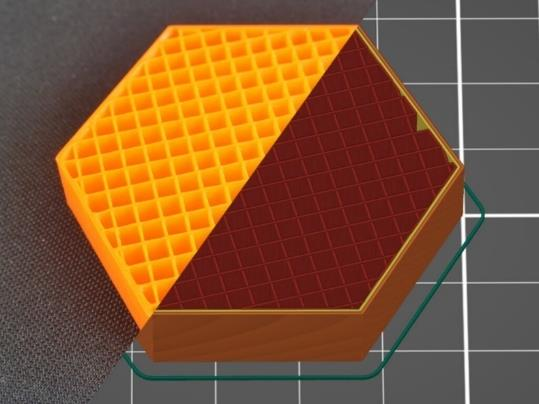



Az egyenes kitöltés **az egyik alapvető kitöltési minta.** Téglalap alakú rácsot hoz létre úgy, hogy egy réteget nyomtat egy irányba, majd a következő réteget 90°-os szögben, és így tovább. Így **kevesebb szálat** fogyaszt, és **az anyag nem halmozódik fel a kereszteződéseknél** \(ellentétben a ráccsal\). Ez az egyik **leggyorsabb nyomtatáskitöltés**.

Ez a kitöltési típus az egyetlen **a 100%-os nyomtatási kitöltéshez ajánlott**. Ha a profilban más kitöltési típus van beállítva, és a kitöltési százalékot 100%-os sűrűségre állítja, a **SuperSlicer** automatikusan egyenesre váltja a kitöltési típust.



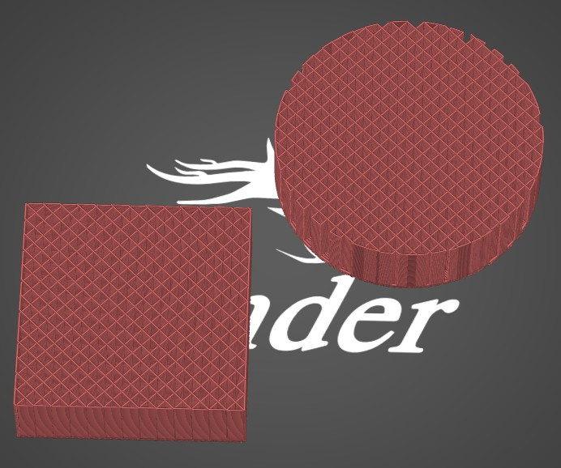



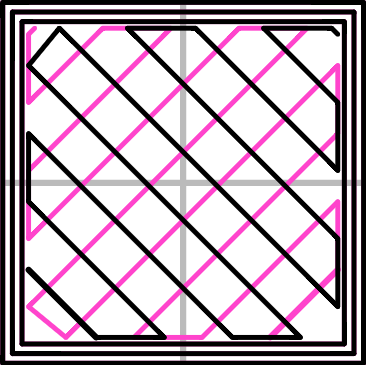









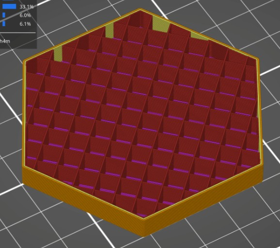



A monoton kitöltés az egyik alapvető kitöltési minta. Egyenes rácsot hoz létre úgy, hogy egy réteget nyomtat egy irányba, majd a következő réteget 90°-os szögben, és így tovább. Így kevesebb szál fogy, és az anyag nem halmozódik fel a kereszteződésekben \(ellentétben a ráccsal\).



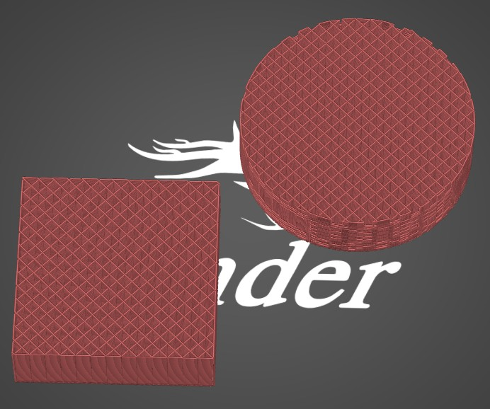









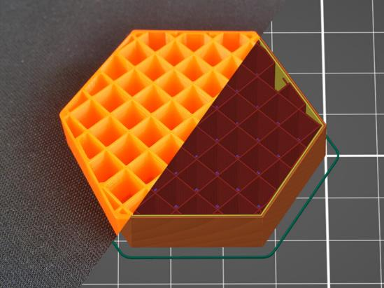



Ez az egyik legegyszerűbb és leggyorsabb **kitöltési változat**. Az egyenes töltéssel ellentétben **mindkét irányban \(90°-os elfordulással\) nyomtatódik minden egyes rétegnél**. Ennek eredményeként az anyag ott halmozódik fel, ahol az utak keresztezik egymást. A rácsos töltés **erősebb** \(és jobb a rétegtapadása\), mint az egyenes töltés, azonban néha **idegesítő zajt** és akár **nyomtatási hibát** is okozhat, amikor a fúvóka olyan kereszteződéseken halad át, ahol anyag halmozódik fel.

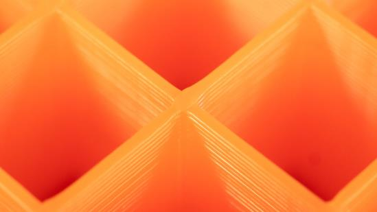

A kitöltőanyag nyomtatásának módja miatt a pályák keresztezik egymást, és ez az anyag felhalmozódását okozza ezeken a területeken. Néha hallani fog egy sajátos hangot, amikor a fúvóka eléri ezeket a területeket. Ez akár a nyomtatás meghiúsulását is okozhatja.



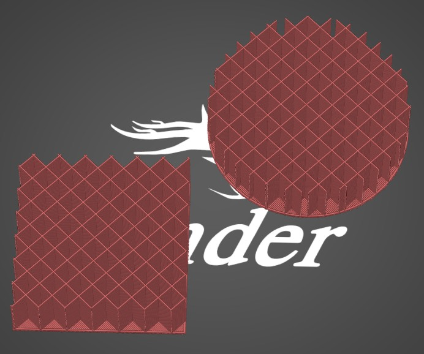









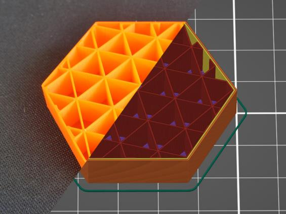



Ez a kitöltés ugyanúgy működik, mint a rácsos kitöltés - az útvonalak metszik egymást a rétegen, azonban ezúttal **három irányban** vannak nyomtatva, és háromszög alakú struktúrát alkotnak. Az anyagfelhasználás és az idő nem azonos a rácshálóval.



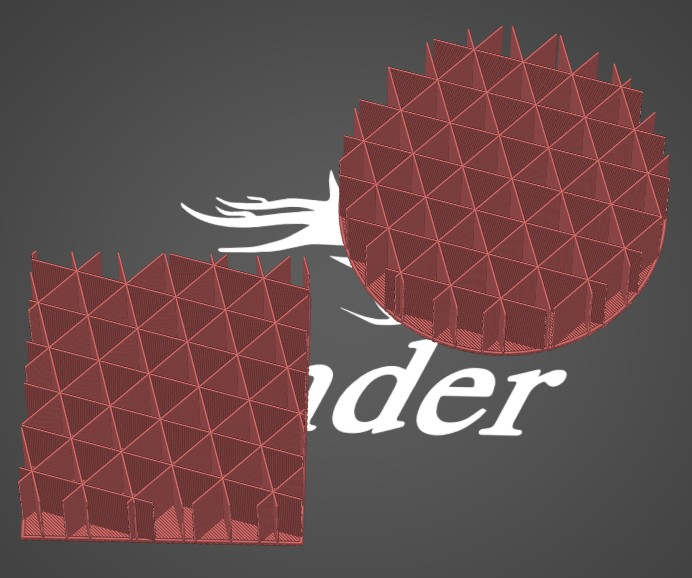









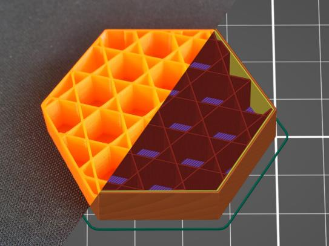



A csillagkitöltés **háromszögeken alapul**, de **az útvonalakat úgy módosítjuk**, hogy hatágú csillagokat alkossanak. Ez a kitöltés ismét az ugyanazon a rétegen belüli vonalak metszéséből jön létre. Az anyag- és időfelhasználás ugyanaz, mint az előző töltésnél.













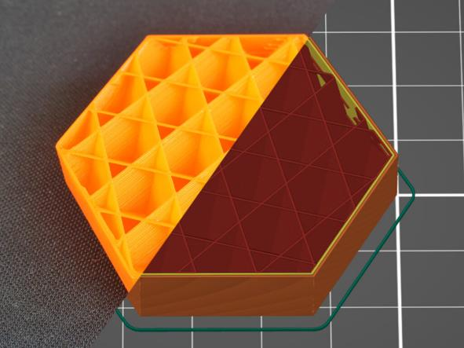



Ez megint egy töltés, amely ugyanazon a rétegen belüli, egymást metsző útvonalakkal van kitöltve. A fent leírt töltelékekkel ellentétben azonban **kockákat** készít, amelyeknek az egyik sarka lefelé mutat. Ily módon **légzsebek sokaságát** hozza létre, amelyek hőszigetelésre használhatók, vagy lehetővé teszik, hogy egy tárgy lebegjen a vízen \(vízálló szálakkal, például PETG-vel\). A nyomtatási idő és a szálfogyasztás nem különbözik a korábbi töltésekhez képest.



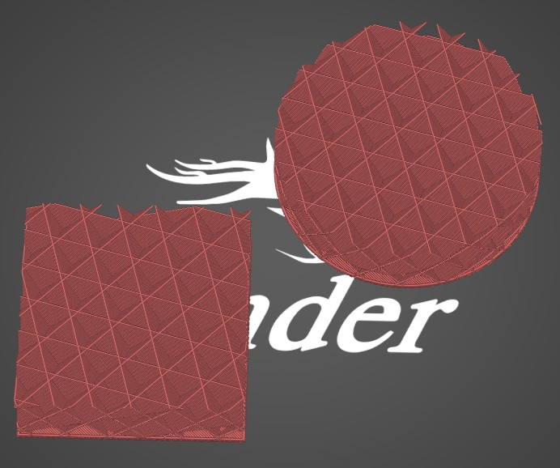









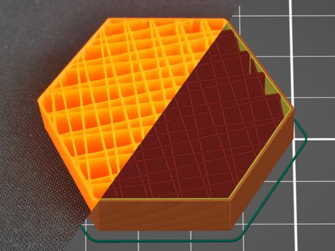



A vonal \(lineáris\) kitöltés egyike azoknak, amelyek **nem rendelkeznek metsző pályákkal** egy rétegen. Útvonalai hasonlóak az egyenes kitöltés útvonalaihoz, de **nem párhuzamosak** egymással. Ehelyett hegyesszögben vannak nyomtatva. Nem meglepő, hogy ez a töltés **hasonlóan működik, mint az egyenes töltés** a nyomtatási idő és az anyagfelhasználás tekintetében.



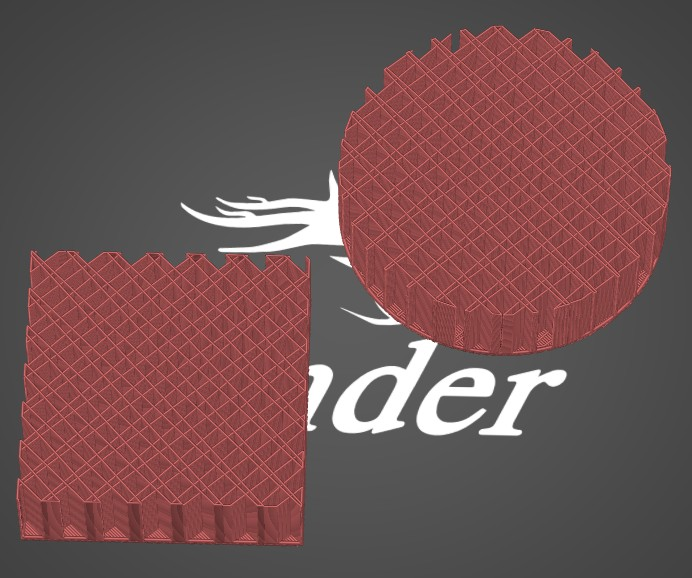



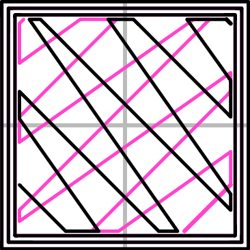









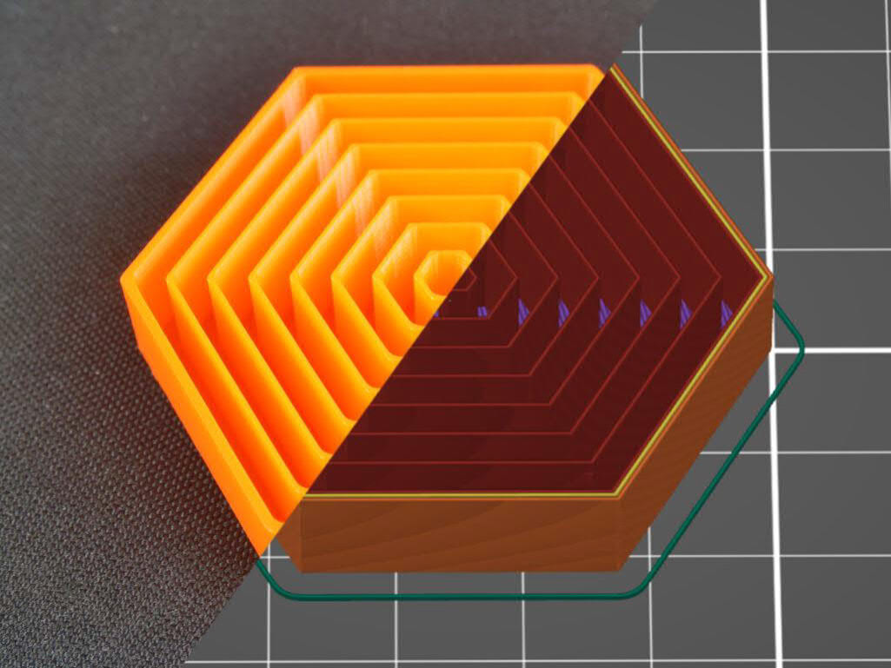



A koncentrikus kitöltés **meghúzza a modell kerületi vonalait**, majd egyre jobban összezsugorítja azokat a középpont felé. Más szóval: ha egy hengert nyomtatunk, a koncentrikus kitöltés **koncentrikus köröket** fog létrehozni a hengeren belül. Ez hasznos lehet **átlátszó alkatrészek vagy rugalmas modellek** \(pl. RC autó gumiabroncsok\) esetén. A fő hátránya a nyomtatási idő. Az anyagfelhasználás nem nagyobb, mint a korábbi típusú töltőminták esetében.



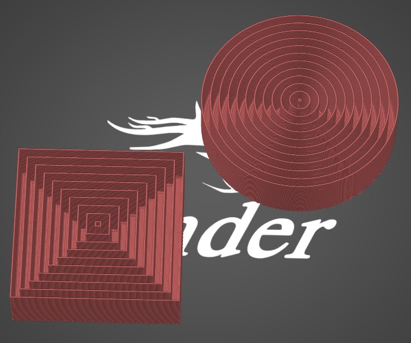

















Ez a kitöltés egy **hatszögekből álló rácsot nyomtat.** Fő előnye a **mechanikai szilárdság** és az optimalizált, útkereszteződések nélküli pályák. Fő hátránya a **magas anyagfelhasználás** \(kb. 25%-kal több\) a többi töltelékhez képest, és a nyomtatási idő **kétszer olyan hosszú** lehet a fent leírt lehetőségekhez képest.



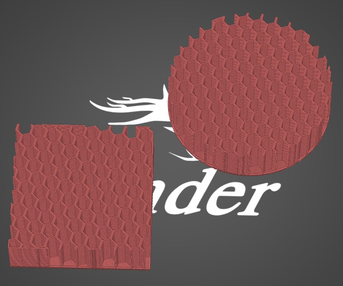



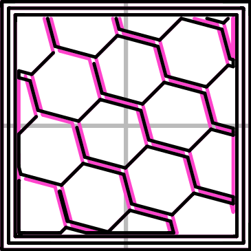



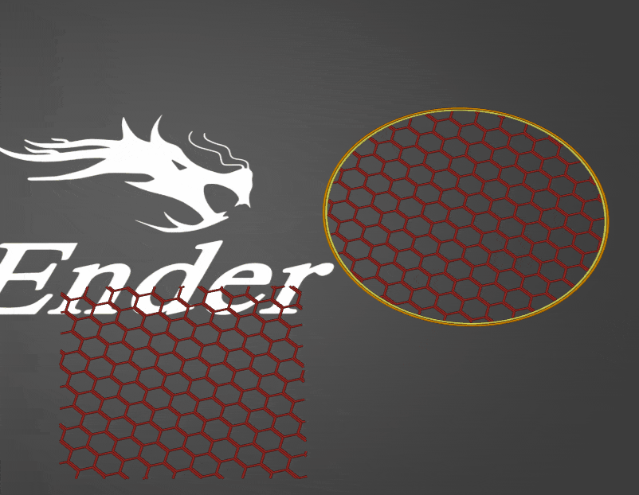





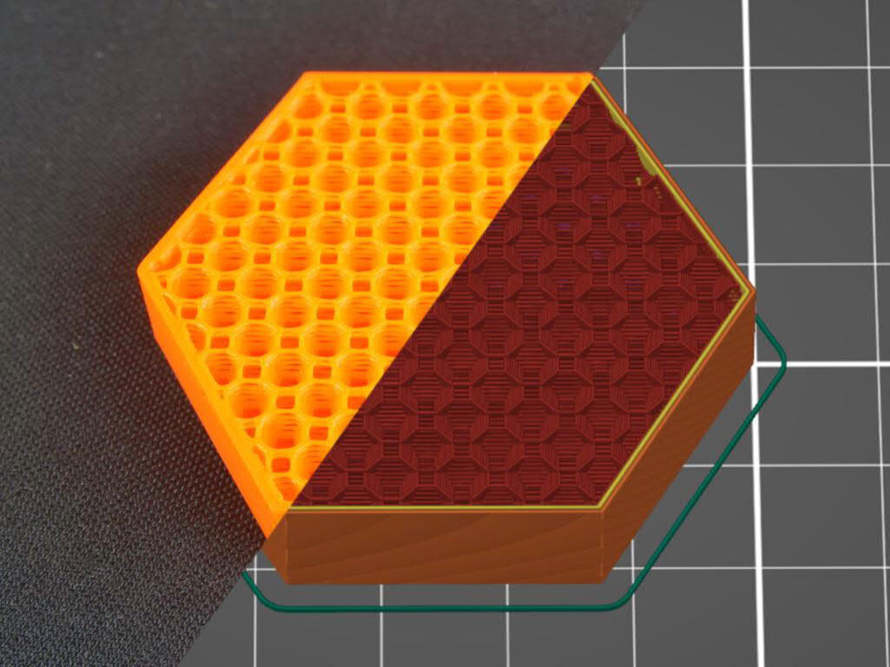



A 3D-s méhsejtek kis és nagy négyzeteket és nyolcszögeket nyomtatnak, hogy időszakosan növekvő és csökkenő vastagságú oszlopokat hozzanak létre. Ez a töltés **nem tartalmaz metsző vonalakat** egy rétegen, azonban az útvonalak kialakításának módja miatt **kis hézagokat hoz létre a rétegek között.** Az anyagfelhasználás és a nyomtatási idő kissé rosszabb a normál méhsejtmintához képest.



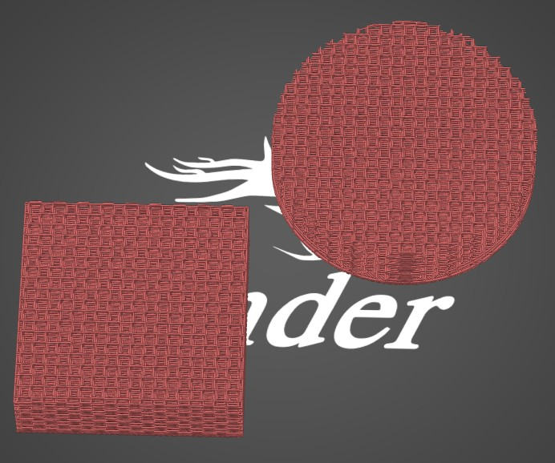









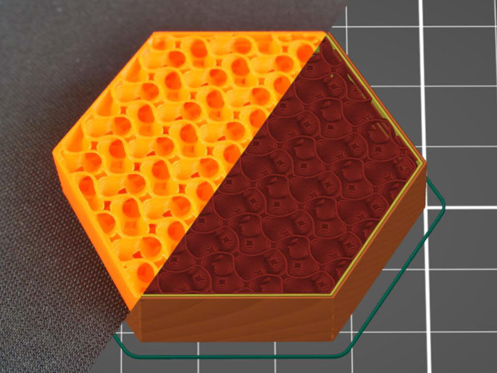



A gyroid kitöltés a kedvencünk és egyben **az egyik legjobb kitöltés.** Ez azon kevés 3D szerkezetek egyike, amely minden irányban nagyon jó alátámasztást biztosít. Ezen kívül igazán **gyors nyomtatás, anyagot takarít meg, vonalak nem keresztezik egymást egy rétegen belül, és jól néz ki**. A töltés különleges formája lehetővé teszi a töltés gyantával vagy bármilyen más folyadékkal való feltöltését.



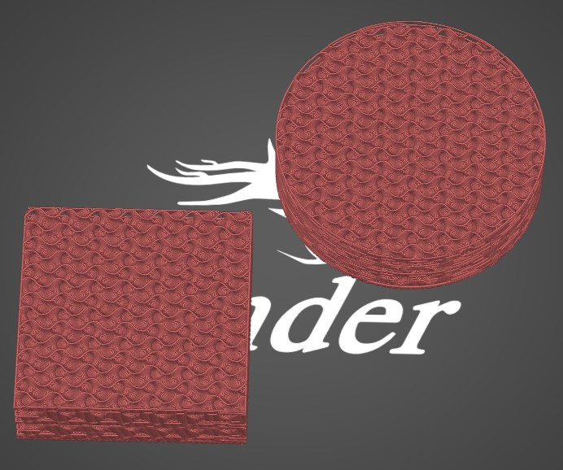



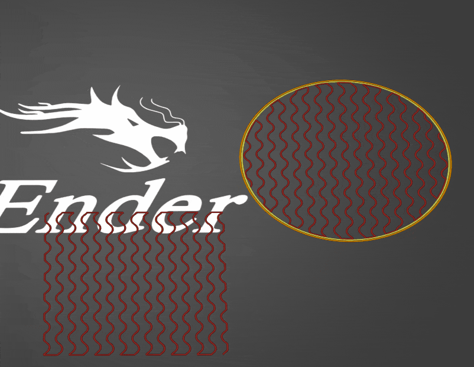





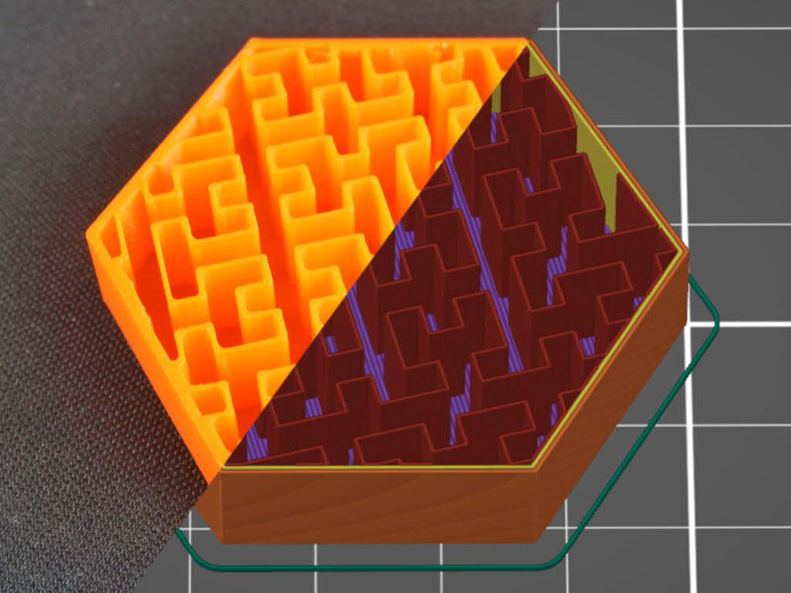



A Hilbert-görbe egy téglalap alakú labirintust rajzol a modellben. Ennek a töltésnek a fő előnye az **eredeti megjelenés,** valamint az, hogy könnyen **betölthető gyantával** vagy más folyadékkal - a modell több nagy üregre oszlik, nem pedig apró "buborékok" sokaságára. Ennek a tölteléknek a fő hátránya a hosszú nyomtatási idő, amely a méhsejtes és az egyenes töltelék között van. A Hilbert-görbe anyagfelhasználása megegyezik az egyenes töltés anyagfelhasználásával.



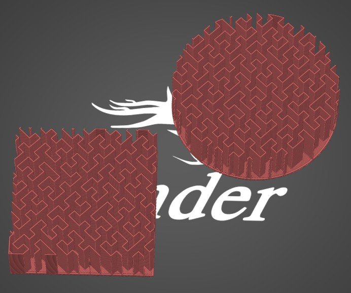



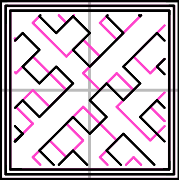









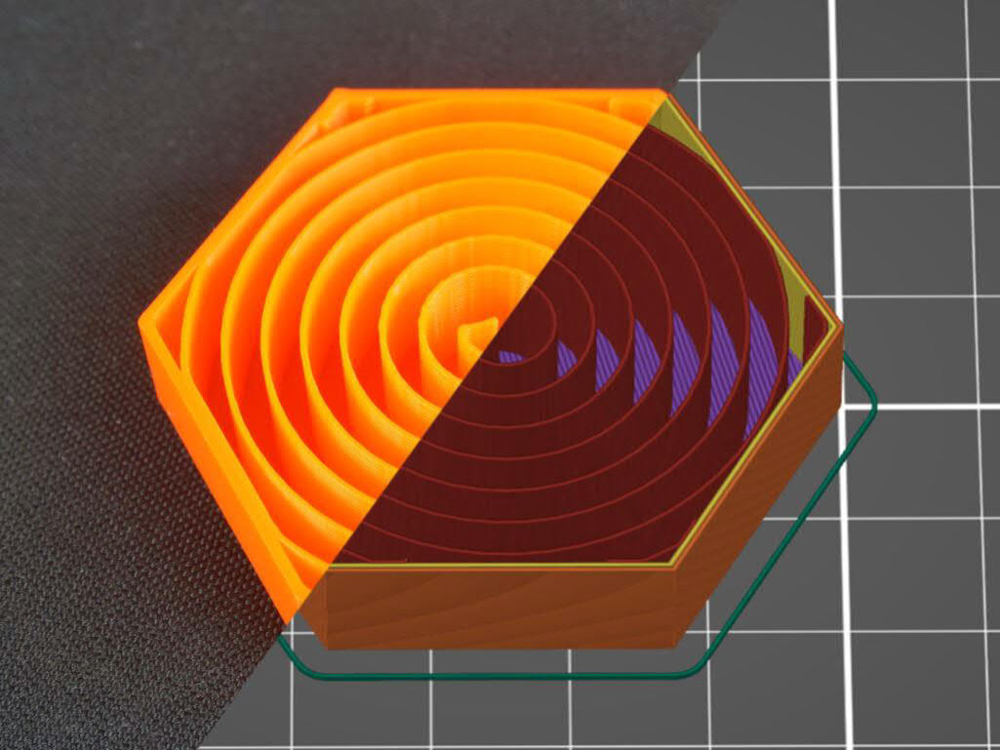



Ez a spirális kitöltés ismét **könnyebbé teszi a folyadékkal való feltöltést.** Ez az egyszerű forma **anyagot és időt takarít meg** \(az egyenes kitöltéshez\) képest. A koncentrikus töltéshez hasonlóan az íves akkordok is **segítenek a modell rugalmasságában**, ha rugalmas szálból nyomtat.



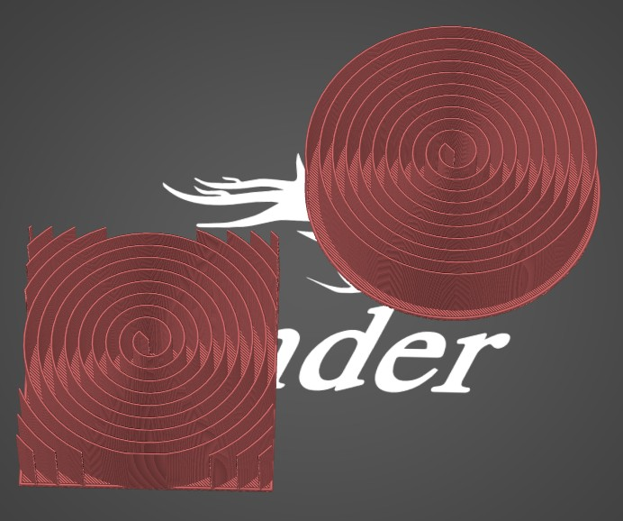



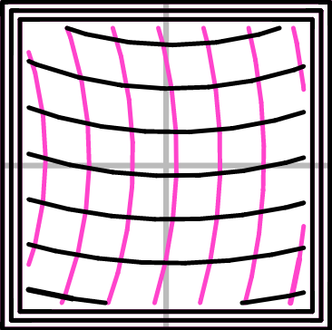



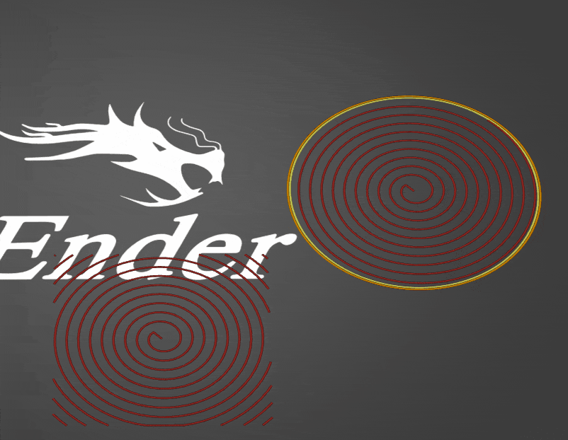





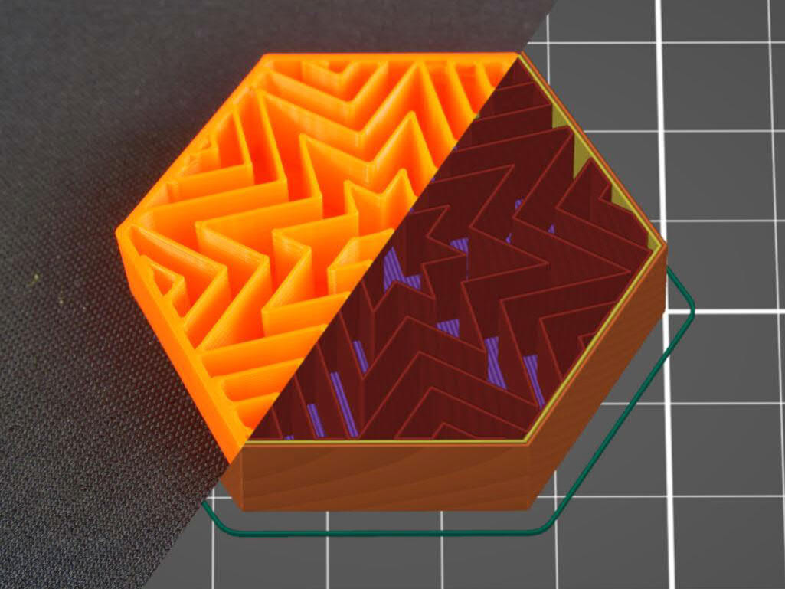



A nyolcágú spirálminta lehetővé teszi, hogy a tárgyat **könnyen meg lehessen tölteni folyadékkal** az ilyen típusú töltés által létrehozott nagy rekeszeknek köszönhetően. A nyolcszögletű spirálmintázat szintén előnyös bizonyos modellek **hajlékonyságához**, de különösen érdekes **esztétikai okokból** és a felső rétegnek nyújtott támasza miatt. Az anyagfelhasználás megegyezik az archimédeszi akkordokéval, de a nyomtatási idő valamivel hosszabb.



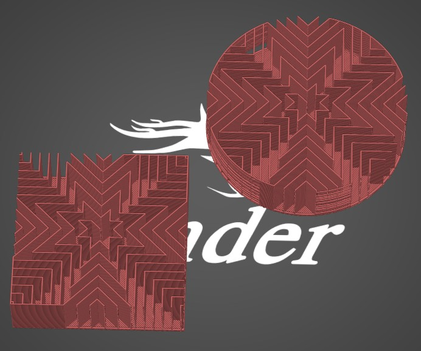



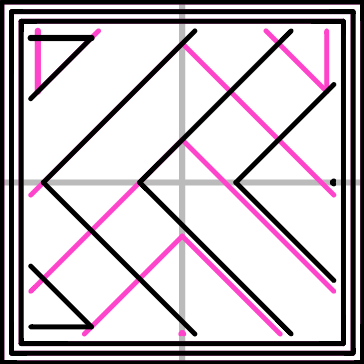













A elszórt egyenes vonalú véletlenszerű lineáris kitöltést hoz létre, amely kevesebb szálból áll, és az anyag nem halmozódik fel a kereszteződéseknél. Alacsony sűrűségben alkalmazva jó térlefedettséget és ezáltal jó alátámasztást biztosít a felső rétegek számára. Az egyenes kitöltéshez hasonlóan ez is az egyik leggyorsabb nyomtatási kitöltés.













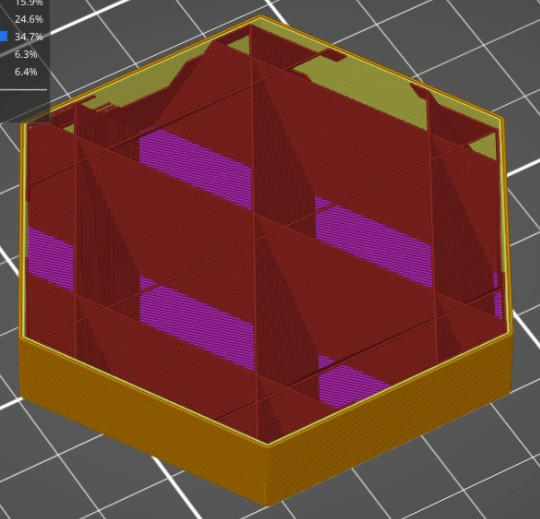



Az alkalmazkodó kocka kitöltés **azon az elven működik, mint a kocka kitöltés:** olyan kockákat tartalmaz, amelyek egyik sarka lefelé néz, és ugyanazon a rétegen belül metszik egymást a vonalak. Van azonban egy nagy előnye: az egyszerű kocka alakú kitöltéssel ellentétben ez a minta **sűrűbbé teszi a kitöltést, ahogy közeledik a modell szélei felé,** és nagy üregeket hagy középen. **Az anyagfogyasztás** körülbelül ¼-ével kevesebb, mint az egyenes töltésnél.

Az alkalmazkodó kocka kitöltés egy [**octree**](https://fr.wikipedia.org/wiki/Octree) azon celláinak finomításával működik, amelyek egy háromszög objektumot tartalmaznak. Minden töltésvonalhoz rögzítőket adunk hozzá. Ezáltal a töltés robusztusabbá válik, és stabilizálja az extrudálási áramlást a töltősor elején. Alapvetően ez a kitöltés a legközelebbi faltól való távolságtól függően válik többé-kevésbé sűrűvé. Ez különösen hasznos a nagy belső térfogatú, nagyméretű nyomatok esetében. Ez rövidebb nyomtatási időt és alacsonyabb szálfogyasztást eredményez, miközben a felső réteg jó alátámasztása és ugyanazok a mechanikai tulajdonságok maradnak meg.



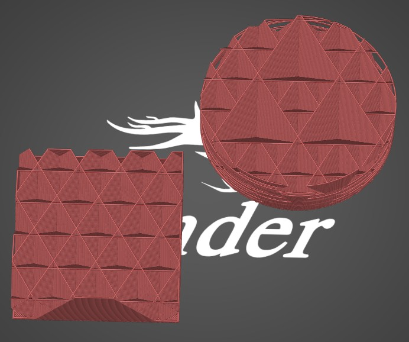













A kocka támogatás kitöltés ugyanúgy működik, mint az előző, egy különbséggel: a **kitöltés sűrűsége csak a Z tengelyen növekszik.** Elsődleges funkciója a felső rétegek **támogatása** a lehető legtöbb anyag megtakarításával, így nem javítja a modell mechanikai tulajdonságait. Ennek a kitöltésnek az anyagfogyasztása és nyomtatási ideje messze a legérdekesebb az összes támogatott kitöltés közül.



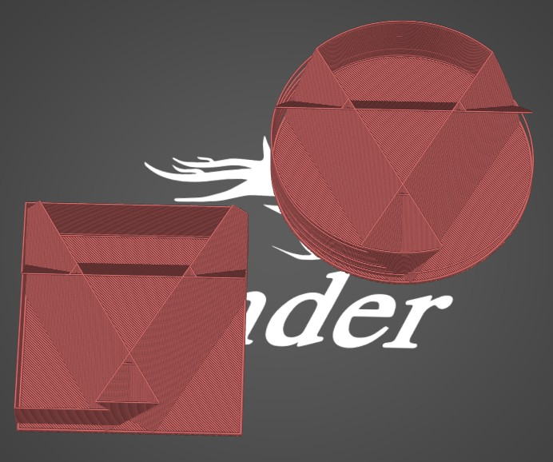



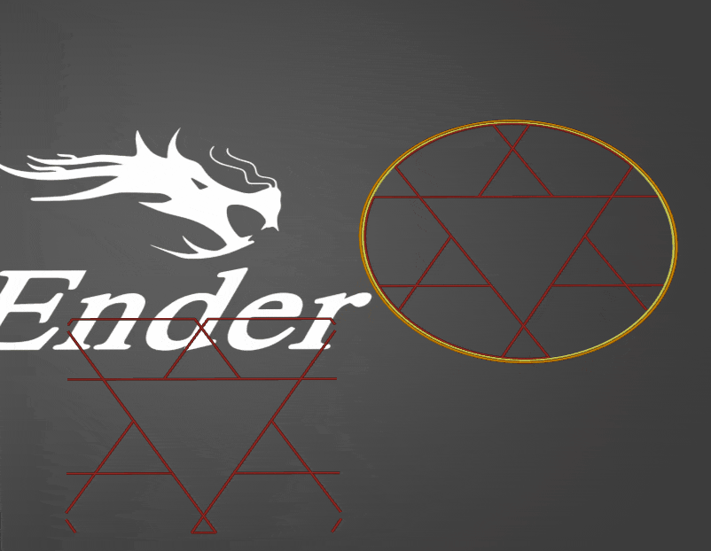



**Javasolt kitöltési minta: Gyroid kitöltés**

A gyroid kitöltés az egyik legsokoldalúbb kitöltő minta.

* Háromdimenziós - ami **egyenletes szilárdságot biztosít minden irányban**.
* Elég **gyorsan kinyomtatható**
* Nem **keresztezi** ugyanazt a réteget.
* **Jó szilárdság/tömeg arány**.
* \(Véleményünk szerint\) **igazán esztétikus**

További információ a Gyroid töltésről [https://mathcurve.com/surfaces/Gyroide/gyroide.shtml](https://mathcurve.com/surfaces/Gyroide/gyroide.shtml)

#### _Felső kitöltési minta_

Választhat olyan egyéni kitöltési mintát, amely csak a legfelső látható rétegre vonatkozik, az alatta lévő szomszédos egyszínű rétegekre nem.

#### _Alsó kitöltési minta_

Választhat olyan egyéni kitöltési mintát, amely csak az alsó látható réteget érinti, a felette lévő szomszédos egyszínű rétegeket nem.

A következő modellváltozatok állnak rendelkezésre:

<table>
  <thead>
    <tr>
      <th style="text-align:left"><b>                                           Le&#xED;r&#xE1;s</b>
      </th>
      <th style="text-align:left">K&#xE9;p</th>
    </tr>
  </thead>
  <tbody>
    <tr>
      <td style="text-align:left">
        
<b>Egyenes vonal&#xFA;:</b>
        

        
Ism&#xE9;tlem, ez a legelterjedtebb (&#xE9;s legalapvet&#x151;bb) t&#xED;pus&#xFA;
          fels&#x151; t&#xF6;lt&#xE9;s. A nyomtat&#xE1;si &#xFA;tvonalak a teljes
          r&#xE9;tegen cikcakkos mint&#xE1;zatban helyezkednek el. Ez azonban a legegyszer&#x171;bb
          kit&#xF6;lt&#xE9;s, &#xE9;s <b>nem ny&#xFA;jt semmilyen el&#x151;nyt</b> (l&#xE1;sd:
          Monoton kit&#xF6;lt&#xE9;s).

      </td>
      <td style="text-align:left">
        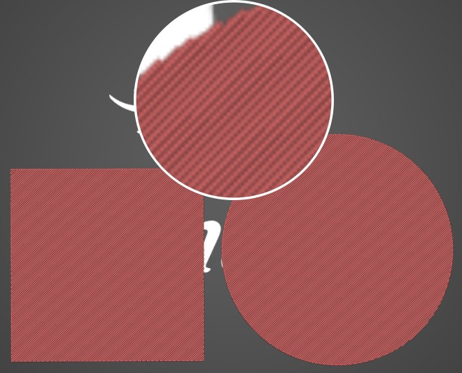
      </td>
    </tr>
    <tr>
      <td style="text-align:left">
        
<b>Monoton:</b>
        

        
A monoton kit&#xF6;lt&#xE9;si minta p&#xE1;rhuzamos vonalakkal t&#xF6;lti
          ki a fels&#x151; (vagy als&#xF3;) r&#xE9;teget, ugyan&#xFA;gy, mint az
          egyenes kit&#xF6;lt&#xE9;si t&#xED;pus. Ez a kit&#xF6;lt&#xE9;s azonban <b>fejlett &#xFA;tvonaltervez&#xE9;st haszn&#xE1;l.</b> Az
          egyenes kit&#xF6;lt&#xE9;ssel ellent&#xE9;tben ez mindig balr&#xF3;l jobbra
          nyomtat, soha nem az ellenkez&#x151; ir&#xE1;nyba. Ez az egyszer&#x171;
          rendszer <b>homog&#xE9;n kit&#xF6;lt&#xE9;st eredm&#xE9;nyez, cs&#xFA;nya dudorok n&#xE9;lk&#xFC;l</b>,
          amelyek m&#xE1;s kit&#xF6;lt&#xE9;sekn&#xE9;l &#xE1;ltal&#xE1;ban akkor
          fordulnak el&#x151;, amikor a bal-jobb p&#xE1;ly&#xE1;k tal&#xE1;lkoznak
          a jobb-bal p&#xE1;ly&#xE1;kkal. Ezt a l&#xE1;tsz&#xF3;lag egyszer&#x171;
          m&#xF3;dszert meglep&#x151;en neh&#xE9;z integr&#xE1;lni. A Raad Salman
          &#xE1;ltal le&#xED;rt <b>Ant Colony System</b> v&#xE1;ltozatot haszn&#xE1;ltuk.

      </td>
      <td style="text-align:left">
        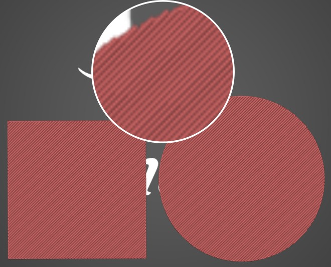
      </td>
    </tr>
    <tr>
      <td style="text-align:left"><b>Monotonikus</b>
      </td>
      <td style="text-align:left">
        
      </td>
    </tr>
    <tr>
      <td style="text-align:left">
        
<b>Koncentrikus:</b>
        

        
A koncentrikus kit&#xF6;lt&#xE9;si minta a ker&#xFC;let alakj&#xE1;t m&#xE1;solja.
          Ha egy hengert nyomtat, akkor koncentrikus k&#xF6;r&#xF6;ket rajzol a modell
          tetej&#xE9;re.

      </td>
      <td style="text-align:left">
        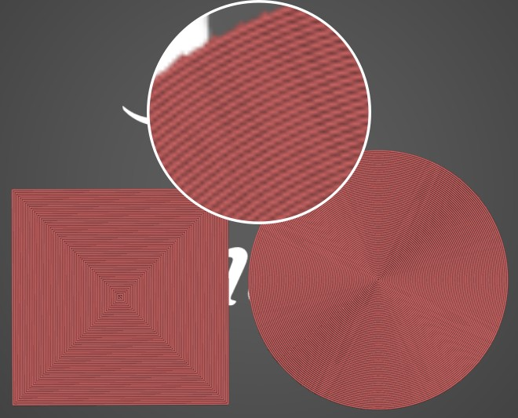
      </td>
    </tr>
    <tr>
      <td style="text-align:left"><b>Koncentrikus (kit&#xF6;lt&#xF6;tt)</b>
      </td>
      <td style="text-align:left">
        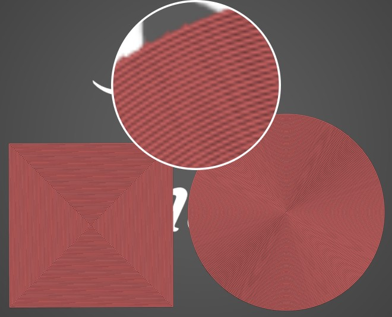
      </td>
    </tr>
    <tr>
      <td style="text-align:left">
        
 <b>Hilbert-g&#xF6;rbe:</b>
        

        
Ez els&#x151;sorban eszt&#xE9;tikai t&#xF6;lt&#xE9;s. Ha a bels&#x151;
          oldalra nyomtatjuk, a Hilbert-g&#xF6;rbe minta t&#xE9;glalap alak&#xFA;
          form&#xE1;kat hoz l&#xE9;tre, m&#xED;g a fels&#x151; r&#xE9;teg ink&#xE1;bb
          egy fonott kos&#xE1;rra hasonl&#xED;t. Ez a kit&#xF6;lt&#xE9;s az &#xF6;sszetett
          forma miatt jelent&#x151;sen megn&#xF6;veli a nyomtat&#xE1;si id&#x151;t.

      </td>
      <td style="text-align:left">
        
      </td>
    </tr>
    <tr>
      <td style="text-align:left">
        
<b>Arkhim&#xE9;d&#xE9;szi akordok:</b>
        

        
Az archim&#xE9;deszi akkordokn&#xE1;l a legfels&#x151; fel&#xFC;let spir&#xE1;lisan
          van nyomtatva. Ez a kit&#xF6;lt&#xE9;s id&#x151;t takar&#xED;that meg bizonyos
          mint&#xE1;k nyomtat&#xE1;sakor.

      </td>
      <td style="text-align:left">
        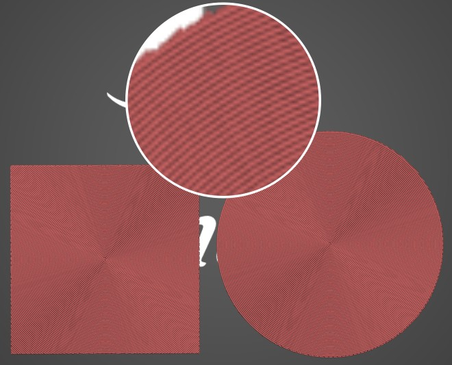
      </td>
    </tr>
    <tr>
      <td style="text-align:left">
        
<b>Spir&#xE1;lis oktagram:</b>
        

        
Ezt a kit&#xF6;lt&#xE9;st m&#xE1;r kor&#xE1;bban le&#xED;rtuk. Legink&#xE1;bb
          eszt&#xE9;tikai okokb&#xF3;l &#xE9;rdekes, de bonyolult form&#xE1;ja megn&#xF6;veli
          a nyomtat&#xE1;si id&#x151;t.

      </td>
      <td style="text-align:left">
        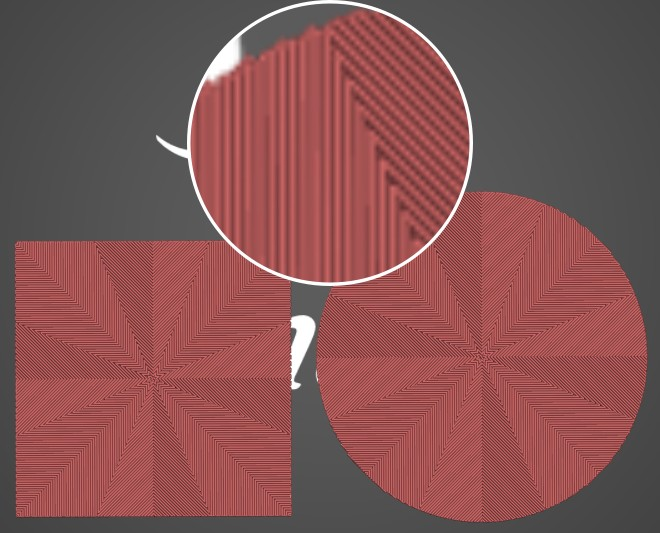
      </td>
    </tr>
    <tr>
      <td style="text-align:left"><b>F&#x171;r&#xE9;szfog</b>
      </td>
      <td style="text-align:left">
        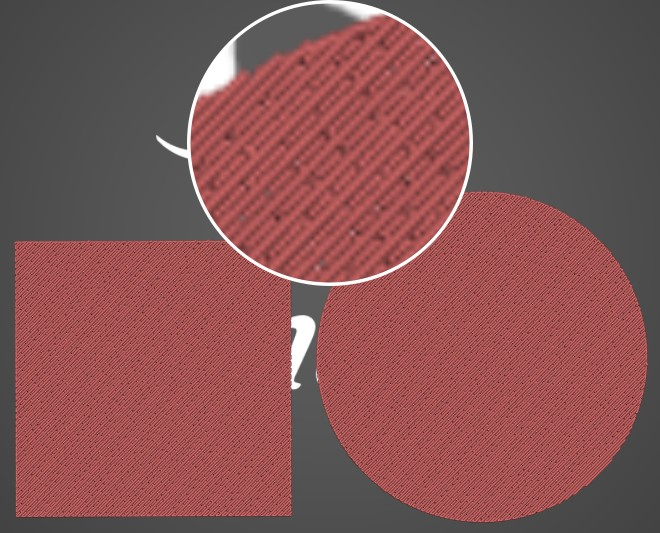
      </td>
    </tr>
    <tr>
      <td style="text-align:left">
        
<b>Vasal&#xE1;s:</b>
        

        
A <b>vasal&#xE1;s</b> egy 90&#xB0;-os &#xE1;tmenettel eg&#xE9;sz&#xED;ti
          ki a m&#xE1;r nyomtatott r&#xE9;teget. Ez a kieg&#xE9;sz&#xED;t&#x151;
          menet nagyon kis vonalsz&#xE9;less&#xE9;g&#x171;, &#xE9;s a nyomtat&#xE1;s
          a t&#xF6;lt&#xE9;si sebess&#xE9;ggel megegyez&#x151; sebess&#xE9;ggel t&#xF6;rt&#xE9;nik.A
          sim&#xED;t&#xE1;s lehet&#x151;v&#xE9; teszi, hogy egyenes vonal&#xFA; mint&#xE1;t
          nyomtassunk a nyomtatott r&#xE9;tegre.

        
Ennek k&#xE9;t f&#x151; el&#x151;nye van:

        <ul>
          <li>A m&#xE1;r kinyomtatott r&#xE9;teget &#xFA;gy olvasztja meg, hogy t&#xF6;bbsz&#xF6;r
            &#xE1;tvezetik egy forr&#xF3; f&#xFA;v&#xF3;ka alatt. Mivel a halad&#xE1;si
            sebess&#xE9;g nagyon alacsony &#xE9;s a vonalsz&#xE9;less&#xE9;g nagyon
            kicsi, a f&#xFA;v&#xF3;ka jelent&#x151;sen felmeleg&#xED;ti a fel&#xFC;letet.
            A f&#xFA;v&#xF3;ka lapos r&#xE9;sze ezut&#xE1;n sim&#xE1;n felsz&#xED;nre
            ker&#xFC;l.</li>
          <li>Kit&#xF6;lti a m&#xE1;r kinyomtatott r&#xE9;teg h&#xE9;zagait. A sim&#xED;t&#xF3;
            mozg&#xE1;s a r&#xE9;teggel azonos magass&#xE1;gban van. Kevesebb &#xE1;raml&#xE1;ssal
            rendelkezik, mint a szil&#xE1;rd r&#xE9;teg, de m&#xE9;g mindig nagyon
            alacsony az &#xE1;raml&#xE1;s. Minden alkalommal, amikor a f&#xFA;v&#xF3;ka
            &#xE1;thalad a fel&#xFC;let egy egyenetlens&#xE9;g&#xE9;n, a f&#xFA;v&#xF3;k&#xE1;ban
            l&#xE9;v&#x151; anyag az adott t&#xE9;rbe &#xE1;ramlik.</li>
        </ul>
      </td>
      <td style="text-align:left">
        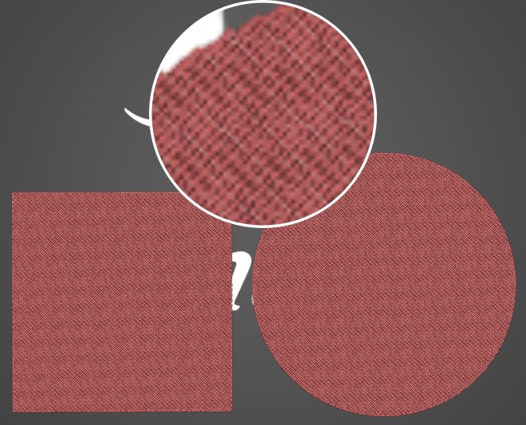
      </td>
    </tr>
  </tbody>
</table>

Megjegyzés: Elméletileg az alsó és felső Lineárisan igazított kitöltési módnak lehetővé kellene tennie a kitöltést a 2 réteg közötti orientációváltás nélkül, de a tesztelt 2.3.0-s verziókon a mód nem változott a standard lineárishoz képest.

### További információk a kitöltéséről

Bizonyára már észrevette, hogy a **SuperSlicer új verziója \(2.3\)** új kitöltési mintákkal bővült. Most, hogy ennyi lehetőség van, talán még egy kicsit elveszettnek is érezheti magát a lehetőségek között. Melyik kitöltést válasszam? Van olyan univerzális minta, amely minden modellnél működik? Vagy egy adott helyzethez kell választanom egy konkrétat? Lássuk, mit lehet tenni a megfelelő típusú kitöltés kiválasztásával és beállításainak módosításával.

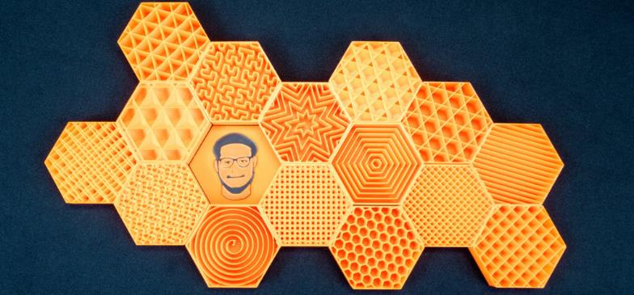

#### _Mi a kitöltés és mire használható?_

Először is, nézzük át gyorsan, mi is az a kitöltés, és miért fontos. Ha Ön már profi 3D nyomtató, akkor ezt a fejezetet valószínűleg kihagyja, de nem árt, ha leporolja az alapokat, nem igaz?

A 3D nyomtatott modelleket ritkán nyomtatják 100%-os kitöltéssel vagy teljesen üregesen. Ehelyett egy olyan módszert használunk, amely **kitölti a tárgy belsejét egy tartószerkezettel.** Ez a módszer segít megszilárdítani a modellt, és **megakadályozza, hogy hézagok és lyukak keletkezzenek a tárgy felületén.** A teljes modellek \(100%-os kitöltés\) száligényesek és időigényesek. Emellett a szilárd modellek legtöbbször nem rendelkeznek jobb mechanikai tulajdonságokkal, mint a kevésbé sűrű kitöltésű modellek. Ha úgy dönt, hogy kitöltés nélkül nyomtatja ki a modellt, fennáll a veszélye, hogy a modell felülete sérül, kisebb hézagok, esetleg nagyobb lyukak is keletkezhetnek. Elég nyilvánvalónak tűnik, hogy a legjobb megoldás a kettő között van. A jó kitöltési beállításokkal **sok anyagot és időt takaríthat meg**, de érdekes mintákat is létrehozhat a felületen.

A legtöbb esetben nagyon kevés értelme van a 40%-nál nagyobb töltési sűrűség beállításának. Tesztjeink azt mutatták, hogy **a legjobb sűrűség beállítása 10-20% körül van,** és ezt az értéket adtuk meg a **SuperSlicer** profiljainkban. A 10-20% az ideális egyensúlyt jelenti a robusztusság, a nyomtatási megbízhatóság, a nyomtatási idő és az anyagfelhasználás között. Természetesen egyes tárgyak esetében elegendő lehet az 5%-os \(vagy annál kisebb\) kitöltés, különösen a **PLA**-ban nyomtatott nagyméretű egyedi tárgyak esetében. A 20%-nál nagyobb töltöttséggel nagyobb szilárdságot érhet el. Ugyanez a hatás azonban több kerület hozzáadásával is elérhető \([Nyomtatási beállítások/Kerületek és héj\)](./#kerueletek-es-hej). A különböző nyomtatási beállítások használatával nemcsak a belső szerkezetet és a mechanikai tulajdonságokat, hanem a nyomtatási sebességet, az anyagfelhasználást és a tárgy felületét is megváltoztathatja.

Mielőtt rátérnénk a speciális beállításokra, gyorsan nézzük át egyenként a meglévő kitöltési típusokat és azok tulajdonságait.

#### _Kitöltő minták és tulajdonságaik_

A kitöltő minták listája egyre bővül, és nehéz lehet kiválasztani a megfelelő típust. Bár az lehet a benyomása, hogy elsősorban a külsőségek különböztetik meg őket, ennek éppen az ellenkezője igaz. Például néhány kitöltés lehetővé teszi számunkra, hogy sok anyagot és időt takarítsunk meg, néhányat folyadékkal lehet kitölteni, stb....

Bizonyos modelltípusok jobban megfelelnek egy adott mintának, például az organikus és a mechanikus típusok között. Az ábra azt mutatja, hogy a méhsejtes kitöltés jobban megfelelhet ennek a mechanikus alkatrésznek, mivel minden egyes hatszög minden rétegben ugyanahhoz a mögöttes mintához kötődik, erős függőleges szerkezetet alkotva.

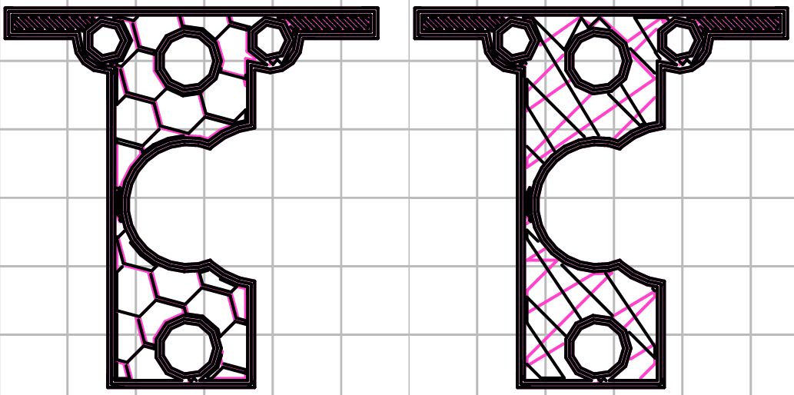

A legtöbb modell csak alacsony sűrűségű kitöltést igényel, mivel ha mondjuk 50%-nál nagyobb sűrűségű kitöltést biztosítunk, akkor egy nagyon szorosan tömörített modellt kapunk, amely a szükségesnél több anyagot használ fel. Emiatt a minták általános tartománya 10% és 30% között van, azonban a modell követelményei határozzák meg, hogy melyik sűrűség a legjobb. Az ábra azt mutatja, hogyan változnak a minták a sűrűség növekedésével.

#### _A felső és alsó réteg kitöltésének típusai_

A kitöltés szerkesztése nem csak az objektum belső részeinek kitöltési típusának kiválasztásáról szól. A felső és alsó rétegek kitöltési típusait is megváltoztathatja, hogy érdekes eredményeket érjen el. Ez a **Nyomtatási beállítások/Kitöltés/felső \(alsó\) kitöltés** lapon állítható be. A felső vagy alsó kitöltés megváltoztatása azonban **esztétikai változásokat** okoz, és nem javítja a modell mechanikai tulajdonságait.

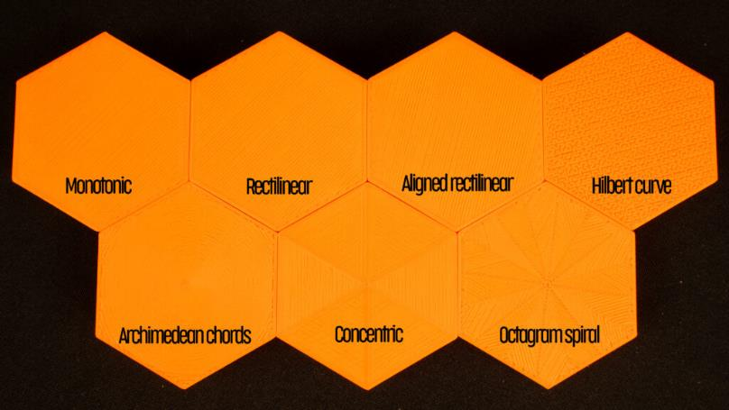

Az alábbiakban a felső és alsó kitöltések mind a hét típusát 80%-os áramlással nyomtatjuk, hogy kiemeljük a mintákat.

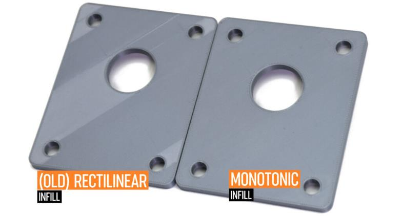

\*\*\*\*

