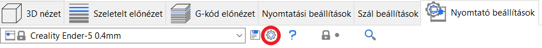
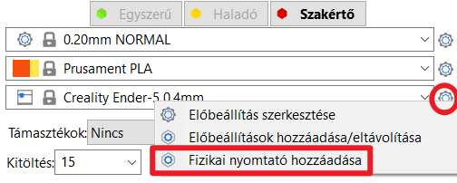
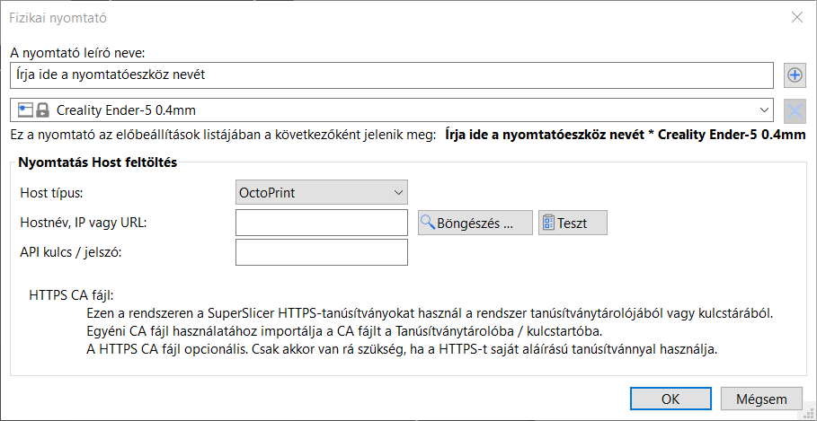
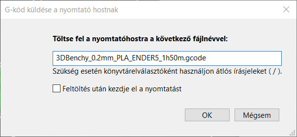
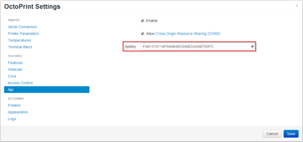

# Fizikai nyomtató hozzáadása

## Fizikai nyomtatók \(hálózati beállítások\)

A SuperSlicer a nyomtató hálózati kapcsolatának beállításait a nyomtató profiljában tárolja. Ez bizonyos esetekben problémát jelenthet \(például ha több nyomtatója van ugyanazzal a profillal\). Az új verzióval a SuperSlicer az új fizikai nyomtatóprofilokban elválasztja a fizikai nyomtatócsatlakozás beállításait a nyomtatóprofiloktól.

Tehát a 2.3.0 verzió óta, ha az [Octoprint](https://octoprint.org/) vagy a [Duet](https://www.duet3d.com/) programot használja, akkor a SuperSlicerből közvetlenül a nyomtatóra küldhet G-kódokat. Válassza a **Nyomtatóbeállítások** - **Fizikai nyomtató hozzáadása** \(fogaskerék ikon a nyomtató nevétől jobbra\)

Vagy bármelyik nézetben a jobb oldali nyomtató lista fogaskerekére kattintva fizikai nyomtató hozzáadása.

### Gazdatípus: Octoprint/Duet/FlashAir/Astrobox/Repetier/Klipper

Válassza ki a használt wifi/usb eszköz típusát.

### Host név, IP vagy URL cím

Ha nem ismeri az eszköz IP-címét, a Tallózás gomb segítségével kereshet kompatibilis eszközöket a hálózaton. Ha telepíti az \[OctoPrint-ipOnConnect\] bővítményt \([https://github.com/jneilliii/OctoPrint-ipOnConnect](https://github.com/jneilliii/OctoPrint-ipOnConnect)\), akkor az IP-címet közvetlenül a nyomtató LCD-képernyőjén láthatja.

Alternatív megoldásként, ha hozzáfér az otthoni Wi-Fi routerhez, keresse meg a DHCP-kiszolgáló által utoljára kiosztott IP-címet, vagy használjon egy hálózatfigyelő eszközt \(pl. [Angry IP scanner](https://angryip.org/)\) a készülék megkereséséhez.

Használhatja a _**Teszt**_ gombot, és a SuperSlicer megpróbál választ kapni a célkészüléktől.

Amint kitölti ezt a mezőt, a G-kód exportálása gomb felett minden alkalommal, amikor a modellt szeleteli, egy új G-kód küldése gomb jelenik meg.

### 

### API kulcs / jelszó

Az Octoprint API kulcsát az **Octoprint beállítások** - **API** menüpontban találja.

