# Különböző átmérőjű fúvókák használata

A legtöbb nyomtató alapértelmezett fúvókaátmérője ma 0,4 mm. A fúvóka cseréje csak néhány percet vesz igénybe, és számos előnnyel járhat. Nemrégiben végzett felmérésünk szerint \(részletesebb eredményeket később mutatunk be\) a felhasználóknak csak körülbelül 20%-a próbálta már valamikor kicserélni a nyomtató fúvókáját, ami meglehetősen alacsony szám. Nézzük meg, hogyan javíthat a fúvóka cseréje az élményen.

A kisebb fúvóka ideális a részletes \(de lassabb\) nyomtatáshoz, míg a nagyobb fúvóka gyorsabb nyomtatást tesz lehetővé, de a minőség szenved - vagy mégsem? Valójában ez egy kicsit bonyolultabb. Cikkünkben a kisebb és nagyobb fúvókák előnyeit mutatjuk be valós helyzetekben. Először azonban tisztáznunk kell valamit, amit a felhasználók gyakran tévesen értelmeznek: a rétegmagasság és a fúvókaátmérő közötti összefüggést.

## Rétegmagasság a fúvóka átmérőjének függvényében

A réteg magassága nem haladhatja meg a fúvóka átmérőjének 80%-át. Ha szabványos 0,4 mm-es fúvókát használ, a maximális rétegmagasság 0,32 mm lehet. Egy 0,6 mm-es fúvókával azonban 0,48 mm-es rétegmagasság érhető el.

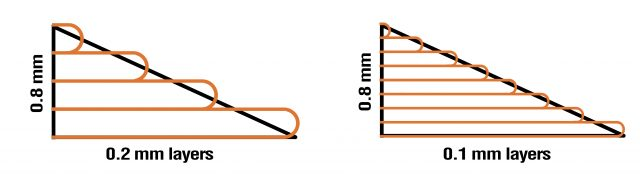

E korlátozásoktól eltekintve a két beállítás egymástól független. Ha külön-külön módosítja a beállításokat, teljesen más eredményeket kap. A fúvóka átmérője szinte kizárólag a vízszintes síkban \(a nyomtatási felülettel párhuzamosan\) befolyásolja a teljes részletesség szintjét. Mit jelent ez? Kisebb fúvókával részletesebb szöveget nyomtathat, amennyiben az a nyomtatott tárgy felső oldalára kerül. Ezzel szemben a rétegmagasság befolyásolja a részletesség szintjét az objektum függőleges és ferde oldalain. Sokkal valószínűbb, hogy az organikusnak tűnő tárgyakon egyedi rétegeket láthat. Minél alacsonyabb a rétegmagasság, annál jobb az összkép. Másrészről viszont nincs sok értelme téglalap alakú tárgyakat nyomtatni nagyon alacsony rétegmagassággal. A végeredményben alig vagy egyáltalán nem lesz különbség, és a nyomtatási idő szükségtelenül hosszú lesz.

## Nyomtasson akár 4-szer gyorsabban!

A 3D nyomtatás nem éppen gyors folyamat. Még egy néhány centiméter magas lenyomat is több órát vehet igénybe. Ezért elég meglepő, hogy a nagy átmérőjű fúvókákkal történő nyomtatást mennyire figyelmen kívül hagyják, pedig ez a nyomtatási sebesség drámai javulását eredményezheti.

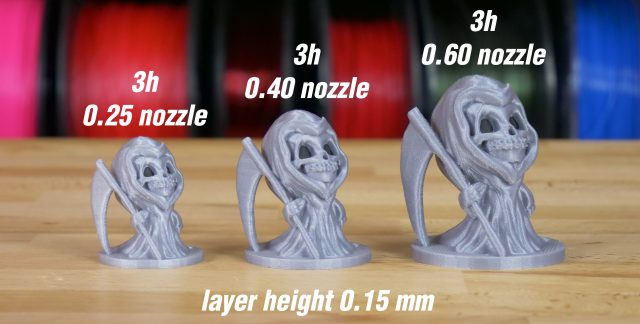

                                                   _STL letöltési link -_ [_Chibi Grim by Tanya Wiesner_](https://www.myminifactory.com/object/3d-print-chibi-grim-24430)\_\_

Egy nagyobb átmérőjű fúvóka nagyobb kerületeket rak le, ami azt jelenti, hogy kevesebb kerületet használ, mint egy kisebb átmérőjű fúvóka ugyanolyan vastagságú fal nyomtatásához. A nagyobb átmérőjű fúvóka nagyobb rétegmagasságú nyomtatást is lehetővé tesz. E két hatás kombinációja a nyomtatási idő jelentős csökkenését eredményezi. De van egy bökkenő: ha ugyanazt a rétegmagasságot tartja meg egy egy kerületi tárgy, például egy váza nyomtatásához, akkor nem fog sebességnövekedést tapasztalni. Ennek oka, hogy a fúvókának az átmérőtől függetlenül pontosan ugyanazt a mozgássort kell végrehajtania. Igen, a váza fala kissé vastagabb lesz, de a nyomtatási idő majdnem ugyanannyi lesz.

## Hatás a mechanikai tulajdonságokra

A nagyobb fúvókák használatának másik előnye a nyomtatott tárgyak nagyobb szilárdsága. Az ütésállósági vizsgálat kimutatta, hogy a 0,6 mm-es fúvókával nyomtatott tárgyak akár 25,6%-kal több energiát nyeltek el, mint a 0,4 mm-es fúvókával nyomtatottak. A 0,25 mm-es verzióval nyomtatott tárgyak pedig 3,6%-kal kevesebb energiát nyeltek el, mint a 0,4 mm-es fúvókával nyomtatottak. Ezt a vizsgálatot tíz különböző mintán végezték el. Ezután eltávolítottuk a minimális és maximális értékeket, így 8 minta értékeit láthatja.

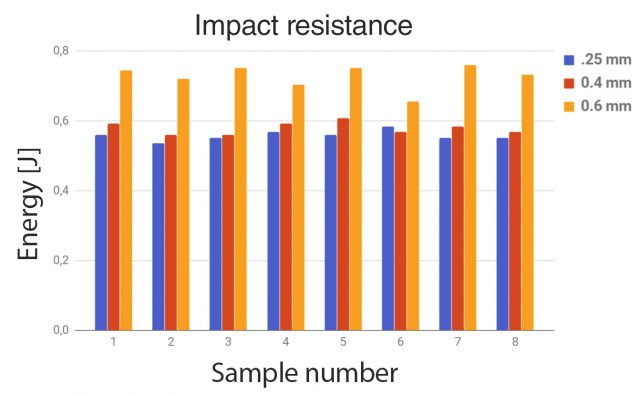

## Támaszték

A támaszték általában egy kerület széles polivonal formájában nyomtatják ki. Ha belép a szeletelő beállításaiba, gyakran láthatja, hogy a támasztékot szándékosan alul extrudálták, hogy könnyebb legyen eltávolítani. És természetesen a különböző nyomtatófúvókák használata közvetlenül befolyásolja a támasztékfalak szélességét. Ezt előnyére fordíthatja. Ha egyszerűen kisebb fúvókát használ, a közeg vékonyabb lesz, és könnyebb lesz eltávolítani. A nagyobb fúvókák használata ellenkező hatást vált ki, és szélesebb, erősebb közeget eredményez, amelyet kissé nehézkes lehet eltávolítani.

## Hogyan cserélheti ki az extruder fúvókát?

Használatra kész beállítások 0,25 mm-es és 0,6 mm-es \(és most már **0,8-as\)** fúvókákhoz

Ha 0,25 mm-es vagy 0,6 mm-es fúvókákat szeretne kipróbálni, nem kell új szeletelőprofilokat létrehoznia. Ezt megtettük Önnek! Nyissa meg a Slic3r-t, és keresse meg a nyomtató beállításait \(közvetlenül a szálválasztó menü alatt\).

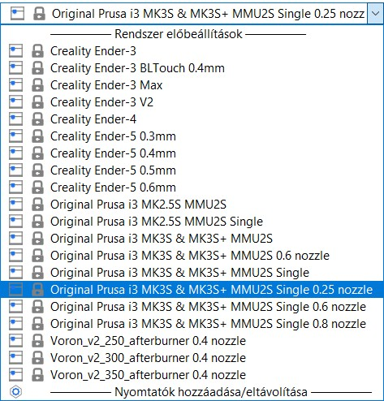

## 0,25 mm-es fúvóka

#### Előny

* Jobb minőségű nyomtatott szövegek
* A legjobb felbontás XY tengelyen - tökéletes ékszerekhez, logókhoz...
* Rendkívül könnyen eltávolítható konzolok

#### Hátrány

* Jelentősen hosszabb nyomtatási idő
* Nagyobb a fúvóka eltömődésének kockázata
* Nem kompatibilis egyes szálakkal \(nagyobb részecskéket tartalmazó szálakkal\)

### Gyakorlati felhasználási példák \(0,25 mm\)

Mint már említettük, a fúvóka átmérője jelentős hatással van a nyomtatási felülettel párhuzamos sík nyomtatási felbontására. Ez azt jelenti, hogy egy 0,25 mm-es fúvóka alkalmas részletes szöveg nyomtatására. Hasonlítsuk össze az alapértelmezett 0,4 mm-es fúvókával. Bár a "Vékony falak felismerése" opció engedélyezve van, a betűk egyes részei elveszhetnek a szeletelés során. A 0,25 mm-es fúvókával ez nem fog megtörténni, így használhatja egy szokatlan névjegykártya nyomtatásához, hogy elvarázsolja a tömeget 🙂 Érdemes megemlíteni, hogy a rétegmagasság megváltoztatása nem befolyásolja a szöveg olvashatóságát.

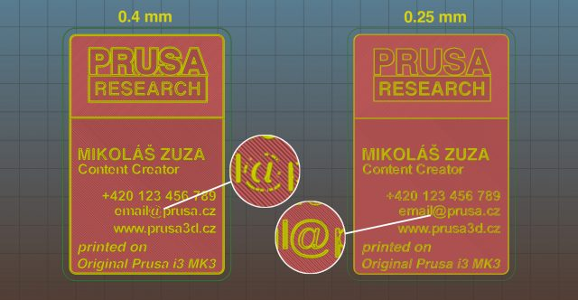

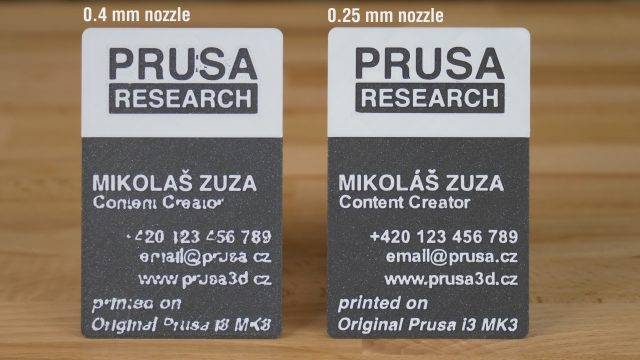

#### Ékszer nyomtatás

Ez egy másik nagyszerű felhasználási módja egy kisebb fúvókának. A 0,4 mm-es és a 0,25 mm-es fúvóka közötti különbség nem olyan drámai, mivel még egy 0,4 mm-es fúvókával is elég jól lehet kis tárgyakat nyomtatni. A javulás leginkább a finom vonalak nyomtatásakor lesz észrevehető.

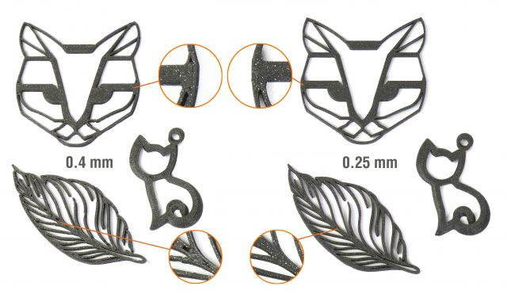

#### Miniatűrök nyomása

Meglepő módon a miniatűrök kis átmérőjű fúvókával történő nyomtatása meglehetősen kis mértékben javítja a nyomtatási minőséget. A legnagyobb javulást az ilyen objektumok támasztékainak nyomtatásakor fogja észrevenni. A 0,25 mm-es fúvókával nyomtatott támaszték könnyen eltávolítható, és szinte láthatatlan nyomokat hagy a tárgyon.

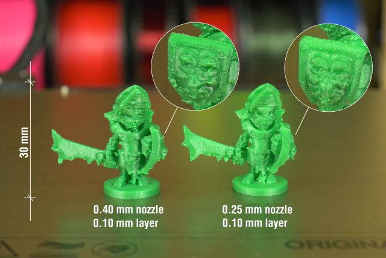

Másrészt, ha nincs szüksége alátámasztásra, a 0,4 mm-es és a 0,25 mm-es fúvókák közötti különbség közel nulla. Őszintén szólva, ha felcseréltük volna a két láda feletti címkéket, meg tudnád mondani?

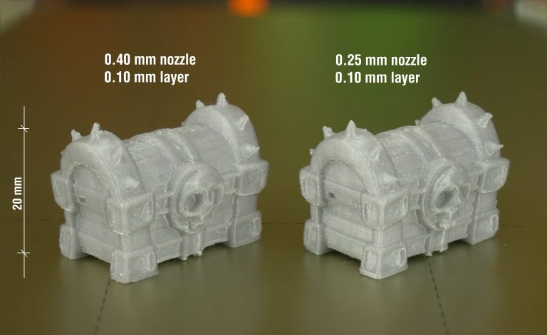

## 0,6 mm-es fúvóka

A 0,60 mm-es fúvóka alkalmas minden olyan nyomtatáshoz, amelynek nem kell apró részletességűnek lennie. Fejhallgatótartók, különféle tartók, konzolok vagy virágcserepek... mind kinyomtathatók a szokásos idő felében. Az elmúlt hónapokban többnyire 0,4 mm-es fúvókát használtunk, így őszintén szólva szépen újra felfedeztük a 0,6 mm-es fúvóka hasznosságát.

#### Előny

* Akár kétszer gyorsabb nyomtatási idő
* A nyomtatási minőség majdnem megegyezik a 0,4 mm-es fúvókákéval.
* Tartósabb nyomatok
* A fúvóka eltömődésének alacsony kockázata

#### Hátrány

* Az apró részletek és szövegek gyenge felbontása
* A támasztékokat nehezebb eltávolítani

## Gyakorlati felhasználási példák \(0,6 mm\)

### Virágcserepek és váza

A virágcserepek általában nem rendelkeznek bonyolult részletekkel, így a 0,4 mm-es és a 0,6 mm-es lenyomat közötti különbség szinte lehetetlen. Az alábbi példában ugyanazt a rétegmagasságot használjuk. Nagyobb rétegmagassággal a 0,6 mm-es nyomtatás még gyorsabban elkészülne. És a virágcserép formája miatt a különbség nem lenne túl feltűnő. 

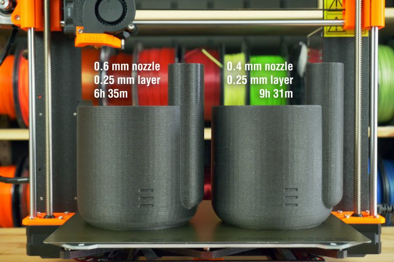

[_**STL letöltési link**_](https://www.thingiverse.com/thing:903411)

### Buddy a kutya

Buddy egy meglehetősen részletes modell. A 0,6 mm-es fúvókával azonban nincs probléma ebben a méretarányban.

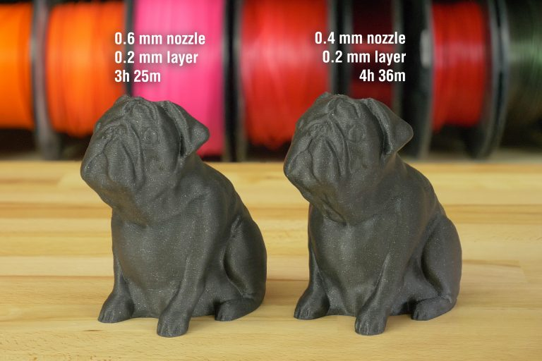

### Voronai lámpa

A lámpa formájának köszönhetően \(nagy sík felületek\) szinte semmi sem szenvedett csorbát a minőségben. Egy 0,6 mm-es fúvókának eggyel kevesebb kerületre van szüksége ugyanolyan falvastagság eléréséhez, mint egy 0,4 mm-es fúvókának \(3 kerület 0,4 mm-es fúvókával szemben 2 kerület 0,6 mm-es fúvókával\). Ez hatalmas időmegtakarítást eredményezett, a nyomtatási idő közel 9 órával csökkent!

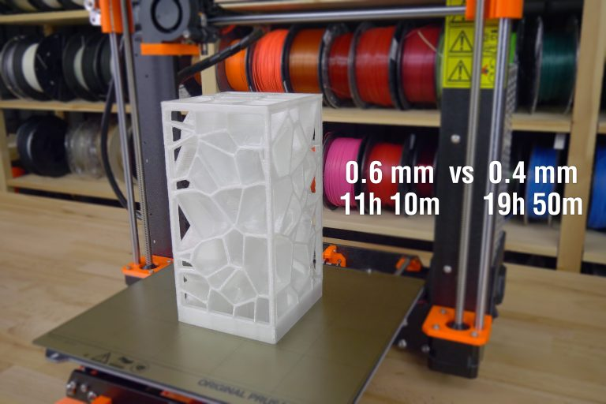

 [_**STL letöltési link**_](https://www.myminifactory.com/object/3d-print-voronoi-lamp-001-hq-version-6019)

## 1 mm-es fúvóka

Egy milliméter?! 0,04 hüvelyk? Igen, így van. Felejtsen el mindent, amit a 3D nyomtatásról tudni vél. Egy 1 mm-es fúvókával akár több tucatnyi órát igénylő nyomatok is elkészíthetők néhány óra alatt. A 0,4 mm-es fúvókával elérhető nyomtatási sebesség akár ötször gyorsabb, mint a 0,4 mm-es fúvókával. Természetesen ennek ára van. Egy 1 mm-es fúvókával jellemzően 0,5 mm-es rétegmagassággal nyomtat, de ennél is tovább lehet menni. Természetesen a nyomtatott tárgy rétegei nagyon jól láthatóak lesznek, de néha nem árt. Bizonyos esetekben még érdekes esztétikát is adhat a modellnek, amit más módszerekkel elég nehéz lenne elérni. Ezt természetesen az alábbiakban több példán keresztül is bemutatjuk.

#### Előny

* Rendkívül gyors nyomtatás
* Nagyon erős nyomatok
* Szokatlan megjelenés jól látható rétegekkel
* Szinte kizárt a fúvóka eltömődésének veszélye.

#### Hátrány

* A részletesség hiánya
* Látható rétegek
* Nagyon nehéz eltávolítani a támasztékokat
* Úgy tűnik, hogy az szál eltűnik a tekercsről.

### Gyakorlati felhasználási példák \(1 mm\)

#### Dinoszaurusz - játék gyerekeknek

Az 1 mm-es fúvóka használatának meglepő előnye, hogy minden további beállítás nélkül képes természetesen lekerekített élek nyomtatására. Ez a funkció ideális a gyermekjátékok nyomtatásához, mivel minimálisra csökken a veszélye annak, hogy az ujját megvágja egy éles perem. Ezenkívül a játékot ötször gyorsabban nyomtatták, mint az alapértelmezett 0,4 mm-es fúvókával.

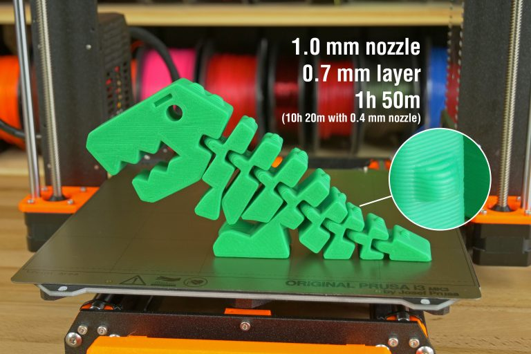

 [_**STL letöltési link**_](https://www.thingiverse.com/thing:2738211)

#### Ceruzatartó

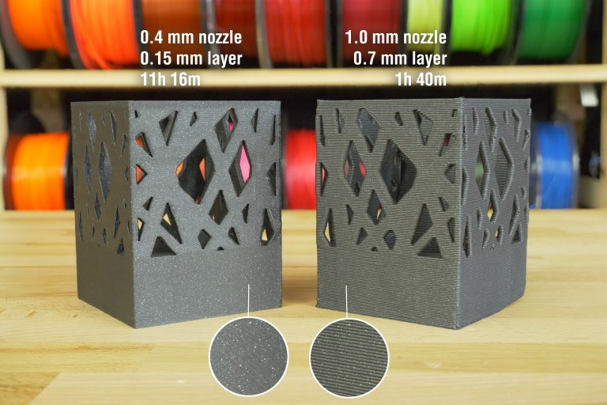

 [_**STL letöltési link**_](https://www.thingiverse.com/thing:297484)

#### Átlátszó nyomatok kitöltés nélkül

Az átlátszó filamenttel \(pl. PETG\) töltés nélkül és nagyon nagy rétegmagassággal nyomtatott modellek érdekes módon képesek megtörni a fényt. Különösen akkor, ha csak egy vagy két kerülettel nyomtathatja ki őket. A hasonló megjelenés elérése egyébként elég nehéz lenne.

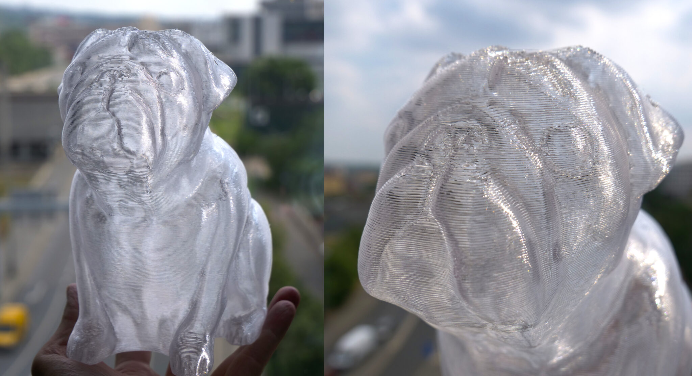

## Következtetés

Ha a 0,4 mm-es fúvóka helyett egyetlen fúvóka vásárlását kellene javasolnunk, a mi szavazatunk a 0,6 mm-es opcióra esne. Jelentősen rövidebb nyomtatási időt kínál, de még így is lehet ésszerűen részletes modelleket nyomtatni. Ha általában apró mintákat nyomtat szöveggel, ékszerekkel vagy logókkal, akkor érdemes megfontolnia a 0,25 mm-es fúvókát is. Az 1 mm-es változat korlátozottan használható, de még mindig nagyon szórakoztató.

