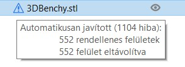
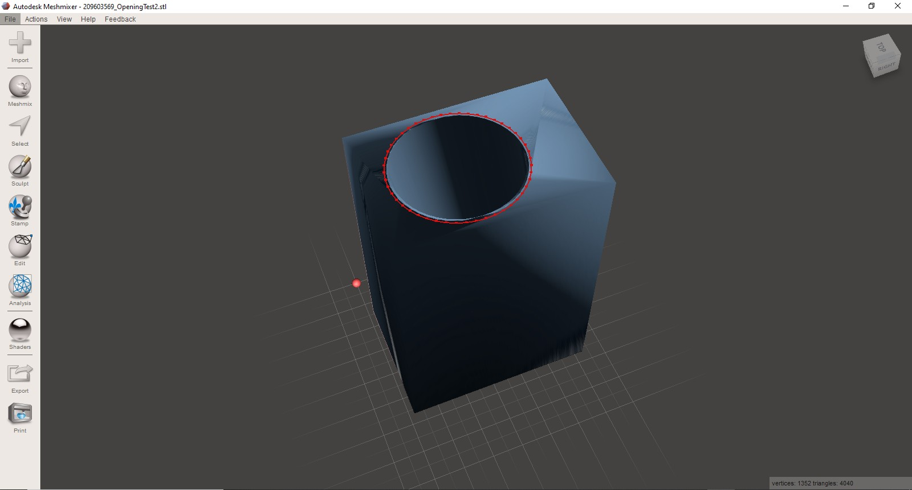
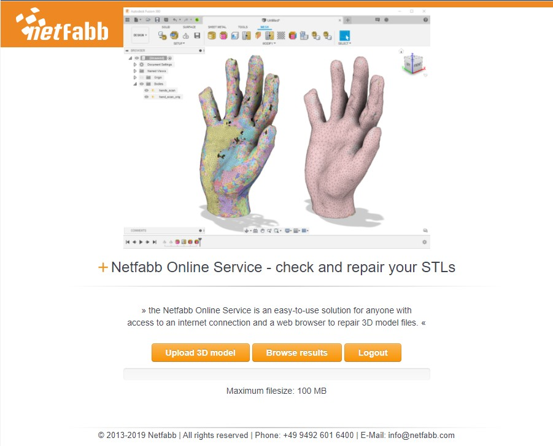
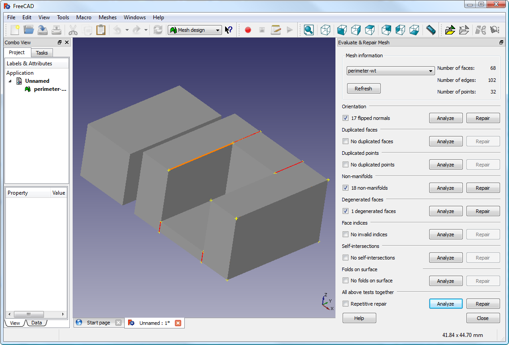

# Hibás modell javítása

## Modelljavítás a SuperSlicer által

A SuperSlicer kínál egy funkciót az érvénytelen modell javítására.

A **File** - **STL fájl javítása** menüpontban a szoftver megkéri, hogy adja meg a javítandó STL fájlt és a célfájlt, amely egy Obj fájl lesz. A javítás után importálhatja az Obj fájlt feldolgozásra.

Ha a modellben leírt 3D háló lyukakat tartalmaz, vagy ha az élek rosszul igazodnak egymáshoz \(azt mondják, hogy nem sokrétűek vagy nem vízzáróak\), a SuperSlicer nehezen tud dolgozni rajtuk. A SuperSlicer megpróbál minden problémát megoldani, de vannak olyan problémák, amelyeket nem tud megoldani.

 _A SuperSlicer olvasáskor javított modellt jelez._

## Modelljavítás külső megoldásokkal

Ha a SuperSlicer azt jelzi, hogy egy modell nem szeletelhető megfelelően, több lehetőség is rendelkezésre áll, és az itt leírtak az írás időpontjában mind ingyenesek.

### MeshMixer

Az Autodesk számos 3D modellező alkalmazást készít, köztük a szoftver [MeshMixer](https://www.meshmixer.com/) nevű verzióját.

**Megjegyzés**: Jelenleg a MeshMixer verziója 3.5.474.

### Netfabb Cloud szolgáltatás

A [Netfabb](http://cloud.netfabb.com/) egy webes szolgáltatásnak is otthont ad, ahová STL-fájlokat lehet feltölteni ellenőrzés és javítás céljából . Az STL feltölthető ellenőrzés és javítás céljából .

* Navigáljon a [http://cloud.netfabb.com](http://cloud.netfabb.com)
* Válassza ki a letöltendő STL fájlt a megadott gomb segítségével.
* Meg kell adni egy e-mail címet, amelyen értesítjük Önt a szolgáltatás befejezéséről.
* Válassza ki, hogy metrikus vagy angolszász mértékegységeket kíván-e használni.
* Olvassa el és fogadja el a szolgáltatási feltételeket, majd kattintson a `Upload 3D Model`.
* Amint a szolgáltatás átvizsgálta és megjavította a fájlt, egy e-mailt küldünk a javított fájl letöltésére szolgáló linket biztosítva.

  Ha az elemzés gyors, akkor az eredményt közvetlenül online is megkaphatja a javított fájlok letöltésére szolgáló linkkel együtt.

### FreeCAD

A[ Freecad](http://sourceforge.net/projects/free-cad) egy teljes és ingyenes CAD program, amely tartalmaz egy hálós modult a degenerált modellek javítására. A háló modul, ahol a degenerált modellek javíthatók. A következő lépések leírják, hogyan lehet egy problémás modellfájlt elemezni és javítani.

* Indítsa el a FreeCAD-et, és a kezdőlapon válassza a következő menüpontot `Hálós kialakítás`.
* Töltse be a sablont a munkaterületre történő húzással vagy a "Fájl" menü segítségével. A bal alsó sarokban egy kis üzenet jelzi, ha a sablonnal problémák merülnek fel.
* Válassza a menüből a `Hálózatok->Analízis->Háló`értékelése és javítása menüpontot, hogy megjelenjen a javítási beállítások párbeszédpanel.
* A beállítások párbeszédpanelen válassza ki a betöltött hálót, majd végezze el az egyes elemzéseket az egyes problématípusoknál az `Analízis` gombra kattintva, vagy válassza az `Megismétlés` lehetőséget az alján az összes ellenőrzés elvégzéséhez. Ha megfelelő problémát észlel, a "Javítás" gomb aktívvá válik.
* Minden egyes kívánt javításnál kattintson a `Javítás` gombra.
* Fontos megvizsgálni a javítási szkript hatását a modellre. Előfordulhat, hogy a szkript károsítja a fájlt, ahelyett, hogy javítaná, például fontos háromszögek eltávolításával..
* Exportálja a javított modellt az "Exportálás" menüpont vagy a kontextusmenü segítségével.

Megjegyzés: A FreeCad jelenlegi verziója 0.19

