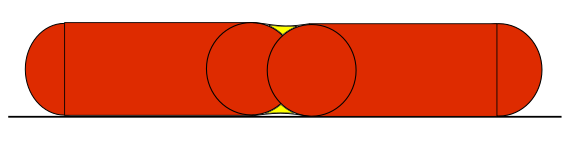

# Áramlás matematika

Forrás : [https://manual.slic3r.org/advanced/flow-math](https://manual.slic3r.org/advanced/flow-math)

Ez az oldal elmagyarázza a SuperSlicer-ben az áramlás mennyiségének meghatározásához használt matematikát. Dokumentálása referenciaként szolgál, és megjegyzéseket kér, mivel jobb modelleket érdemes lenne kipróbálni.

## Az extrudálás szélességének megértése

A SuperSlicer munkáját két fő probléma befolyásolja:

1. **Milyen távolságra** kell elhelyezni az extrudálási utakat ahhoz, hogy jó, folyamatos felületet kapjunk?
2. Mennyi anyagot kell extrudálni az ilyen utak mentén?

Ha két szomszédos pálya **túl közel** van egymáshoz \(vagy **túl sok anyagot** extrudál\), akkor átfedik egymást. Ha két szomszédos pálya **túl messze** van egymástól \(vagy **túl kevés anyagot** extrudáltak\), akkor hézagok lesznek láthatóak és/vagy az extrudálások a nem elégséges kötés miatt leválnak.

Azzal, hogy mozgatás közben többet vagy kevesebbet extrudálunk \(azaz megváltoztatjuk az **áramlási sebesség/fejsebesség arányát**\), vastagabbá vagy vékonyabbá tehetjük a pályákat:


A **vastagabb utak jobban kötődnek** az alsó réteghez, így mechanikus alkatrészekhez jók. Ugyanakkor kevésbé lesznek képesek megközelíteni a tárgy alakját és kitölteni az apró réseket vagy szűk íveket \(gondoljon egy fúrófejre: egy nagyobb fúrófej nem fog tudni behatolni a szűk helyekre\). Ezzel szemben a **vékonyabb pályák** kevesebb tapadást, de jobb alakpontosságot biztosítanak.

Azonban vegye figyelembe, hogy az extrudálás szélessége csak akkor szabályozható, ha egy meglévő felület \(például egy korábbi réteg vagy nyomtatóágy\) fölött extrudál. Ha **szabad levegőben** extrudálunk \(azaz áthidaláskor\), a kapott alakzat mindig **kerek** lesz, és megegyezik a **fúvóka átmérőjével**:


Valójában, ha csökkenti az anyagáramlást, akkor bizonyos mértékig kisebb köröket kap, amíg a műanyag viszkozitása úgy nem dönt, hogy a túl nagy feszültség miatt ideje eltörni a hidat. Ha ezzel szemben túl sok anyagot extrudál, akkor az extrudált szál alakja nem változik \(még mindig egyenlő a fúvóka átmérőjével\), de laza hidat fog kapni.

Kezdjük tehát a meghatározással:


 Az extrudálási szélesség a levegőben vagy egy felület felett extrudált **egyetlen szál vastagsága**. Ez **nem** két szomszédos útvonal távolsága, mivel a jobb kötés érdekében általában némi átfedést alkalmaznak


## Hidak: az egyszerű eset

Ahogy fentebb említettük, csak egy helyes áramlási sebesség létezik a hídépítéshez: az, amelyik nem okoz megereszkedést vagy törést a hídnak. Az extrúziók **kerekek**, és **átmérőjük megegyezik a fúvóka átmérőjével**. A párhuzamos pályák úgy helyezkednek el, hogy **érintőlegesek** legyenek, így az egyik pálya és a szomszédja közötti távolság is egyenlő a fúvóka átmérőjével. \(A hidak esetében nem akarunk átfedést, mert az bizonyítottan elhúzza\) a meglévő pályákat.

Az egységnyi hosszúságú útvonalhoz szükséges anyagmennyiséget a hengeres alaknak megfelelően, tehát kör keresztmetszetű felülettel számítják ki:

```text
E = (nozzle_diameter/2)^2 * PI
```

## Extrudálás egy felület tetején

Ebben az esetben a probléma a következő: **milyen alakot** kapjon az extrudálásunk? Tudjuk, hogy vízszintesen összenyomódik, de vajon téglalap vagy ovális alakja lesz? Mekkora a maximális extrudálási szélesség, amit egy adott fúvókaátmérővel elérhetünk, mielőtt a műanyag elkezd görbülni az oldalán?

A SuperSlicer feltételezi, hogy az extrudálás keresztmetszeti alakja téglalap, félköríves végekkel. Tehát a kívánt extrudálási szélesség és az extrudálandó térfogat közötti kapcsolat a következő:


Ha a cél extrudálási szélesség vékonyabb, mint a rétegmagasság, az alak kiszámíthatatlan, ezért csak ugyanazt a téglalap alakú képletet használjuk, de nem javasoljuk az ilyen vékony extrudálási értékek használatát.

A fenti képlet egy olyan függvényt biztosít, amely a cél extrudálási szélességet összhangba hozza a távolságegységenként extrudálandó anyagmennyiséggel:

```text
E = f(extrusion_width, layer_height)
```

## Távolságtartó útvonalak

Oké, most már tudjuk, hogy mennyit kell extrudálnunk, hogy a kívánt szélességű egyetlen pályát kapjunk. De **mennyire kell átfednünk** az útvonalakat, hogy tökéletes kötést kapjunk?

Feltételezve, hogy nincs átfedés, tehát érintő pályák, akkor üres tér lenne \(sárga\):


Az ilyen hézagok keresztmetszeti területe általában: 

```text
void_area = layer_height^2 - (layer_height/2)^2 * PI
```

Ideális esetben a sárga területet úgy szeretnénk kitölteni, hogy az extrudálásokat egymáshoz közel helyezzük. Azonban nagyon valószínűtlen, hogy a második extrúzió kitölti az előző alatti teret, így még mindig maradna egy kis rés.



Az ideális átfedés valami ilyesmi lenne:

```text
0 < overlap_factor*void_area < void_area
```

Az `overlap_factor` \(átfedési tényező\) értéke 0 és 1 között mozog. Az `overlap_factor` azt jelzi, hogy mennyi üres tér marad az extrúziók között. Ezt a mennyiséget nehéz megbecsülni, mivel valószínűleg a műanyag viszkozitásától, az extrudálási sebességtől és a hőmérséklettől is függ. Korábban több értéket is kipróbáltunk az `overlap_factor` értékére, de egyes felhasználók még mindig túl ritkás pályákat jelentettek. Jelenleg az 1 értéket használják, hogy garantálják, hogy a hiba \(ami mindig jelen van\) teljes mértékben a bőséges extrudálás, és nem az anyaghiány oldalán van.

Az útvonaltávolság tehát:

```text
spacing = extrusion_width - layer_height * (1 - PI/4)
```

## Ajánlott alapértelmezett értékek

A SuperSlicer lehetővé teszi a felhasználók számára, hogy manuálisan határozzák meg az extrudálás szélességét az egyes extrudálási típusokhoz \(peremek, kitöltés, tartóanyag stb.\), de ha nem adnak meg egyéni értékeket, akkor az alapértelmezett értékeket számítja ki.

A kerületek **legkülső hurkához** \(más néven külső kerület\) a Slic3r alapértelmezés szerint **vékony extrudálási szélességet** használ, ami egyenlő a \``nozzle_diameter`  _1,05\`\`\(fúvóka átmérő\). Ezt tekintjük a legvékonyabb biztonságos extrudálási szélességnek. A vékony extrudálási szélesség \*jobb pontosságot_ biztosít a tárgy alakjához, és minimalizálja a szabálytalan szálak okozta áramlási hibákat.

Az extrudálási szélességet más dolgok esetében úgy számítják ki, hogy megkapják a konfigurált fúvókaátmérő keresztmetszeti területét, majd kiszámítják az adott anyagmennyiség extrudálásával előállított extrudálási szélességet. Más szóval, az áramlási sebesség és a fejsebesség összehangolásával. Ennek a logikának az a célja, hogy megtalálja azt a " natív" áramlást, amely minimalizálja az extrudálás során fellépő oldalerőket. Az ilyen kiszámított extrudálást a `nozzle_diameter * 1,7` \(fúvóka átmérő\) maximális értékre korlátozza, kivéve a belső ritkás kitöltés esetén, ahol a teljes natív áramlás kerül alkalmazásra.

