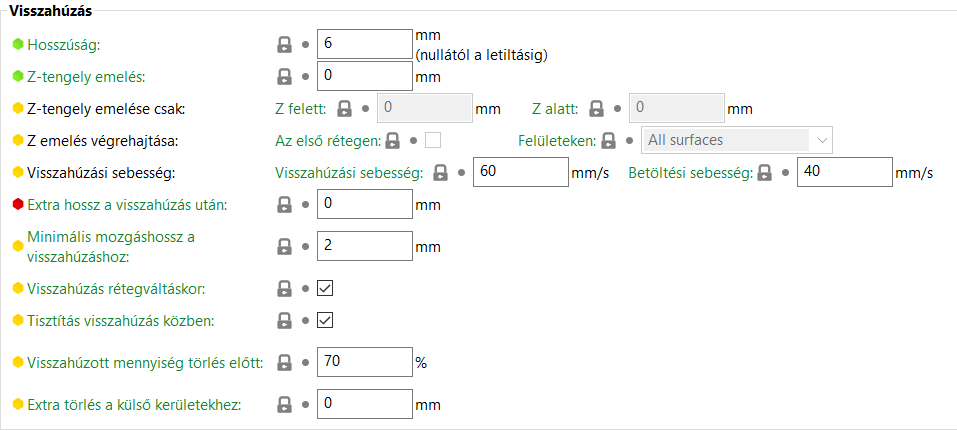

# Nyomtató beállítások

### Egyedi SVG és PNG textúrák

A SuperSlicer támogatja az egyéni textúrákat és nyomtatólemez mintákat **PNG** és **SVG** formátumban.

Egyéni mintát vagy textúrát a **Nyomtatóbeállítások - Általános \(méret és koordináták\) - Ágy formája - Beállítás** menüpont kiválasztásával rendelhet hozzá.

> A kiválasztott fájlok teljes elérési útvonalát az `bed_custom_texture` és az `bed_custom_model` nyomtatási profilváltozók tárolják.

### SVG textúrák exportálása Adobe Illustratorból

A [Nano SVG](https://github.com/memononen/nanosvg) elemző, amelyet a SuperSlicer használ, nem támogatja az SVG formátum összes funkcióját. Az alábbi munkafolyamatot javasoljuk az SVG textúra Adobe Illustratorból történő megfelelő exportálásához:

1. \*\*Fájl - Exportálás - Exportálás mint
2. Ellenőrizze a **Munkalapok használata** ellenőrzést, hogy a kapott méret megfelelő legyen.
3. A **SVG beállítások** párbeszédpanelen:
   1. Formázás - **Inline formázás \(belső CSS NEM támogatott\)**
4. Erősítse meg a **OK** gomb megnyomásával

_SVG textúrák exportálása Adobe Illustratorból_.

### Teljesítmény

Annak érdekében, hogy elkerüljük a grafikai problémákat a túl részletes nyomtatólemez textúrák miatt, amelyek nem férnek el a GPU memóriájában, a következő stratégiákat alkalmaztuk az alacsony GPU-memória problémák kezelésére:

* A nyomtatólemezt textúráját csak akkor pixelezzük nagy, 8192x8192 pixeles felbontásban, ha a grafikus kártya támogatja az OpenGL 3.0 vagy magasabb verziószámú grafikus kártyát, vagy ha a Mac számítógéphez Retina kijelző van csatlakoztatva. Ellenkező esetben a 4096x4096 kisebb felbontású nyomtatólemez textúrája pixeles lesz.
* Ha az észlelt RAM mérete kevesebb, mint 6 GB, a textúra mérete ismét elosztásra kerül 2-vel.
* A nyomtatólemez textúráját tömöríti a [DXT1/DXT5 C valós idejű tömörítő könyvtár](https://github.com/Cyan4973/RygsDXTc).

Ezen túlmenően az alkalmazás elindítása után először egy alacsony felbontású nyomtatólemez textúrája töltődik be a GPU-ba, míg a nagyobb felbontások tömörítésre kerülnek, és fokozatosan kerülnek a CPU-ba, amint készen állnak.

## Általános

### Méret és koordináták

**Ágy alakja**

Itt állíthatja be az ágy alakját, méretét, textúráját és modellt.

#### _Maximális nyomtatási magasság_

Állítsa be ezt az értéket arra a maximális magasságra, amelyet az extruder a nyomtatás során elérhet.

#### _Z-eltolódás_

Ez az érték hozzáadódik \(vagy kivonásra kerül\) a kimeneti G-kódban szereplő összes Z koordinátához. A rossz Z végállású végálláskapcsoló helyzetének kompenzálására szolgál: például ha a végálláskapcsoló a fúvókát 0,3 mm-rel a lemez fölé helyezi, állítsa ezt az értéket -0,3-ra \(vagy javítsa ki a végálláskapcsolót\).

#### _Z teljes lépés_

Állítsa be ezt az értéket a Z-motor \(vagy azzal egyenértékű\) egy lépéssel történő fordulásakor elmozduló magasságra. Ha a motornak 200 lépésre van szüksége a fej/lemez 1 mm-es mozgatásához, akkor ennek a mezőnek 1/200 = 0,005-nek kell lennie.

Vegye figyelembe, hogy a G-kód 6 számjegyű z-értékeket ír ki a pont után, ha a z\_step be van kapcsolva \(3 számjegyű, ha ki van kapcsolva\).

> A letiltáshoz állítsa 0-ra.

### Lehetőségek

#### _Extruderek_

A nyomtatóban lévő extruderek száma.

#### _Egyetlen extruder több anyaggal_

A nyomtató a szálakat egyetlen extrudálófejbe adagolja.

Ha engedélyezi ezt az opciót, akkor a nyomtató beállítási paraméterei hozzáférhetők: _**MM beállítás egy extruderhez**_.

#### _Marók_

A gépen rendelkezésre álló marófejek száma.

### Firmware

#### _G-kód típus_

Egyes G/M-kódú parancsok, köztük a hőmérséklet-szabályozás és mások, nem univerzálisak. Állítsa be ezt a beállítást a nyomtató firmware-ében, hogy kompatibilis kimenetet kapjon. A "_**Nincs extrudálás**_" opció teljesen megakadályozza, hogy a SuperSlicer bármilyen extrudálási értéket exportáljon.

#### _Támogatja a csendes módot_

Jelzi, hogy a firmware támogatja a csendes üzemmódot. Ez az üzemmód általában lehetővé teszi, hogy a nyomtatók egy kicsit halkabbak legyenek működés közben. A csendes üzemmód közvetlenül nem mozog lassabban. Amikor a nyomtató csendes üzemmódba kerül, a firmware csendes részében található gyorsítási és sebességbeállításokat használja \(amelyek megfelelnek a nyomtató beállításának _**csendes mód**_ szakaszában található beállításoknak\). Így nem éri el ugyanazt a sebességet, mivel a gyorsulás alacsonyabb, és a firmware korlátozza a végsebességet. A csendes üzemmód a meghajtóáramokkal is csinál dolgokat, ami szerintem az oka annak, hogy az ütközésérzékelés nem működik ebben az üzemmódban a Prusa nyomtatókon.

Ha azt szeretné, hogy éjszaka halkabb legyen, a csendes üzemmódba való átkapcsolás mellett a nyomtató vezérlésével csökkentheti a sebességet is. Ez bármely üzemmódban elvégezhető, és a normál működés része. Csak állítsa le a készülék sebességét elég alacsonyra, és reggel, ha a nyomtatás folytatódik, állítsa vissza 100%-ra.

#### _Hátralévő nyomtatási idő támogatása_

Az M73 P\[nyomtatott százalék\] R\[hátralévő idő percben\] 1 perces időközönként adja ki a G-kódban, hogy a firmware pontosan jelezze a hátralévő időt. Eddig csak a Prusa i3 MK3 firmware ismeri fel az M73-at. Továbbá az i3 MK3 firmware támogatja az M73 Qxx Sxx Sxx-t a csendes üzemmódban.

#### _G-kód pontosság_

Beállítja a pont utáni számjegyek számát a **XYZ** koordináták és az **E** extruder vezérlőértékek esetében.

### Hűtőventilátor

#### _Gyorsítás_

Gyorsítási idő: Lehetővé teszi, hogy a ventilátor indítása legalább ennyi idővel \(másodpercben, tizedesjegyeket is használhat\) korábban kezdődjön. Ehhez az időbecsléshez végtelen gyorsulást feltételez, és csak a G1 és G0 elmozdulásokat veszi figyelembe.

> A kikapcsoláshoz használja a 0 értéket.

A _**Csak a túlnyúlásoknál**_ opció csak a túlnyúlások hűtésének késleltetését veszi figyelembe.

#### _Indulási szakasz időtartama_

Adjon hozzá egy M106 S255-öt \(maximális ventilátorsebesség\) erre a másodpercszámra, mielőtt a kívánt sebességre váltana a hűtőventilátor indításához.

> A letiltáshoz állítsa 0-ra.

#### _Ventilátor PWM 0-100 között._

Állítsa be ezt a beállítást, ha a nyomtató 0 és 100 közötti értékeket használ a 0 és 255 közötti értékek helyett.

### Miniatűr

#### _Méret a G-kódhoz_

A miniatűrök méretét .gcode és .sl1 fájlban kell tárolni a következő formátumban: "XxY, XxY, ...".

#### _Szín felülírása_

Egy adott színt alkalmazhat a miniatűrökre. Ha nem, akkor a színük a szál által meghatározott színű lesz.

#### _Lemez a miniatűrön_

Mutassa a lemez textúráját a miniatűr képen.

### Haladó

#### _Relatív E értékek használata_.

Ha a firmware relatív értékeket igényel az E értékekhez, jelölje be ezt a négyzetet, egyébként hagyja bejelölve. A legtöbb firmware abszolút értékeket használ.

Érvényesítse az indító G-kódban az M83 opciót a relatív extrudálási mód aktiválásához.

#### _Firmware visszahúzás használata_

Ez a kísérleti beállítás a G10 és G11 parancsokat használja, hogy a firmware kezelje a behúzást. Csak a Marlin legújabb verzióival használható.

#### _Használjon E térfogatot_

Ez a kísérleti függvény lineáris milliméter helyett köbmilliméterben adja meg az E értékeket. Ha a firmware még nem ismeri az szál átmérőjét, akkor az indító G-kódban a _**'M200 D\[izzószál\_átmérő\0\] T0'**_ parancsot adhatja meg a térfogatmérési üzemmód aktiválásához, és a SuperSlicerben kiválasztott szálhoz tartozó szál átmérőjét használhatja. Ez a funkció csak a Marlin legújabb verzióiban érhető el.

#### _Minimális extrudálási hossz_

A túl sok kis mozgatási parancs túlterhelheti a firmware-t/kapcsolatot. Ha furcsa lassulást észlel a nyomtatónál, állítson be itt magasabb értéket.

> Állítsa 0-ra a minimális extrudálási hossz kezelésének teljes kikapcsolásához.

#### _A változó rétegmagasság funkció engedélyezése_

Egyes nyomtatók vagy nyomtatóbeállítások nehézséget okozhatnak a változó rétegmagasságú nyomtatással. Alapértelmezés szerint engedélyezve.

## Egyedi G-kód

### Csak a saját G-kód indításakor

Csak az egyéni indítási G-kód használatának lehetősége.

Győződjön meg róla, hogy a szeletelő nem ad fűtő, ventilátor, extruder... parancsokat a G-kód indítása előtt vagy után. Ha engedélyezi, akkor teljes és helyes G-kódot kell írnia, mivel nem történik ellenőrzés.

Lehetőség van egyéni G-kódot definiálni a szakaszokhoz :

#### _Kezdő G-kód_

Ez az indítási eljárás az elején, a nyomtató indítási G-kódja után kerül beillesztésre \(és a szálaknak az adott szálra történő cseréje után, ha a többanyagú opciót használja\).

Egy adott szálra vonatkozó beállítások felülbírálására szolgál.

Ha a SuperSlicer érzékeli az M104, M109, M140 vagy M190 parancsokat az egyéni kódokban, ezek a parancsok nem kerülnek automatikusan hozzáadásra, így testre szabhatja a fűtési eljárást és más műveleteket.

Ne feledje, hogy általános változókat használhat az összes SuperSlicer beállításhoz, így bárhová beírhat egy _**M109 S\[first\_layer\_temperature\]**_ parancsot.

Ha több extrudere van, a G-kód az extruderek sorrendjében kerül végrehajtásra.

#### _Vége G-kód_

Ez a befejezési eljárás a kimeneti fájl végére kerül, közvetlenül a befejező G-kód előtt \(és több anyagból készült nyomtatók esetében az extruder cseréje előtt\).

Vegye figyelembe, hogy a SuperSlicer összes paraméteréhez használhat helyettesítő változókat. Ha több extruderrel rendelkezik, a G-kódot a sorrendjükben kell hozzáadni.

#### _G-kód rétegváltás előtt_

Ez az egyéni kód minden rétegváltáskor, közvetlenül a Z elmozdulás előtt kerül beillesztésre.

Vegye figyelembe, hogy a SuperSlicer összes beállításához használhat általános változókat, valamint a \[layer\_num\] és \[layer\_z\] értékeket.

#### _G-kód rétegváltás után_

Ez az egyéni kód minden rétegváltásnál beillesztésre kerül, közvetlenül a Z mozgás után, és mielőtt az extruder a következő réteg kezdőpontjára lépne.

Vegye figyelembe, hogy a SuperSlicer összes beállításához használhat általános változókat, valamint a \[layer\_num\] és \[layer\_z\] értékeket.

#### _G-Kód extruder váltáskor_

Ez az egyéni kód minden egyes extruder váltáskor beillesztésre kerül. Ha nem hagyja üresen ezt a mezőt, akkor az extruder váltás kódjáról magának kell gondoskodnia.

A SuperSlicer nem ad más G-kódot a szálcseréhez.

Használhat helyettesítő változókat az összes SuperSlicer paraméterhez, valamint például a \[previous\_extruder\] és \[next\_extruder\] paraméterekhez.

A szabványos extruderváltási parancsot a következőképpen írhatjuk le: _T \[next\_extruder\]._

**!! Figyelmeztetés!!** Ha ide bármilyen karaktert ír, a SuperSlicer nem fog magától fúvókaváltó G-kódot írni.

#### _Objektumok közötti G-kód \(szekvenciális nyomtatáshoz\)._

Ez a kód a szekvenciális\(sorrendi\) nyomtatás használatakor az objektumok közé kerül. Alapértelmezés szerint az extruder és a lemez hőmérséklete visszaáll, és a várakozás nélküli parancsot használja; azonban ha az M104, M109, M140 vagy M190 parancsokat észleli ebben az egyéni kódban, a SuperSlicer nem ad hozzá hőmérséklet-parancsokat. Ne feledje, hogy a SuperSlicer összes beállításához használhat általános változókat, így bárhová beírhat egy "_**M109S\[first\_layer\_temperature\]**_ parancsot."

#### _Extrudálás típus változás G-kód_

Ez az egyéni kód minden egyes alkalommal beillesztésre kerül, amikor az extrudálás típusa megváltozik.

Vegye figyelembe, hogy az összes SuperSlicer paraméterhez, valamint a \[layer\_num\], \[layer\_z\] és \[extrusion\_role\] paraméterekhez használhat helyettesítő változókat, amelyek ezeket a string értékeket vehetik fel: {Perimeter, ExternalPerimeter, OverhangPerimeter, InternalInfill, SolidInfill, TopSolidInfill, BridgeInfill, GapFill, Skirt, SupportMaterial, SupportMaterialInterface, WipeTower, Mixed}.

A vegyes csak akkor használatos, ha az extrudálás típusa nem egyedi, nem csak egy kategóriába tartozik vagy nem ismert.

## A gép korlátai

### Gép korlátozások

Lehetőség annak meghatározására, hogy a szoftver ezen szakaszában meghatározott határértékek hogyan kerülnek alkalmazásra. Mindenesetre a G-kód fájlba kerülnek elmentésre.

Legyen óvatos, még akkor is, ha olyan nyomtatási profilt használ, amely 5000-es gyorsulást határoz meg, ha a gépén a gyorsulási határ 4000, a G-kód kimenet a 4000-es határértéket fogja használni.

* Biztonsági mentésként is használhatja, és a nyomtatási idő jobb megbecsülése érdekében a "Használja az időbecsléshez" opciót választhatja.
* "A G-kódban a határértékek is megjelennek" opció. Az értékek a G-kódban kerülnek elmentésre, lehetővé teszik a nyomtatási idő jobb becslését, és a G-kód fájl elejére kerülnek, az M201, M202, M203, M204 és M205 jelekkel.
* Ha csak az értékeket szeretné elmenteni, válassza a "Használja az időbecsléshez is" opciót, és írja be a határértékeket az egyéni G-kód szakaszban.
* A 'Csak biztonsági mentéshez használni' opció csak a mentett G-kód beállításokba írja az adatokat.
* A G-kódban is korlátozások kibocsátása = emit\_to\_gcode
* Használja az időbecsléshez = time\_estimate\_only
* Csak biztonsági mentéshez használható = korlátozások
* Letiltás = figyelmen kívül hagyás

Példa a határértékeket meghatározó kódra G-kódban :

M201 X500 Y500 Z100 E5000 ; maximális gyorsulást állít be, mm/sec^2

M203 X500 Y500 Z10 E60 ; sets maximum feedrates, mm/sec

M204 P500 R1000 T1500 ; beállítja a gyorsulást \(P, T\) és a behúzási gyorsulást \(R\), mm/sec^2

M205 X8.00 Y8.00 Z0.40 E5.00 ; beállítja a rántás határértékét, mm/sec

M205 S0 T0 ; beállítja a minimális extrudálási és haladási előtolási sebességet, mm/sec

#### _Maximális sebességek_

Az XYZ és E tengelyek maximális sebességének meghatározása mm/s-ban kifejezve

#### _Maximális gyorsulások_

Az XYZ és E tengelyek maximális gyorsulásainak meghatározása mm/s²-ben kifejezve.

Az E tengely \(Az extruder\) esetében is lehetőség van a maximális extrudálás értékének finomítására az alábbiak szerinti bontással:

Maximális gyorsulás extrudálás közben \(M204P\)

Maximális gyorsulás behúzás közben \(M204R\)

Maximális gyorsulás elmozdulás közben \(M204T\)

#### _A rángatás \(jerk\) korlátai **\(A hirtelen mozgások korlátai\)**_

Az XYZ és E tengelyek maximális rándulásának meghatározása mm/s-ban kifejezve.

A jerk kifejezést Marlin vezette be. Ez egyfajta megoldás volt arra a problémára, ami azzal jár, hogy megpróbáljuk tökéletesen követni az utat. Mivel a fúvóka \(elméletileg\) nem térhet le az útról, minden egyes sarokban 0 mm/s-ra kell lassulnia. Ez tönkretenné a nyomatot, mivel a 0 mm/s-ra való lassítás minden egyes sarokban túlnyúlást okozna. Ehelyett a Marlin lehetővé teszi a sebességvektor pillanatnyi változását minden egyes sarokban. A sebességvektorban bekövetkező változás nagyságát "rántásnak" nevezzük.

#### _Minimális sebességek_

Az E extruder minimális sebességének meghatározása mm/s-ban kifejezve

Meg lehet különböztetni a _**minimum értéket az extrudálás során**_: M205S, és a _**minimum értéket az utazás során**_: M205T.

## Extruder

Extruderrel kapcsolatos beállítások.

A menü listában annyi extruder jelenik meg amennyit a gép tartalmaz és extruderenként lehet mindent beállítani.

### Név és méret

#### _Extruder neve_

Csak a klipper esetében használatos, ahol megnevezheti az extruder nevét. Ha nincs definiálva, akkor '**extruderX**' lesz, ahol az 'X' helyébe az extruder száma lép.

#### _Fúvóka átmérője_

Ez az extruder fúvókájának átmérője \(például: 0,5, 0,35, stb.\)

### Rétegmagassági korlátok

#### _Minimum_

Ez az érték a minimális nyomtatható rétegmagasság az adott extruder esetében, és korlátozza a változó rétegmagasság felbontását. A tipikus értékek 0,05 mm és 0,1 mm között vannak.

#### _Maximum_

Ez a maximális nyomtatható rétegmagasság ennél az extrudernél, amelyet a változó rétegmagasság és a hordozórétegek rétegmagasságának felső határértékének meghatározására használnak. Az ajánlott maximális rétegmagasság az extrudálás szélességének 75%-a a megfelelő rétegközi tapadás elérése érdekében.

Ha 0-ra van állítva, a réteg magassága a fúvóka átmérőjének 75%-ára korlátozódik.

A SuperSlicer változó rétegmagasságot használ, amely eltér a modell rétegmagasságától, ezért ez a paraméter nagyon fontos a szoftver által kiszámított rétegmagasságok meghatározásához.

A tartókon lévő rétegmagasságokat a Slicer automatikusan kezeli, és azok nem egyeznek meg az alkatrész rétegmagasságával. Ezért fontos az ezeket a magasságokat szabályozó minimális és maximális rétegmagassági határértékek beállítása.

### Eltolás \(több extruderes nyomtatók esetében\)

#### _Extruder eltolás_

Ha a nyomtató firmware-e nem támogatja az extruder eltolását, a G-kódnak ezt figyelembe kell vennie. Ezzel az opcióval megadhatja az egyes extrudereknek az elsőtől való eltolását. Pozitív értékeket várunk \(ezeket kivonjuk az XY-koordinátákból\).

#### Extruder hőmérséklet eltolás

Ez az eltolás hozzáadódik a szálbeállításokban beállított extruder hőmérsékletekhez. Ne feledje, hogy az 'M104 S{first\_layer\_temperature\[initial\_extruder\] + extruder\_temperature\_offset\[initial\_extruder\]}' értéket kell beállítania. az 'M104 S\[irst\_layer\_temperature\]' helyett a start\_gcode-ban.

#### Extruder ventilátor eltolás

Ez az eltolás hozzáadódik az izzószál tulajdonságaiban beállított összes ventilátor értékhez. Ez nem fogja őket 100%-nál magasabbra és 0%-nál alacsonyabbra állítani.

### Visszahúzás

#### _Hosszúság_

Amikor a visszahúzás elindul, a szálat a megadott mennyiséggel visszahúzza \(a hosszúságot a nyers szálon mérik, mielőtt az az extruderbe kerülne\).

#### _Z-tengely emelés_

Ha pozitív értéket ad meg, a Z-tengely minden egyes visszahúzáskor gyorsan megemelkedik. Több extruder használata esetén csak az első extruder beállítását veszik figyelembe.

#### _Z-tengely emelése csak_

**Z felett:** Ha pozitív értéket ad meg, a Z-tengely emelése csak a Z-tengelyhez megadott abszolút értéktől indul. Ezt a beállítást megváltoztathatja, hogy _**elkerülje**_ a Z-tengely felemelését _**az első néhány rétegnél**_.

**Z alatt:** Ha pozitív értéket ad meg, a Z tengelyemelés csak a Z tengelyhez megadott abszolút értékig lép működésbe. Ezt a beállítást úgy módosíthatja, hogy _**korlátozza**_ a Z-tengelyes emelést _**az első rétegekre**_.

#### _Z emelés végrehajtása_

Ezekkel az opciókkal megadhatja, hogy mikor kerüljön alkalmazásra a Z emelés:

**Az első rétegen**

Ha ezt a lehetőséget választja, a Z emelést az első rétegre alkalmazza.

**Felületeken**

Válassza ezt a lehetőséget, ha nem kívánja használni/alkalmazni a Z felemelést egy felső felületen. A beállítási lehetőségek a következők:

* _**Minden felületen**_ : minden felületen
* _**A tetején nem**_: ne alkalmazza a felső felületeken.
* _**Csak a tetején**_: csak a felső felületekre vonatkozik.

#### _Visszahúzási sebesség_

A visszahúzások sebessége \(csak az extruder motorjára vonatkozik\).

#### _Betöltési sebesség_

Az extruderbe visszahúzás után a szál betöltésének sebessége \(ez csak az extruder motorra vonatkozik\). Ha nulla marad, akkor a visszahúzási sebességet használja a rendszer.

#### _Extra hossz a visszahúzás után_

Amikor a visszahúzás kompenzálásra kerül az elmozdulás után, az extruder ezt a további szálmennyiséget tolja ki. Erre a beállításra ritkán van szükség.

#### _Minimális mozgáshossz a visszahúzáshoz_

A visszahúzás nem lép működésbe, ha a mozgások hossza ennél rövidebb.

#### _Visszahúzás rétegváltáskor_

Ez az opció aktiválja a visszahúzást a Z tengelyen történő mozgáskor.

#### _Tisztítás visszahúzás közben_

Ez az opció a fúvókát visszahúzás közben mozgatja, így korlátozva a csomók megjelenését a kifutásra hajlamos extrudereken.

A visszahúzás pont után a visszahúzás egy része a már lerakott szálat követő fúvókával történik.

#### _Visszahúzott mennyiség törlés előtt_

A bowdenes extruderekkel célszerű a törlő mozdulat végrehajtása előtt egy gyors visszahúzást végezni.

#### _Extra törlés a külső kerületekhez_

A külső kerületi hurok extrudálásának végén egy törlés történik, egy kicsit a nyomtatás belsejébe haladva. Az ebben a paraméterben beállított szám növeli a törlést azáltal, hogy a fúvókát a hurok mentén a végső törlés előtt visszaviszi.

### Visszahúzás, ha a szerszám ki van kapcsolva \(Speciális beállítások több extruderes konfigurációkhoz\)

Szálváltás specifikus beállítások.

#### _Hosszúság_

Ha a visszahúzás a szálcsere előtt beindul, a szál a megadott hosszban visszahúzódik \(a hosszúságot a nyers szálon mérik, mielőtt az az extruderbe kerülne\).

#### _Extra hossz a visszahúzás után_

Amikor a szálcsere után a visszahúzás kompenzálásra kerül, az extruder ezt a mennyiségű extra szálmennyiséget fogja kifejezni. Erre a beállításra ritkán van szükség.

### Előnézet

#### _Extruder szín_

Ezt csak a SuperSlicer kezelőfelületén használjuk vizuális jelzésként, nem pedig az szál színét.

### G-Kód

**Extruder tizedesjegyek**

Lehetővé teszi annak meghatározását, hogy a pont után hány számjegyet használjon az extruder mozgatásához.

## Marás

A marási műveletek beállítására szolgáló paraméter. Ahhoz, hogy láthatóvá váljon, szükséges, hogy előzőleg az **Általános** részen elérhető marók számát definiáljuk. Annyi maró jelenik meg a menübe amennyit beállítottunk, és külön maróként lehet beállítani a paramétereket. 

### Méret

#### _Marási átmérő_

A használt vágószerszám átmérője

### _Művelet_

#### _Szerszám felemelése_

A Z-eltolódások értéke a marási mozgások során.

### G-kód

#### _G-kód a marófejre való váltáshoz_

Tegye ide a szerszámfej cseréjéhez szükséges G-kódot \(a T \[next\_extruder\] G-kód után\). Hozzáférése van a \[next\_extruder\] és \[previous\_extruder\] értékekhez. Next\_extruder az új marószerszám "extruder száma", ez egyenlő a marószerszám indexével \(0-val kezdődően\) és az extruderek számával.

previous\_extruder az előző szerszám "extruder száma", ez lehet egy normál extruder, ha kevesebb, mint az extruderek száma. Az extruder száma a \[extruder\], a marógép száma pedig a \[milling\_cutter\] címen érhető el.

#### _G-kód a marófej leállításához_

Ide írja be a G-kódot a szerszámfej műveletének befejezéséhez, például az orsó leállításához.

A \[next\_extruder\] és \[previous\_extruder\] értékekhez hozzáférhet. previous\_extruder az aktuális marószerszám "extruder száma", egyenlő a marószerszám indexével \(0-tól kezdődően\) plusz az extruderek számával. next\_extruder a következő szerszám "extruder száma", ez lehet egy normál extruder, ha kevesebb, mint az extruderek száma.

Az extruderek száma az \[extruder\] változóban, a marószerszámok száma pedig a \[milling\_cutter\] változóban érhető el.

 A marási művelethez kapcsolódó mozgások megjelenítéséhez aktiválnia kell a mozgások megjelenítését a megjelenítési beállítások között:

## Egyetlen extruder MM beállítása

Ez a beállításcsoport akkor érhető el, ha a SuperSlicerben engedélyezte a több extruderes gépet és az Egyetlen többanyagú extruder opciót a [**Nyomtató beállítások-Általános**](printer_settings.md#lehetosegek) részbe.

### Egyetlen extruder többanyagú paraméterei

#### _Hűtőcső pozíciója_

A hűtőcső középpontjától az extruder csúcsáig mért távolság.

#### _Hűtőcső hossza_

A hűtőcső hossza a hűtőmozgások helyének korlátozása érdekében.

#### _Szál készenléti pozíció_

Az extruder csúcsától attól a helyzettől mért távolság, ahol a szál készenléti állapotban, ürítéskor helyezkedik el. Ennek meg kell egyeznie a nyomtató firmware-ében szereplő értékkel.

#### _Extra betöltési távolság_

Ha nullára van állítva, akkor a szál a betöltés során pontosan ugyanolyan távolságra mozdul el a készenléti pozíciótól, mint amikor nincs betöltve. Ha pozitív, akkor jobban terhelődik, ha negatív, akkor a betöltő mozgás rövidebb, mint a kiürülés.

#### _Magas extruderáram szálak cseréjekor_

Érdemes lehet megnövelni az extruder motor áramát a szálcsere-sorozat során, hogy lehetővé tegye a gyors kiürítési sebességet, és kompenzálja az ellenállást a rosszul vágott végű szál betöltésekor.

### Fejlett tisztitótorony térfogat számítások

#### _Fokozott tisztítási mennyiség aktiválása_

Engedélyezze, hogy a SuperSlicer intelligens számítások segítségével kiszámítsa a tisztítási mennyiséget. Használja az egyes szálak pigment%-át és a következő paramétereket.

#### _Fúvóka térfogata_

A fúvókában megolvadt műanyag mennyisége. A _**'haladó tisztítás'**_ által használt.

#### _Szorzószám_

Az algoritmus által extrudálandó végső térfogat kiszámításához használt térfogatszorzó.

#### _Algoritmus_

Fejlett tisztítási algoritmus.

* _**Lineáris**_ : térfogat = fúvóka + volume\_mult \* \(pigmentAvant-pigmentAfter\)
* _**Kvadratikus**_ : térfogat = fúvóka + térfogat\_mult \* \(pigmentAvant-pigmentAfter\) + térfogat\_mult \* \(pigmentAvant-pigmentAfter\)^3
* _**Hiperbola**_ : térfogat = buse + volume\_mult \* \(0.5 + pigmentAvant\) / \(0.5 + pigmentAfter\)

### Megjegyzések

A nyomtatóval kapcsolatos megjegyzéseit itt helyezheti el.

### Függőségek

## Profilok létrehozása különböző fúvókákhoz

A legtöbb nyomtató alapértelmezett fúvókaátmérője ma 0,4 mm. Ha úgy dönt, hogy más fúvókaátmérőjű fúvókát szeretne használni, és nincs hozzá beépített profil, akkor magának kell létrehoznia egyet.

Ahelyett, hogy új profilt hozna létre, jobb, ha egy meglévő profilból indul ki, és azt módosítja.

A két fő dolog, amit ki kell igazítani, a következő:

* Fúvókaátmérő a nyomtató beállításaiban
* Extrudálás szélessége a nyomtatási beállításokban

Ez azt jelenti, hogy nem csak egy új nyomtatóprofilt, hanem új nyomtatási profilokat is regisztrálnia kell.

A SuperSlicer Prusa nyomtatók beépített profilokkal rendelkeznek 0,25, 0,4 és 0,6 mm-es fúvókákhoz.

### Fúvókaátmérő az extruder beállításaiban

Menjen a [**Nyomtató beállítások - Extruder 1 - Fúvókaátmérő**](printer_settings.md#nev-es-meret) menüpontba, és adja meg az új fúvóka pontos átmérőjét.

Ezt az értéket elsősorban a SuperSlicerben használják gépi korlátként. Például nem nyomtathat a fúvóka átmérőjénél nagyobb rétegmagassággal. A SuperSlicer a fúvóka átmérőjét is megjegyzi az exportált G-kódban megjegyzésként. Ez nagyon hasznos, mert a nyomtató figyelmeztetni tudja Önt, ha véletlenül megpróbál egy másik fúvókamérethez generált G-kódot nyomtatni.

Önmagában azonban **ennek az értéknek a megváltoztatása nem eredményezi, hogy a SuperSlicer vastagabb extrudálási vonalakat generáljon**.

### Extrudálás szélessége a nyomtatási beállításokban

Az extrudálás szélességének beállítása a legfontosabb dolog, amikor egy új fúvóka profilját hozza létre.

Válassza a [**Nyomtatási beállítások - Szélesség és áramlás**](print_settings.md#szelesseg-es-aramlas) menüpontot.

Megjelenik a különböző extrudálási szélesség beállítások listája.

* Adja meg az extrudálás szélességét kézzel, például 0.65 \(**előnyös**\)
* Adja meg a 0 értéket, és a SuperSlicer levonja az extrudálás szélességét a fúvóka átmérőjéből. 
  * 1,125 × fúvókaátmérőt kell használni.
* Adjon meg egy százalékos értéket, például 120%-ot.
  * a százalékos értéket a **bevonat magasságából** számítják ki, nem a fúvóka átmérőjéből.

#### _Tippek az extrudálás szélességéhez_

Alapszabályként az extrudálás szélessége körülbelül a fúvóka átmérőjének **110%-a** legyen.

Növelheti az első réteg extrudálási szélességét, hogy jobban tapadjon a nyomtatólemezhez \(pl. a fúvóka átmérőjének 120-140%-a\), ami az XY-síkban alacsonyabb felbontás árán érhető el.

Az extrudálás szélességének **a fúvóka átmérőjénél kisebb értékre** történő beállításával gyengítheti a hordozót, és könnyebben eltávolíthatja azt.

