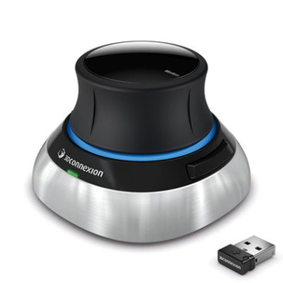
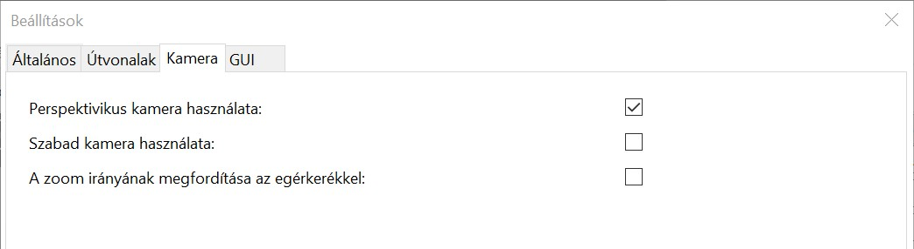
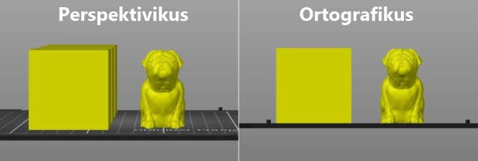
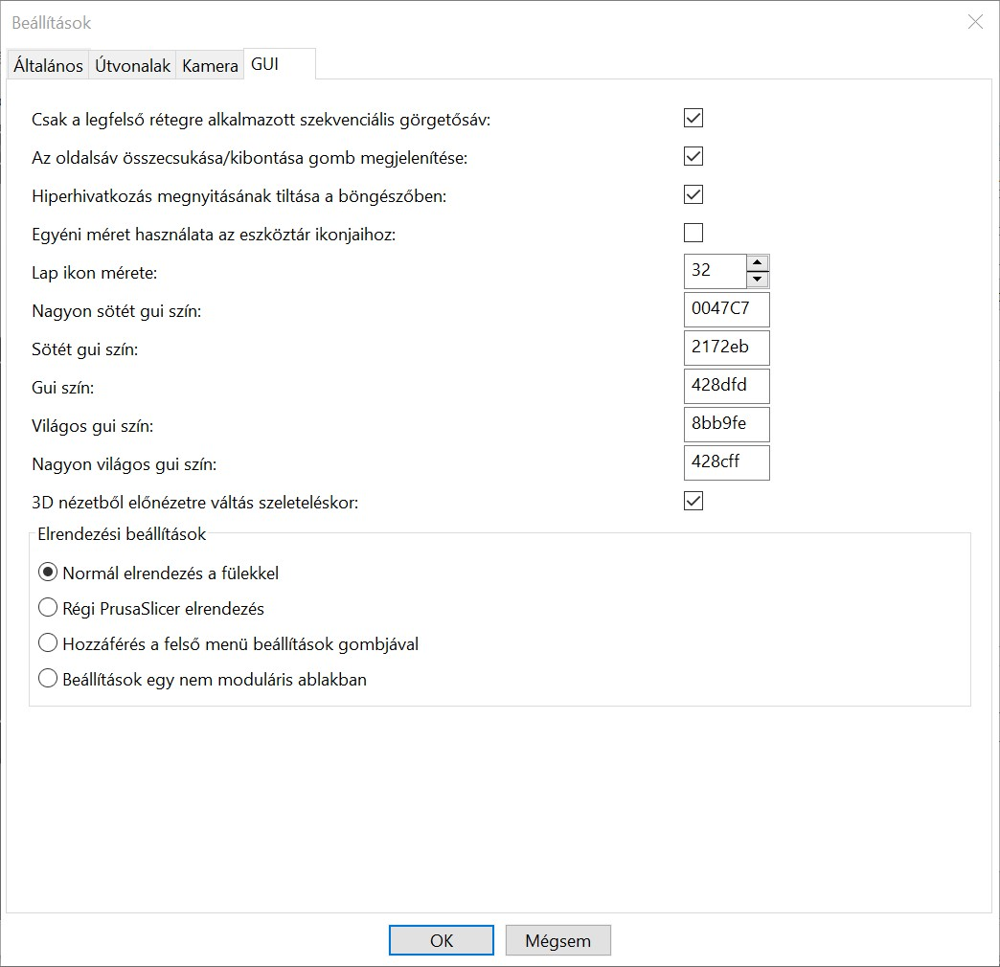
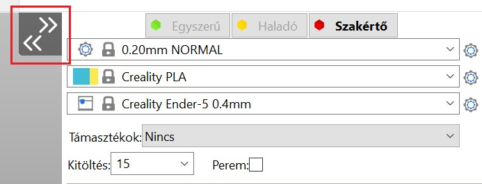
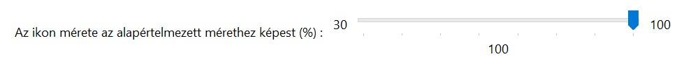
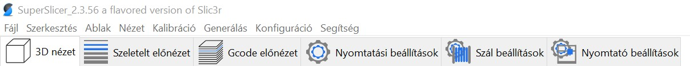
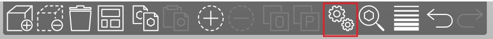
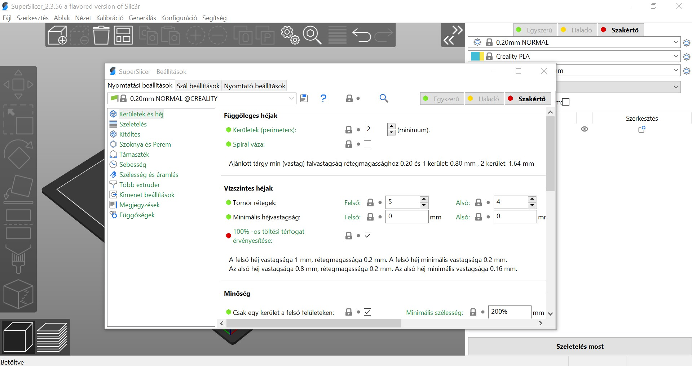

# Szoftver beállítások

## Beállítások

A **Konfiguráció - Beállítások** menü lehetővé teszi a szoftver beállításainak elérését.

A Beállítások ablakot a Konfiguráció - Beállítások menüpont kiválasztásával  
vagy a **Ctrl + P** gombokkal.

### Általános

#### Kimeneti könyvtár megjegyzése

Ha ez engedélyezve van, a SuperSlicer az utolsó kimeneti könyvtárat fogja megjeleníteni a bemeneti fájlokat tartalmazó könyvtár helyett.

#### Automatikusan központosítja az objektumokat

Ha ez be van kapcsolva, a SuperSlicer automatikusan a nyomtatási tálca közepe köré központosítja az objektumokat.

#### Háttérfeldolgozás

Alapértelmezés szerint a G-kód generálása akkor kezdődik, amikor a felhasználó a Szeletelés most gombra kattint, vagy közvetlenül az előnézetre váltás után. Ha a háttérfeldolgozás engedélyezve van, a G-kód a sablonok betöltése után azonnal generálódik. Ezért a G-kód előnézet, valamint a becsült nyomtatási idő a legtöbb esetben azonnal megjeleníthető, miután az előnézetre váltott.

A háttérben történő feldolgozás különösen hasznos, ha a program ide-oda mozog a paraméterek és a G-kód előnézetben \(pl. a médiaparaméterek beállításakor\).

Amikor a táblán változást észlelünk \(pl. egy modell áthelyezése, egy modell másolatának létrehozása\), a G-kód megfelelő része a háttérben frissülni kezd. Kérjük, vegye figyelembe, hogy a Slic3r PE néhány régebbi verziójával ellentétben a háttérfeldolgozás most intelligensebb, és nem generálja újra a teljes G-kódot, ami számításigényes lenne. Csak a felhasználói művelet által érvénytelenített szeletelési lépések kerülnek újraszámításra.

Ne feledje, hogy régebbi, kisebb teljesítményű eszközökön a háttérben történő feldolgozás engedélyezése összességében kevésbé zökkenőmentes élményt eredményezhet.

#### Az alkalmazás frissítéseinek ellenőrzése

Ha engedélyezve van, és a SuperSlicer új, [stabil verzió](https://github.com/supermerill/SuperSlicer/releases) elérhetővé válik, a következő indításkor megjelenik egy értesítés \(soha nem a program futása közben\). Ez jelenleg csak egy értesítési mechanizmus, automatikus telepítés nem történik.

#### A források teljes elérési útjának exportálása 3mf és amf fájlba

Ha engedélyezve van, lehetővé teszi, hogy a Újratöltés lemezről parancs automatikusan megkeresse és betöltse a fájlokat.

Miért van alapértelmezés szerint letiltva a teljes elérési útvonal rögzítése?

A 3MF formátum lényegében egy zip-archívum, amely ember által olvasható XML-fájlokat, egy miniatűr képet és néhány egyéb fájlt tartalmaz. A 3MF fájlformátum egyik előnye, hogy az XML fájlok ember által olvashatóak. Bizonyos esetekben azonban előfordulhat, hogy nem szeretné felfedni a modellfájlok helyét, például: `C:\MyCompanyName\MySecretProjectName\friend_name_gift.stl`

#### .3mf fájlok társítása a SuperSlicer-el

Ha engedélyezve van,a SuperSlicer lesz az alapértelmezett alkalmazás a .3mf fájlok megnyitásához.

#### .stl fájlok társítása a SuperSlicer-el

Ha engedélyezve van, a SuperSlicer lesz az alapértelmezett alkalmazás a .stl fájlok megnyitásához.

#### Beépített előbeállítások automatikus frissítése

Ha engedélyezve van, a SuperSlicer a háttérben letölti a beépített rendszerbe épített alapbeállítások \(nyomtatási, szál- és nyomtatóprofilok\) frissítéseit. \(nyomtatási, szál- és nyomtatóprofilok\) a háttérben. Ezek a frissítések letöltése egy külön ideiglenes könyvtárban. Ha új előbeállítás-frissítés érhető el, a következő indításkor az alkalmazás felajánlja azt.

A SuperSlicer **SOHA** nem törli a felhasználó által létrehozott profilokat. Ezenkívül egy teljes pillanatfelvétel minden egyes előbeállítás frissítésénél az összes előbeállításra vonatkozóan.

**Pillanatkép helye**

Windows `C/Users/username/AppData/Roaming/SuperSlicer/snapshots`

 Mac `“HDD” ▸ Users ▸ username ▸ Library ▸ Application Support ▸ SuperSlicer ▸ snapshots` 

Linux `~/.SuperSlicer/snapshots`

A fejlesztői verziók \(alfák és béták\) más paraméterkészleteket használnak, mint a stabil verziók. Ez lehetővé teszi a fejlesztői verziók használatát anélkül, hogy bármilyen módon befolyásolná a stabil verziót. Ezeket a pillanatfelvételeket a megfelelő alkalmazási adatmappában találja.

#### Előbeállítások «  Alapértelmezett » törlése

Törölje az “- alapértelmezett -” előbeállításokat a Nyomtatás / Szál / Nyomtató választásokból, amint más érvényes előbeállítások állnak rendelkezésre.

#### A nem kompatibilis nyomtatási és szálkészletek megjelenítése

jelölve, a nyomtató és a szálak előbeállításai akkor is láthatóak az előbeállításszerkesztőben, ha a használt nyomtatóval nem kompatibilisek.

#### A fő felhasználói felület mindig szakértői módban van

Ha engedélyezve van, a felület akkor is szakértői módban lesz, ha az egyszerű vagy a haladó mód van kiválasztva \(de a beállítások lapjai nem\).

#### A projekt elküldéséhez szükséges párbeszédpanel megjelenítése

Ha ez a négyzet be van jelölve, akkor egy fájlprojekt alkalmazáson történő áthúzásakor egy párbeszédpanel jelenik meg, amely a betöltendő fájlon végrehajtandó művelet kiválasztását kéri.

#### Csak egyetlen SuperSlicer példány engedélyezése

Ha ez engedélyezve van, a SuperSlicer indításakor, ha ugyanannak a SuperSlicernek egy másik példánya már fut, akkor az a példány fog újraindulni helyette.

#### Kérdezze meg a nem mentett módosításokat az alkalmazás bezárásakor

Az alkalmazás bezárásakor mindig kérdezzen rá a nem mentett változtatásokra

#### Új előbeállítás kiválasztásakor kérdezze meg a nem elmentett módosításokat

Új előbeállítás kiválasztásakor mindig kérdezze meg a még nem mentett módosításokat.

#### Mindig tartsa meg az aktuálisan előre beállított változásokat egy új projektnél

Amikor új projektet hoz létre, a program megtartja az aktuális előbeállítás állapotát, és nem nyitja meg az előbeállítás módosítása párbeszédpanelt.

#### Nem mentett projektmódosítások lekérdezése

Mindig kérdezze meg, hogy szeretné-e menteni a projekt módosítását, ha elveszítené néhány változtatást. Különben alapértelmezés szerint eldobja őket.

#### Kezdőképernyő megjelenítése

Az indítóképernyő megjelenítése

#### Véletlenszerű kezdőképernyő

Minden indításkor egy véletlenszerűen kiválasztott kezdőképernyő megjelenítése a listából

#### Kezdőképernyő kép

Válassza ki a kezdőképernyőként használni kívánt képet.

#### A 3DConnexion eszközök támogatásának engedélyezése.

Ha engedélyezve van, a 3DConnection eszközök konfigurálására szolgáló párbeszédpanel elérhetővé válik, ha megnyomja a **Ctrl + M** gombokat.

### Útvonalak

#### FreeCAD elérési út

Ha ez egy érvényes freecad példányra mutat \(a bin könyvtárra vagy a python futtatható állományra\), akkor a beépített python szkript segítségével gyorsan generálhat formákat.

### Kamera

Kamera beállításai.

#### Perspektivikus kamera használata

Ha engedélyezve van, a perspektivikus kamerát használja. Ha nincs engedélyezve, ortografikus kamerát használ.

### Perspektivikus kamera / ortografikus kamera

A perspektivikus és ortografikus kamera között gyorsan válthat a **K** billentyűvel vagy a felső eszköztáron a **Konfiguráció - Beállítások - Perspektivikus kamera használata** jelölőnégyzet bejelölésével. Mindkét kamerának megvannak a maga előnyei, és előnyös, ha az aktuális igényektől függően váltogat közöttük.

#### Perspektivikus kamera \(alapértelmezett\)

A perspektivikus kamera több mélységinformációt ad, a távoli tárgyak kisebbek, mint a közeli tárgyak. A perspektivikus nézet az emberi szem által a valóságban látott nézet.

#### Ortografikus kamera

Az ortografikus kamerát gyakran használják a mérnöki gyakorlatban. Minden tárgy ugyanabban a méretarányban jelenik meg, a párhuzamos vonalak párhuzamosak maradnak, és a hosszegység a rajz egészén azonos hosszúságúnak tűnik. Ez megkönnyíti a relatív méretek megítélését és a modellek összehangolását.

#### Szabad kamera használata

Ha engedélyezve van, a szabad kamerát használja. Ha nincs engedélyezve, akkor kötött kamerát használ.

#### A zoom irányának megfordítása az egérkerékkel

Ha engedélyezve van, megfordítja a zoom irányát az egérkerékkel.

### GUI \(Felhasználói felület\)

Felhasználói felület beállításai.

#### Csak a legfelső rétegre alkalmazott szekvenciális görgetősáv

Ha engedélyezve van, az előnézetben a szekvenciális görgetősáv segítségével végzett módosítások csak a G-kód legfelső rétegére vonatkoznak. Ha letiltja, az előnézetben a szekvenciális görgetősáv segítségével végzett módosítások a teljes G-kódra vonatkoznak.

#### Az Oldalsáv összecsukása/kibontása gomb megjelenítése

Ha engedélyezve van, a 3D jelenet jobb felső sarkában megjelenik az oldalsáv minimalizálása gomb.

#### Hiperhivatkozás megnyitásának tiltása a böngészőben

Ha engedélyezve van, a beállítások lapjain a konfigurációs paraméterek leírásai nem fognak hiperhivatkozásként működni. Ha kikapcsolja, a beállítások lapjain a konfigurációs paraméterek leírásai hiperhivatkozásként működnek.

#### Egyéni méret használata az eszköztár ikonjaihoz

Ha engedélyezve van, az eszköztár ikonjainak méretét manuálisan is módosíthatja.

Ha az opció aktiválva van, egy vezérlősáv lehetővé teszi az ikonok méretének beállítását.

#### 3D nézetből előnézetre váltás szeleteléskor

Ez az opció lehetővé teszi, hogy a szeletelés számításának megkezdésekor automatikusan áttérjen az előnézetre.

#### Elrendezési beállítások

_**Normál elrendezés a fülekkel**_ : az összes ablak az alkalmazásban van, mindegyik kiválasztható egy lapon.

Amit a legpraktikusabbnak találok.

_**Régi PrusaSlicer elrendezés**_ : az összes ablak az alkalmazásban van, a paraméterek a felső lapon, a renderelési szakaszok kiválasztása pedig a 3D nézet alján. 

_**Hozzáférés a felső menü Beállítások gombjával**_ : minden ablak az alkalmazásban van, nincsenek fülek : a beállítások fogaskerék ikonjaira kell kattintania, hogy a beállítások lapjaira váltson.

_**Beállítások egy nem moduláris ablakban**_ : A paraméterek saját ablakban jelennek meg. A beállítások ablakának megjelenítéséhez a beállítások fogaskerék ikonjaira kell kattintania.

